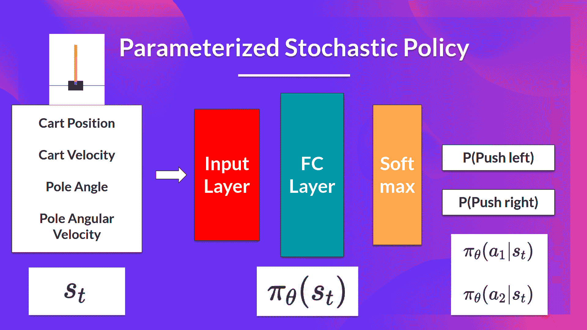
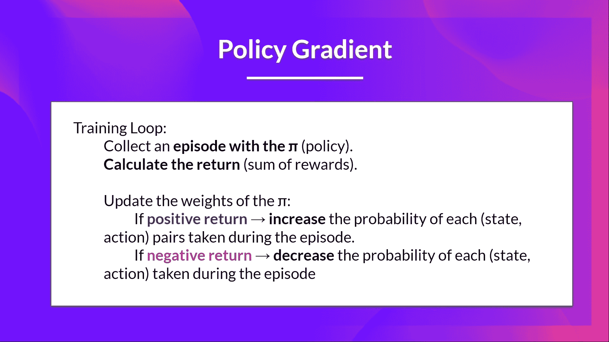
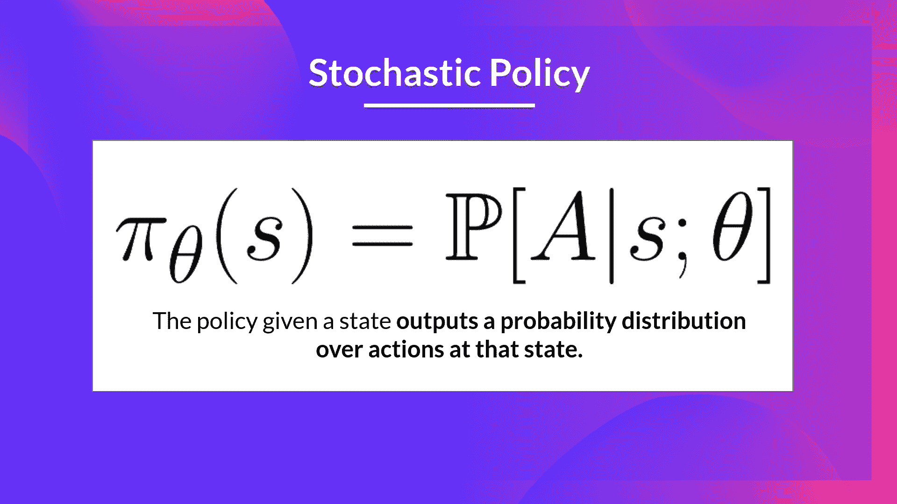
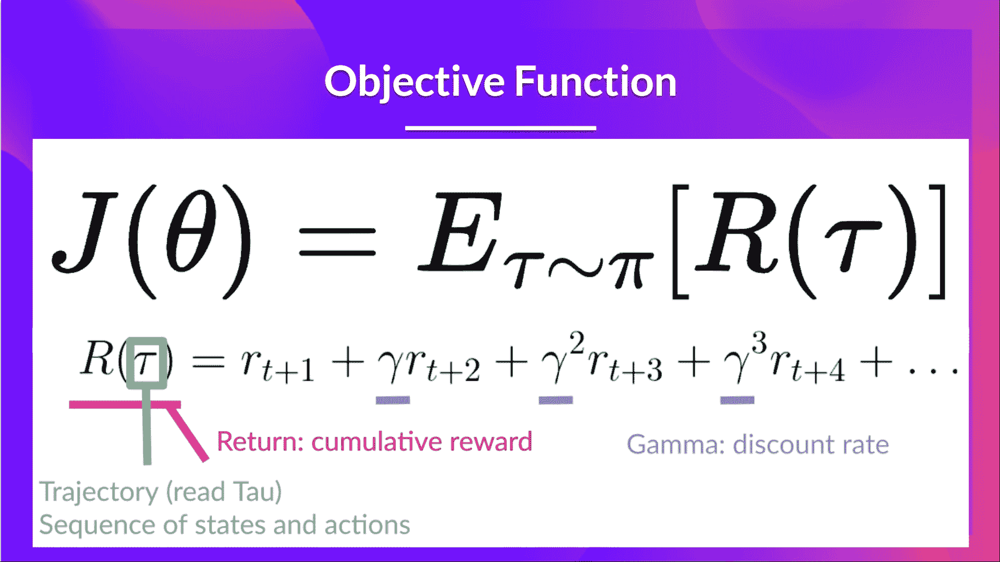
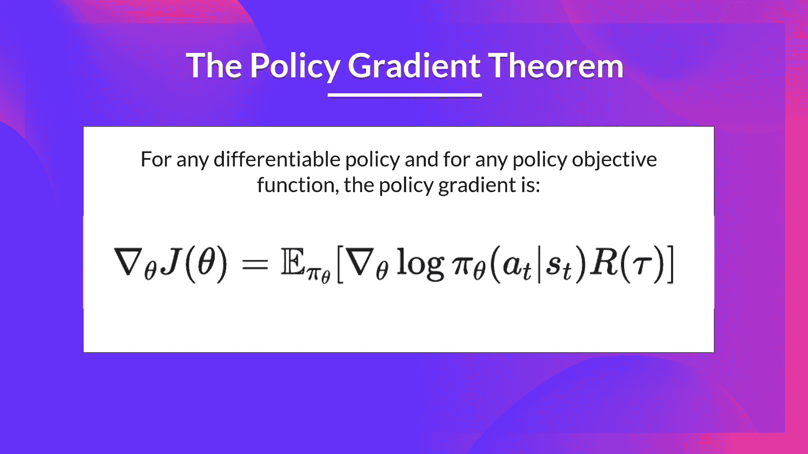
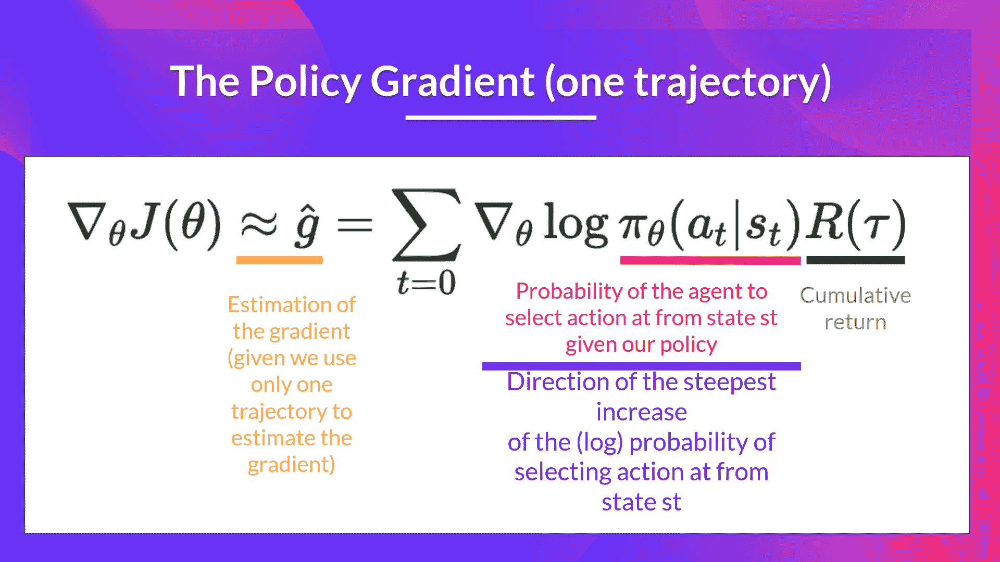

# 深入研究政策梯度方法

> 原始文本：[`huggingface.co/learn/deep-rl-course/unit4/policy-gradient`](https://huggingface.co/learn/deep-rl-course/unit4/policy-gradient)

## 获得大局

我们刚刚学到，政策梯度方法的目标是找到**最大化预期回报的参数**。

这个想法是我们有一个*参数化的随机策略*。在我们的情况下，一个神经网络输出动作的概率分布。采取每个动作的概率也被称为*动作偏好*。

如果我们以 CartPole-v1 为例：

+   作为输入，我们有一个状态。

+   作为输出，我们有在该状态下的动作概率分布。

我们的政策梯度的目标是通过调整策略来**控制动作的概率分布**，使得**好的动作（最大化回报）在未来更频繁地被采样**。每次代理与环境交互时，我们调整参数，以便未来更有可能采样到好的动作。

但是**我们如何使用预期回报来优化权重**？

这个想法是**让代理在一个 episode 期间与环境交互**。如果我们赢得了这一 episode，我们认为每个动作都是好的，并且在未来必须更频繁地被采样，因为它们导致了胜利。

因此，对于每个状态-动作对，我们希望增加<math><semantics><mrow><mi>P</mi><mo stretchy="false">(</mo><mi>a</mi><mi mathvariant="normal">∣</mi><mi>s</mi><mo stretchy="false">)</mo></mrow><annotation encoding="application/x-tex">P(a|s)</annotation></semantics></math>P(a∣s)：在该状态下采取该动作的概率。或者如果我们失败了就减少。

政策梯度算法（简化版）如下所示：

现在我们已经有了大局，让我们深入研究政策梯度方法。

## 深入研究政策梯度方法

我们有我们的随机策略<math><semantics><mrow><mi>π</mi></mrow><annotation encoding="application/x-tex">\pi</annotation></semantics></math>π，它有一个参数<math><semantics><mrow><mi>θ</mi></mrow><annotation encoding="application/x-tex">\theta</annotation></semantics></math>θ。这个<math><semantics><mrow><mi>π</mi></mrow><annotation encoding="application/x-tex">\pi</annotation></semantics></math>π，在给定一个状态时，**输出动作的概率分布**。

其中<math><semantics><mrow><msub><mi>π</mi><mi>θ</mi></msub><mo stretchy="false">(</mo><msub><mi>a</mi><mi>t</mi></msub><mi mathvariant="normal">∣</mi><msub><mi>s</mi><mi>t</mi></msub><mo stretchy="false">)</mo></mrow><annotation encoding="application/x-tex">\pi_\theta(a_t|s_t)</annotation></semantics></math>πθ​(at​∣st​)是代理根据我们的策略从状态<math><semantics><mrow><msub><mi>s</mi><mi>t</mi></msub></mrow><annotation encoding="application/x-tex">s_t</annotation></semantics></math>st​选择动作<math><semantics><mrow><msub><mi>a</mi><mi>t</mi></msub></mrow><annotation encoding="application/x-tex">a_t</annotation></semantics></math>at​的概率。

**但是我们如何知道我们的策略是否好？**我们需要有一种方法来衡量它。为了知道这一点，我们定义了一个叫做<math><semantics><mrow><mi>J</mi><mo stretchy="false">(</mo><mi>θ</mi><mo stretchy="false">)</mo></mrow><annotation encoding="application/x-tex">J(\theta)</annotation></semantics></math>J(θ)的得分/目标函数。

### 目标函数

*目标函数*给出了在给定轨迹（不考虑奖励的状态动作序列（与一个 episode 相反））的情况下代理的**表现**，并输出*预期累积奖励*。

让我们对这个公式进行更详细的说明：

+   *期望回报*（也称为期望累积奖励）是所有可能的回报<math><semantics><mrow><mi>R</mi><mo stretchy="false">(</mo><mi>τ</mi><mo stretchy="false">)</mo></mrow><annotation encoding="application/x-tex">R(\tau)</annotation></semantics></math>R(τ)可能取值的加权平均值（其中权重由<math><semantics><mrow><mi>P</mi><mo stretchy="false">(</mo><mi>τ</mi><mo separator="true">;</mo><mi>θ</mi><mo stretchy="false">)</mo></mrow><annotation encoding="application/x-tex">P(\tau;\theta)</annotation></semantics></math>P(τ;θ)给出）。

-<math><semantics><mrow><mi>R</mi><mo stretchy="false">(</mo><mi>τ</mi><mo stretchy="false">)</mo></mrow><annotation encoding="application/x-tex">R(\tau)</annotation></semantics></math>R(τ)：任意轨迹的回报。要使用此数量并用其计算期望回报，我们需要将其乘以每个可能轨迹的概率。-<math><semantics><mrow><mi>P</mi><mo stretchy="false">(</mo><mi>τ</mi><mo separator="true">;</mo><mi>θ</mi><mo stretchy="false">)</mo></mrow><annotation encoding="application/x-tex">P(\tau;\theta)</annotation></semantics></math>P(τ;θ)：每个可能轨迹<math><semantics><mrow><mi>τ</mi></mrow><annotation encoding="application/x-tex">\tau</annotation></semantics></math>τ的概率（该概率取决于<math><semantics><mrow><mi>θ</mi></mrow><annotation encoding="application/x-tex">\theta</annotation></semantics></math>θ，因为它定义了用于选择轨迹动作的策略，这对访问的状态产生影响）。

-<math><semantics><mrow><mi>J</mi><mo stretchy="false">(</mo><mi>θ</mi><mo stretchy="false">)</mo></mrow><annotation encoding="application/x-tex">J(\theta)</annotation></semantics></math>J(θ)：期望回报，我们通过对所有轨迹求和来计算它，即给定<math><semantics><mrow><mi>θ</mi></mrow><annotation encoding="application/x-tex">\theta</annotation></semantics></math>θ的情况下，取该轨迹的概率乘以该轨迹的回报。

我们的目标是通过找到将输出最佳动作概率分布的<math><semantics><mrow><mi>θ</mi></mrow><annotation encoding="application/x-tex">\theta</annotation></semantics></math>θ来最大化期望累积奖励：

最大目标

## 梯度上升和策略梯度定理

策略梯度是一个优化问题：我们希望找到最大化我们目标函数<math><semantics><mrow><mi>J</mi><mo stretchy="false">(</mo><mi>θ</mi><mo stretchy="false">)</mo></mrow><annotation encoding="application/x-tex">J(\theta)</annotation></semantics></math>J(θ)的值，因此我们需要使用**梯度上升**。这是*梯度下降*的反向，因为它给出了<math><semantics><mrow><mi>J</mi><mo stretchy="false">(</mo><mi>θ</mi><mo stretchy="false">)</mo></mrow><annotation encoding="application/x-tex">J(\theta)</annotation></semantics></math>J(θ)最陡增加的方向。

（如果您需要了解梯度下降和梯度上升之间的区别，请查看[这里](https://www.baeldung.com/cs/gradient-descent-vs-ascent)和[这里](https://stats.stackexchange.com/questions/258721/gradient-ascent-vs-gradient-descent-in-logistic-regression)）。

我们梯度上升的更新步骤是：<math><semantics><mrow><mi>θ</mi><mo>←</mo><mi>θ</mi><mo>+</mo><mi>α</mi><mo>∗</mo><msub><mi mathvariant="normal">∇</mi><mi>θ</mi></msub><mi>J</mi><mo stretchy="false">(</mo><mi>θ</mi><mo stretchy="false">)</mo></mrow> <annotation encoding="application/x-tex">\theta \leftarrow \theta + \alpha * \nabla_\theta J(\theta)</annotation></semantics></math> θ←θ+α∗∇θ​J(θ)

我们可以反复应用这个更新，希望<math><semantics><mrow><mi>θ</mi></mrow><annotation encoding="application/x-tex">\theta</annotation></semantics></math> θ收敛到最大化<math><semantics><mrow><mi>J</mi><mo stretchy="false">(</mo><mi>θ</mi><mo stretchy="false">)</mo></mrow><annotation encoding="application/x-tex">J(\theta)</annotation></semantics></math>J(θ)的值。

然而，计算<math><semantics><mrow><mi>J</mi><mo stretchy="false">(</mo><mi>θ</mi><mo stretchy="false">)</mo></mrow><annotation encoding="application/x-tex">J(\theta)</annotation></semantics></math>J(θ)的导数存在两个问题：

1.  我们无法计算目标函数的真实梯度，因为这需要计算每个可能轨迹的概率，这在计算上非常昂贵。因此，我们希望**使用基于样本的估计（收集一些轨迹）来计算梯度估计**。

1.  我们还有另一个问题，我会在下一节（可选）中解释。为了区分这个目标函数，我们需要区分状态分布，称为马尔可夫决策过程动态。这与环境相关联。它给出了环境进入下一个状态的概率，考虑到当前状态和代理采取的动作。问题在于我们无法区分它，因为我们可能不了解它。

幸运的是，我们将使用一个称为策略梯度定理的解决方案，它将帮助我们将目标函数重新构造为一个可微分的函数，不涉及状态分布的区分。

如果您想了解我们如何推导出这个近似梯度的公式，请查看下一节（可选）。

## Reinforce 算法（蒙特卡洛 Reinforce）

Reinforce 算法，也称为蒙特卡洛策略梯度，是一种策略梯度算法，**使用整个 episode 的估计回报来更新策略参数** <math><semantics><mrow><mi>θ</mi></mrow><annotation encoding="application/x-tex">\theta</annotation></semantics></math>θ：

在一个循环中：

+   使用策略<math><semantics><mrow><msub><mi>π</mi><mi>θ</mi></msub></mrow><annotation encoding="application/x-tex">\pi_\theta</annotation></semantics></math>πθ​来收集一个 episode<math><semantics><mrow><mi>τ</mi></mrow><annotation encoding="application/x-tex">\tau</annotation></semantics></math>τ

+   使用 episode 来估计梯度<math><semantics><mrow><mover accent="true"><mi>g</mi><mo>^</mo></mover><mo>=</mo><msub><mi mathvariant="normal">∇</mi><mi>θ</mi></msub><mi>J</mi><mo stretchy="false">(</mo><mi>θ</mi><mo stretchy="false">)</mo></mrow><annotation encoding="application/x-tex">\hat{g} = \nabla_\theta J(\theta)</annotation></semantics></math>g^​=∇θ​J(θ)

    

+   更新策略的权重：<math><semantics><mrow><mi>θ</mi><mo>←</mo><mi>θ</mi><mo>+</mo><mi>α</mi><mover accent="true"><mi>g</mi><mo>^</mo></mover></mrow><annotation encoding="application/x-tex">\theta \leftarrow \theta + \alpha \hat{g}</annotation></semantics></math>θ←θ+αg^​

我们可以将这个更新解释如下：-∇θ​logπθ​(at​∣st​)是选择动作 at​从状态 st​的（对数）概率的**最陡增加方向**。这告诉我们如果我们想增加/减少选择动作 at​的对数概率，我们应该如何改变策略的权重。

+   否则，如果回报很低，它将**降低**（状态，动作）组合的概率。

+   R(τ)：是评分函数：

我们还可以**收集多个轨迹（路径）**来估计梯度：

如果回报很高，它将**提高**（状态，动作）组合的概率。
