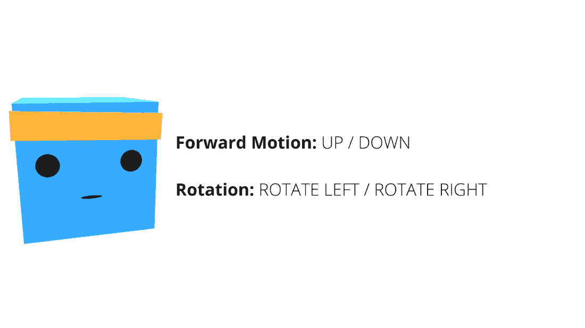

# 金字塔环境

> 原始文本：[`huggingface.co/learn/deep-rl-course/unit5/pyramids`](https://huggingface.co/learn/deep-rl-course/unit5/pyramids)

在这个环境中的目标是训练我们的代理获取金字塔顶部的金砖。为了做到这一点，它需要按下一个按钮生成一个金字塔，导航到金字塔，将其推倒，然后移动到顶部的金砖处。

## 奖励函数

奖励函数为：

在代码方面，看起来像这样

为了训练这个寻找按钮然后摧毁金字塔的新代理，我们将使用两种类型奖励的组合：

+   由环境提供的外在奖励（如上图所示）。

+   但也有一个称为好奇心的内在动作。这个动作将促使我们的代理变得好奇，或者换句话说，更好地探索其环境。

如果您想了解更多关于好奇心的信息，下一节（可选）将解释基础知识。

## 观察空间

在观察方面，我们使用了 148 个可以检测物体的射线投射（开关、砖块、金砖和墙壁）。

我们还使用一个表示开关状态的布尔变量（我们是否打开或关闭开关来生成金字塔），以及一个包含代理速度的向量。

## 动作空间

动作空间是离散的，有四种可能的动作：

