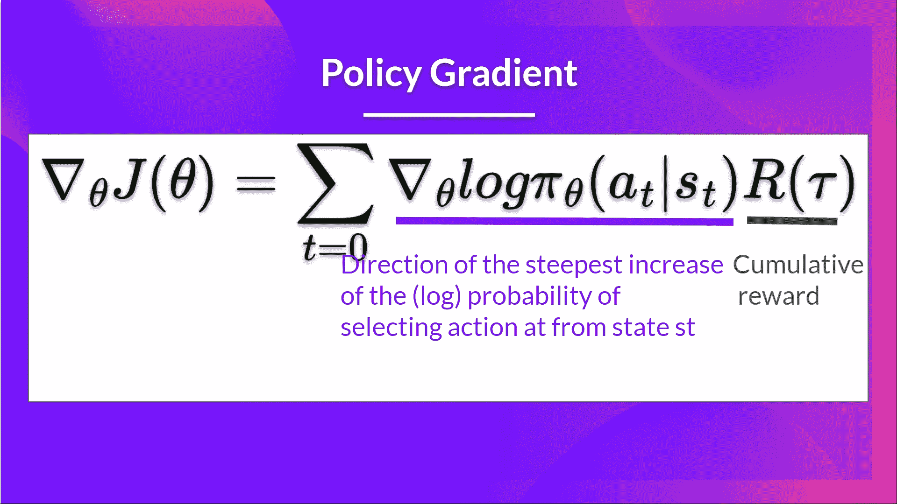

# Reinforce 中的方差问题

> 原文：[`huggingface.co/learn/deep-rl-course/unit6/variance-problem`](https://huggingface.co/learn/deep-rl-course/unit6/variance-problem)

在 Reinforce 中，我们希望**根据回报的高低比例增加轨迹中动作的概率**。

+   如果**回报很高**，我们将**增加**（状态，动作）组合的概率。

+   否则，如果**回报很低**，它将**降低**（状态，动作）组合的概率。

这个回报<math><semantics><mrow><mi>R</mi><mo stretchy="false">(</mo><mi>τ</mi><mo stretchy="false">)</mo></mrow><annotation encoding="application/x-tex">R(\tau)</annotation></semantics></math>R(τ)是使用*蒙特卡罗采样*计算的。我们收集一个轨迹并计算折扣回报，**并使用这个分数来增加或减少在该轨迹中采取的每个动作的概率**。如果回报很好，所有动作都将通过增加它们被采取的可能性来“强化”。

这种方法的优点是**它是无偏的。因为我们不是在估计回报**，我们只使用我们获得的真实回报。

考虑到环境的随机性（在一个 episode 中的随机事件）和策略的随机性，**轨迹可能导致不同的回报，这可能导致高方差**。因此，相同的起始状态可能导致非常不同的回报。由于这个原因，**从相同状态开始的回报在不同 episode 中可能会有显著变化**。

解决方案是通过**使用大量轨迹来减少方差，希望任何一个轨迹引入的方差在总体中会减少，并提供“真实”的回报估计**。

然而，显著增加批量大小**会降低样本效率**。因此，我们需要找到额外的机制来减少方差。

* * *

如果您想深入探讨深度强化学习中的方差和偏差权衡问题，可以查看这两篇文章：

+   [深度]强化学习中的偏差/方差权衡的意义

+   在强化学习中的偏差-方差权衡

* * *
