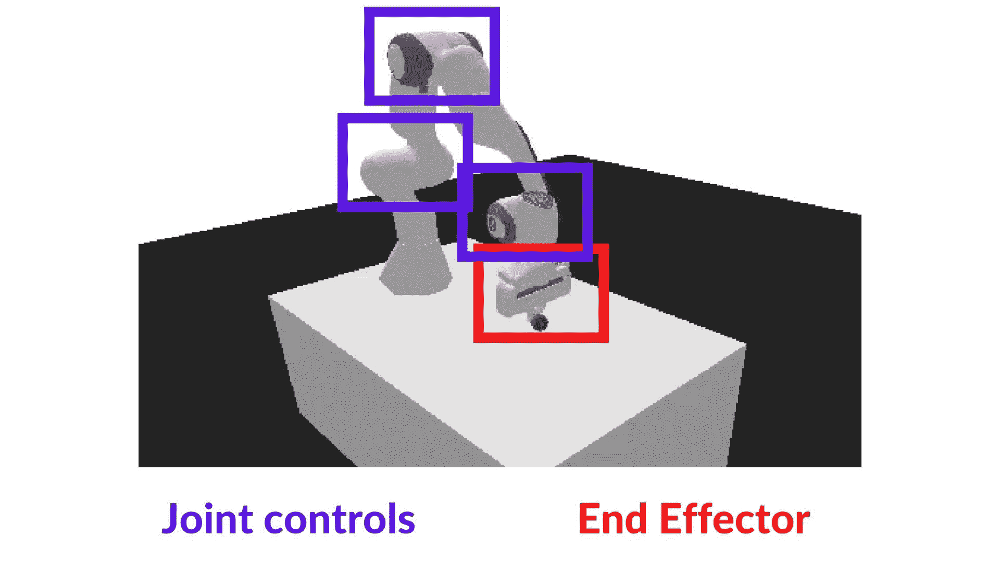

# 使用 Panda-Gym 进行机器人模拟的 Advantage Actor Critic (A2C) 🤖

> 原始文本：[`huggingface.co/learn/deep-rl-course/unit6/hands-on`](https://huggingface.co/learn/deep-rl-course/unit6/hands-on)

 

现在您已经学习了 Advantage Actor Critic (A2C) 的理论，**您已经准备好训练您的 A2C 代理**，使用 Stable-Baselines3 在一个机器人环境中进行训练。并训练一个：

+   一个机器人手臂🦾移动到正确的位置。

我们将使用

+   [panda-gym](https://github.com/qgallouedec/panda-gym)

为了验证这个实践过程的认证，您需要将您的两个训练模型推送到 Hub 并获得以下结果：

+   `PandaReachDense-v3` 获得结果 >= -3.5。

要找到您的结果，请[转到排行榜](https://huggingface.co/spaces/huggingface-projects/Deep-Reinforcement-Learning-Leaderboard)并找到您的模型，**结果 = 平均奖励 - 奖励的标准差**

有关认证过程的更多信息，请查看此部分👉[`huggingface.co/deep-rl-course/en/unit0/introduction#certification-process`](https://huggingface.co/deep-rl-course/en/unit0/introduction#certification-process)

**点击“在 Colab 中打开”按钮开始实践**👇：


# 第 6 单元：使用 Panda-Gym 进行机器人模拟的 Advantage Actor Critic (A2C) 🤖

### 🎮 环境：

+   [Panda-Gym](https://github.com/qgallouedec/panda-gym)

### 📚 强化学习库：

+   [Stable-Baselines3](https://stable-baselines3.readthedocs.io/)

我们不断努力改进我们的教程，所以**如果您在本笔记本中发现问题**，请[在 GitHub 仓库上提出问题](https://github.com/huggingface/deep-rl-class/issues)。

## 本笔记本的目标🏆

在笔记本的末尾，您将：

+   能够使用**Panda-Gym**，这个环境库。

+   能够**使用 A2C 训练机器人**。

+   了解为什么**我们需要对输入进行归一化**。

+   能够**将您训练好的代理和代码推送到 Hub**，并附带一个漂亮的视频回放和评估分数🔥。

## 先决条件🏗️

在深入研究笔记本之前，您需要：

🔲 📚 学习 [通过阅读第 6 单元的 Actor-Critic 方法](https://huggingface.co/deep-rl-course/unit6/introduction) 🤗

# 让我们训练我们的第一个机器人🤖

## 设置 GPU 💪

+   为了**加速代理的训练，我们将使用 GPU**。为此，请转到 `运行时 > 更改运行时类型`


+   `硬件加速器 > GPU`


## 创建一个虚拟显示🔽

在笔记本中，我们需要生成一个回放视频。为此，在 colab 中，**我们需要有一个虚拟屏幕来渲染环境**（从而记录帧）。

以下单元格将安装库并创建并运行一个虚拟屏幕🖥

```py
%%capture
!apt install python-opengl
!apt install ffmpeg
!apt install xvfb
!pip3 install pyvirtualdisplay
```

```py
# Virtual display
from pyvirtualdisplay import Display

virtual_display = Display(visible=0, size=(1400, 900))
virtual_display.start()
```

### 安装依赖🔽

我们将安装多个：

+   `gymnasium`

+   `panda-gym`：包含机器人手臂环境。

+   `stable-baselines3`：SB3 深度强化学习库。

+   `huggingface_sb3`：用于 Stable-baselines3 的额外代码，用于从 Hugging Face 🤗 Hub 加载和上传模型。

+   `huggingface_hub`：允许任何人使用 Hub 存储库。

```py
!pip install stable-baselines3[extra]
!pip install gymnasium
!pip install huggingface_sb3
!pip install huggingface_hub
!pip install panda_gym
```

## 导入包📦

```py
import os

import gymnasium as gym
import panda_gym

from huggingface_sb3 import load_from_hub, package_to_hub

from stable_baselines3 import A2C
from stable_baselines3.common.evaluation import evaluate_policy
from stable_baselines3.common.vec_env import DummyVecEnv, VecNormalize
from stable_baselines3.common.env_util import make_vec_env

from huggingface_hub import notebook_login
```

## PandaReachDense-v3 🦾

我们将训练的代理是一个需要进行控制的机器人手臂（移动手臂并使用末端执行器）。

在机器人技术中，*末端执行器*是设计用于与环境交互的机器人手臂末端的设备。

在 `PandaReach` 中，机器人必须将其末端执行器放置在目标位置（绿色球）。

我们将使用此环境的密集版本。这意味着我们将获得一个*密集奖励函数*，**将在每个时间步提供奖励** (代理越接近完成任务，奖励越高)。与*稀疏奖励函数*相反，环境**仅在任务完成时返回奖励**。

此外，我们将使用 *末端执行器位移控制*，这意味着**动作对应于末端执行器的位移**。我们不控制每个关节的单独运动 (关节控制)。



这样**训练将更容易**。

### 创建环境

#### 环境 🎮

在 `PandaReachDense-v3` 中，机械臂必须将其末端执行器放置在目标位置 (绿色球)。

```py
env_id = "PandaReachDense-v3"

# Create the env
env = gym.make(env_id)

# Get the state space and action space
s_size = env.observation_space.shape
a_size = env.action_space
```

```py
print("_____OBSERVATION SPACE_____ \n")
print("The State Space is: ", s_size)
print("Sample observation", env.observation_space.sample()) # Get a random observation
```

观察空间**是一个具有 3 个不同元素的字典**：

+   `achieved_goal`: 目标的位置 (x,y,z)。

+   `desired_goal`: 目标位置与当前物体位置之间的距离 (x,y,z)。

+   `observation`: 末端执行器的位置 (x,y,z) 和速度 (vx, vy, vz)。

鉴于观察是一个字典，**我们需要使用 MultiInputPolicy 策略而不是 MlpPolicy**。

```py
print("\n _____ACTION SPACE_____ \n")
print("The Action Space is: ", a_size)
print("Action Space Sample", env.action_space.sample()) # Take a random action
```

动作空间是一个具有 3 个值的向量：

+   控制 x、y、z 运动

### 归一化观察和奖励

在强化学习中的一个好的实践是[归一化输入特征](https://stable-baselines3.readthedocs.io/en/master/guide/rl_tips.html)。

为此，有一个包装器将计算输入特征的运行平均值和标准差。

我们还通过添加 `norm_reward = True` 来使用相同的包装器对奖励进行归一化

[您应该查看文档以填写此单元格](https://stable-baselines3.readthedocs.io/en/master/guide/vec_envs.html#vecnormalize)

```py
env = make_vec_env(env_id, n_envs=4)

# Adding this wrapper to normalize the observation and the reward
env = # TODO: Add the wrapper
```

#### 解决方案

```py
env = make_vec_env(env_id, n_envs=4)

env = VecNormalize(env, norm_obs=True, norm_reward=True, clip_obs=10.)
```

### 创建 A2C 模型 🤖

有关使用 StableBaselines3 实现 A2C 的更多信息，请查看：[`stable-baselines3.readthedocs.io/en/master/modules/a2c.html#notes`](https://stable-baselines3.readthedocs.io/en/master/modules/a2c.html#notes)

为了找到最佳参数，我检查了[由 Stable-Baselines3 团队官方训练的代理](https://huggingface.co/sb3)。

```py
model = # Create the A2C model and try to find the best parameters
```

#### 解决方案

```py
model = A2C(policy = "MultiInputPolicy",
            env = env,
            verbose=1)
```

### 训练 A2C 代理 🏃

+   让我们对代理进行 1,000,000 个时间步的训练，不要忘记在 Colab 上使用 GPU。大约需要 25-40 分钟

```py
model.learn(1_000_000)
```

```py
# Save the model and  VecNormalize statistics when saving the agent
model.save("a2c-PandaReachDense-v3")
env.save("vec_normalize.pkl")
```

### 评估代理 📈

+   现在我们的代理已经训练好了，我们需要**检查其性能**。

+   Stable-Baselines3 提供了一个方法来做到这一点：`evaluate_policy`

```py
from stable_baselines3.common.vec_env import DummyVecEnv, VecNormalize

# Load the saved statistics
eval_env = DummyVecEnv([lambda: gym.make("PandaReachDense-v3")])
eval_env = VecNormalize.load("vec_normalize.pkl", eval_env)

# We need to override the render_mode
eval_env.render_mode = "rgb_array"

#  do not update them at test time
eval_env.training = False
# reward normalization is not needed at test time
eval_env.norm_reward = False

# Load the agent
model = A2C.load("a2c-PandaReachDense-v3")

mean_reward, std_reward = evaluate_policy(model, eval_env)

print(f"Mean reward = {mean_reward:.2f} +/- {std_reward:.2f}")
```

### 在 Hub 上发布您训练好的模型 🔥

现在我们看到训练后取得了良好的结果，我们可以用一行代码将我们训练好的模型发布到 Hub 上。

📚 图书馆文档 👉 [`github.com/huggingface/huggingface_sb3/tree/main#hugging-face—x-stable-baselines3-v20`](https://github.com/huggingface/huggingface_sb3/tree/main#hugging-face--x-stable-baselines3-v20)

通过使用 `package_to_hub`，正如我们在前面的单元中已经提到的，**您可以评估、记录重播、生成代理的模型卡并将其推送到 Hub**。

这样：

+   您可以 **展示我们的工作** 🔥

+   您可以 **查看您的代理进行游戏** 👀

+   您可以 **与社区分享其他人可以使用的代理** 💾

+   您可以 **访问排行榜 🏆 查看您的代理相对于同学表现如何** 👉 [`huggingface.co/spaces/huggingface-projects/Deep-Reinforcement-Learning-Leaderboard`](https://huggingface.co/spaces/huggingface-projects/Deep-Reinforcement-Learning-Leaderboard)

要能够与社区分享您的模型，还需要遵循三个步骤：

1️⃣ (如果尚未完成) 创建一个 HF 帐户 ➡ [`huggingface.co/join`](https://huggingface.co/join)

2️⃣ 登录，然后，您需要从 Hugging Face 网站存储您的身份验证令牌。

+   创建一个新的令牌 ([`huggingface.co/settings/tokens`](https://huggingface.co/settings/tokens)) **具有写入权限**


+   复制令牌

+   运行下面的单元格并粘贴令牌

```py
notebook_login()
!git config --global credential.helper store
```

如果您不想使用 Google Colab 或 Jupyter Notebook，您需要使用这个命令：`huggingface-cli login`

3️⃣ 现在我们准备使用 `package_to_hub()` 函数将我们训练好的 agent 推送到 🤗 Hub 🔥。对于这个环境，**运行这个单元格可能需要大约 10 分钟**。

```py
from huggingface_sb3 import package_to_hub

package_to_hub(
    model=model,
    model_name=f"a2c-{env_id}",
    model_architecture="A2C",
    env_id=env_id,
    eval_env=eval_env,
    repo_id=f"ThomasSimonini/a2c-{env_id}", # Change the username
    commit_message="Initial commit",
)
```

## 一些额外的挑战 🏆

学习的最好方法 **是自己尝试**！为什么不尝试 `PandaPickAndPlace-v3`？

如果您想尝试更高级的任务，您需要检查使用 **TQC 或 SAC**（适用于机器人任务的更高效的算法）完成了什么。在真实的机器人技术中，您将使用更高效的算法，一个简单的原因是：与模拟相反，**如果您移动机器人手臂太多，您有破坏的风险**。

PandaPickAndPlace-v1（此模型使用环境的 v1 版本）：[`huggingface.co/sb3/tqc-PandaPickAndPlace-v1`](https://huggingface.co/sb3/tqc-PandaPickAndPlace-v1)

并且不要犹豫查看 panda-gym 文档：[`panda-gym.readthedocs.io/en/latest/usage/train_with_sb3.html`](https://panda-gym.readthedocs.io/en/latest/usage/train_with_sb3.html)

我们为您提供了训练另一个 agent 的步骤（可选）：

1.  定义名为 “PandaPickAndPlace-v3” 的环境

1.  创建一个矢量化环境

1.  添加一个包装器来规范观察和奖励。[查看文档](https://stable-baselines3.readthedocs.io/en/master/guide/vec_envs.html#vecnormalize)

1.  创建 A2C 模型（不要忘记 verbose=1 以打印训练日志）。

1.  训练 100 万个时间步

1.  保存模型和 VecNormalize 统计数据时保存 agent

1.  评估您的 agent

1.  使用 `package_to_hub` 在 Hub 🔥 上发布您训练好的模型

### 解决方案（可选）

```py
# 1 - 2
env_id = "PandaPickAndPlace-v3"
env = make_vec_env(env_id, n_envs=4)

# 3
env = VecNormalize(env, norm_obs=True, norm_reward=True, clip_obs=10.)

# 4
model = A2C(policy = "MultiInputPolicy",
            env = env,
            verbose=1)
# 5
model.learn(1_000_000)
```

```py
# 6
model_name = "a2c-PandaPickAndPlace-v3";
model.save(model_name)
env.save("vec_normalize.pkl")

# 7
from stable_baselines3.common.vec_env import DummyVecEnv, VecNormalize

# Load the saved statistics
eval_env = DummyVecEnv([lambda: gym.make("PandaPickAndPlace-v3")])
eval_env = VecNormalize.load("vec_normalize.pkl", eval_env)

#  do not update them at test time
eval_env.training = False
# reward normalization is not needed at test time
eval_env.norm_reward = False

# Load the agent
model = A2C.load(model_name)

mean_reward, std_reward = evaluate_policy(model, eval_env)

print(f"Mean reward = {mean_reward:.2f} +/- {std_reward:.2f}")

# 8
package_to_hub(
    model=model,
    model_name=f"a2c-{env_id}",
    model_architecture="A2C",
    env_id=env_id,
    eval_env=eval_env,
    repo_id=f"ThomasSimonini/a2c-{env_id}", # TODO: Change the username
    commit_message="Initial commit",
)
```

在第 7 单元见！🔥

## 继续学习，保持出色 🤗
