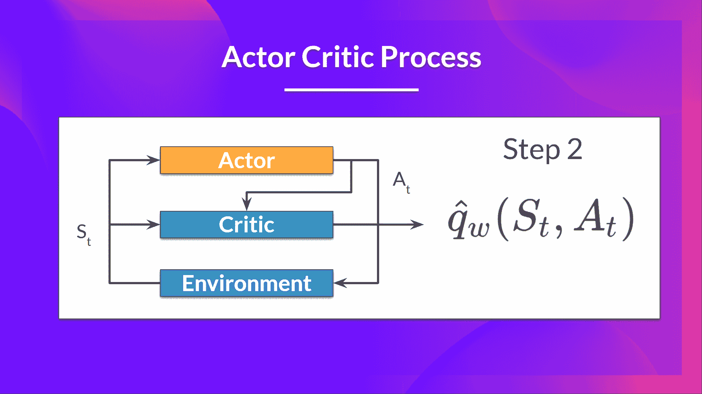
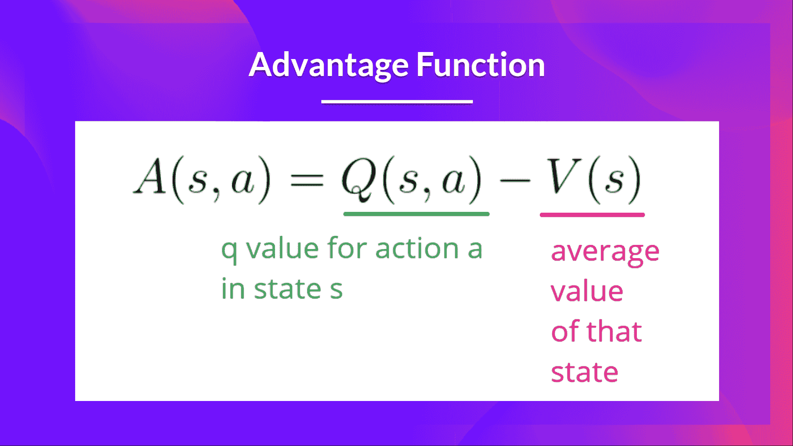

# 测验

> 原文：[`huggingface.co/learn/deep-rl-course/unit6/quiz`](https://huggingface.co/learn/deep-rl-course/unit6/quiz)

学习和[避免能力错觉](https://www.coursera.org/lecture/learning-how-to-learn/illusions-of-competence-BuFzf)的最佳方法**是测试自己**。这将帮助您找到**需要加强知识的地方**。

### Q1：在强化学习领域，以下哪种对于偏差-方差权衡的解释最准确？

### Q2：在谈论具有偏差和/或方差的模型时，以下哪些陈述是正确的？

### Q3：关于蒙特卡洛方法，以下哪些陈述是正确的？

### Q4：您如何用自己的话描述 Actor-Critic 方法（A2C）？

解决方案

Actor-Critic 的想法是我们学习两个函数近似：

1.  一个控制我们代理如何行动的`策略`（π）

1.  通过测量采取的行动有多好（q）来辅助策略更新的`值`函数

### Q5：关于 Actor-Critic 方法，以下哪些陈述是正确的？

### Q6：A2C 方法中的优势是什么？

解决方案

我们可以使用一个`优势`函数，而不是直接使用评论家的动作值函数。`优势`函数背后的想法是，我们计算一个动作相对于其他可能动作的优势，然后对它们进行平均。

换句话说：在某个状态下采取行动如何比该状态的平均值更好

恭喜您完成了这个测验🥳，如果错过了一些元素，请花时间再次阅读章节以加强（😏）您的知识。
