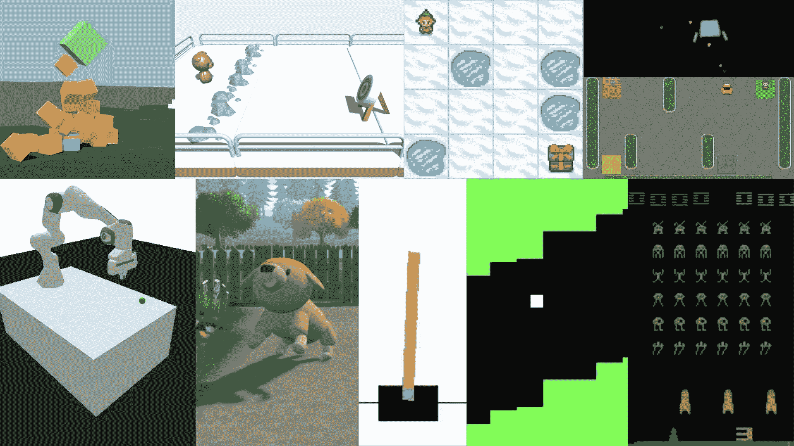
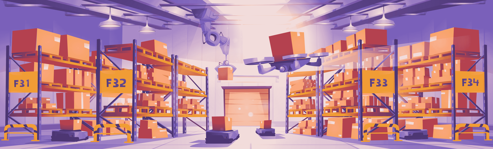
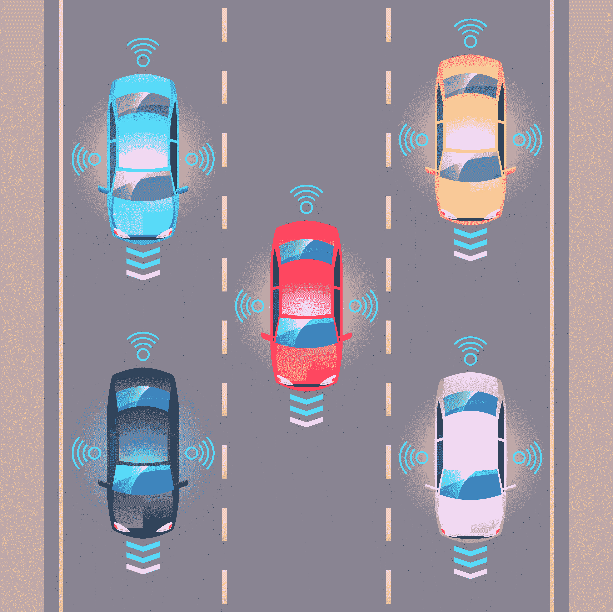
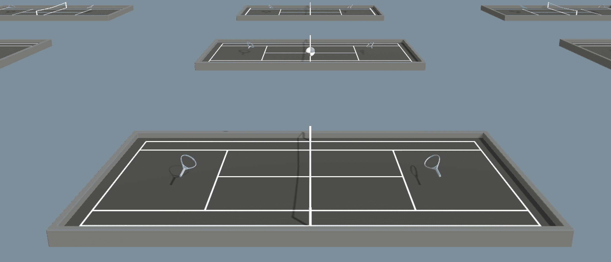
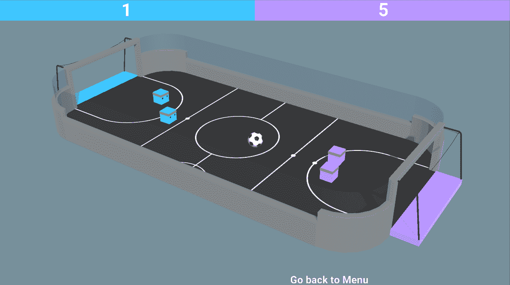

# 多代理强化学习（MARL）简介

> 原文链接：[`huggingface.co/learn/deep-rl-course/unit7/introduction-to-marl`](https://huggingface.co/learn/deep-rl-course/unit7/introduction-to-marl)

## 从单一代理到多个代理

在第一个单元中，我们学习了如何在单一代理系统中训练代理。当我们的代理在环境中独自一人时：**它并不是在与其他代理合作或协作**。

一个由你在课程开始以来训练你的代理的所有环境拼凑而成的图案

当我们进行多代理强化学习（MARL）时，我们处于一个情况，其中我们有多个代理**共享并在一个共同的环境中互动**。

例如，你可以想象一个仓库，**多个机器人需要导航以装载和卸载包裹**。

[图片来源：upklyak](https://www.freepik.com/free-vector/robots-warehouse-interior-automated-machines_32117680.htm#query=warehouse robot&position=17&from_view=keyword)

或者一条有**多辆自动驾驶车辆**的道路。

[图片来源：jcomp](https://www.freepik.com/free-vector/autonomous-smart-car-automatic-wireless-sensor-driving-road-around-car-autonomous-smart-car-goes-scans-roads-observe-distance-automatic-braking-system_26413332.htm#query=self driving cars highway&position=34&from_view=search&track=ais)

在这些例子中，我们有**多个代理在环境中互动并与其他代理互动**。这意味着定义一个多代理系统。但首先，让我们了解不同类型的多代理环境。

## 不同类型的多代理环境

鉴于在多代理系统中，代理与其他代理互动，我们可以有不同类型的环境：

+   *合作环境*：在这种环境中，你的代理需要**最大化共同利益**。

例如，在一个仓库中，**机器人必须合作以高效地装载和卸载包裹（尽快地）**。

+   *竞争/对抗环境*：在这种情况下，你的代理**希望通过最小化对手的利益来最大化自己的利益**。

例如，在一场网球比赛中，**每个代理都希望击败另一个代理**。

+   *既有对抗性又有合作性*：就像在我们的 SoccerTwos 环境中，两个代理是一个团队的一部分（蓝色或紫色）：他们需要彼此合作并击败对手团队。

这个环境是由[Unity MLAgents 团队](https://github.com/Unity-Technologies/ml-agents)创建的

那么现在我们可能会想：我们如何设计这些多代理系统呢？换句话说，**我们如何在多代理设置中训练代理**？
