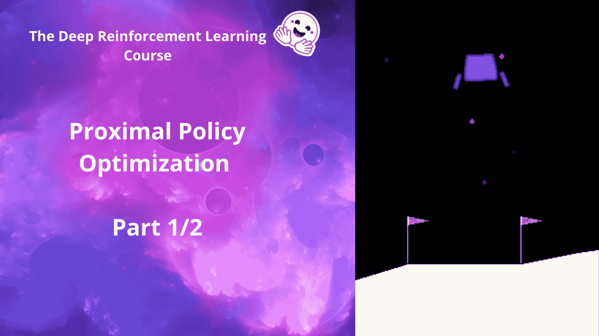
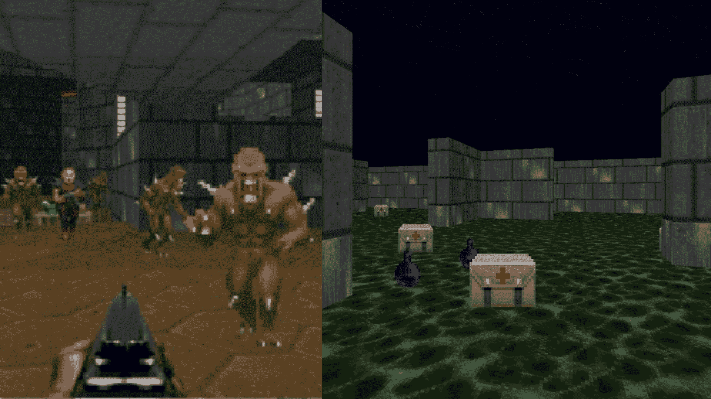

# 介绍

> 原文链接：[`huggingface.co/learn/deep-rl-course/unit8/introduction`](https://huggingface.co/learn/deep-rl-course/unit8/introduction)

在第 6 单元，我们学习了优势演员评论家（A2C），这是一种混合架构，结合了基于价值和基于策略的方法，有助于通过减少方差来稳定训练。

+   一个控制**代理行为方式**的演员（基于策略的方法）。

+   一个度量**采取的行动有多好**的评论家（基于价值的方法）。

今天我们将学习 Proximal Policy Optimization（PPO），这是一种架构，通过避免过大的策略更新来提高我们代理的训练稳定性。为此，我们使用一个比率来指示当前策略和旧策略之间的差异，并将此比率剪切到特定范围[1−ϵ,1+ϵ]。

这样做将确保我们的策略更新不会太大，并且训练更加稳定。

本单元分为两部分：

+   在这第一部分中，您将学习 PPO 背后的理论，并使用[CleanRL](https://github.com/vwxyzjn/cleanrl)实现从头开始编写您的 PPO 代理。为了测试其稳健性，您将使用 LunarLander-v2。LunarLander-v2 是您开始本课程时使用的第一个环境。那时，您不知道 PPO 是如何工作的，现在您可以从头开始编码并训练它。这是多么令人难以置信的事情🤩。

+   在第二部分中，我们将通过使用[Sample-Factory](https://samplefactory.dev/)深入了解 PPO 优化，并训练一个玩 vizdoom（Doom 的开源版本）的代理。

这些是您将用来训练代理的环境：VizDoom 环境

听起来很激动人心吗？让我们开始吧！🚀
