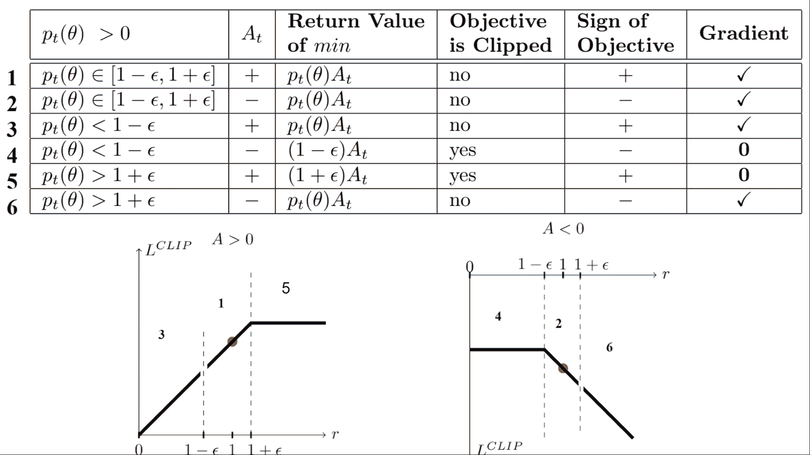
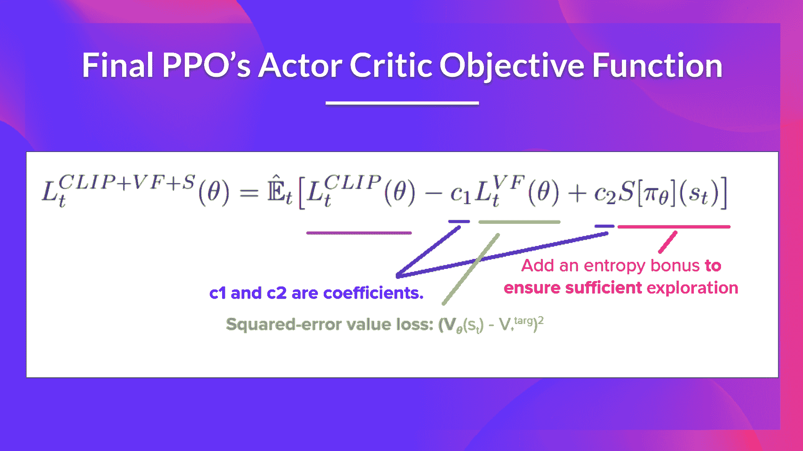

# 可视化修剪的替代目标函数

> 原文链接：[`huggingface.co/learn/deep-rl-course/unit8/visualize`](https://huggingface.co/learn/deep-rl-course/unit8/visualize)

不用担心。**如果现在处理起来似乎复杂，这是正常的**。但我们将看看这个修剪的替代目标函数是什么样子的，这将帮助您更好地理解发生了什么。

[来自 Daniel Bick 的“朝向提供一种连贯的自包含解释：近端策略优化”表格](https://fse.studenttheses.ub.rug.nl/25709/1/mAI_2021_BickD.pdf)

我们有六种不同的情况。首先记住我们取修剪和未修剪目标之间的最小值。

## 情况 1 和 2：比率在范围之间

在情况 1 和 2 中，**由于比率在范围之间，修剪不适用**<math><semantics><mrow><mo stretchy="false">[</mo><mn>1</mn><mo>−</mo><mi>ϵ</mi><mo separator="true">,</mo><mn>1</mn><mo>+</mo><mi>ϵ</mi><mo stretchy="false">]</mo></mrow> <annotation encoding="application/x-tex">[1 - \epsilon, 1 + \epsilon]</annotation></semantics></math> [1−ϵ,1+ϵ]

在情况 1 中，我们有一个正优势：该**动作比该状态下所有动作的平均值更好**。因此，我们应该鼓励当前策略增加在该状态下采取该动作的概率。

由于比率在区间之间，**我们可以增加策略在该状态下采取该动作的概率**。

在情况 2 中，我们有一个负优势：该动作比该状态下所有动作的平均值更差。因此，我们应该阻止当前策略在该状态下采取该动作。

由于比率在区间之间，**我们可以降低策略在该状态下采取该动作的概率**。

## 情况 3 和 4：比率在范围之下

[来自 Daniel Bick 的“朝向提供一种连贯的自包含解释：近端策略优化”表格](https://fse.studenttheses.ub.rug.nl/25709/1/mAI_2021_BickD.pdf)

如果概率比小于<math><semantics><mrow><mo stretchy="false">[</mo><mn>1</mn><mo>−</mo><mi>ϵ</mi><mo stretchy="false">]</mo></mrow> <annotation encoding="application/x-tex">[1 - \epsilon]</annotation></semantics></math> [1−ϵ]，在该状态下采取该动作的概率比旧策略要低得多。

如果像情况 3 那样，优势估计为正值（A>0），那么**您希望增加在该状态下采取该动作的概率**。

但是，如果像情况 4 那样，优势估计为负值，**我们不希望进一步降低**在该状态下采取该动作的概率。因此，梯度=0（因为我们处于一条平直线上），所以我们不更新权重。

## 情况 5 和 6：比率在范围之上

[来自 Daniel Bick 的“朝向提供一种连贯的自包含解释：近端策略优化”表格](https://fse.studenttheses.ub.rug.nl/25709/1/mAI_2021_BickD.pdf)

如果概率比大于<math><semantics><mrow><mo stretchy="false">[</mo><mn>1</mn><mo>+</mo><mi>ϵ</mi><mo stretchy="false">]</mo></mrow> <annotation encoding="application/x-tex">[1 + \epsilon]</annotation></semantics></math> [1+ϵ]，那么在当前策略中采取该动作的概率**比以前的策略要高得多**。

如果像情况 5 那样，优势为正，**我们不希望太贪心**。我们已经比以前的策略有更高的概率在该状态下采取该动作。因此，梯度=0（因为我们处于一条平直线上），所以我们不更新权重。

如果像情况 6 那样，优势为负值，我们希望降低在该状态下采取该动作的概率。

因此，总结一下，**我们只更新未剪切的目标部分的策略**。当最小值是剪切的目标部分时，我们不更新我们的策略权重，因为梯度将等于 0。

因此，我们只在以下情况下更新我们的策略：

+   我们的比率在范围内[1−ϵ,1+ϵ]

+   我们的比率在范围之外，但**优势导致更接近范围**

    +   在比率之下但优势>0

    +   在比率之上但优势<0

**你可能会想知道为什么，当最小值是剪切比率时，梯度为 0。**当比率被剪切时，在这种情况下的导数将不是 rt(θ)∗At，而是(1−ϵ)∗At 或(1+ϵ)∗At，两者都等于 0。

总结一下，由于这个剪切的替代目标，**我们限制了当前策略可以从旧策略变化的范围。**因为我们消除了概率比率移出区间的激励，剪切强制梯度为零。如果比率是 1+ϵ或 1−ϵ，梯度将等于 0。

PPO Actor-Critic 风格的最终 Clipped Surrogate Objective Loss 看起来像这样，它是 Clipped Surrogate Objective 函数、Value Loss 函数和熵奖励的组合：

这相当复杂。花时间通过查看表格和图形来理解这些情况。**你必须理解为什么这是有道理的。**如果你想深入了解，最好的资源是 Daniel Bick 的文章[“Towards Delivering a Coherent Self-Contained Explanation of Proximal Policy Optimization”，特别是第 3.4 部分](https://fse.studenttheses.ub.rug.nl/25709/1/mAI_2021_BickD.pdf)。
