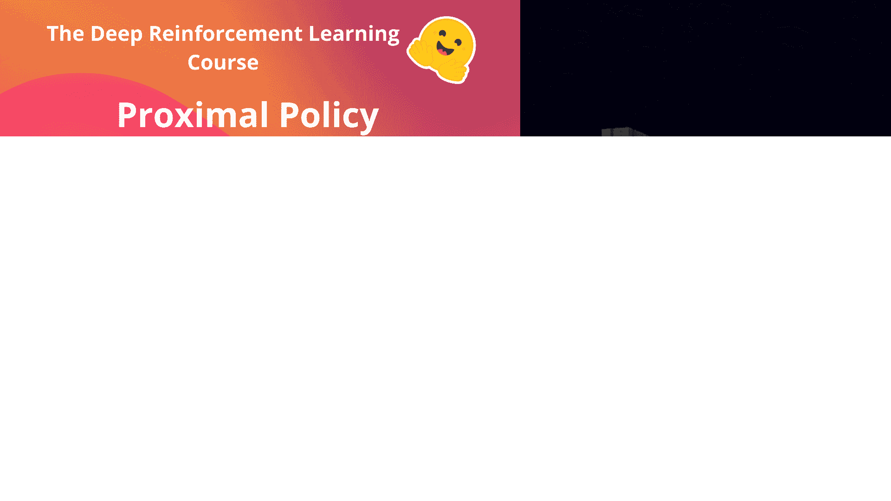
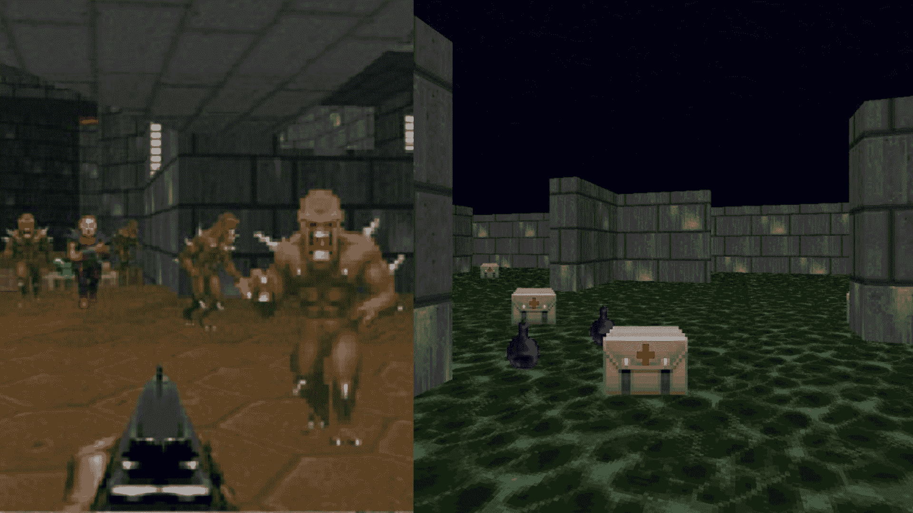

# 使用 Sample-Factory 介绍 PPO

> 原文链接：[`huggingface.co/learn/deep-rl-course/unit8/introduction-sf`](https://huggingface.co/learn/deep-rl-course/unit8/introduction-sf)

在第 8 单元的第二部分中，我们将通过使用[Sample-Factory](https://samplefactory.dev/)深入了解 PPO 优化，这是 PPO 算法的**异步实现**，用于训练我们的代理玩[vizdoom](https://vizdoom.cs.put.edu.pl/)（Doom 的开源版本）。

在笔记本中，**您将训练您的代理玩健康收集关卡**，代理必须收集健康包以避免死亡。之后，您可以**训练您的代理玩更复杂的关卡，比如死斗**。

听起来很激动人心吗？让我们开始吧！🚀

这个实践是由[Hugging Face 的机器学习研究科学家 Edward Beeching](https://twitter.com/edwardbeeching)制作的。他曾在 Godot 强化学习代理上工作，这是一个用于在 Godot 游戏引擎中开发环境和代理的开源接口。
