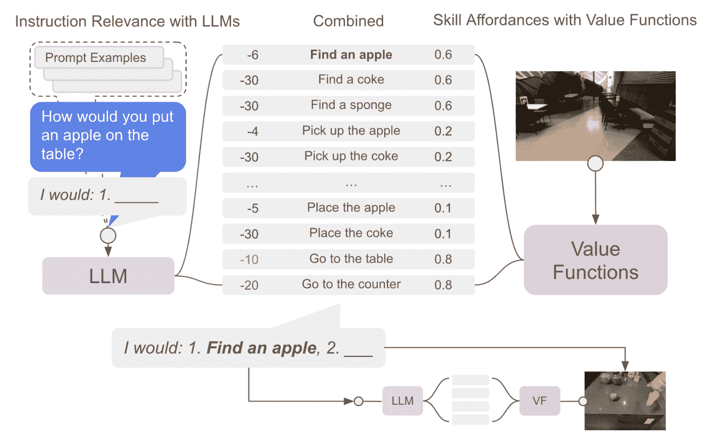
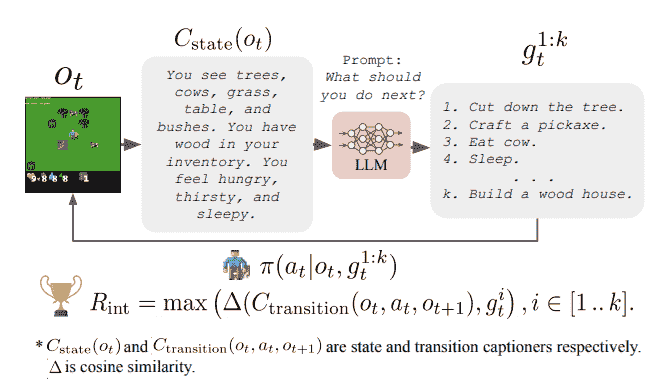

# 强化学习中的语言模型

> 原文：[`huggingface.co/learn/deep-rl-course/unitbonus3/language-models`](https://huggingface.co/learn/deep-rl-course/unitbonus3/language-models)

## 语言模型为代理编码了有用的知识

**语言模型**（LMs）在处理文本时可以展示出令人印象深刻的能力，例如问答或逐步推理。此外，它们在大规模文本语料库上的训练使它们能够**编码各种类型的知识，包括关于我们世界的物理规则的抽象知识**（例如使用物体时可能发生的情况，旋转物体时会发生什么...）。

最近研究的一个自然问题是，这种知识是否能够使代理（如机器人）在尝试解决日常任务时受益。虽然这些工作显示了有趣的结果，但所提出的代理缺乏任何学习方法。**这种限制阻碍了这些代理适应环境（例如修正错误知识）或学习新技能。**

来源：[朝着有用的机器人：将语言基于机器人的可供性](https://ai.googleblog.com/2022/08/towards-helpful-robots-grounding.html)

## 语言模型和强化学习

因此，语言模型和强化学习之间存在潜在的协同作用，语言模型可以为世界带来知识，而强化学习可以通过与环境的交互来对齐和纠正这些知识。从强化学习的角度来看，这是特别有趣的，因为强化学习领域主要依赖于**Tabula-rasa**设置，其中一切都是由代理从头学习的，导致：

1）样本效率

2）从人类眼中看到的意外行为

作为第一次尝试，论文[“使用在线强化学习对大型语言模型进行基础”](https://arxiv.org/abs/2302.02662v1)解决了**使用 PPO 将语言模型适应或对齐到文本环境的问题**。他们表明，语言模型中编码的知识导致对环境的快速适应（为样本有效的 RL 代理开辟了途径），但也表明这种知识使得一旦对齐，语言模型能够更好地推广到新任务。

<https://huggingface.co/datasets/huggingface-deep-rl-course/course-images/resolve/main/en/unit12/papier_v4.mp4>

另一个研究方向在[“使用大型语言模型引导强化学习的预训练”](https://arxiv.org/abs/2302.06692)中探讨了保持语言模型冻结但利用其知识来**引导 RL 代理的探索**。这种方法允许 RL 代理被引导朝着人类有意义且可能有用的行为方向发展，而无需在训练过程中需要人类参与。

来源：[朝着有用的机器人：将语言基于机器人的可供性](https://ai.googleblog.com/2022/08/towards-helpful-robots-grounding.html)

一些限制使这些工作仍然非常初步，例如需要将代理的观察转换为文本然后再将其提供给语言模型，以及与非常大的语言模型交互的计算成本。

## 进一步阅读

有关更多信息，我们建议您查看以下资源：

+   [Google Research，2022 年及以后：机器人技术](https://ai.googleblog.com/2023/02/google-research-2022-beyond-robotics.html)

+   [用于交互式决策制定的预训练语言模型](https://arxiv.org/abs/2202.01771)

+   [使用在线强化学习对大型语言模型进行基础](https://arxiv.org/abs/2302.02662v1)

+   [使用大型语言模型引导强化学习的预训练](https://arxiv.org/abs/2302.06692)

## 作者

本节由[Clément Romac](https://twitter.com/ClementRomac)撰写
