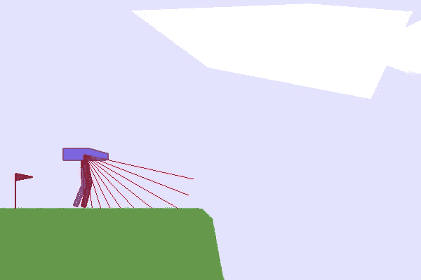
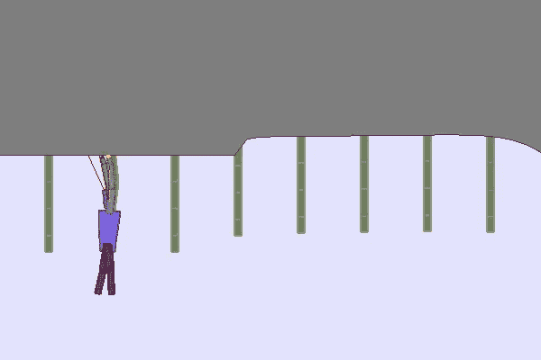
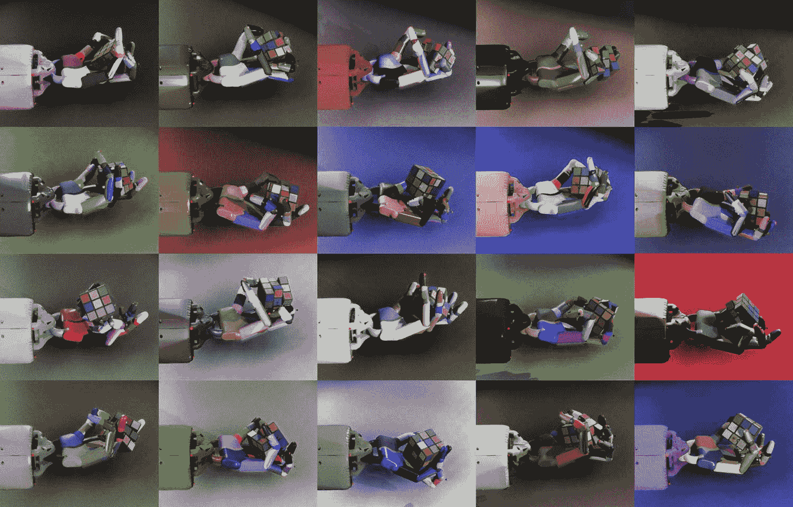
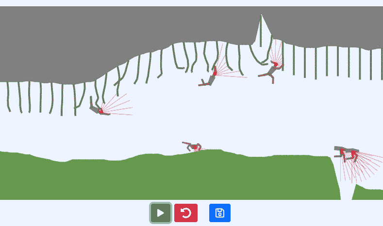

# （自动）强化学习课程

> 原文链接：[`huggingface.co/learn/deep-rl-course/unitbonus3/curriculum-learning`](https://huggingface.co/learn/deep-rl-course/unitbonus3/curriculum-learning)

虽然本课程中介绍的大多数强化学习方法在实践中表现良好，但有些情况下仅使用它们会失败。例如，当：

+   学习的任务很艰巨，需要**逐步习得技能**（例如，当一个人想让一个双足机器人学会穿过困难障碍物时，它必须首先学会站立，然后行走，然后可能跳跃…）

+   环境中存在变化（影响难度），人们希望他们的代理能够**对其具有鲁棒性**

 

[TeachMyAgent](https://developmentalsystems.org/TeachMyAgent/)

在这种情况下，似乎需要向我们的强化学习代理提出不同的任务，并组织这些任务，使代理逐渐习得技能。这种方法称为**课程学习**，通常意味着手动设计的课程（或按特定顺序组织的任务集）。在实践中，例如，可以控制环境的生成，初始状态，或者使用自我对弈并控制提供给强化学习代理的对手的水平。

由于设计这样的课程并不总是简单的，**自动课程学习（ACL）领域提出设计方法，学习创建这样的任务组织，以最大化强化学习代理的表现**。Portelas 等人提出将 ACL 定义为：

> … 一系列机制，通过学习调整学习情境的选择，自动调整训练数据的分布，以适应强化学习代理的能力。

举例来说，OpenAI 使用**领域随机化**（他们在环境中应用随机变化）让一个机器人手解决魔方。

[OpenAI - 用机器人手解决魔方](https://openai.com/blog/solving-rubiks-cube/)

最后，您可以通过控制环境变化或甚至绘制地形👇来玩强化学习代理在[TeachMyAgent](https://huggingface.co/spaces/flowers-team/Interactive_DeepRL_Demo)基准测试中训练的鲁棒性

[`huggingface.co/spaces/flowers-team/Interactive_DeepRL_Demo`](https://huggingface.co/spaces/flowers-team/Interactive_DeepRL_Demo)

## 进一步阅读

更多信息，请查看以下资源：

### 领域概述

+   [深度强化学习的自动课程学习：简短调查](https://arxiv.org/pdf/2003.04664.pdf)

+   [强化学习课程](https://lilianweng.github.io/posts/2020-01-29-curriculum-rl/)

### 最新方法

+   [通过基于遗憾的环境设计演变课程](https://arxiv.org/abs/2203.01302)

+   [通过受限最优传输进行课程强化学习](https://proceedings.mlr.press/v162/klink22a.html)

+   [优先级水平重播](https://arxiv.org/abs/2010.03934)

## 作者

本节由[Clément Romac](https://twitter.com/ClementRomac)撰写
