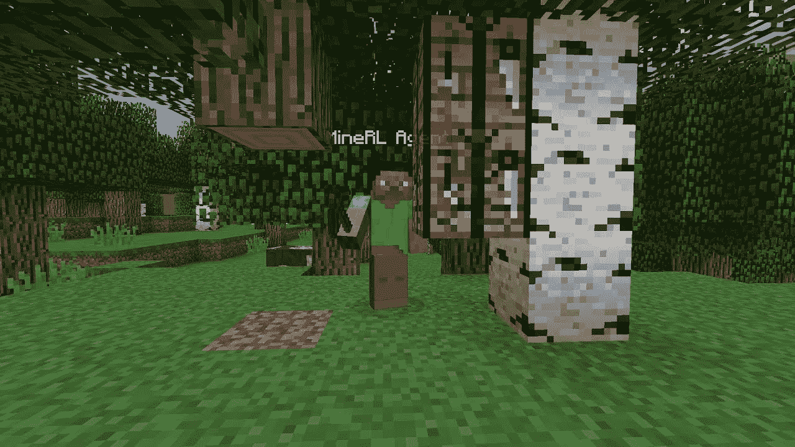
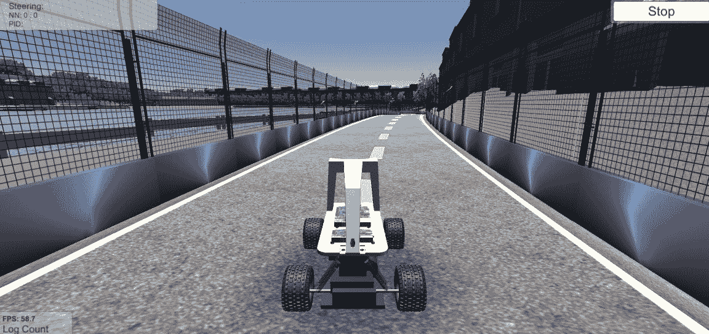
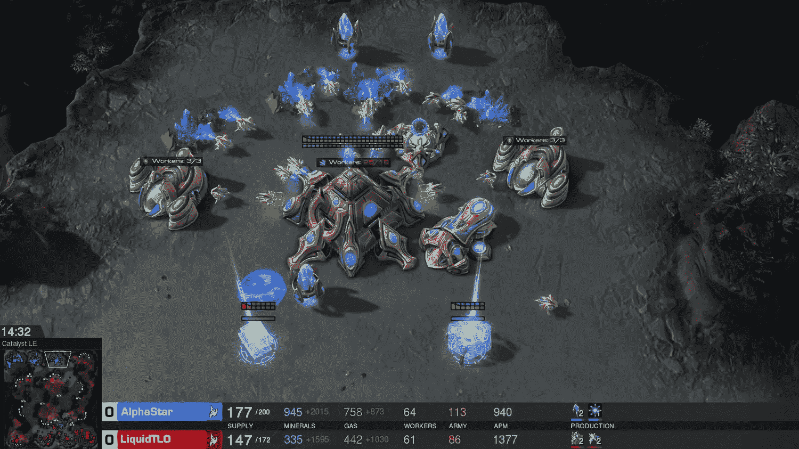

# 有趣的环境尝试

> 原始文本：[`huggingface.co/learn/deep-rl-course/unitbonus3/envs-to-try`](https://huggingface.co/learn/deep-rl-course/unitbonus3/envs-to-try)

这里我们提供了一个有趣的环境列表，您可以尝试在上面训练您的代理：

## MineRL

MineRL 是一个提供与视频游戏 Minecraft 交互的 Gym 接口的 Python 库，附带有人类游戏数据集。每年都会有关于这个库的挑战。查看[网站](https://minerl.io/)

使用这个环境，请查看以下资源：

+   [什么是 MineRL？](https://www.youtube.com/watch?v=z6PTrGifupU)

+   [在 MineRL 中的第一步](https://www.youtube.com/watch?v=8yIrWcyWGek)

+   [MineRL 文档和教程](https://minerl.readthedocs.io/en/latest/)

## DonkeyCar 模拟器

 Donkey 是一个用于爱好者遥控车的自动驾驶汽车平台。这个模拟器版本是建立在 Unity 游戏平台上的。它使用他们内部的物理和图形，并连接到一个 Donkey Python 进程，以使用我们训练的模型来控制模拟的 Donkey（汽车）。

使用这个环境，请查看以下资源：

+   [DonkeyCar 模拟器文档](https://docs.donkeycar.com/guide/deep_learning/simulator/)

+   [学习平稳驾驶（Antonin Raffin 的教程）第 1 部分](https://www.youtube.com/watch?v=ngK33h00iBE)

+   [学习平稳驾驶（Antonin Raffin 的教程）第 2 部分](https://www.youtube.com/watch?v=DUqssFvcSOY)

+   [学习平稳驾驶（Antonin Raffin 的教程）第 3 部分](https://www.youtube.com/watch?v=v8j2bpcE4Rg)

+   预训练代理：

    +   [`huggingface.co/araffin/tqc-donkey-mountain-track-v0`](https://huggingface.co/araffin/tqc-donkey-mountain-track-v0)

    +   [`huggingface.co/araffin/tqc-donkey-avc-sparkfun-v0`](https://huggingface.co/araffin/tqc-donkey-avc-sparkfun-v0)

    +   [`huggingface.co/araffin/tqc-donkey-minimonaco-track-v0`](https://huggingface.co/araffin/tqc-donkey-minimonaco-track-v0)

## 星际争霸 II

星际争霸 II 是一款著名的*实时战略游戏*。DeepMind 已经将这个游戏用于他们的深度强化学习研究，使用[Alphastar](https://www.deepmind.com/blog/alphastar-mastering-the-real-time-strategy-game-starcraft-ii)

使用这个环境，请查看以下资源：

+   [星际争霸健身房](http://starcraftgym.com/)

+   [A. I. 学习玩星际争霸 2（强化学习）教程](https://www.youtube.com/watch?v=q59wap1ELQ4)

## 作者

这部分内容由[Thomas Simonini](https://twitter.com/ThomasSimonini)撰写
