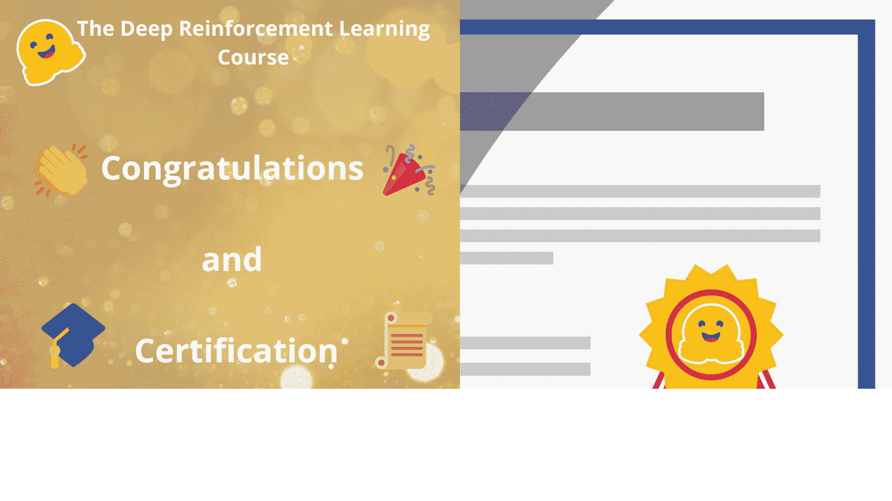

# 恭喜

> 原文链接：[`huggingface.co/learn/deep-rl-course/communication/conclusion`](https://huggingface.co/learn/deep-rl-course/communication/conclusion)

**恭喜您完成这门课程！**凭借毅力、努力和决心，**您已经获得了深度强化学习的坚实基础**。

但完成这门课程并不是**您旅程的终点**。这只是开始：不要犹豫探索额外的第 3 单元，我们会向您展示您可能有兴趣学习的主题。并且不要犹豫**分享您正在做的事情，并在 Discord 服务器上提问**

**谢谢**您参加这门课程。**我希望您喜欢这门课程，就像我喜欢写作一样**。

不要犹豫**通过[此表格](https://forms.gle/BzKXWzLAGZESGNaE9)给我们反馈，告诉我们如何改进课程**

并不要忘记**查看下一部分，了解如何获得（如果通过）您的完成证书‎‍🎓。**

最后一件事，保持联系与强化学习团队和我：

+   [关注我的 Twitter](https://twitter.com/thomassimonini)

+   [关注拥抱面对面的 Twitter 账号](https://twitter.com/huggingface)

+   [加入拥抱面对面 Discord](https://www.hf.co/join/discord)

## 继续学习，保持精彩 🤗

Thomas Simonini，
