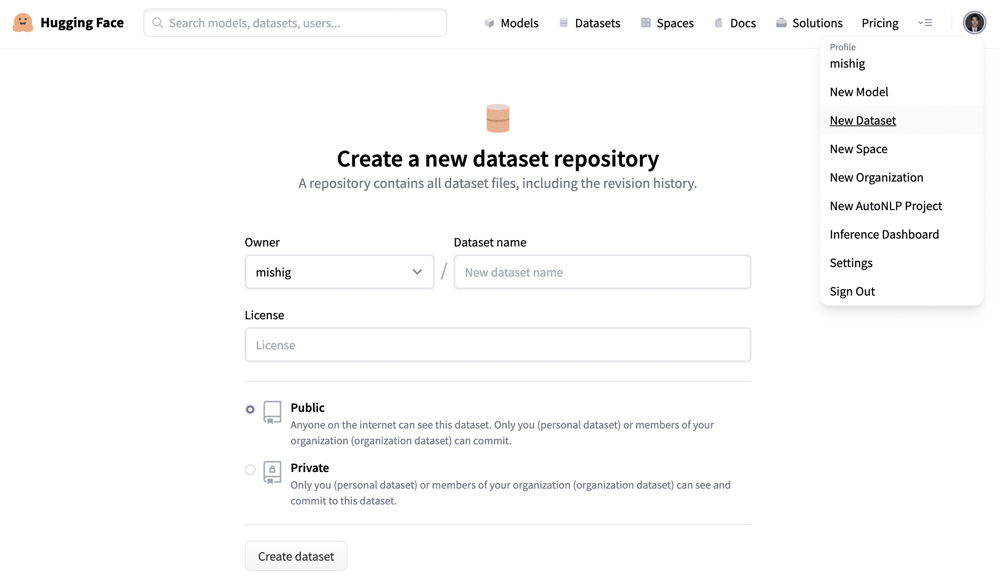
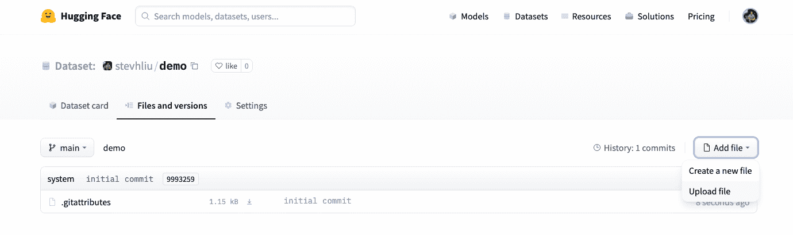
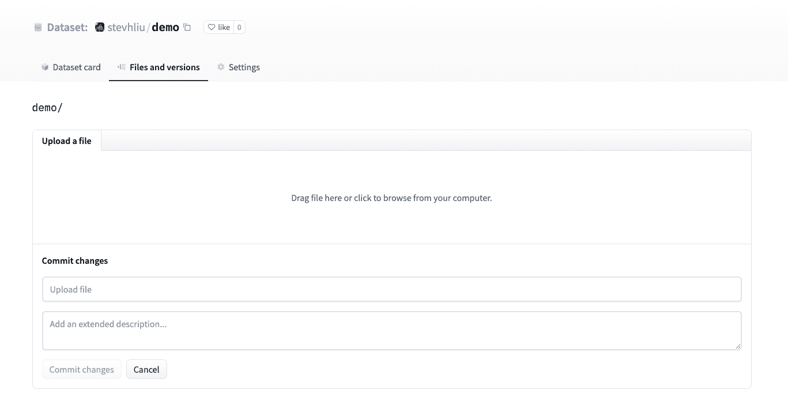
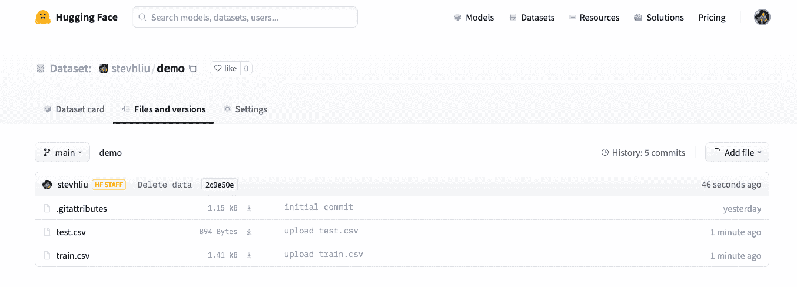
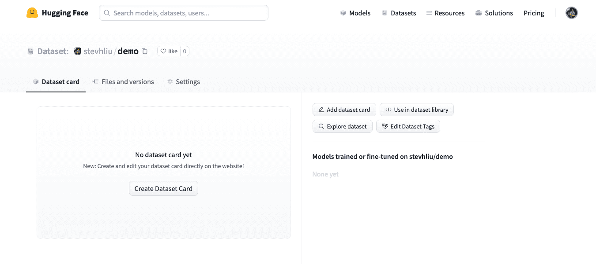
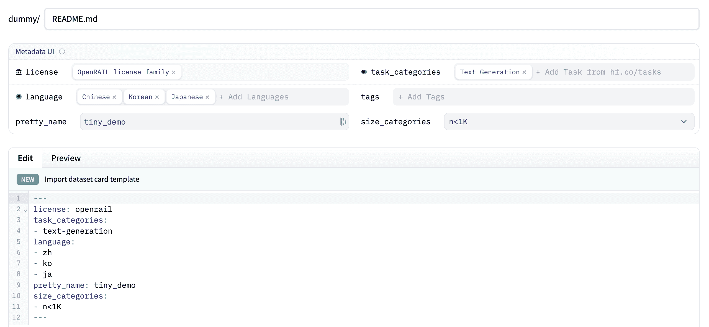

# 分享数据集到 Hub

> 原文链接：[`huggingface.co/docs/datasets/upload_dataset`](https://huggingface.co/docs/datasets/upload_dataset)

[Hub](https://huggingface.co/datasets)是一个包含社区策划和热门研究数据集的广泛集合。我们鼓励您将您的数据集分享到 Hub，以帮助发展 ML 社区并加速每个人的进步。欢迎所有贡献；添加数据集只是一步之遥！

如果您还没有，请首先[创建 Hugging Face Hub 账户](https://huggingface.co/join)。

## 使用 Hub UI 上传

Hub 的基于 Web 的界面允许没有任何开发经验的用户上传数据集。

### 创建存储库

存储库托管所有您的数据集文件，包括修订历史，使得存储多个数据集版本成为可能。

1.  单击您的个人资料，选择**新数据集**以创建新的数据集存储库。

1.  为您的数据集选择一个名称，并选择它是公共数据集还是私有数据集。公共数据集对任何人可见，而私有数据集只能被您或您的组织成员查看。



### 上传数据集

1.  创建存储库后，转到**文件和版本**选项卡以添加文件。选择**添加文件**以上传您的数据集文件。我们支持许多文本、音频和图像数据扩展名，如`.csv`、`.mp3`和`.jpg`等。对于文本数据扩展名如`.csv`、`.json`、`.jsonl`和`.txt`，我们建议在上传到 Hub 之前对其进行压缩（例如`.zip`或`.gz`文件扩展名）。

    默认情况下，Git LFS 不跟踪文本文件扩展名，如果它们大于 10MB，将不会被提交和上传。查看您存储库中的`.gitattributes`文件，以获取受跟踪的文件扩展名的完整列表。在本教程中，您可以使用以下示例`.csv`文件，因为它们很小：[train.csv](https://huggingface.co/datasets/stevhliu/demo/raw/main/train.csv)，[test.csv](https://huggingface.co/datasets/stevhliu/demo/raw/main/test.csv)。



1.  拖放您的数据集文件并添加简要描述性提交消息。



1.  上传数据集文件后，它们将存储在您的数据集存储库中。



### 创建数据集卡

添加数据集卡对帮助用户找到您的数据集并了解如何负责使用它非常有价值。

1.  单击**创建数据集卡**以创建数据集卡。此按钮会在您的存储库中创建一个`README.md`文件。



1.  在顶部，您将看到**元数据 UI**，其中有几个字段可供选择，如许可证、语言和任务类别。这些是帮助用户在 Hub 上发现您的数据集的最重要标签。当您从每个字段中选择一个选项时，它们将自动添加到数据集卡的顶部。

    您还可以查看[数据集卡规范](https://github.com/huggingface/hub-docs/blob/main/datasetcard.md?plain=1)，其中包含一整套（但不是必需的）标签选项，如`annotations_creators`，以帮助您选择适当的标签。



1.  单击编辑器顶部的**导入数据集卡模板**链接，自动创建数据集卡模板。填写模板是向社区介绍您的数据集并帮助用户了解如何使用它的好方法。要查看良好数据集卡的详细示例，请查看[CNN DailyMail 数据集卡](https://huggingface.co/datasets/cnn_dailymail)。

### 加载数据集

一旦您的数据集存储在 Hub 上，任何人都可以使用 load_dataset()函数加载它：

```py
>>> from datasets import load_dataset

>>> dataset = load_dataset("stevhliu/demo")
```

## 使用 Python 上传

用户可以使用[huggingface_hub](https://huggingface.co/docs/huggingface_hub/index)库以编程方式上传数据集。该库允许用户从 Python 与 Hub 进行交互。

1.  首先安装库：

```py
pip install huggingface_hub
```

1.  要在 Python 中将数据集上传到 Hub，您需要登录您的 Hugging Face 帐户：

```py
huggingface-cli login
```

1.  使用[`push_to_hub()`](https://huggingface.co/docs/datasets/main/en/package_reference/main_classes#datasets.DatasetDict.push_to_hub)函数来帮助您将文件添加、提交和推送到您的存储库：

```py
>>> from datasets import load_dataset

>>> dataset = load_dataset("stevhliu/demo")
# dataset = dataset.map(...)  # do all your processing here
>>> dataset.push_to_hub("stevhliu/processed_demo")
```

要将数据集设置为私有，请将`private`参数设置为`True`。如果您是第一次创建存储库，则此参数将起作用。

```py
>>> dataset.push_to_hub("stevhliu/private_processed_demo", private=True)
```

要向数据集添加新配置（或子集）或添加新拆分（训练/验证/测试），请参考 Dataset.push_to_hub()文档。

### 隐私

私有数据集只能由您访问。同样，如果您在组织内共享数据集，则组织成员也可以访问数据集。

通过向`token`参数提供您的身份验证令牌来加载私有数据集：

```py
>>> from datasets import load_dataset

# Load a private individual dataset
>>> dataset = load_dataset("stevhliu/demo", token=True)

# Load a private organization dataset
>>> dataset = load_dataset("organization/dataset_name", token=True)
```

## 接下来是什么？

恭喜，您已完成教程！🥳

从这里，您可以继续：

+   了解更多关于如何使用🤗数据集其他功能来处理您的数据集。

+   在本地不下载的情况下流式传输大型数据集。

+   定义您的数据集拆分和配置或加载脚本并与社区分享您的数据集。

如果您对🤗数据集有任何问题，请随时加入我们的[论坛](https://discuss.huggingface.co/c/datasets/10)并向社区提问。
