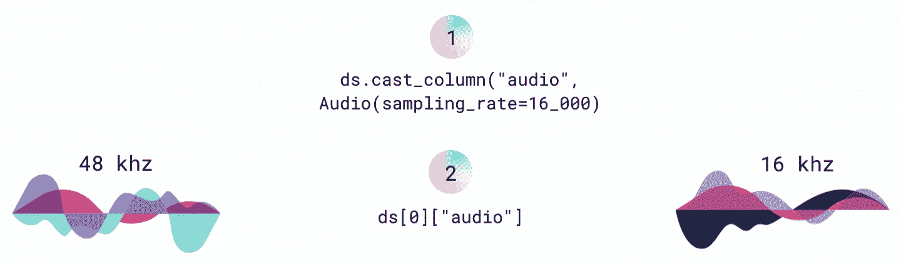
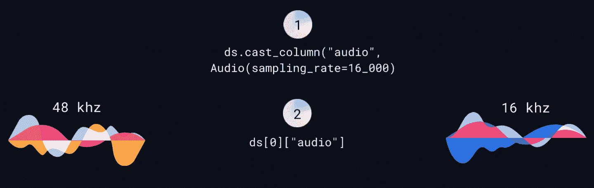

# 处理音频数据

> 原始文本：[`huggingface.co/docs/datasets/audio_process`](https://huggingface.co/docs/datasets/audio_process)

本指南展示了处理音频数据集的具体方法。学习如何：

+   重新采样采样率。

+   使用 map() 处理音频数据集。

要了解如何处理任何类型的数据集，请查看通用处理指南。

## 转换

cast_column() 函数用于将列转换为另一个要解码的特征。当您将此函数与 Audio 特征一起使用时，可以重新采样采样率：

```py
>>> from datasets import load_dataset, Audio

>>> dataset = load_dataset("PolyAI/minds14", "en-US", split="train")
>>> dataset = dataset.cast_column("audio", Audio(sampling_rate=16000))
```

音频文件会动态解码和重新采样，因此下次访问示例时，音频文件将被重新采样为 16kHz：

```py
>>> dataset[0]["audio"]
{'array': array([ 2.3443763e-05,  2.1729663e-04,  2.2145823e-04, ...,
         3.8356509e-05, -7.3497440e-06, -2.1754686e-05], dtype=float32),
 'path': '/root/.cache/huggingface/datasets/downloads/extracted/f14948e0e84be638dd7943ac36518a4cf3324e8b7aa331c5ab11541518e9368c/en-US~JOINT_ACCOUNT/602ba55abb1e6d0fbce92065.wav',
 'sampling_rate': 16000}
```

 

## 映射

map() 函数有助于一次预处理整个数据集。根据您正在使用的模型类型，您需要加载一个[feature extractor](https://huggingface.co/docs/transformers/model_doc/auto#transformers.AutoFeatureExtractor) 或一个[processor](https://huggingface.co/docs/transformers/model_doc/auto#transformers.AutoProcessor)。

+   对于预训练的语音识别模型，请加载一个特征提取器和分词器，并将它们组合在一个`processor`中：

    ```py
    >>> from transformers import AutoTokenizer, AutoFeatureExtractor, AutoProcessor

    >>> model_checkpoint = "facebook/wav2vec2-large-xlsr-53"
    # after defining a vocab.json file you can instantiate a tokenizer object:
    >>> tokenizer = AutoTokenizer("./vocab.json", unk_token="[UNK]", pad_token="[PAD]", word_delimiter_token="|")
    >>> feature_extractor = AutoFeatureExtractor.from_pretrained(model_checkpoint)
    >>> processor = AutoProcessor.from_pretrained(feature_extractor=feature_extractor, tokenizer=tokenizer)
    ```

+   对于经过微调的语音识别模型，您只需要加载一个`processor`：

    ```py
    >>> from transformers import AutoProcessor

    >>> processor = AutoProcessor.from_pretrained("facebook/wav2vec2-base-960h")
    ```

当您使用 map() 与您的预处理函数时，请包括`audio`列以确保您实际上正在重新采样音频数据：

```py
>>> def prepare_dataset(batch):
...     audio = batch["audio"]
...     batch["input_values"] = processor(audio["array"], sampling_rate=audio["sampling_rate"]).input_values[0]
...     batch["input_length"] = len(batch["input_values"])
...     with processor.as_target_processor():
...         batch["labels"] = processor(batch["sentence"]).input_ids
...     return batch
>>> dataset = dataset.map(prepare_dataset, remove_columns=dataset.column_names)
```
