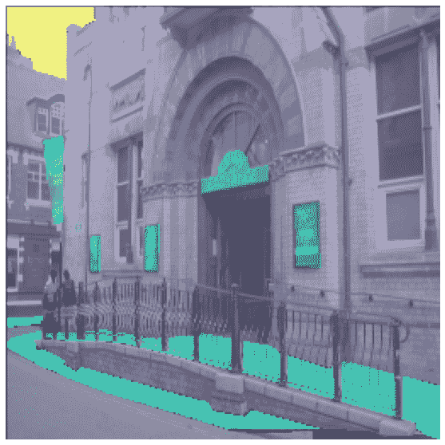
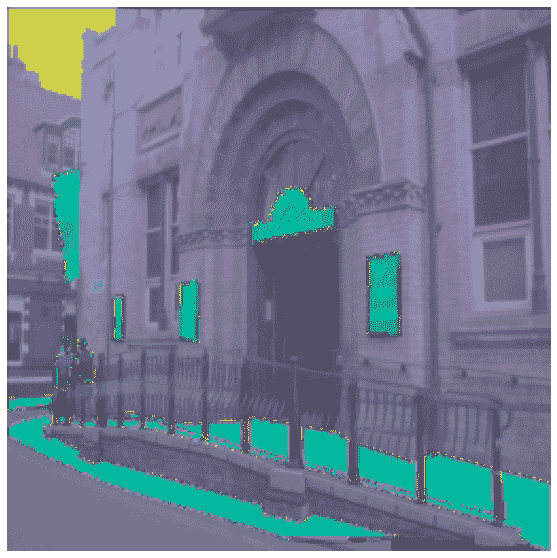

# 语义分割

> 原文链接：[`huggingface.co/docs/datasets/semantic_segmentation`](https://huggingface.co/docs/datasets/semantic_segmentation)

语义分割数据集用于训练模型以对图像中的每个像素进行分类。这些数据集使得可以实现许多应用，如从图像中去除背景、美化图像或用于自动驾驶的场景理解。本指南将向您展示如何对图像分割数据集应用转换。

在开始之前，请确保您已安装了最新版本的`albumentations`和`cv2`：

```py
pip install -U albumentations opencv-python
```

[Albumentations](https://albumentations.ai/)是一个用于计算机视觉数据增强的 Python 库。它支持各种计算机视觉任务，如图像分类、目标检测、分割和关键点估计。

本指南使用[Scene Parsing](https://huggingface.co/datasets/scene_parse_150)数据集来对图像进行分割和解析，将其分为与语义类别相关的不同图像区域，如天空、道路、人物和床。

加载数据集的`train`拆分并查看一个示例：

```py
>>> from datasets import load_dataset

>>> dataset = load_dataset("scene_parse_150", split="train")
>>> index = 10
>>> dataset[index]
{'image': <PIL.JpegImagePlugin.JpegImageFile image mode=RGB size=683x512 at 0x7FB37B0EC810>,
 'annotation': <PIL.PngImagePlugin.PngImageFile image mode=L size=683x512 at 0x7FB37B0EC9D0>,
 'scene_category': 927}
```

数据集有三个字段：

+   `image`：一个 PIL 图像对象。

+   `annotation`：图像的分割蒙版。

+   `scene_category`：图像的标签或场景类别（如“厨房”或“办公室”）。

接下来，查看一个图像：

```py
>>> dataset[index]["image"]
```


同样，您可以查看相应的分割蒙版：

```py
>>> dataset[index]["annotation"]
```


我们还可以在分割蒙版上添加[调色板](https://github.com/tensorflow/models/blob/3f1ca33afe3c1631b733ea7e40c294273b9e406d/research/deeplab/utils/get_dataset_colormap.py#L51)，并将其叠加在原始图像上以可视化数据集：

在定义颜色调色板之后，您应该准备好可视化一些叠加效果。

```py
>>> import matplotlib.pyplot as plt

>>> def visualize_seg_mask(image: np.ndarray, mask: np.ndarray):
...    color_seg = np.zeros((mask.shape[0], mask.shape[1], 3), dtype=np.uint8)
...    palette = np.array(create_ade20k_label_colormap())
...    for label, color in enumerate(palette):
...        color_seg[mask == label, :] = color
...    color_seg = color_seg[..., ::-1]  # convert to BGR

...    img = np.array(image) * 0.5 + color_seg * 0.5  # plot the image with the segmentation map
...    img = img.astype(np.uint8)

...    plt.figure(figsize=(15, 10))
...    plt.imshow(img)
...    plt.axis("off")
...    plt.show()

>>> visualize_seg_mask(
...     np.array(dataset[index]["image"]),
...     np.array(dataset[index]["annotation"])
... )
```


现在使用`albumentations`进行一些增强。您将首先调整图像大小并调整其亮度。

```py
>>> import albumentations

>>> transform = albumentations.Compose(
...     [
...         albumentations.Resize(256, 256),
...         albumentations.RandomBrightnessContrast(brightness_limit=0.3, contrast_limit=0.3, p=0.5),
...     ]
... )
```

创建一个函数来将转换应用于图像：

```py
>>> def transforms(examples):
...     transformed_images, transformed_masks = [], []
...
...     for image, seg_mask in zip(examples["image"], examples["annotation"]):
...         image, seg_mask = np.array(image), np.array(seg_mask)
...         transformed = transform(image=image, mask=seg_mask)
...         transformed_images.append(transformed["image"])
...         transformed_masks.append(transformed["mask"])
...
...     examples["pixel_values"] = transformed_images
...     examples["label"] = transformed_masks
...     return examples
```

使用 set_transform()函数将转换应用于数据集的批次，以在消耗更少磁盘空间的同时进行实时转换：

```py
>>> dataset.set_transform(transforms)
```

您可以通过索引到示例的`pixel_values`和`label`来验证转换是否起作用：

```py
>>> image = np.array(dataset[index]["pixel_values"])
>>> mask = np.array(dataset[index]["label"])

>>> visualize_seg_mask(image, mask)
```



在本指南中，您已经使用`albumentations`来增强数据集。也可以使用`torchvision`来应用一些类似的转换。

```py
>>> from torchvision.transforms import Resize, ColorJitter, Compose

>>> transformation_chain = Compose([
...     Resize((256, 256)),
...     ColorJitter(brightness=0.25, contrast=0.25, saturation=0.25, hue=0.1)
... ])
>>> resize = Resize((256, 256))

>>> def train_transforms(example_batch):
...     example_batch["pixel_values"] = [transformation_chain(x) for x in example_batch["image"]]
...     example_batch["label"] = [resize(x) for x in example_batch["annotation"]]
...     return example_batch

>>> dataset.set_transform(train_transforms)

>>> image = np.array(dataset[index]["pixel_values"])
>>> mask = np.array(dataset[index]["label"])

>>> visualize_seg_mask(image, mask)
```



现在您知道如何处理用于语义分割的数据集后，学习[如何训练语义分割模型](https://huggingface.co/docs/transformers/tasks/semantic_segmentation)并将其用于推断。
