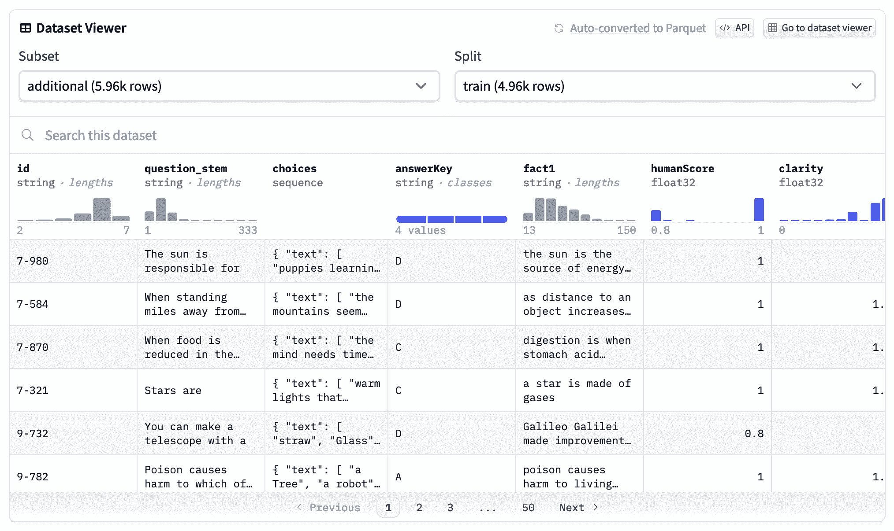
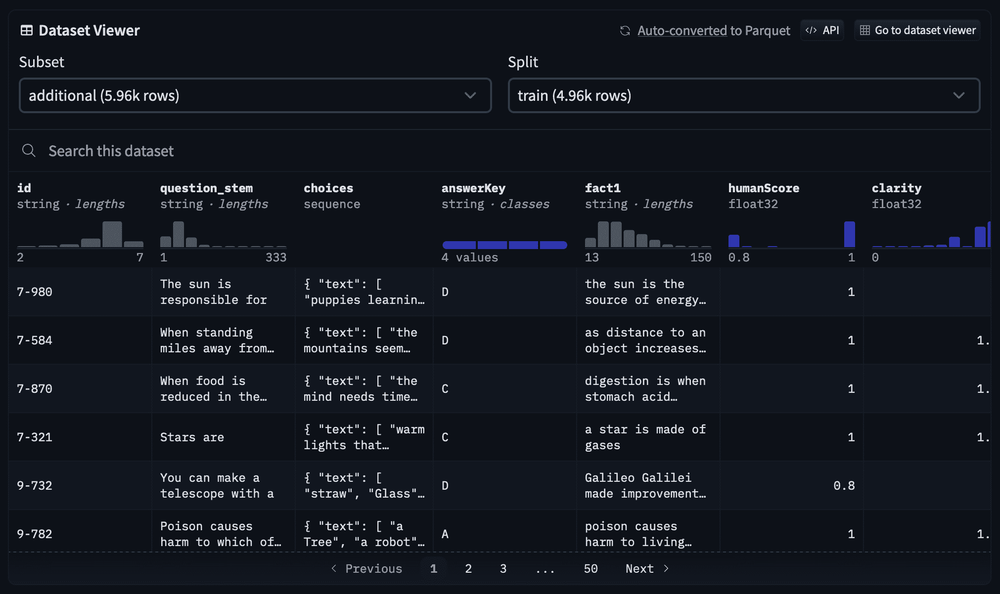

# 🤗 数据集服务器

> 原始文本：[`huggingface.co/docs/datasets-server/index`](https://huggingface.co/docs/datasets-server/index)

数据集服务器是一个轻量级的 Web API，用于可视化和探索存储在 Hugging Face Hub 上的各种类型的数据集 - 计算机视觉、语音、文本和表格。

数据集服务器的主要功能是自动将所有 Hub 数据集转换为 Parquet。在 Parquet 部分中了解更多信息。

随着数据集的增大和数据类型的丰富，预处理这些数据集的成本（存储和计算）可能具有挑战性且耗时。为了帮助用户访问这些现代数据集，数据集服务器在幕后运行一个服务器，提前生成 API 响应并将其存储在数据库中，因此当您通过 API 进行查询时，它们会立即返回。

让数据集服务器处理繁重的工作，这样您就可以在 Hugging Face 上的 30,000 多个数据集中使用简单的 REST API：

+   列出数据集的拆分、列名和数据类型

+   获取数据集大小（行数或字节）

+   下载并查看数据集中任意索引处的行

+   在数据集中搜索一个单词

+   根据查询字符串过滤行

+   获取有关数据的深刻统计信息

+   访问数据集作为 Parquet 文件，以在您喜欢的处理或分析框架中使用

 

[OpenBookQA 数据集](https://huggingface.co/datasets/openbookqa)的数据集查看器

今天加入不断增长的社区，在[论坛](https://discuss.huggingface.co/)或[Discord](https://discord.com/invite/JfAtkvEtRb)上，如果您对最新更新感兴趣，请给[数据集服务器存储库](https://github.com/huggingface/datasets-server)点赞！
