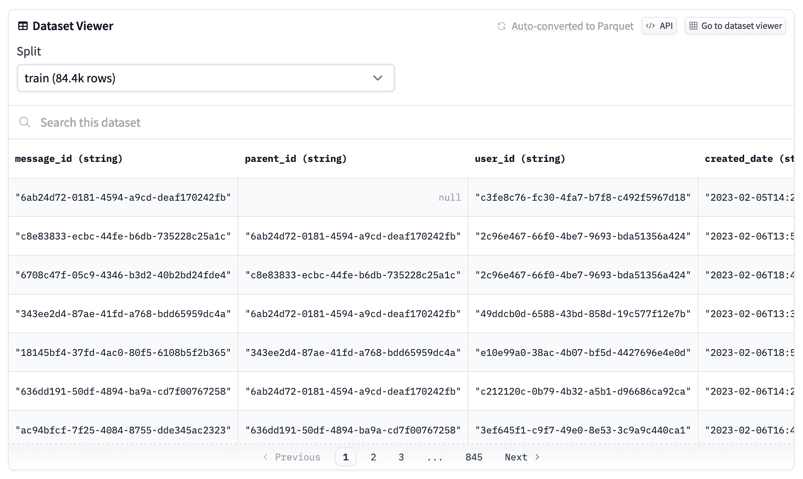

# 下载行切片

> 原文链接：[`huggingface.co/docs/datasets-server/rows`](https://huggingface.co/docs/datasets-server/rows)

数据集服务器提供了一个`/rows`端点，用于可视化数据集的任何行切片。这将让您浏览和检查数据集中包含的数据。

 目前，仅支持具有 parquet 导出的数据集，因此数据集服务器可以提取任何行切片而无需下载整个数据集。

本指南向您展示如何使用数据集服务器的`/rows`端点下载数据集的切片。也可以尝试使用[Postman](https://www.postman.com/huggingface/workspace/hugging-face-apis/request/23242779-32d6a8be-b800-446a-8cee-f6b5ca1710df)，[RapidAPI](https://rapidapi.com/hugging-face-hugging-face-default/api/hugging-face-datasets-api)，或[ReDoc](https://redocly.github.io/redoc/?url=https://datasets-server.huggingface.co/openapi.json#operation/listFirstRows)。

`/rows`端点接受五个查询参数：

+   `dataset`：数据集名称，例如`glue`或`mozilla-foundation/common_voice_10_0`

+   `config`：配置名称，例如`cola`

+   `split`：拆分名称，例如`train`

+   `offset`：切片的偏移量，例如`150`

+   `length`：切片的长度，例如`10`（最大值：`100`）

PythonJavaScriptcURL

```py
import requests
headers = {"Authorization": f"Bearer {API_TOKEN}"}
API_URL = "https://datasets-server.huggingface.co/rows?dataset=ibm/duorc&config=SelfRC&split=train&offset=150&length=10"
def query():
    response = requests.get(API_URL, headers=headers)
    return response.json()
data = query()
```

端点响应是一个包含两个键的 JSON：

+   数据集的[`features`](https://huggingface.co/docs/datasets/about_dataset_features)，包括列名和数据类型。

+   数据集的`rows`切片和特定行每列中包含的内容。

例如，这里是`ibm/duorc`/`SelfRC`训练拆分的`features`和`rows`切片，从 150 到 151：

```py
// https://datasets-server.huggingface.co/rows?dataset=ibm/duorc&config=SelfRC&split=train&offset=150&length=2
{
  "features": [
    {
      "feature_idx": 0,
      "name": "plot_id",
      "type": { "dtype": "string", "_type": "Value" }
    },
    {
      "feature_idx": 1,
      "name": "plot",
      "type": { "dtype": "string", "_type": "Value" }
    },
    {
      "feature_idx": 2,
      "name": "title",
      "type": { "dtype": "string", "_type": "Value" }
    },
    {
      "feature_idx": 3,
      "name": "question_id",
      "type": { "dtype": "string", "_type": "Value" }
    },
    {
      "feature_idx": 4,
      "name": "question",
      "type": { "dtype": "string", "_type": "Value" }
    },
    {
      "feature_idx": 5,
      "name": "answers",
      "type": {
        "feature": { "dtype": "string", "_type": "Value" },
        "_type": "Sequence"
      }
    },
    {
      "feature_idx": 6,
      "name": "no_answer",
      "type": { "dtype": "bool", "_type": "Value" }
    }
  ],
  "rows": [
    {
      "row_idx": 150,
      "row": {
        "plot_id": "/m/03wj_q",
        "plot": "The film is centered on Mortal Kombat, a fighting tournament between the representatives of the realms of Earth and Outworld conceived by the Elder Gods amid looming invasion of the Earth by Outworld. If the realm of Outworld wins Mortal Kombat ten consecutive times, its Emperor Shao Kahn will be able to invade and conquer the Earth realm.\nShaolin monk Liu Kang and his comrades, movie star Johnny Cage and military officer Sonya Blade were handpicked by Raiden, the god of thunder and defender of the Earth realm, to overcome their powerful adversaries in order to prevent Outworld from winning their tenth straight Mortal Kombat tournament. Each of the three has his or her own reason for competing: Liu seeks revenge against the tournament host Shang Tsung for killing his brother Chan; Sonya seeks revenge on an Australian crime lord Kano; and Cage, having been branded as a fake by the media, seeks to prove otherwise.\nAt Shang Tsung's island, Liu is attracted to Princess Kitana, Shao Kahn's adopted daughter. Aware that Kitana is a dangerous adversary because she is the rightful heir to Outworld and that she will attempt to ally herself with the Earth warriors, Tsung orders the creature Reptile to spy on her. Liu defeats his first opponent and Sonya gets her revenge on Kano by snapping his neck. Cage encounters and barely beats Scorpion. Liu engages in a brief duel with Kitana, who secretly offers him cryptic advice for his next battle. Liu's next opponent is Sub-Zero, whose defense seems untouched because of his freezing abilities, until Liu recalls Kitana's advice and uses it to kill Sub-Zero.\nPrince Goro enters the tournament and mercilessly crushes every opponent he faces. One of Cage's peers, Art Lean, is defeated by Goro as well and has his soul taken by Shang Tsung. Sonya worries that they may not win against Goro, but Raiden disagrees. He reveals their own fears and egos are preventing them from winning the tournament.\nDespite Sonya's warning, Cage comes to Tsung to request a fight with Goro. The sorcerer accepts on the condition that he be allowed to challenge any opponent of his choosing, anytime and anywhere he chooses. Raiden tries to intervene, but the conditions are agreed upon before he can do so. After Shang Tsung leaves, Raiden confronts Cage for what he has done in challenging Goro, but is impressed when Cage shows his awareness of the gravity of the tournament. Cage faces Goro and uses guile and the element of surprise to defeat the defending champion. Now desperate, Tsung takes Sonya hostage and takes her to Outworld, intending to fight her as his opponent. Knowing that his powers are ineffective there and that Sonya cannot defeat Tsung by herself, Raiden sends Liu and Cage into Outworld in order to rescue Sonya and challenge Tsung. In Outworld, Liu is attacked by Reptile, but eventually gains the upper hand and defeats him. Afterward, Kitana meets up with Cage and Liu, revealing to the pair the origins of both herself and Outworld. Kitana allies with them and helps them to infiltrate Tsung's castle.\nInside the castle tower, Shang Tsung challenges Sonya to fight him, claiming that her refusal to accept will result in the Earth realm forfeiting Mortal Kombat (this is, in fact, a lie on Shang's part). All seems lost for Earth realm until Kitana, Liu, and Cage appear. Kitana berates Tsung for his treachery to the Emperor as Sonya is set free. Tsung challenges Cage, but is counter-challenged by Liu. During the lengthy battle, Liu faces not only Tsung, but the souls that Tsung had forcibly taken in past tournaments. In a last-ditch attempt to take advantage, Tsung morphs into Chan. Seeing through the charade, Liu renews his determination and ultimately fires an energy bolt at the sorcerer, knocking him down and impaling him on a row of spikes. Tsung's death releases all of the captive souls, including Chan's. Before ascending to the afterlife, Chan tells Liu that he will remain with him in spirit until they are once again reunited, after Liu dies.\nThe warriors return to Earth realm, where a victory celebration is taking place at the Shaolin temple. The jubilation abruptly stops, however, when Shao Kahn's giant figure suddenly appears in the skies. When the Emperor declares that he has come for everyone's souls, the warriors take up fighting stances.",
        "title": "Mortal Kombat",
        "question_id": "40c1866a-b214-11ba-be57-8979d2cefa90",
        "question": "Where is Sonya taken to?",
        "answers": ["Outworld"],
        "no_answer": false
      },
      "truncated_cells": []
    },
    {
      "row_idx": 151,
      "row": {
        "plot_id": "/m/03wj_q",
        "plot": "The film is centered on Mortal Kombat, a fighting tournament between the representatives of the realms of Earth and Outworld conceived by the Elder Gods amid looming invasion of the Earth by Outworld. If the realm of Outworld wins Mortal Kombat ten consecutive times, its Emperor Shao Kahn will be able to invade and conquer the Earth realm.\nShaolin monk Liu Kang and his comrades, movie star Johnny Cage and military officer Sonya Blade were handpicked by Raiden, the god of thunder and defender of the Earth realm, to overcome their powerful adversaries in order to prevent Outworld from winning their tenth straight Mortal Kombat tournament. Each of the three has his or her own reason for competing: Liu seeks revenge against the tournament host Shang Tsung for killing his brother Chan; Sonya seeks revenge on an Australian crime lord Kano; and Cage, having been branded as a fake by the media, seeks to prove otherwise.\nAt Shang Tsung's island, Liu is attracted to Princess Kitana, Shao Kahn's adopted daughter. Aware that Kitana is a dangerous adversary because she is the rightful heir to Outworld and that she will attempt to ally herself with the Earth warriors, Tsung orders the creature Reptile to spy on her. Liu defeats his first opponent and Sonya gets her revenge on Kano by snapping his neck. Cage encounters and barely beats Scorpion. Liu engages in a brief duel with Kitana, who secretly offers him cryptic advice for his next battle. Liu's next opponent is Sub-Zero, whose defense seems untouched because of his freezing abilities, until Liu recalls Kitana's advice and uses it to kill Sub-Zero.\nPrince Goro enters the tournament and mercilessly crushes every opponent he faces. One of Cage's peers, Art Lean, is defeated by Goro as well and has his soul taken by Shang Tsung. Sonya worries that they may not win against Goro, but Raiden disagrees. He reveals their own fears and egos are preventing them from winning the tournament.\nDespite Sonya's warning, Cage comes to Tsung to request a fight with Goro. The sorcerer accepts on the condition that he be allowed to challenge any opponent of his choosing, anytime and anywhere he chooses. Raiden tries to intervene, but the conditions are agreed upon before he can do so. After Shang Tsung leaves, Raiden confronts Cage for what he has done in challenging Goro, but is impressed when Cage shows his awareness of the gravity of the tournament. Cage faces Goro and uses guile and the element of surprise to defeat the defending champion. Now desperate, Tsung takes Sonya hostage and takes her to Outworld, intending to fight her as his opponent. Knowing that his powers are ineffective there and that Sonya cannot defeat Tsung by herself, Raiden sends Liu and Cage into Outworld in order to rescue Sonya and challenge Tsung. In Outworld, Liu is attacked by Reptile, but eventually gains the upper hand and defeats him. Afterward, Kitana meets up with Cage and Liu, revealing to the pair the origins of both herself and Outworld. Kitana allies with them and helps them to infiltrate Tsung's castle.\nInside the castle tower, Shang Tsung challenges Sonya to fight him, claiming that her refusal to accept will result in the Earth realm forfeiting Mortal Kombat (this is, in fact, a lie on Shang's part). All seems lost for Earth realm until Kitana, Liu, and Cage appear. Kitana berates Tsung for his treachery to the Emperor as Sonya is set free. Tsung challenges Cage, but is counter-challenged by Liu. During the lengthy battle, Liu faces not only Tsung, but the souls that Tsung had forcibly taken in past tournaments. In a last-ditch attempt to take advantage, Tsung morphs into Chan. Seeing through the charade, Liu renews his determination and ultimately fires an energy bolt at the sorcerer, knocking him down and impaling him on a row of spikes. Tsung's death releases all of the captive souls, including Chan's. Before ascending to the afterlife, Chan tells Liu that he will remain with him in spirit until they are once again reunited, after Liu dies.\nThe warriors return to Earth realm, where a victory celebration is taking place at the Shaolin temple. The jubilation abruptly stops, however, when Shao Kahn's giant figure suddenly appears in the skies. When the Emperor declares that he has come for everyone's souls, the warriors take up fighting stances.",
        "title": "Mortal Kombat",
        "question_id": "f1fdefcf-1191-b5f9-4cae-4ce4d0a59da7",
        "question": "Who took Goro's soul?",
        "answers": ["Shang Tsung."],
        "no_answer": false
      },
      "truncated_cells": []
    }
  ],
  "num_rows_total":60721,
  "num_rows_per_page":100,
  "partial":false
}
```

## 图像和音频样本

图像和音频由指向文件的 URL 表示。

### 图像

图像表示为具有三个字段的 JSON 对象：

+   `src`：图像文件的 URL

+   `height`：图像的高度（以像素为单位）

+   `width`：图像的宽度（以像素为单位）

这是 cifar100 数据集的第一行的图像示例：

```py
// https://datasets-server.huggingface.co/rows?dataset=cifar100&config=cifar100&split=train&offset=0&length=1
{
  "features": [
    { "feature_idx": 0, "name": "img", "type": { "_type": "Image" } },
    ...
  ],
  "rows": [
    {
      "row_idx": 0,
      "row": {
        "img": {
          "src": "https://datasets-server.huggingface.co/cached-assets/cifar100/--/main/--/cifar100/train/0/img/image.jpg",
          "height": 32,
          "width": 32
        },
        "fine_label": 19,
        "coarse_label": 11
      },
      "truncated_cells": []
    }
  ],
  "num_rows_total":50000,
  "num_rows_per_page":100,
  "partial":false
}
```

如果结果为`partial: true`，则表示切片无法在完整数据集上运行，因为数据集太大。

### 缓存

图像和音频样本会被数据集服务器临时缓存。我们会根据使用情况定期清空某些数据集的缓存资产。

如果某个资产不可用，您可能需要再次调用`/rows`。

## 截断响应

与`/first-rows`不同，`/rows`目前没有截断。`truncated_cells`字段仍然存在，但始终为空。
