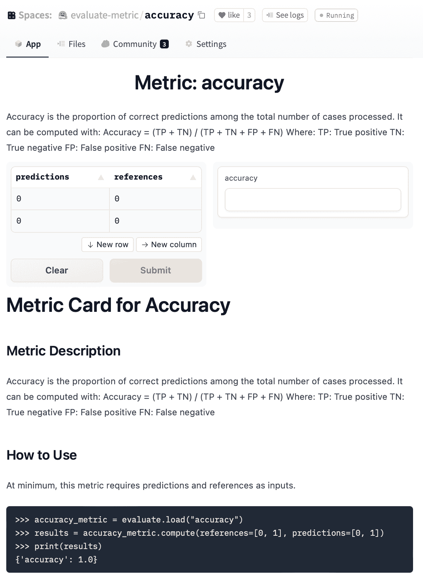
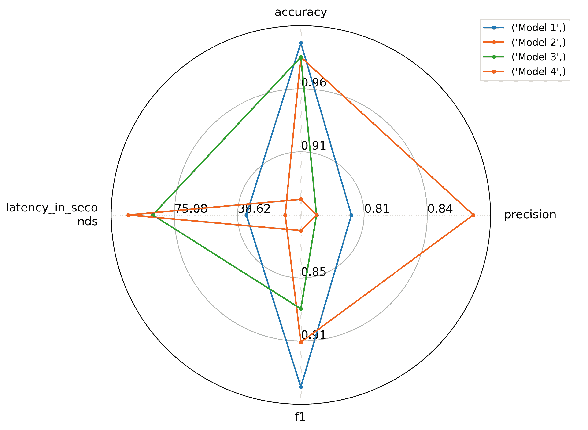

# 快速浏览

> 原文链接：[`huggingface.co/docs/evaluate/a_quick_tour`](https://huggingface.co/docs/evaluate/a_quick_tour)

🤗 Evaluate 提供了广泛的评估工具。它涵盖了文本、计算机视觉、音频等多种形式，以及用于评估模型或数据集的工具。这些工具分为三类。

## 评估类型

典型机器学习流水线的不同方面可以进行评估，对于每个方面🤗 Evaluate 都提供了一个工具：

+   **度量**：度量用于评估模型的性能，通常涉及模型的预测以及一些地面真实标签。您可以在[evaluate-metric](https://huggingface.co/evaluate-metric)找到所有集成的度量。

+   **比较**：比较用于比较两个模型。例如，可以通过将它们的预测与地面真实标签进行比较并计算它们的一致性来进行比较。您可以在[evaluate-comparison](https://huggingface.co/evaluate-comparison)找到所有集成的比较。

+   **测量**：数据集和训练模型一样重要。通过测量，可以研究数据集的属性。您可以在[evaluate-measurement](https://huggingface.co/evaluate-measurement)找到所有集成的测量。

这些评估模块中的每一个都存在于 Hugging Face Hub 上作为一个 Space。它们带有一个交互式小部件和一个文档卡，记录了其使用和限制。例如[accuracy](https://huggingface.co/spaces/evaluate-metric/accuracy)：



每个度量、比较和测量都是一个单独的 Python 模块，但要使用其中任何一个，都有一个单一的入口点：evaluate.load()!

## 加载

任何度量、比较或测量都可以使用`evaluate.load`函数加载：

```py
>>> import evaluate
>>> accuracy = evaluate.load("accuracy")
```

如果您想确保加载正确类型的评估（特别是如果存在名称冲突），您可以明确传递类型：

```py
>>> word_length = evaluate.load("word_length", module_type="measurement")
```

### 社区模块

除了🤗 Evaluate 中实现的模块外，您还可以通过指定度量实现的存储库 ID 加载任何社区模块：

```py
>>> element_count = evaluate.load("lvwerra/element_count", module_type="measurement")
```

有关上传自定义度量的信息，请参阅创建和共享指南。

### 列出可用模块

使用 list_evaluation_modules()可以检查 Hub 上有哪些模块可用。您还可以过滤特定模块并跳过社区度量。您还可以查看额外信息，如喜欢数：

```py
>>> evaluate.list_evaluation_modules(
...   module_type="comparison",
...   include_community=False,
...   with_details=True)

[{'name': 'mcnemar', 'type': 'comparison', 'community': False, 'likes': 1},
 {'name': 'exact_match', 'type': 'comparison', 'community': False, 'likes': 0}]
```

## 模块属性

所有评估模块都带有一系列有用的属性，可帮助使用存储在 EvaluationModuleInfo 对象中的模块。

| 属性 | 描述 |
| --- | --- |
| `description` | 评估模块的简要描述。 |
| `citation` | 当可用时用于引用的 BibTex 字符串。 |
| `features` | 定义输入格式的`Features`对象。 |
| `inputs_description` | 这相当于模块的文档字符串。 |
| `homepage` | 模块的主页。 |
| `license` | 模块的许可证。 |
| `codebase_urls` | 模块背后的代码链接。 |
| `reference_urls` | 附加参考链接。 |

让我们看几个例子。首先，让我们看一下准确度度量的`description`属性：

```py
>>> accuracy = evaluate.load("accuracy")
>>> accuracy.description
Accuracy is the proportion of correct predictions among the total number of cases processed. It can be computed with:
Accuracy = (TP + TN) / (TP + TN + FP + FN)
 Where:
TP: True positive
TN: True negative
FP: False positive
FN: False negative
```

您可以看到它描述了度量在理论上的工作原理。如果您在工作中使用此度量，特别是如果它是学术出版物，您希望正确引用它。为此，您可以查看`citation`属性：

```py
>>> accuracy.citation
@article{scikit-learn,
  title={Scikit-learn: Machine Learning in {P}ython},
  author={Pedregosa, F. and Varoquaux, G. and Gramfort, A. and Michel, V.
         and Thirion, B. and Grisel, O. and Blondel, M. and Prettenhofer, P.
         and Weiss, R. and Dubourg, V. and Vanderplas, J. and Passos, A. and
         Cournapeau, D. and Brucher, M. and Perrot, M. and Duchesnay, E.},
  journal={Journal of Machine Learning Research},
  volume={12},
  pages={2825--2830},
  year={2011}
}
```

在我们可以将度量或其他评估模块应用于用例之前，我们需要知道度量的输入格式是什么：

```py
>>> accuracy.features
{
    'predictions': Value(dtype='int32', id=None),
    'references': Value(dtype='int32', id=None)
}
```

请注意，features 始终描述单个输入元素的类型。通常我们会添加元素列表，因此您可以始终将`features`中的类型想象为列表。Evaluate 接受各种输入格式（Python 列表、NumPy 数组、PyTorch 张量等），并将它们转换为适合存储和计算的格式。

## 计算

现在我们知道评估模块的工作原理和应该放入其中的内容，我们想要实际使用它！在计算实际得分时，有两种主要方法可以做到：

1.  一体化

1.  增量

在增量方法中，必要的输入通过 EvaluationModule.add()或 EvaluationModule.add_batch()添加到模块中，并且最终得分通过 EvaluationModule.compute()计算。或者，您可以一次性将所有输入传递给`compute()`。让我们看看这两种方法。

### 如何计算

计算评估模块得分的最简单方法是直接调用`compute()`并将必要的输入传递给`compute()`方法中的`features`。

```py
>>> accuracy.compute(references=[0,1,0,1], predictions=[1,0,0,1])
{'accuracy': 0.5}
```

评估模块以字典形式返回结果。然而，在某些情况下，您可以迭代地或以分布式方式构建预测，在这种情况下`add()`或`add_batch()`会很有用。

### 计算单个指标或一批指标

在许多评估流水线中，您会迭代地构建预测，比如在 for 循环中。在这种情况下，您可以将预测存储在列表中，并在最后将它们传递给`compute()`。使用`add()`和`add_batch()`可以避免单独存储预测的步骤。如果您一次只创建单个预测，您可以使用`add()`：

```py
>>> for ref, pred in zip([0,1,0,1], [1,0,0,1]):
>>>     accuracy.add(references=ref, predictions=pred)
>>> accuracy.compute()
{'accuracy': 0.5}
```

一旦收集到所有预测，您可以调用`compute()`根据所有存储的值计算得分。当以批量方式获取预测和参考值时，您可以使用`add_batch()`，它为以后处理添加了一个元素列表。其余操作与`add()`相同：

```py
>>> for refs, preds in zip([[0,1],[0,1]], [[1,0],[0,1]]):
>>>     accuracy.add_batch(references=refs, predictions=preds)
>>> accuracy.compute()
{'accuracy': 0.5}
```

当您需要批量从模型获取预测时，这种方法尤其有用：

```py
>>> for model_inputs, gold_standards in evaluation_dataset:
>>>     predictions = model(model_inputs)
>>>     metric.add_batch(references=gold_standards, predictions=predictions)
>>> metric.compute()
```

### 分布式评估

在分布式环境中计算指标可能会很棘手。指标评估在不同数据集子集上的单独 Python 进程或节点中执行。通常，当指标得分是可加的（`f(AuB) = f(A) + f(B)`）时，您可以使用分布式 reduce 操作来收集每个数据集子集的得分。但是当指标是非可加的（`f(AuB) ≠ f(A) + f(B)`）时，情况就不那么简单了。例如，您不能将每个数据子集的[F1](https://huggingface.co/spaces/evaluate-metric/f1)得分求和作为您的**最终指标**。

克服这个问题的常见方法是回退到单进程评估。指标在单个 GPU 上评估，这变得低效。

🤗 Evaluate 通过仅在第一个节点上计算最终指标来解决这个问题。预测和参考值分别为每个节点计算并提供给指标。这些暂时存储在 Apache Arrow 表中，避免了 GPU 或 CPU 内存的混乱。当您准备好`compute()`最终指标时，第一个节点能够访问所有其他节点上存储的预测和参考值。一旦收集到所有预测和参考值，`compute()`将执行最终指标评估。

这个解决方案允许🤗 Evaluate 执行分布式预测，这对于在分布式环境中提高评估速度很重要。同时，您还可以使用复杂的非可加指标，而不会浪费宝贵的 GPU 或 CPU 内存。

## 将多个评估结果合并

通常，人们不仅想评估单个指标，而且想评估捕捉模型不同方面的一系列不同指标。例如，对于分类，通常计算 F1 分数、召回率和精确度是一个好主意，以便除了准确度外获得模型性能的更全面的图片。当然，您可以加载一堆指标并依次调用它们。然而，一个更方便的方法是使用 combine()函数将它们捆绑在一起：

```py
>>> clf_metrics = evaluate.combine(["accuracy", "f1", "precision", "recall"])
```

`combine`函数接受指标名称列表以及实例化的模块。然后`compute`调用计算每个指标：

```py
>>> clf_metrics.compute(predictions=[0, 1, 0], references=[0, 1, 1])

{
  'accuracy': 0.667,
  'f1': 0.667,
  'precision': 1.0,
  'recall': 0.5
}
```

## 保存并推送到 Hub

保存和分享评估结果是一个重要的步骤。我们提供了 evaluate.save()函数来轻松保存指标结果。您可以传递一个特定的文件名或目录。在后一种情况下，结果将保存在一个自动创建的文件名的文件中。除了目录或文件名，该函数还接受任何键值对作为输入，并将它们存储在一个 JSON 文件中。

```py
>>> result = accuracy.compute(references=[0,1,0,1], predictions=[1,0,0,1])

>>> hyperparams = {"model": "bert-base-uncased"}
>>> evaluate.save("./results/"experiment="run 42", **result, **hyperparams)
PosixPath('results/result-2022_05_30-22_09_11.json')
```

JSON 文件的内容如下：

```py
{
    "experiment": "run 42",
    "accuracy": 0.5,
    "model": "bert-base-uncased",
    "_timestamp": "2022-05-30T22:09:11.959469",
    "_git_commit_hash": "123456789abcdefghijkl",
    "_evaluate_version": "0.1.0",
    "_python_version": "3.9.12 (main, Mar 26 2022, 15:51:15) \n[Clang 13.1.6 (clang-1316.0.21.2)]",
    "_interpreter_path": "/Users/leandro/git/evaluate/env/bin/python"
}
```

除了指定的字段，它还包含有用的系统信息，以便重现结果。

除了在本地存储结果，您还应该将它们报告到 Hub 上的模型存储库。使用 evaluate.push_to_hub()函数，您可以轻松地将评估结果报告到模型存储库：

```py
evaluate.push_to_hub(
  model_id="huggingface/gpt2-wikitext2",  # model repository on hub
  metric_value=0.5,                       # metric value
  metric_type="bleu",                     # metric name, e.g. accuracy.name
  metric_name="BLEU",                     # pretty name which is displayed
  dataset_type="wikitext",                # dataset name on the hub
  dataset_name="WikiText",                # pretty name
  dataset_split="test",                   # dataset split used
  task_type="text-generation",            # task id, see https://github.com/huggingface/datasets/blob/master/src/datasets/utils/resources/tasks.json
  task_name="Text Generation"             # pretty name for task
)
```

## 评估器

evaluate.evaluator()提供了自动化评估，只需要一个模型、数据集和指标，与`EvaluationModule`中需要模型预测的指标相比，更容易评估一个模型在给定指标下的数据集上的表现，因为推理是在内部处理的。为了实现这一点，它使用了`transformers`中的[pipeline](https://huggingface.co/docs/transformers/v4.25.1/en/main_classes/pipelines#transformers.pipeline)抽象。然而，只要遵循`pipeline`接口，您可以使用自己的框架。

要使用`evaluator`进行评估，让我们加载一个`transformers`管道（但您可以传递自己的自定义推理类，只要它遵循管道调用 API），该管道使用在 IMDb 上训练的模型，IMDb 测试拆分和准确度指标。

```py
from transformers import pipeline
from datasets import load_dataset
from evaluate import evaluator
import evaluate

pipe = pipeline("text-classification", model="lvwerra/distilbert-imdb", device=0)
data = load_dataset("imdb", split="test").shuffle().select(range(1000))
metric = evaluate.load("accuracy")
```

然后，您可以为文本分类创建一个评估器，并将这三个对象传递给`compute()`方法。通过标签映射，`evaluate`提供了一种方法来将管道输出与数据集中的标签列对齐：

```py
>>> task_evaluator = evaluator("text-classification")

>>> results = task_evaluator.compute(model_or_pipeline=pipe, data=data, metric=metric,
...                        label_mapping={"NEGATIVE": 0, "POSITIVE": 1},)

>>> print(results)
{'accuracy': 0.934}
```

仅计算指标的值通常不足以知道一个模型是否比另一个模型表现显著更好。通过*bootstrapping*，`evaluate`计算置信区间和标准误差，这有助于估计得分的稳定性有多高：

```py
>>> results = eval.compute(model_or_pipeline=pipe, data=data, metric=metric,
...                        label_mapping={"NEGATIVE": 0, "POSITIVE": 1},
...                        strategy="bootstrap", n_resamples=200)

>>> print(results)
{'accuracy':
    {
      'confidence_interval': (0.906, 0.9406749892841922),
      'standard_error': 0.00865213251082787,
      'score': 0.923
    }
}
```

评估器期望数据输入中有一个`"text"`和`"label"`列。如果您的数据集不同，您可以使用关键字`input_column="text"`和`label_column="label"`提供列。目前仅支持`"text-classification"`，未来将添加更多任务。

## 可视化

当比较几个模型时，有时仅通过查看它们的分数很难发现它们性能的差异。通常也不是一个最佳模型，而是在延迟和准确性之间存在权衡，例如更大的模型可能性能更好，但也更慢。我们正在逐步添加不同的可视化方法，例如图表，以便更容易地为用例选择最佳模型。

例如，如果您有来自多个模型的结果列表（作为字典），您可以将它们输入到`radar_plot()`函数中：

```py
import evaluate
from evaluate.visualization import radar_plot

>>> data = [
   {"accuracy": 0.99, "precision": 0.8, "f1": 0.95, "latency_in_seconds": 33.6},
   {"accuracy": 0.98, "precision": 0.87, "f1": 0.91, "latency_in_seconds": 11.2},
   {"accuracy": 0.98, "precision": 0.78, "f1": 0.88, "latency_in_seconds": 87.6}, 
   {"accuracy": 0.88, "precision": 0.78, "f1": 0.81, "latency_in_seconds": 101.6}
   ]
>>> model_names = ["Model 1", "Model 2", "Model 3", "Model 4"]
>>> plot = radar_plot(data=data, model_names=model_names)
>>> plot.show()
```

让您可以通过可视化比较 4 个模型，并根据一个或多个指标选择最佳模型：



## 在一系列任务上运行评估

在各种不同任务上评估模型可能很有用，以了解它们的下游性能。EvaluationSuite 使得可以在一组任务上评估模型。任务可以构建为（evaluator、数据集、指标）元组，并传递给存储在 Hugging Face Hub 上的 EvaluationSuite 作为一个 Space，或者本地作为 Python 脚本。请参阅评估器文档以获取当前支持的任务列表。

`EvaluationSuite`脚本可以定义如下，并支持用于数据预处理的 Python 代码。

```py
import evaluate
from evaluate.evaluation_suite import SubTask

class Suite(evaluate.EvaluationSuite):

    def __init__(self, name):
        super().__init__(name)

        self.suite = [
            SubTask(
                task_type="text-classification",
                data="imdb",
                split="test[:1]",
                args_for_task={
                    "metric": "accuracy",
                    "input_column": "text",
                    "label_column": "label",
                    "label_mapping": {
                        "LABEL_0": 0.0,
                        "LABEL_1": 1.0
                    }
                }
            ),
            SubTask(
                task_type="text-classification",
                data="sst2",
                split="test[:1]",
                args_for_task={
                    "metric": "accuracy",
                    "input_column": "sentence",
                    "label_column": "label",
                    "label_mapping": {
                        "LABEL_0": 0.0,
                        "LABEL_1": 1.0
                    }
                }
            )
        ]
```

评估可以通过加载`EvaluationSuite`并调用`run()`方法来运行，传入一个模型或 pipeline。

```py
>>> from evaluate import EvaluationSuite
>>> suite = EvaluationSuite.load('mathemakitten/sentiment-evaluation-suite')
>>> results = suite.run("huggingface/prunebert-base-uncased-6-finepruned-w-distil-mnli")
```

| 准确率 | 总时间（秒） | 每秒样本数 | 延迟时间（秒） | 任务名称 |
| --: | --: | --: | :-- | :-- |
| 0.3 | 4.62804 | 2.16074 | 0.462804 | imdb |
| 0 | 0.686388 | 14.569 | 0.0686388 | sst2 |
