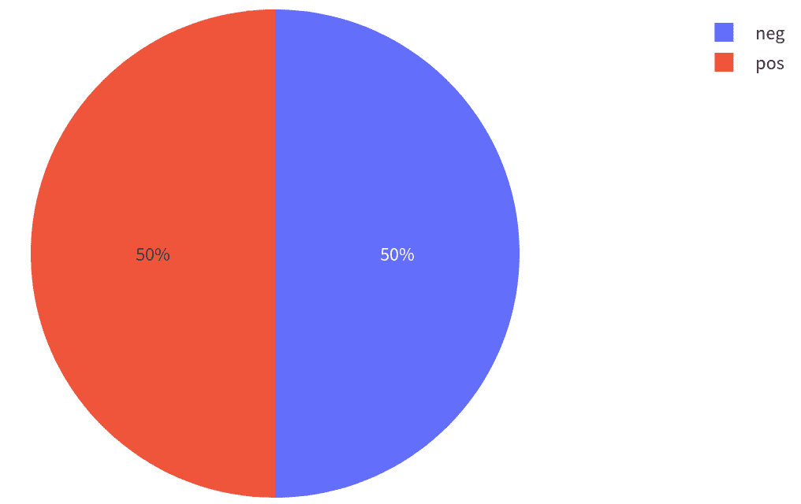
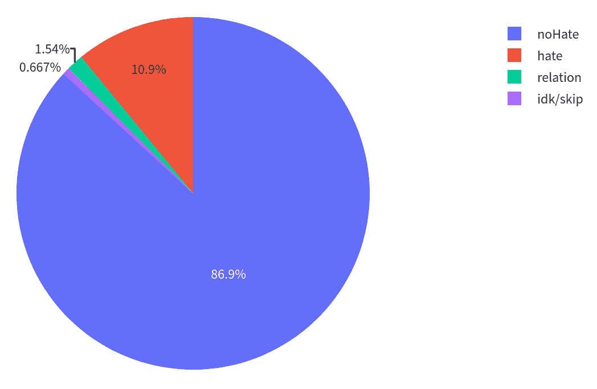

# 模型评估考虑事项

> 原始文本：[`huggingface.co/docs/evaluate/considerations`](https://huggingface.co/docs/evaluate/considerations)

开发 ML 模型很少是一次性的事情：通常涉及多个阶段，包括定义模型架构和调整超参数，然后收敛到最终集。负责任的模型评估是这个过程的关键部分，🤗 Evaluate 在这里帮助您！

在使用🤗 Evaluate 库评估模型时，请记住以下几点：

## 正确拆分您的数据

良好的评估通常需要对数据集进行三次拆分：

+   **训练**：用于训练您的模型。

+   **验证**：用于验证模型的超参数。

+   **测试**：用于评估您的模型。

🤗 Hub 上的许多数据集分为 2 个拆分：`train`和`validation`；其他数据集分为 3 个拆分（`train`，`validation`和`test`）- 确保为正确目的使用正确的拆分！

🤗 Hub 上的一些数据集已经分为这三个拆分。但是，也有许多只有训练/验证或只有训练拆分的数据集。

如果您使用的数据集没有预定义的训练-测试拆分，那么您需要定义要用于训练模型的数据集的哪一部分，以及要用于超参数调整或最终评估的哪一部分。

在同一拆分上训练和评估可能会误代表您的结果！如果在训练数据上过拟合，那么该拆分上的评估结果看起来很好，但模型在新数据上的表现会很差。

根据数据集的大小，您可以保留 10-30%用于评估，其余用于训练，同时努力设置测试集以尽可能接近生产数据。查看[此主题](https://discuss.huggingface.co/t/how-to-split-main-dataset-into-train-dev-test-as-datasetdict/1090)以获取有关数据集拆分的更深入讨论！

## 类别不平衡的影响

虽然许多学术数据集，如[IMDb 数据集](https://huggingface.co/datasets/imdb)的电影评论，是完全平衡的，但大多数现实世界的数据集不是。在机器学习中，*平衡数据集*对应于所有标签都平等表示的数据集。在 IMDb 数据集的情况下，这意味着数据集中有与负面评论一样多的正面评论。在不平衡的数据集中，情况并非如此：例如，在欺诈检测中，数据集中通常有比欺诈案例更多的非欺诈案例。

数据集不平衡会扭曲指标结果。想象一个包含 99 个“非欺诈”案例和 1 个“欺诈”案例的数据集。一个简单的模型总是预测“非欺诈”案例，将得到一个 99%的准确率，听起来可能很好，直到意识到你永远也不会捕捉到一个欺诈案例。

通常，使用多个指标可以帮助更好地了解模型的性能。例如，可以一起使用**[召回率](https://huggingface.co/metrics/recall)**和**[精确率](https://huggingface.co/metrics/precision)**这样的指标，而**[F1 分数](https://huggingface.co/metrics/f1)**实际上是两者的调和平均值。

在数据集平衡的情况下，使用[准确率](https://huggingface.co/metrics/accuracy)可以反映整体模型性能：

在存在不平衡的情况下，使用[F1 分数](https://huggingface.co/metrics/f1)可能更好地表示性能，因为它包含了精确率和召回率。

在不平衡的情况下使用准确率不太理想，因为它对少数类不敏感，不会忠实地反映模型在这些类上的性能。

## 离线与在线模型评估

评估模型有多种方式，一个重要的区别是离线评估和在线评估：

**离线评估**是在部署模型或使用模型生成的见解之前进行的，使用静态数据集和指标。

**在线评估**意味着在部署后以及在生产中使用模型时评估模型的性能。

这两种评估类型可以使用不同的指标，并衡量模型性能的不同方面。例如，离线评估可以根据常见基准测试比较模型与其他模型的性能，而在线评估将根据生产数据（例如，能够处理的用户查询数量）评估模型的延迟和准确性等方面。

## 模型评估中的权衡

在实践中评估模型时，通常需要在模型性能的不同方面之间进行权衡：例如，选择一个略微准确性较低但推理时间更快的模型，与一个准确性较高但内存占用量更大且需要更多 GPU 访问的模型相比。

以下是在评估过程中考虑的模型性能的其他方面：

### 解释性

在评估模型时，**解释性**（即*解释结果的能力*）可能非常重要，特别是在生产中部署模型时。

例如，像[exact match](https://huggingface.co/spaces/evaluate-metric/exact_match)这样的指标具有一定范围（在 0 和 1 之间，或者 0%和 100%之间），并且对用户来说很容易理解：对于一对字符串，如果两个字符串完全相同，则精确匹配分数为 1，否则为 0。

其他指标，如[BLEU](https://huggingface.co/spaces/evaluate-metric/exact_match)更难解释：虽然它们也在 0 和 1 之间变化，但根据用于生成分数的参数不同，它们可能会有很大的变化，特别是当使用不同的标记化和规范化技术时（有关 BLEU 限制的更多信息，请参阅[指标卡](https://huggingface.co/spaces/evaluate-metric/bleu/blob/main/README.md)）。这意味着在没有更多关于获得 BLEU 分数的过程的信息的情况下，很难解释 BLEU 分数。

解释性可能在评估用例中更或更不重要，但它是模型评估的一个有用方面，因为沟通和比较模型评估是负责任的机器学习的重要组成部分。

### 推理速度和内存占用量

近年来，越来越大的机器学习模型在各种任务和基准测试中取得了高性能，但在实践中部署这些数十亿参数的模型本身就是一个挑战，许多组织缺乏这方面的资源。这就是为什么在进行在线模型评估时考虑模型的**推理速度**和**内存占用量**是重要的原因。

推理速度指的是模型进行预测所需的时间 — 这取决于所使用的硬件以及查询模型的方式，例如通过 API 实时查询或每天运行一次的批处理作业。

内存占用量指的是模型权重的大小以及它们占用的硬件内存量。如果一个模型太大，无法放入单个 GPU 或 CPU 中，那么就必须将其分割到多个设备上，这取决于模型架构和部署方法的复杂程度。

在线模型评估时，通常需要在推理速度和准确性或精度之间进行权衡，而对于离线评估来说，情况就不那么明显了。

## 限制和偏见

所有模型和所有指标都有其局限性和偏见，这取决于它们的训练方式、使用的数据以及预期的用途。重要的是要清楚地测量和传达这些限制，以防止误用和意外影响，例如通过[模型卡片](https://huggingface.co/course/chapter4/4?fw=pt)来记录训练和评估过程。

通过在诸如[Wino Bias](https://huggingface.co/datasets/wino_bias)或[MD Gender Bias](https://huggingface.co/datasets/md_gender_bias)等数据集上评估模型，并通过进行[交互式错误分析](https://huggingface.co/spaces/nazneen/error-analysis)来测量偏见。尝试识别模型在评估数据集的哪些子集上表现不佳。

我们目前正在努力开展额外的测量工作，以量化模型和数据集中不同维度的偏见 - 敬请关注有关此主题的更多文档！
