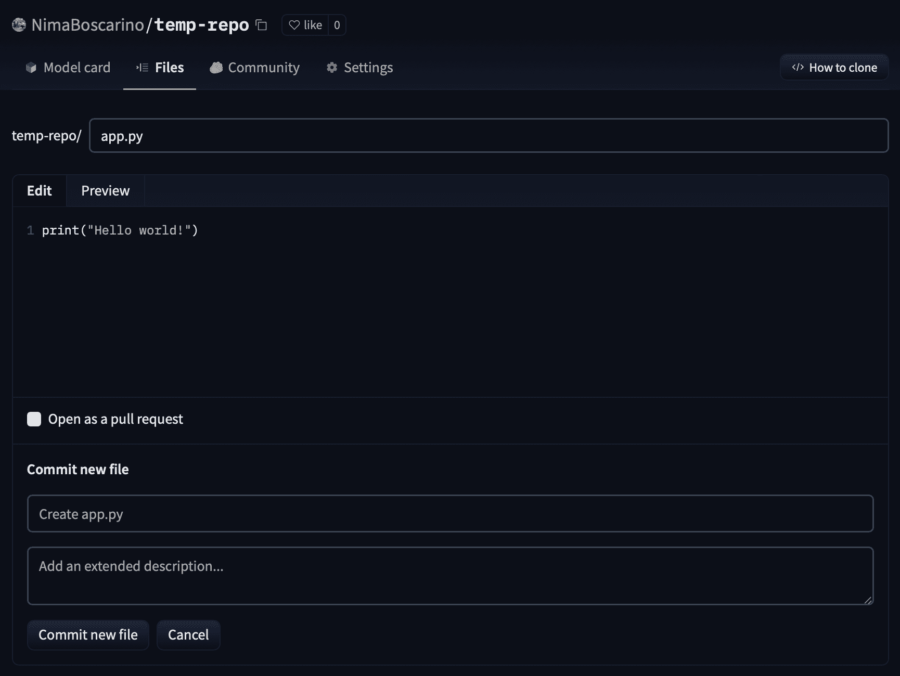
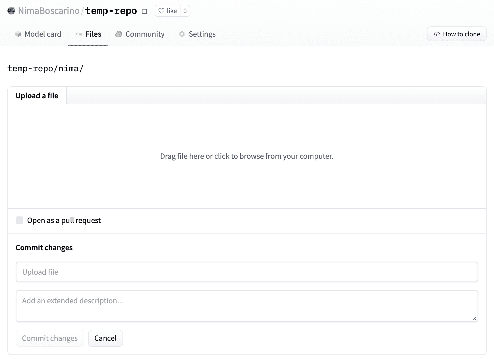
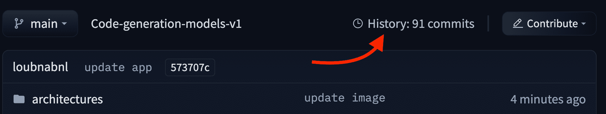

# 开始使用存储库

> 原文链接：[`huggingface.co/docs/hub/repositories-getting-started`](https://huggingface.co/docs/hub/repositories-getting-started)

这份适合初学者的指南将帮助您获得在 Hub 上创建和管理存储库所需的基本技能。每个部分都建立在前一个部分的基础上，所以请随意选择从哪里开始！

## 要求

本文展示了如何通过 Web 界面和终端处理存储库。如果使用 UI，没有任何要求。如果要使用终端，请按照这些安装说明进行操作。

如果您的 CLI 命令中尚未有`git`，您需要为您的平台[安装 Git](https://git-scm.com/downloads)。您还需要[安装 Git LFS](https://git-lfs.github.com/)，用于处理诸如图像和模型权重等大文件。

要能够将代码推送到 Hub，您需要进行身份验证。最简单的方法是安装[`huggingface_hub` CLI](https://huggingface.co/docs/huggingface_hub/index)并运行登录命令：

```py
python -m pip install huggingface_hub
huggingface-cli login
```

**本文档的入门部分内容也可作为视频观看！**

[`www.youtube-nocookie.com/embed/rkCly_cbMBk`](https://www.youtube-nocookie.com/embed/rkCly_cbMBk)

## 创建存储库

使用 Hub 的 Web 界面，您可以轻松创建存储库，添加文件（甚至大文件！），探索模型，可视化差异等等。Hub 上有三种存储库，本指南将创建一个**模型存储库**以进行演示。有关创建和管理模型、数据集和空间的信息，请参考各自的文档。

1.  要创建一个新存储库，请访问[huggingface.co/new](http://huggingface.co/new)：

 

1.  指定存储库的所有者：可以是您自己或您所属的任何组织。

1.  输入您的模型名称。这也将是存储库的名称。

1.  指定您希望您的模型是公开的还是私有的。

1.  指定许可证。您现在可以将*许可证*字段留空。要了解有关许可证的信息，请访问**许可证**文档。

创建您的模型存储库后，您应该看到类似于这样的页面：

 

请注意，Hub 会提示您创建一个*模型卡片*，您可以在**模型卡片文档**中了解更多信息。在您的模型存储库中包含一个模型卡片是最佳实践，但由于我们目前只是创建一个测试存储库，所以我们可以跳过这一步。

## 向存储库添加文件（Web UI）

要通过 Web UI 向存储库添加文件，首先选择**文件**选项卡，导航到所需目录，然后单击**添加文件**。您将有选项创建一个新文件或直接从计算机上传文件。

 

### 创建一个新文件

选择创建新文件将带您到以下编辑器屏幕，您可以为文件选择一个名称，添加内容，并使用总结您更改的消息保存文件。您可以选择`作为拉取请求打开`，而不是直接将新文件提交到存储库的`main`分支，以创建一个拉取请求。 

 

### 上传文件

如果选择*上传文件*，您将能够选择要上传的本地文件，以及总结您对存储库所做更改的消息。

 

与创建新文件一样，您可以选择`作为拉取请求打开`来创建一个拉取请求，而不是直接将更改添加到存储库的`main`分支。

## 将文件添加到存储库（终端）

### 克隆存储库

将存储库下载到本地计算机称为*克隆*。您可以使用以下命令加载您的存储库并导航到它：

```py
git clone https://huggingface.co/<your-username>/<your-model-name>
cd <your-model-name>
```

您可以使用以下命令通过 SSH 进行克隆：

```py
git clone git@hf.co:<your-username>/<your-model-name>
cd <your-model-name>
```

您需要将 SSH 公钥添加到[您的用户设置](https://huggingface.co/settings/keys)以推送更改或访问私人存储库。

### 设置

现在是时候了，您可以向存储库添加任何文件！🔥

您有大于 10MB 的文件吗？这些文件应该使用`git-lfs`进行跟踪，您可以使用以下命令进行初始化：

```py
git lfs install
```

请注意，如果您的文件大于**5GB**，您还需要运行：

```py
huggingface-cli lfs-enable-largefiles .
```

当您使用 Hugging Face 创建存储库时，Hugging Face 会自动在`.gitattributes`文件中提供常见的机器学习大文件的常见文件扩展名列表，`git-lfs`使用该文件有效地跟踪对大文件的更改。但是，如果您的文件类型尚未处理，您可能需要添加新的扩展名。您可以使用`git lfs track "*.your_extension"`来执行此操作。

### 推送文件

您可以使用 Git 将新文件和对已经存在的文件的任何更改保存为一组更改，称为*提交*，可以将其视为对项目的“修订”。要创建一个提交，您必须`add`文件，让 Git 知道我们计划保存更改，然后`commit`这些更改。为了将新提交与 Hugging Face Hub 同步，然后将提交`push`到 Hub。

```py
# Create any files you like! Then...
git add .
git commit -m "First model version"  # You can choose any descriptive message
git push
```

完成了！您可以在 Hugging Face 上检查您的存储库，查看所有最近添加的文件。例如，在下面的屏幕截图中，用户添加了许多文件。请注意，此示例中的一些文件大小为`1.04 GB`，因此存储库使用 Git LFS 进行跟踪。

 

如果您使用 HTTP 克隆了存储库，则可能会要求您在每次推送操作时填写用户名和密码。避免重复的最简单方法是切换到 SSH，而不是 HTTP。或者，如果必须使用 HTTP，您可能会发现设置[git 凭据助手](https://git-scm.com/docs/gitcredentials#_avoiding_repetition)以自动填充用户名和密码很有帮助。

## 查看存储库的历史记录

每次您执行`add`-`commit`-`push`循环时，存储库将跟踪您对文件所做的每个更改。UI 允许您浏览模型文件和提交，并查看每个提交引入的差异（也称为*diff*）。要查看历史记录，您可以单击**历史记录：X 次提交**链接。

 

您可以单击单个提交以查看该提交引入的更改：

 
