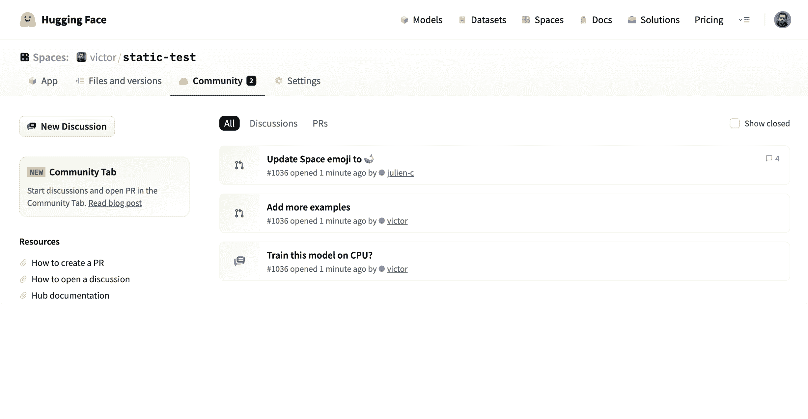
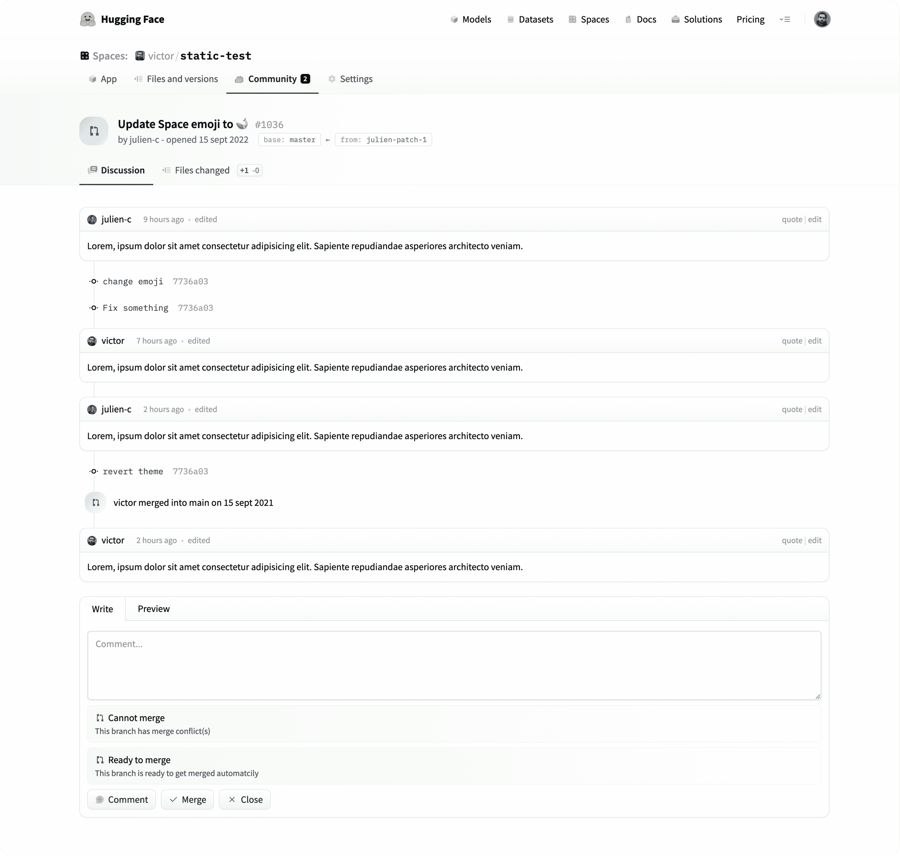
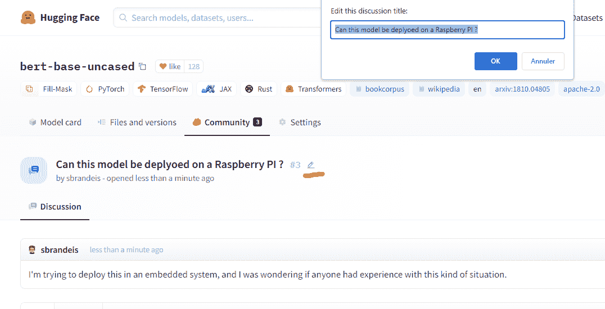
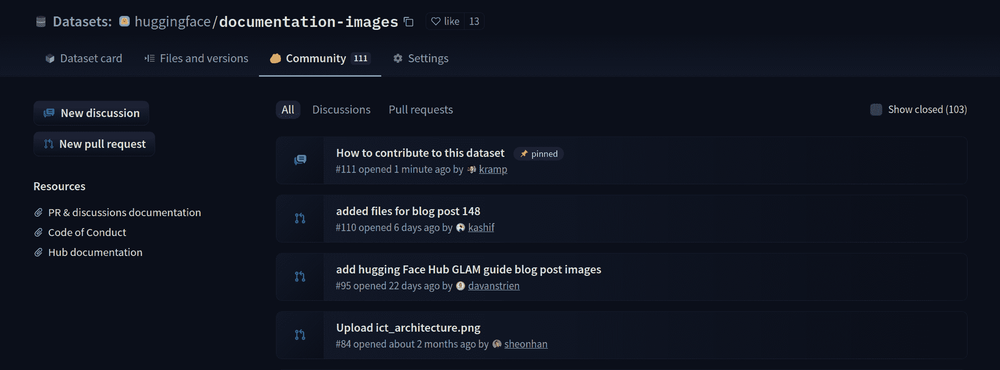
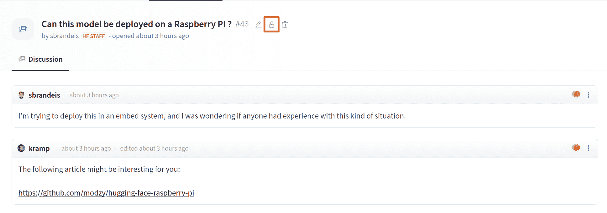
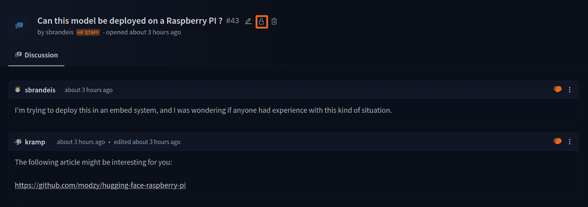
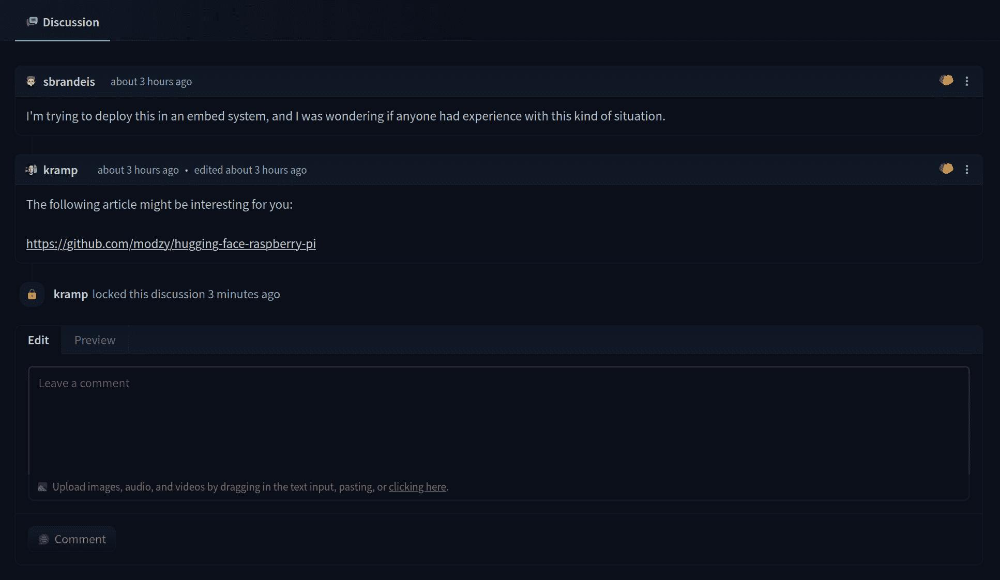
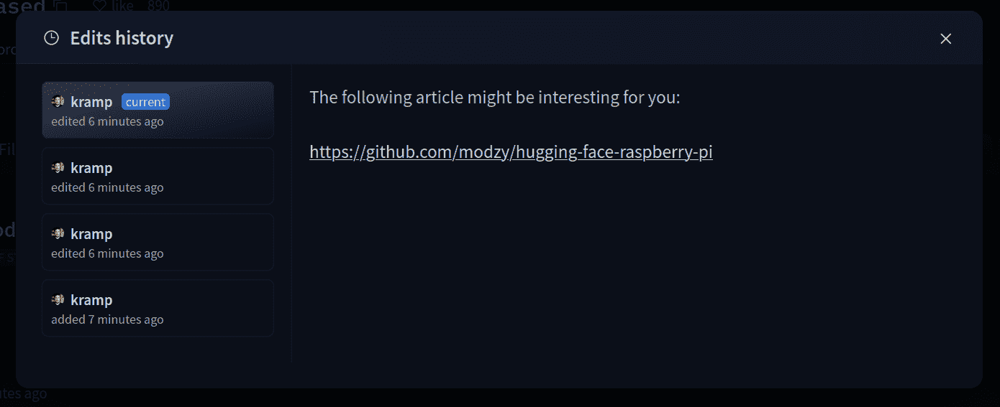

# Pull 请求和讨论

> 原文：[`huggingface.co/docs/hub/repositories-pull-requests-discussions`](https://huggingface.co/docs/hub/repositories-pull-requests-discussions)

Hub Pull 请求和讨论允许用户对存储库进行社区贡献。对于所有存储库类型，Pull 请求和讨论的工作方式相同。

总体而言，目标是构建其他 git 主机（如 GitHub）PR 和 Issues 的简化版本：

+   不涉及分叉：贡献者直接将内容推送到源存储库上的特殊`ref`分支。

+   讨论和 PR 之间没有明确的区别：它们本质上是相同的，因此它们显示在相同的列表中。

+   它们专为 ML（即模型/数据集/空间存储库）而设计，而不是任意存储库。

*注意，可以从存储库设置启用或禁用 Pull Requests 和讨论*

## 列表

通过转到任何存储库中的社区选项卡，您可以查看所有讨论和 Pull 请求。您还可以过滤以仅查看已打开的讨论。

 

## 查看

讨论页面允许您查看不同用户的评论。如果是 Pull Request，您可以通过转到“更改的文件”选项卡查看所有更改。

 

## 编辑讨论/PR 标题

如果您打开了 PR 或讨论，是存储库的作者，或者具有对其的写入访问权限，则可以单击铅笔按钮编辑讨论标题。

 

## 固定讨论/PR

如果您对存储库具有写入访问权限，则可以固定讨论和 Pull 请求。固定的讨论将显示在所有讨论的顶部。

  

## 锁定讨论/PR

如果您对存储库具有写入访问权限，则可以锁定讨论或 Pull 请求。一旦讨论被锁定，以前的评论仍然可见，用户将无法添加新评论。

  

## 评论编辑和管理

如果您撰写了评论或对存储库具有写入访问权限，则可以通过单击评论框右上角的上下文菜单编辑评论内容。

  

一旦评论被编辑，新链接将出现在评论上方。此链接显示编辑历史记录。

  

您还可以隐藏评论。隐藏评论是不可逆的，没有人将能够看到其内容或再次编辑它。

 

还要阅读 moderation 以了解如何报告滥用评论。

## 我可以在我的评论和讨论中使用 Markdown 和 LaTeX 吗？

是的！您可以使用 Markdown 为您的评论添加格式。此外，您可以利用 LaTeX 进行数学排版，您的公式将在 Markdown 中解析之前使用[KaTeX](https://katex.org/)进行呈现。

对于 LaTeX 方程式，您必须使用以下定界符：

+   `$$ ... $$`用于显示模式

+   `\\(...\\)` 用于内联模式（斜杠和括号之间没有空格）。

## 我如何在本地管理拉取请求？

假设您的 PR 编号是 42。

```py
git fetch origin refs/pr/42:pr/42
git checkout pr/42
# Do your changes
git add .
git commit -m "Add your change"
git push origin pr/42:refs/pr/42
```

### 草稿模式

在“高级模式”中从头开始打开新拉取请求时，草稿模式是默认状态。有了这个状态，其他贡献者就知道您的拉取请求正在进行中，不能合并。当您的分支准备就绪时，只需点击“发布”按钮将拉取请求的状态更改为“打开”。请注意，一旦发布，您就无法返回到草稿模式。

## 拉取请求的高级用法

### 更改存储在 git 存储库中的位置在哪里？

我们的拉取请求不使用分叉和分支，而是使用自定义的“引用”（refs），直接存储在源存储库上。

[Git References](https://git-scm.com/book/en/v2/Git-Internals-Git-References) 是 git 的内部机制，已经存储了标签和分支。

使用自定义引用（例如`refs/pr/42`）而不是分支的优势在于，它们不会被默认克隆存储库的人（包括存储库“所有者”）获取，但仍然可以按需获取。

### 获取所有拉取请求：对于 git 魔术师🧙‍♀️

您可以调整本地的**refspec**来获取所有拉取请求：

1.  获取

```py
git fetch origin refs/pr/*:refs/remotes/origin/pr/*
```

1.  创建一个本地分支来跟踪引用

```py
git checkout pr/{PR_NUMBER}
# for example: git checkout pr/42
```

1.  如果您进行了本地更改，要推送到 PR 引用：

```py
git push origin pr/{PR_NUMBER}:refs/pr/{PR_NUMBER}
# for example: git push origin pr/42:refs/pr/42
```
