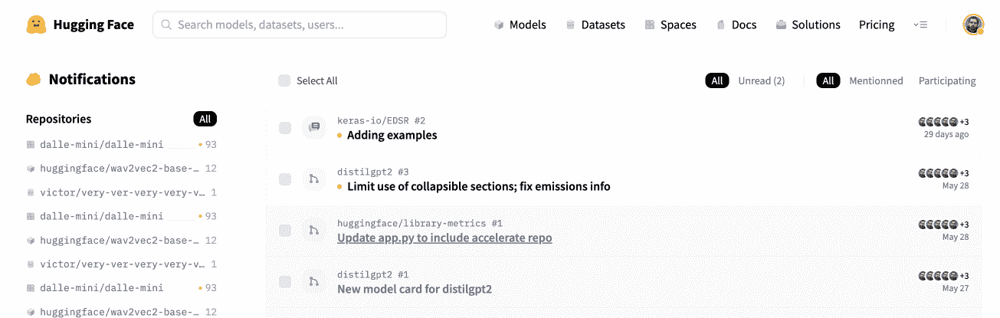
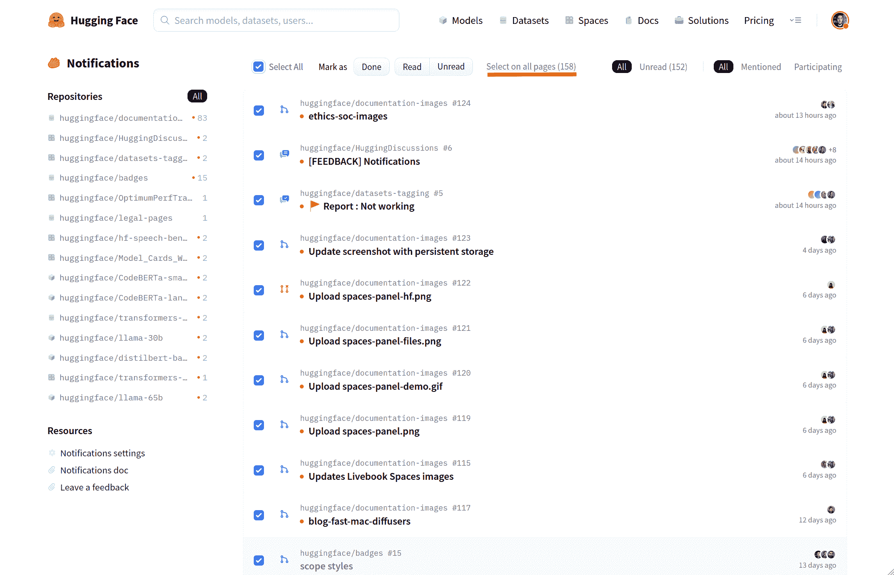
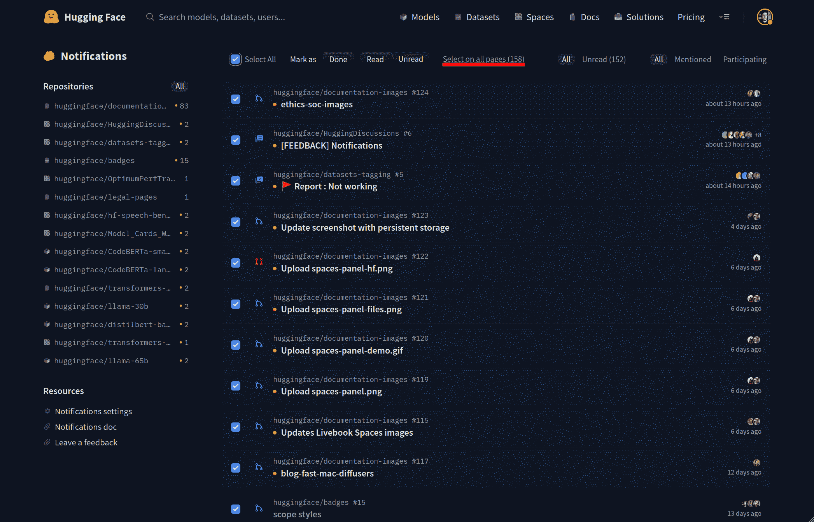
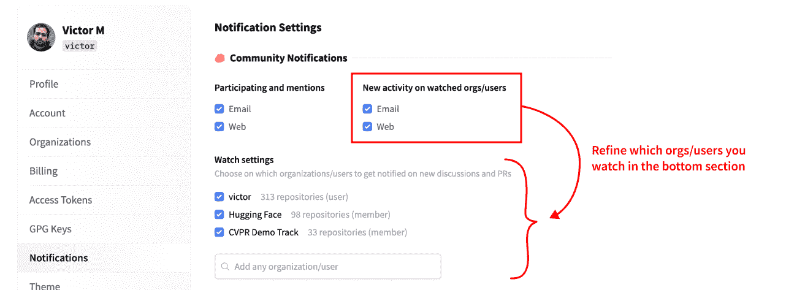
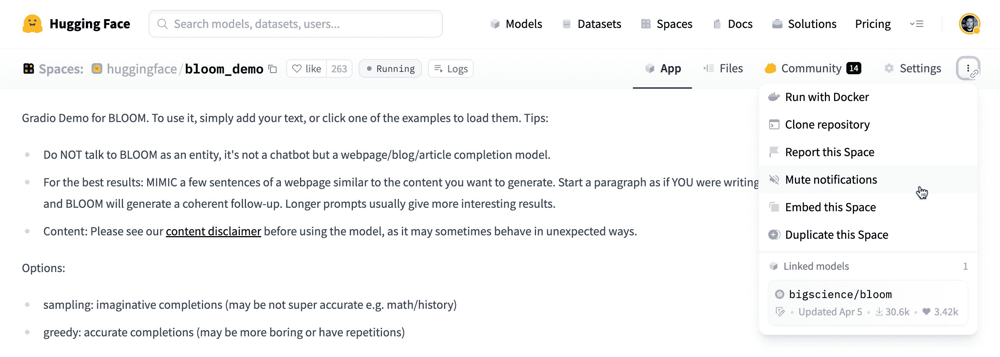
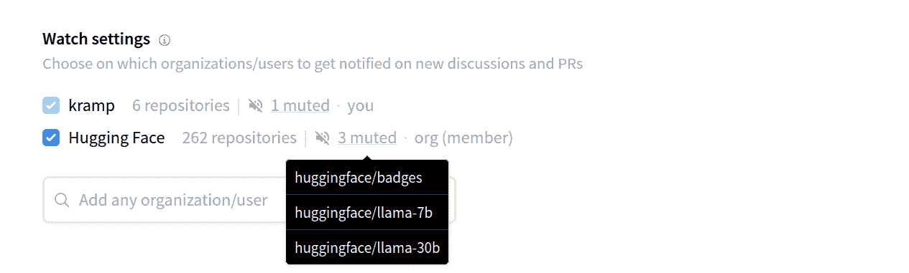

# 通知

> 原始文本：[`huggingface.co/docs/hub/notifications`](https://huggingface.co/docs/hub/notifications)

通知允许您了解您正在关注的用户或组织拥有的模型、数据集和空间上发生的新活动（拉取请求或讨论）。

默认情况下，如果：

+   有人在讨论/PR 中提到了您。

+   在您参与的讨论/PR 中发布了新评论。

+   组织或用户的存储库中发布了新的讨论/PR 或评论，您正在关注。

您将通过电子邮件和[直接在网站上](https://huggingface.co/notifications)收到新通知，您可以在您的通知设置中更改此设置。

## 过滤和管理通知

在[通知页面](https://huggingface.co/notifications)上，您有几个选项可以更有效地过滤和管理您的通知：

+   按存储库筛选：选择仅显示特定存储库的通知。

+   按已读状态筛选：仅显示未读通知或所有通知。

+   按参与筛选：显示您参与的通知或直接提到您的通知。

此外，您可以执行以下操作来管理您的通知：

+   标记为已读/未读：更改通知的状态以将其标记为已读或未读。

+   标记为已完成：标记为已完成后，通知将不再出现在通知中心（它们将被删除）。

默认情况下，对通知所做的更改仅适用于屏幕上选择的通知。但是，您也可以对所有匹配的通知应用更改（例如，在 Gmail 中）以提高便利性。

 

## 关注用户和组织

默认情况下，您将关注您是成员的所有组织，并将收到有关这些组织的任何新活动的通知。

您还可以选择在任意用户或组织上收到通知。要这样做，请使用其 HF 个人资料上的“关注存储库”按钮。请注意，您还可以直接从您的通知设置快速关注/取消关注用户和组织。

*与 Github 或类似服务不同，您无法关注特定存储库。您必须关注用户/组织，以便在其任何存储库上有任何新活动时收到通知。目标是尽可能简化用户的功能，并确保您不会错过任何您可能感兴趣的内容。*

## 通知设置

在您的[通知设置](https://huggingface.co/settings/notifications)页面上，您可以根据活动类型选择特定渠道进行通知，例如，接收有关直接提及的电子邮件，但仅在关注的用户和组织上有新活动时收到网络通知。默认情况下，您将收到有关任何新活动的电子邮件和网络通知，但请根据您的需求调整设置。

*请注意，在电子邮件中点击取消订阅链接将取消您对该类型活动的订阅，例如直接提及。*

您可以通过使用专用搜索栏按名称搜索任何用户/组织，快速将其添加到关注列表中。只需取消选中相应的复选框即可取消订阅特定用户/组织。

## 为特定存储库静音通知

通过在存储库的上下文菜单中使用“静音通知”操作，可以将通知静音到特定存储库。这将阻止您收到有关该特定存储库的任何新通知。您可以随时通过单击同一存储库菜单中的“取消静音通知”操作来取消对该存储库的静音。

*注意，如果一个存储库被静音，除非直接提到或参与讨论，否则您将不会收到任何新通知。*

静音存储库的列表可以从通知设置页面中找到：

