# 收藏

> 原文：[`huggingface.co/docs/hub/collections`](https://huggingface.co/docs/hub/collections)

使用收藏将 Hub 中的存储库（模型、数据集、空间和论文）分组到一个专门的页面。

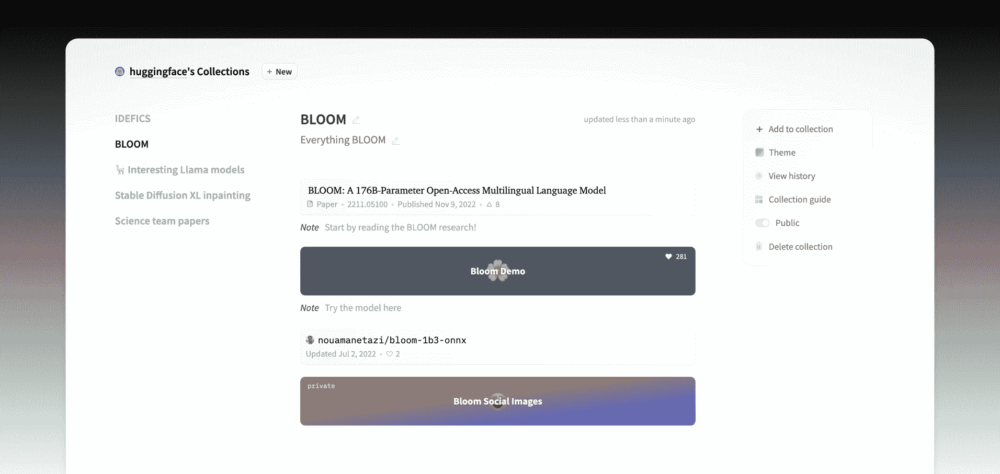

收藏有许多用途：

+   突出显示您个人或组织资料中的特定存储库。

+   将关键存储库与其他存储库分开以供您的资料访客查看。

+   展示和分享一个完整的项目及其论文、数据集、模型和空间。

+   在 Hub 中的类别中收藏您发现的事物。

+   拥有一个专门的页面，用于分享精心挑选的内容。

这只是可能用途的列表，但请记住，收藏只是一种将事物分组的方式，因此请根据最适合您用例的方式使用它们。

## 创建新收藏

有几种方法可以创建收藏：

+   对于个人收藏：在您登录的主页上使用**+ 新建**按钮（1）。

+   对于组织收藏：在组织页面上使用可用的**+ 新建**按钮（2）。

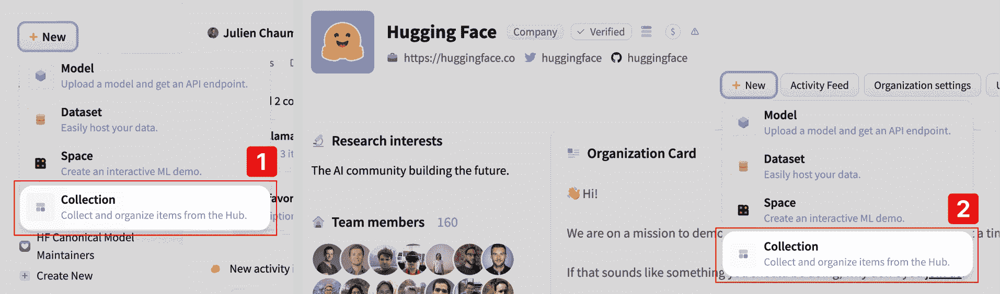

在从存储库页面添加第一项时，也可以即时创建一个收藏，从下拉菜单中选择**+ 创建新收藏**。您需要输入标题和简短描述以创建您的收藏。

## 将项目添加到收藏中

有两种方法可以将项目添加到收藏中：

+   从任何存储库页面：使用任何存储库页面上可用的上下文菜单，然后选择**添加到收藏**以将其添加到收藏中（1）。

+   从收藏页面：如果您知道要添加的存储库的名称，请在右侧菜单中使用**+ 添加到收藏**选项（2）。

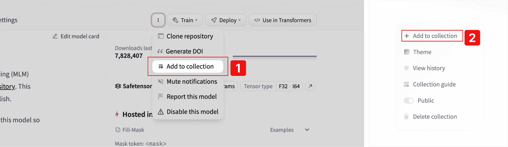

您可以向您的收藏中添加外部存储库，而不仅仅是您自己的。

## 在收藏上进行协作

组织收藏是一种共同建立收藏的好方法。组织的任何成员都可以向收藏中添加、编辑和删除项目。使用**历史记录功能**跟踪谁编辑了收藏。

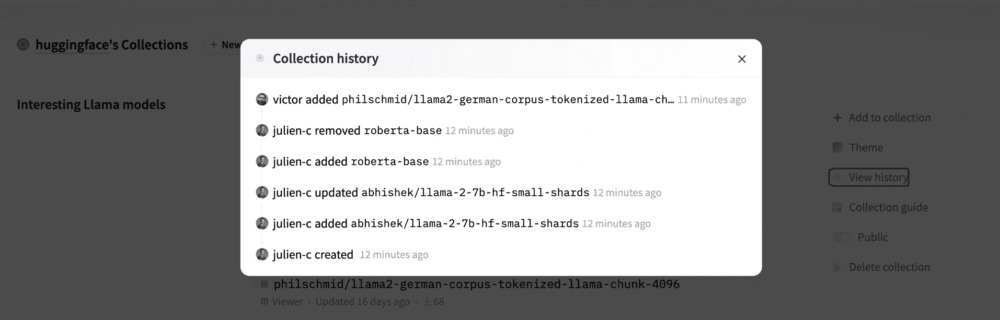

## 收藏选项

### 收藏可见性

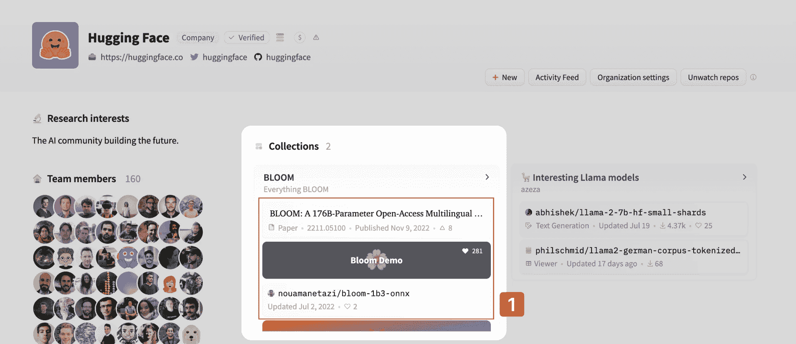

**公开**收藏会显示在您的资料或组织页面的顶部，并可供任何人查看。每个收藏中的前 3 个项目直接在收藏预览中可见（1）。要查看更多内容，用户必须单击转到收藏页面。

如果您不希望通过其 URL 访问收藏，请将其设置为**私有**（它不会显示在您的资料/组织页面上）。对于组织来说，私有收藏仅对组织成员可用。

### 对您的收藏和其项目进行排序

您可以使用收藏列表中的拖放手柄（在您的收藏页面的左侧）来更改收藏的顺序（1）。前两个收藏将直接显示在您的资料/组织页面上。

您还可以通过拖动每个项目旁边的手柄来对收藏中的存储库进行排序（2）。

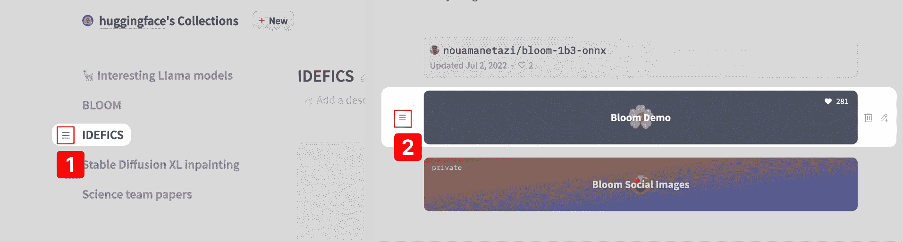

### 从收藏中删除项目

要从收藏中删除项目，请单击悬停在项目上时显示的右侧菜单中的垃圾桶图标（1）。要删除整个收藏，请单击右侧菜单中的删除（2）- 您需要确认此操作。

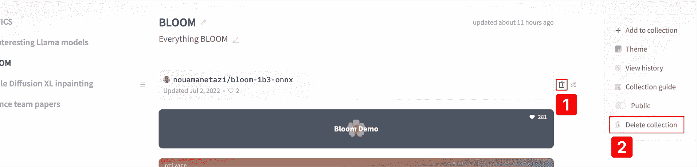

### 向收藏的项目添加注释

您可以向收藏中的任何项目添加注释，以便为其提供更多上下文（供他人查看，或作为自己的提醒）。当您将鼠标悬停在项目上时，可以通过单击铅笔图标添加注释。注释是纯文本，不支持 markdown，以保持简洁和简单。注释中的 URL 会转换为可点击的链接。

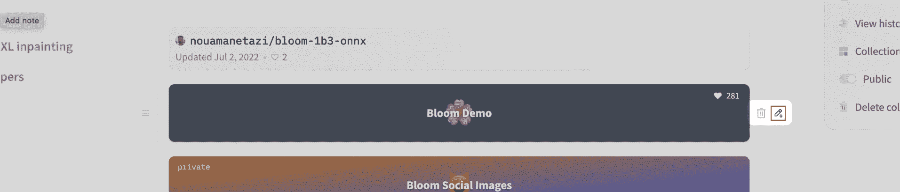

### 向收藏项添加图像

同样，您可以将图像附加到收藏项中。这对于展示模型的输出、数据集的内容、附加信息图表等非常有用。

要开始向您的收藏中添加图像，您可以单击项目的上下文菜单中的图像图标。当您将鼠标悬停在项目上时，菜单会显示出来。

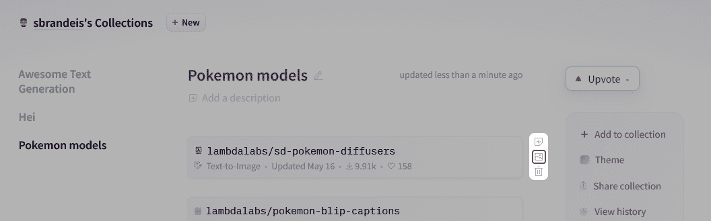

然后，通过从计算机中拖放图像来添加图像。您也可以单击灰色区域，从计算机的文件系统中选择图像文件。

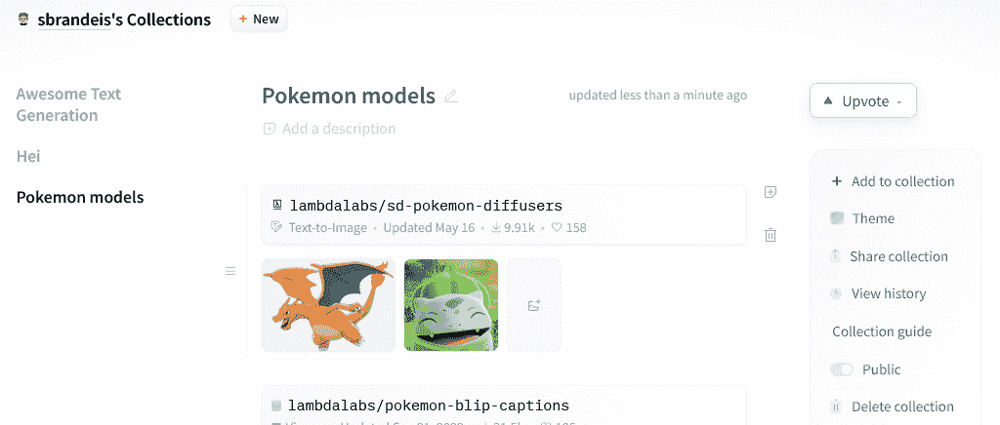

您可以通过拖放来重新排序图像。单击图像将以全屏模式打开它。

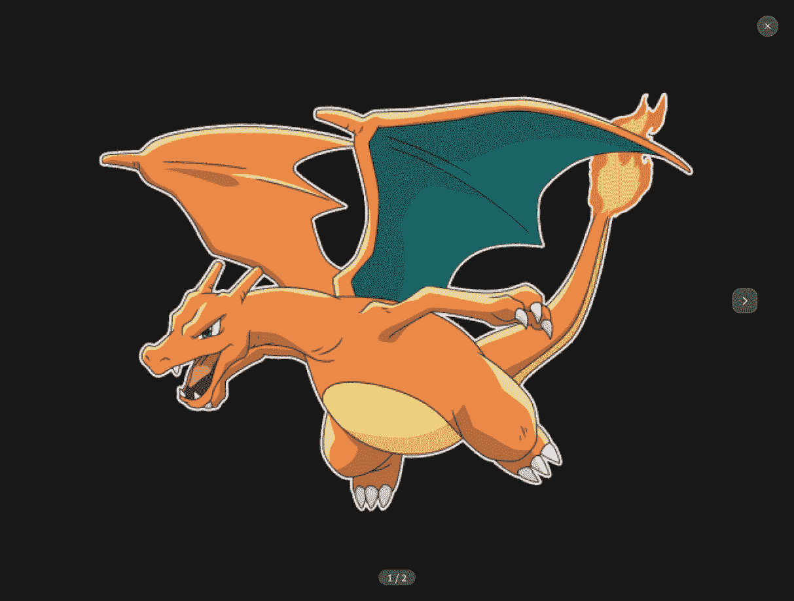

## 关于收藏的反馈

我们正在努力改进收藏功能，因此如果您有任何错误、问题或希望添加的新功能，请在[专门的讨论区](https://huggingface.co/spaces/huggingface/HuggingDiscussions/discussions/12)中发布消息。
