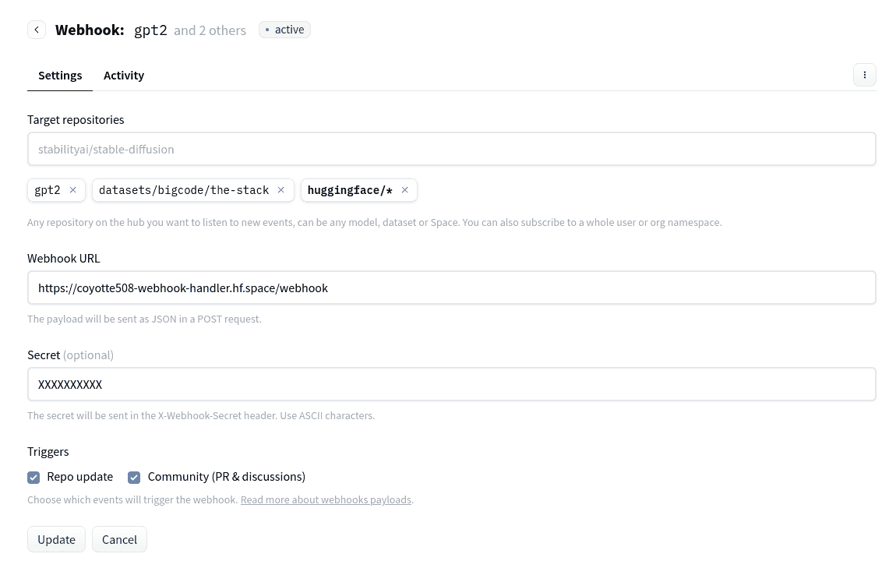
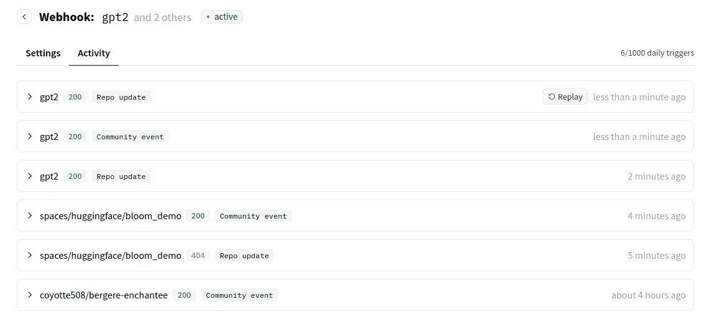
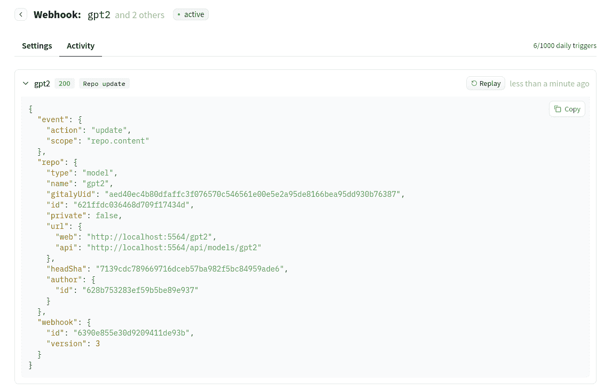

# Webhooks

> 原始文本：[`huggingface.co/docs/hub/webhooks`](https://huggingface.co/docs/hub/webhooks)

Webhooks 现在已经公开可用！

Webhooks 是与 MLOps 相关功能的基础。它们允许您监听特定仓库或属于特定用户/组织的所有仓库的新更改（不仅仅是您的仓库，而是任何仓库）。

您可以使用它们自动转换模型、构建社区机器人，或为您的模型、数据集和 Space 构建 CI/CD（以及更多！）。

Webhooks 的文档如下 - 或者您也可以浏览我们的 **指南**，展示了 Webhooks 的一些可能用例：

+   每当数据集更新时微调新模型（Python）

+   在 Hub 上使用 LLM API（NodeJS）创建讨论机器人

+   创建元数据质量报告（Python）

+   更多内容即将推出...

## 创建您的 Webhook

您可以在您的 Webhooks [设置](https://huggingface.co/settings/webhooks) 中创建新的 Webhooks 并编辑现有的 Webhooks：



Webhooks 可以监视仓库更新、拉取请求、讨论和新评论。甚至可以创建一个 Space 来响应您的 Webhooks！

## Webhook 有效载荷

注册 Webhook 后，您将通过指定目标 URL 的 `HTTP POST` 调用收到新事件的通知。有效载荷以 JSON 编码。

您可以在 Webhook 设置页面的活动选项卡中查看发送的有效载荷历史记录，也可以重播过去的 Webhooks 以便更轻松地进行调试：



当打开拉取请求时，以下是完整的有效载荷：

```py
{
  "event": {
    "action": "create",
    "scope": "discussion"
  },
  "repo": {
    "type": "model",
    "name": "gpt2",
    "id": "621ffdc036468d709f17434d",
    "private": false,
    "url": {
      "web": "https://huggingface.co/gpt2",
      "api": "https://huggingface.co/api/models/gpt2"
    },
    "owner": {
      "id": "628b753283ef59b5be89e937"
    }
  },
  "discussion": {
    "id": "6399f58518721fdd27fc9ca9",
    "title": "Update co2 emissions",
    "url": {
      "web": "https://huggingface.co/gpt2/discussions/19",
      "api": "https://huggingface.co/api/models/gpt2/discussions/19"
    },
    "status": "open",
    "author": {
      "id": "61d2f90c3c2083e1c08af22d"
    },
    "num": 19,
    "isPullRequest": true,
    "changes": {
      "base": "refs/heads/main"
    }
  },
  "comment": {
    "id": "6399f58518721fdd27fc9caa",
    "author": {
      "id": "61d2f90c3c2083e1c08af22d"
    },
    "content": "Add co2 emissions information to the model card",
    "hidden": false,
    "url": {
      "web": "https://huggingface.co/gpt2/discussions/19#6399f58518721fdd27fc9caa"
    }
  },
  "webhook": {
    "id": "6390e855e30d9209411de93b",
    "version": 3
  }
}
```

### 事件

顶级属性 `event` 总是指定并用于确定事件的性质。

它有两个子属性：`event.action` 和 `event.scope`。

`event.scope` 将是以下值之一：

+   `"repo"` - 仓库上的全局事件。相关 `action` 的可能值：`"create"`、`"delete"`、`"update"`、`"move"`。

+   `"repo.content"` - 仓库内容上的事件，例如新提交或标签。由于新创建的引用/提交，它也会触发新的拉取请求。相关 `action` 总是 `"update"`。

+   `"repo.config"` - 配置上的事件：更新 Space 密钥、更新设置、更新 DOI、禁用或启用等。相关的 `action` 总是 `"update"`。

+   `"discussion"` - 创建讨论或拉取请求，更新标题或状态，并合并。相关 `action` 的可能值：`"create"`、`"delete"`、`"update"`。

+   `"discussion.comment"` - 创建、更新和隐藏评论。相关 `action` 的可能值：`"create"`、`"update"`。

未来可以添加更多范围。为处理未知事件，您的 Webhook 处理程序可以将狭窄范围上的任何操作视为更广泛范围上的 `"update"` 操作。

例如，如果未来添加了 `"repo.config.dois"` 范围，那么任何具有该范围的事件都可以被您的 Webhook 处理程序视为 `"repo.config"` 范围上的 `"update"` 操作。

### 仓库

在当前版本的 Webhooks 中，顶级属性 `repo` 总是指定的，因为事件总是可以与仓库关联。例如，考虑以下值：

```py
"repo": {
	"type": "model",
	"name": "some-user/some-repo",
	"id": "6366c000a2abcdf2fd69a080",
	"private": false,
	"url": {
		"web": "https://huggingface.co/some-user/some-repo",
		"api": "https://huggingface.co/api/models/some-user/some-repo"
	},
	"headSha": "c379e821c9c95d613899e8c4343e4bfee2b0c600",
	"tags": [
		"license:other",
		"has_space"
	],
	"owner": {
		"id": "61d2000c3c2083e1c08af22d"
	}
}
```

`repo.headSha` 是仓库 `main` 分支上最新提交的 sha。仅当 `event.scope` 以 `"repo"` 开头时才发送，而不是在讨论和评论等社区事件上发送。

### 讨论和拉取请求

顶级属性 `discussion` 在社区事件（讨论和拉取请求）上指定。`discussion.isPullRequest` 属性是一个布尔值，指示讨论是否也是一个拉取请求（在 Hub 上，PR 是一种特殊类型的讨论）。以下是一个示例值：

```py
"discussion": {
	"id": "639885d811ae2bad2b7ba461",
	"title": "Hello!",
	"url": {
		"web": "https://huggingface.co/some-user/some-repo/discussions/3",
		"api": "https://huggingface.co/api/models/some-user/some-repo/discussions/3"
	},
	"status": "open",
	"author": {
		"id": "61d2000c3c2083e1c08af22d"
	},
	"isPullRequest": true,
	"changes": {
		"base": "refs/heads/main"
	}
	"num": 3
}
```

### 评论

顶级属性 `comment` 在创建评论（包括讨论创建）或更新评论时指定。以下是一个示例值：

```py
"comment": {
	"id": "6398872887bfcfb93a306f18",
	"author": {
		"id": "61d2000c3c2083e1c08af22d"
	},
	"content": "This adds an env key",
	"hidden": false,
	"url": {
		"web": "https://huggingface.co/some-user/some-repo/discussions/4#6398872887bfcfb93a306f18"
	}
}
```

## Webhook 密钥

设置 Webhook 密钥对于确保发送到您的 Webhook 处理程序 URL 的有效负载实际来自 Hugging Face 非常有用。

如果为您的 Webhook 设置了一个密钥，它将作为`X-Webhook-Secret` HTTP 标头发送到每个请求中。仅支持 ASCII 字符。

还可以直接在处理程序 URL 中添加密钥。例如，将其设置为查询参数：https://example.com/webhook?secret=XXX。

如果访问请求的 HTTP 标头对于您的 Webhook 处理程序来说很复杂，这可能会有所帮助。

## 速率限制

每个 Webhook 每 24 小时限制为 1,000 次触发。您可以在“活动”选项卡中的 Webhook 设置页面中查看您的使用情况。

如果您需要增加 Webhook 的触发次数，请联系我们 website@huggingface.co。

## 开发您的 Webhooks

如果您没有 HTTPS 端点/URL，您可以尝试使用公共工具进行 Webhook 测试。这些工具充当捕获所有请求并返回 200 OK 状态代码的接收器。[Beeceptor](https://beeceptor.com/)是一个工具，您可以使用它创建临时的 HTTP 端点并查看传入的有效负载。另一个类似的工具是[Webhook.site](https://webhook.site/)。

此外，您可以在开发过程中将真实的 Webhook 有效负载路由到本地计算机上运行的代码。这是测试和调试更快集成的好方法。您可以通过将本地主机端口暴露到互联网来实现这一点。要走这条路，您可以使用[ngrok](https://ngrok.com/)或[localtunnel](https://theboroer.github.io/localtunnel-www/)。

## 调试 Webhooks

您可以轻松找到您的 Webhook 最近生成的事件。打开您的 Webhook 的活动选项卡。在那里您将看到最近事件的列表。



在这里，您可以查看生成事件的 HTTP 状态代码和有效负载。此外，您可以通过单击“重新播放”按钮来重新播放这些事件！

注意：更改 Webhook 的目标 URL 或密钥时，重新播放事件将将有效负载发送到更新后的 URL。

## 常见问题

##### 我可以在我的组织上定义 Webhook，还是在我的用户帐户上定义？

不，目前不支持。

##### 如何订阅所有存储库的事件（或跨整个存储库类型，例如所有模型）？

目前尚未向最终用户公开，但如果您发送电子邮件至 website@huggingface.co，我们可以为您切换此功能。
