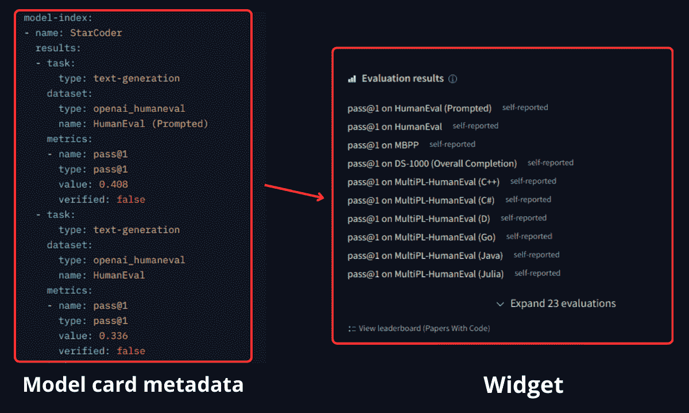

# 模型卡

> 原始文本：[`huggingface.co/docs/hub/model-cards`](https://huggingface.co/docs/hub/model-cards)

[新！尝试我们的实验性模型卡创建器应用](https://huggingface.co/spaces/huggingface/Model_Cards_Writing_Tool)

## 什么是模型卡？

模型卡是随模型一起提供的文件，提供便捷信息。在幕后，模型卡是带有额外元数据的简单 Markdown 文件。模型卡对于可发现性、可重现性和共享至关重要！您可以在任何模型存储库中找到模型卡，它作为`README.md`文件。

模型卡应描述：

+   模型

+   其预期用途和潜在限制，包括详细说明的偏见和伦理考虑，如[Mitchell, 2018](https://arxiv.org/abs/1810.03993)

+   培训参数和实验信息（您可以嵌入或链接到实验跟踪平台以供参考）

+   用于训练您的模型的数据集

+   模型的评估结果

模型卡模板可在[此处](https://github.com/huggingface/huggingface_hub/blob/main/src/huggingface_hub/templates/modelcard_template.md)找到。

如何填写模型卡的每个部分在[注释模型卡](https://huggingface.co/docs/hub/model-card-annotated)中有描述。

Hub 上的模型卡有两个关键部分，信息有重叠：

+   元数据

+   文本描述

## 模型卡元数据

模型存储库将将其`README.md`呈现为模型卡。模型卡是一个[Markdown](https://en.wikipedia.org/wiki/Markdown)文件，顶部有一个包含有关模型元数据的[YAML](https://en.wikipedia.org/wiki/YAML)部分。

您添加到模型卡的元数据支持发现和更轻松使用您的模型。例如：

+   允许用户在[`huggingface.co/models`](https://huggingface.co/models)上筛选模型。

+   显示模型的许可证。

+   向元数据添加数据集将在您的模型卡中添加一个消息，显示“用于训练的数据集：”，并链接相关数据集，如果它们在 Hub 上可用。

数据集、指标和语言标识符是列在[数据集](https://huggingface.co/datasets)、[指标](https://huggingface.co/metrics)和[语言](https://huggingface.co/languages)页面上的内容。

### 向您的模型卡添加元数据

有几种不同的方法可以向您的模型卡添加元数据，包括：

+   使用元数据 UI

+   直接编辑`README.md`文件中的 YAML 部分

+   通过[`huggingface_hub`](https://huggingface.co/docs/huggingface_hub) Python 库，查看更多详细信息，请参阅[文档](https://huggingface.co/docs/huggingface_hub/guides/model-cards#update-metadata)。

许多具有 Hub 集成的库在上传模型时将自动向模型卡添加元数据。

#### 使用元数据 UI

您可以使用元数据 UI 向您的模型卡添加元数据。要访问元数据 UI，请转到模型页面，然后单击模型卡右上角的“编辑模型卡”按钮。这将打开一个编辑器，显示模型卡的`README.md`文件，以及用于编辑元数据的 UI。

！[](../Images/143e784800a2dc82ef42a024dbe6ba04.png)！[](../Images/d67f8951223912e8360fe09bb39293ee.png)

此 UI 将允许您向您的模型卡添加关键元数据，许多字段将根据您提供的信息自动完成。使用 UI 是向您的模型卡添加元数据的最简单方法，但它不支持所有元数据字段。如果您想添加 UI 不支持的元数据，可以直接编辑`README.md`文件中的 YAML 部分。

#### 编辑`README.md`文件中的 YAML 部分

您还可以直接编辑`README.md`文件中的 YAML 部分。如果模型卡尚未包含 YAML 部分，您可以通过在文件顶部添加三个`---`，然后包含所有相关元数据，并使用另一组`---`来关闭该部分，如下例所示：

```py
---
language: 
  - "List of ISO 639-1 code for your language"
  - lang1
  - lang2
thumbnail: "url to a thumbnail used in social sharing"
tags:
- tag1
- tag2
license: "any valid license identifier"
datasets:
- dataset1
- dataset2
metrics:
- metric1
- metric2
base_model: "base model Hub identifier"
---
```

您可以在此处找到详细的模型卡片元数据规范[here](https://github.com/huggingface/hub-docs/blob/main/modelcard.md?plain=1)。

### 指定库

您可以在模型卡片元数据部分指定受支持的库。在此处查找更多关于我们支持的库的信息 here。库将按以下优先顺序指定：

1.  在模型卡片中指定`library_name`（如果您的模型不是`transformers`模型，则建议使用）。此信息可以通过元数据 UI 或直接在模型卡片的 YAML 部分中添加：

```py
library_name: flair
```

1.  具有受支持的库名称的标签

```py
tags:
- flair
```

如果未指定，Hub 将尝试自动检测库类型。除非您的模型来自`transformers`，否则不鼓励使用这种方法，存储库创建者应尽可能使用显式的`library_name`。

1.  通过查看诸如`*.nemo`或`*saved_model.pb*`之类的文件的存在，Hub 可以确定模型是否来自 NeMo 或 Keras。

1.  如果未检测到任何内容并且存在`config.json`文件，则假定库是`transformers`。

### 指定基础模型

如果您的模型是基础模型的微调或适配器，您可以在模型卡片元数据部分指定基础模型。这些信息还可以用于指示您的模型是否是多个现有模型的合并。`base_model`字段可以是单个模型 ID，也可以是一个或多个基础模型的列表（通过它们的 Hub 标识符指定）。

```py
base_model: HuggingFaceH4/zephyr-7b-beta
```

此元数据将用于在模型页面上显示基础模型。用户还可以使用此信息来通过基础模型筛选模型或查找从特定基础模型微调的模型。

 

### 指定数据集

您可以在模型卡片元数据部分指定用于训练模型的数据集。这些数据集将显示在模型页面上，用户可以通过数据集来筛选模型。您应该使用 Hub 数据集标识符，该标识符与数据集的存储库名称相同：

```py
datasets:
- imdb
- HuggingFaceH4/no_robots
```

### 指定任务（pipeline_tag）

您可以在模型卡片元数据中指定`pipeline_tag`。`pipeline_tag`指示模型用于的任务类型。此标签将显示在模型页面上，用户可以通过任务在 Hub 上筛选模型。此标签还用于确定为模型使用哪个小部件以及在幕后使用哪些 API。

对于`transformers`模型，管道标签会自动从模型的`config.json`文件中推断出来，但如果需要的话，您可以在模型卡片元数据中覆盖它。在元数据 UI 中编辑此字段将确保管道标签有效。一些其他集成了 Hub 的库也会自动将管道标签添加到模型卡片元数据中。

### 指定许可证

您可以在模型卡片元数据部分指定许可证。许可证将显示在模型页面上，用户可以通过许可证筛选模型。使用元数据 UI，您将看到最常见许可证的下拉列表。

如果需要，您还可以通过将`other`添加为许可证值并在元数据中指定名称和许可证链接来指定自定义许可证。

```py
# Example from https://huggingface.co/coqui/XTTS-v1
---
license: other
license_name: coqui-public-model-license
license_link: https://coqui.ai/cpml
---
```

如果许可证不是通过 URL 提供的，您可以链接到存储在模型存储库中的 LICENSE。

### 评估结果

您可以以结构化方式在模型卡片元数据中指定**模型的评估结果**。结果将由 Hub 解析并显示在模型页面上的小部件中。以下是[bigcode/starcoder](https://huggingface.co/bigcode/starcoder)模型的示例：

 

元数据规范基于 Papers with code 的[model-index 规范](https://github.com/paperswithcode/model-index)。这使我们能够在适当时直接将结果索引到 Papers with code 的排行榜中。您还可以链接计算评估结果的来源。

这是一个部分示例，用于描述[01-ai/Yi-34B](https://huggingface.co/01-ai/Yi-34B)在 ARC 基准测试中的得分。结果来自[Open LLM 排行榜](https://huggingface.co/spaces/HuggingFaceH4/open_llm_leaderboard)，被定义为`source`：

```py
---
model-index:
  - name: Yi-34B
    results:
      - task:
          type: text-generation
        dataset:
          name: ai2_arc
          type: ai2_arc
        metrics:
          - name: AI2 Reasoning Challenge (25-Shot)
            type: AI2 Reasoning Challenge (25-Shot)
            value: 64.59
        source:
          name: Open LLM Leaderboard
          url: https://huggingface.co/spaces/HuggingFaceH4/open_llm_leaderboard
---
```

有关如何格式化这些数据的更多详细信息，请查看[模型卡片规范](https://github.com/huggingface/hub-docs/blob/main/modelcard.md?plain=1)。

### CO2 排放

模型卡片也是展示您的模型 CO[2]影响信息的好地方。访问我们的[跟踪和报告 CO[2]排放指南](./model-cards-co2)以了解更多信息。

### 链接一篇论文

如果模型卡片包含指向 arXiv 上的论文的链接，Hugging Face Hub 将提取 arXiv ID，并以`arxiv:<PAPER ID>`格式包含在模型标签中。点击标签将让您：

+   访问论文页面

+   过滤 Hub 上引用相同论文的其他模型。

 

在这里阅读有关论文页面的更多信息。

## 模型卡片文本

有关如何填写一个可打印、可剪切+粘贴等不包含 Hub 特定元数据的易读模型卡片的详细信息，请参阅 Annotated Model Card。

## 常见问题解答

### 模型标签是如何确定的？

每个模型页面在页面标题下列出所有模型的标签。这些标签主要是从模型卡片元数据计算出来的，尽管有些是自动添加的，如创建小部件中所述。

### 我可以为我的模型添加自定义标签吗？

是的，您可以通过将它们添加到模型卡片元数据中的`tags`字段来为您的模型添加自定义标签。元数据 UI 将建议一些流行的标签，但您可以添加任何您想要的标签。例如，您可以通过添加一个`finance`标签来指示您的模型专注于金融。

### 如何指示我的模型不适合所有受众

您可以向您的模型卡片元数据中添加一个`not-for-all-audience`标签。当此标签存在时，将在模型页面上显示一条消息，指示该模型不适合所有受众。用户可以通过此消息点击查看模型卡片。

### 我可以在我的模型卡片中写 LaTeX 吗？

是的！Hub 使用[KaTeX](https://katex.org/)数学排版库在解析 Markdown 之前在服务器端呈现数学公式。

您必须使用以下定界符：

+   `$$ ... $$` 用于显示模式

+   `\\(...\\)` 用于内联模式（斜杠和括号之间没有空格）。

然后您可以编写：<math display="block"><semantics><mrow><mtext>LaTeX</mtext></mrow> <annotation encoding="application/x-tex">\LaTeX</annotation></semantics></math> LATE​X <math display="block"><semantics><mrow><mrow><mi mathvariant="normal">M</mi><mi mathvariant="normal">S</mi><mi mathvariant="normal">E</mi></mrow><mo>=</mo><mrow><mo fence="true">(</mo><mfrac><mn>1</mn><mi>n</mi></mfrac><mo fence="true">)</mo></mrow><munderover><mo>∑</mo><mrow><mi>i</mi><mo>=</mo><mn>1</mn></mrow><mi>n</mi></munderover><mo stretchy="false">(</mo><msub><mi>y</mi><mi>i</mi></msub><mo>−</mo><msub><mi>x</mi><mi>i</mi></sub><msup><mo stretchy="false">)</mo><mn>2</mn></msup></mrow> <annotation encoding="application/x-tex">\mathrm{MSE} = \left(\frac{1}{n}\right)\sum_{i=1}^{n}(y_{i} - x_{i})^{2}</annotation></semantics></math> MSE=(n1​)i=1∑n​(yi​−xi​)2 <math display="block"><semantics><mrow><mi>E</mi><mo>=</mo><mi>m</mi><msup><mi>c</mi><mn>2</mn></msup></mrow> <annotation encoding="application/x-tex">E=mc²</annotation></semantics></math> E=mc2
