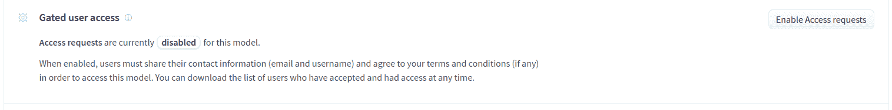
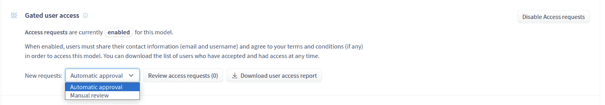
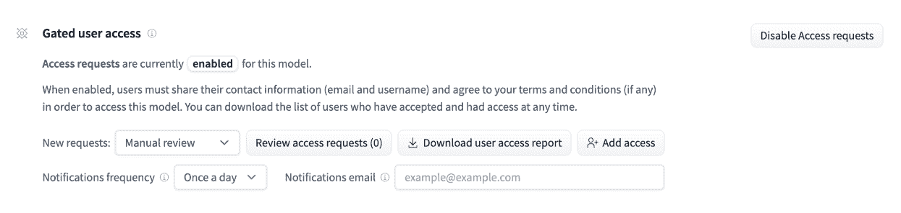
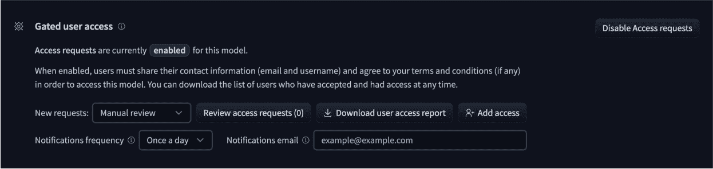
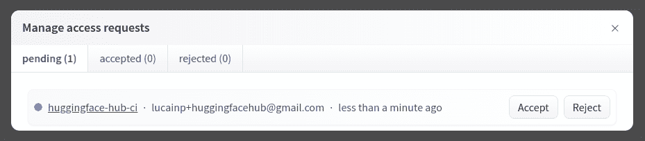
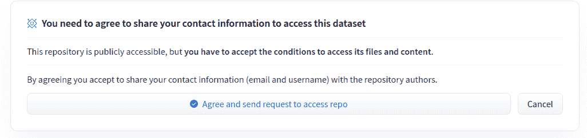

# 门控模型

> 原始文本：[`huggingface.co/docs/hub/models-gated`](https://huggingface.co/docs/hub/models-gated)

为了更好地控制模型的使用方式，Hub 允许模型作者为其模型启用**访问请求**。用户必须同意与模型作者分享其联系信息（用户名和电子邮件地址）以便在启用时访问模型文件。模型作者可以配置此请求以包含其他字段。启用访问请求的模型称为**门控模型**。访问请求始终授予个别用户而不是整个组织。门控模型的常见用例是在更广泛发布之前提供对早期研究模型的访问。

## 作为模型作者管理门控模型

要启用访问请求，请转到模型设置页面。默认情况下，模型未被门控。单击右上角的**启用访问请求**。

 

默认情况下，用户请求访问模型时，模型会自动授予用户访问权限。这称为**自动批准**。在此模式下，用户一旦与您分享了个人信息，就可以访问您的模型。

 

如果您想手动批准哪些用户可以访问您的模型，您必须将其设置为**手动批准**。在这种情况下，您将注意到更多选项：

+   **添加访问**允许您搜索用户并授予他们访问权限，即使他们没有请求。

+   **通知频率**允许您配置何时在新用户请求访问时收到通知。它可以设置为每天一次或实时。默认情况下，电子邮件将发送到您的主要电子邮件地址。您可以在**通知电子邮件**字段中设置不同的电子邮件地址。对于托管在组织下的模型，电子邮件将发送给组织的前 5 个管理员。

 

### 查看访问请求

一旦启用访问请求，您将完全控制谁可以访问您的模型，无论批准模式是手动还是自动。您可以通过 UI 或通过 API 查看和管理请求。

#### 通过 UI

您可以通过单击**查看访问请求**按钮从设置页面查看谁可以访问您的门控模型。这将打开一个带有 3 个用户列表的模态框：

+   **pending**：等待批准访问您的模型的用户列表。除非您选择了**手动批准**，否则此列表为空。您可以选择**接受**或**拒绝**需求。如果需求被拒绝，用户将无法访问您的模型，也无法再次请求访问。

+   **accepted**：具有访问权限的用户的完整列表。您可以随时为任何用户拒绝访问，无论批准模式是手动还是自动。您还可以**取消**批准，这将将用户移至*pending*列表。

+   **rejected**：您手动拒绝的用户列表。这些用户无法访问您的模型。如果他们转到您的模型存储库，他们将看到一条消息*您对访问此存储库的请求已被存储库的作者拒绝*。

 

#### 通过 API

您可以通过使用 API 自动批准访问请求。您必须传递一个具有对门控存储库的`写`访问权限的`token`。要生成一个令牌，请转到[您的用户设置](https://huggingface.co/settings/tokens)。

| 方法 | URI | 描述 | 标头 | 负载 |
| --- | --- | --- | --- | --- |
| `GET` | `/api/models/{repo_id}/user-access-request/pending` | 检索待处理请求列表。 | `{"authorization": "Bearer $token"}` |  |
| `GET` | `/api/models/{repo_id}/user-access-request/accepted` | 检索已接受请求的列表。 | `{"authorization": "Bearer $token"}` |  |
| `GET` | `/api/models/{repo_id}/user-access-request/rejected` | 检索已拒绝请求的列表。 | `{"authorization": "Bearer $token"}` |  |
| `POST` | `/api/models/{repo_id}/user-access-request/handle` | 更改给定访问请求的状态为`status`。 | `{"authorization": "Bearer $token"}` | `{"status": "accepted"/"rejected"/"pending", "user": "username"}` |
| `POST` | `/api/models/{repo_id}/user-access-request/grant` | 允许特定用户访问您的 repo。 | `{"authorization": "Bearer $token"}` | `{"user": "username"}` |

上述 HTTP 端点的基本 URL 是`https://huggingface.co`。

**新功能！** 这些端点现在在我们的 Python 客户端`huggingface_hub`中得到官方支持。使用[`list_pending_access_requests`](https://huggingface.co/docs/huggingface_hub/main/en/package_reference/hf_api#huggingface_hub.HfApi.list_pending_access_requests)，[`list_accepted_access_requests`](https://huggingface.co/docs/huggingface_hub/main/en/package_reference/hf_api#huggingface_hub.HfApi.list_accepted_access_requests)和[`list_rejected_access_requests`](https://huggingface.co/docs/huggingface_hub/main/en/package_reference/hf_api#huggingface_hub.HfApi.list_rejected_access_requests)列出对您模型的访问请求。您还可以使用[`accept_access_request`](https://huggingface.co/docs/huggingface_hub/main/en/package_reference/hf_api#huggingface_hub.HfApi.accept_access_request)，[`cancel_access_request`](https://huggingface.co/docs/huggingface_hub/main/en/package_reference/hf_api#huggingface_hub.HfApi.cancel_access_request)，[`reject_access_request`](https://huggingface.co/docs/huggingface_hub/main/en/package_reference/hf_api#huggingface_hub.HfApi.reject_access_request)接受、取消和拒绝访问请求。最后，您可以使用[`grant_access`](https://huggingface.co/docs/huggingface_hub/main/en/package_reference/hf_api#huggingface_hub.HfApi.grant_access)向用户授予访问权限。

### 下载访问报告

您可以通过**下载用户访问报告**按钮下载受限制模型的所有访问请求的报告。单击它以下载一个包含用户列表的 json 文件。对于每个条目，您有：

+   **用户**：用户 ID。示例：*julien-c*。

+   **全名**：Hub 上用户的名称。示例：*Julien Chaumond*。

+   **状态**：请求的状态。可以是`"pending"`、`"accepted"`或`"rejected"`。

+   **电子邮件**：用户的电子邮件。

+   **时间**：用户最初发出请求的日期时间。

### 自定义请求的信息

默认情况下，访问您受限制模型的用户将被要求通过单击**同意并发送请求以访问 repo**按钮来分享他们的联系信息（电子邮件和用户名）。

 

如果您想收集更多用户信息，可以配置额外的字段。这些信息将可以从**设置**选项卡中访问。为此，请向您的模型卡片元数据添加一个`extra_gated_fields`属性，其中包含一组键/值对。*键*是字段的名称，*值*是其类型或带有`type`字段的对象。字段类型列表如下：

+   `text`：单行文本字段。

+   `checkbox`：复选框字段。

+   `date_picker`：日期选择器字段。

+   `country`：国家下拉菜单。国家列表基于[ISO 3166-1 alpha-2](https://en.wikipedia.org/wiki/ISO_3166-1_alpha-2)标准。

+   `select`：带有选项列表的下拉菜单。选项列表在`options`字段中定义。示例：`options: ["option 1", "option 2", {label: "option3", value: "opt3"}]`。

最后，您还可以使用`extra_gated_prompt`额外字段来个性化向用户显示的消息。

这是一个定制请求表单的示例，用户被要求提供他们的公司名称和国家，并承认该模型仅用于非商业用途。

```py
---
extra_gated_prompt: "You agree to not use the model to conduct experiments that cause harm to human subjects."
extra_gated_fields:
  Company: text
  Country: country
  Specific date: date_picker
  I want to use this model for:
    type: select
    options: 
      - Research
      - Education
      - label: Other
        value: other
  I agree to use this model for non-commercial use ONLY: checkbox
---
```

在某些情况下，您可能还希望修改门标题中的文本和按钮中的文本。对于这些用例，您可以像这样修改`extra_gated_heading`和`extra_gated_button_content`：

```py
---
extra_gated_heading: "Acknowledge license to accept the repository"
extra_gated_button_content: "Acknowledge license"
---
```

### 以编程方式管理访问请求的示例用例

以下是社区中自然出现的一些有趣的使用案例，用于以编程方式管理对有门控存储库的访问请求。作为提醒，模型存储库需要设置为手动批准，否则用户将自动获得对其的访问权限。

程序化管理的可能用例包括：

+   如果您有高级用户请求筛选要求（用于高级合规要求等），或者希望在 Hub 之外处理用户请求。

    +   一个例子是 Meta 的 [Llama 2](https://huggingface.co/meta-llama/Llama-2-7b-chat-hf) 的初始发布，用户必须在 Meta 网站上请求访问权限。

    +   您可以在访问流程中要求用户提供他们的 HF 用户名，然后使用脚本根据您设置的条件在 Hub 上程序化接受用户请求。

+   如果您希望根据完成付款流程来限制对模型的访问（请注意，实际的付款流程发生在 Hub 之外）。

    +   这是 TrelisResearch 的一个使用此用例的[示例存储库](https://huggingface.co/Trelis/openchat_3.5-function-calling-v3)。

    +   [@RonanMcGovern](https://huggingface.co/RonanMcGovern) 发布了一个关于流程的[视频](https://www.youtube.com/watch?v=2OT2SI5auQU)，以及如何实施的提示。

## 作为用户访问有门控的模型

作为用户，如果您想使用有门控的模型，您将需要请求访问权限。这意味着您必须登录到 Hugging Face 用户帐户。

只能从浏览器中请求访问权限。转到 Hub 上的模型，您将被提示共享您的信息：

 

点击**同意**，即表示您同意与模型作者分享您的用户名和电子邮件地址。在某些情况下，可能会要求提供其他字段。为了帮助模型作者决定是否授予您访问权限，请尽可能完整地填写表格。

一旦访问请求发送出去，就有两种可能性。如果批准机制是自动的，您将立即获得对模型文件的访问权限。否则，请求必须由作者手动批准，这可能需要更多时间。

模型作者对模型访问拥有完全控制权。特别是，他们可以随时决定阻止您对模型的访问，而无需事先通知，无论批准机制如何，或者您的请求是否已经获得批准。

### 下载文件

要从有门控的模型中下载文件，您需要进行身份验证。在浏览器中，只要您使用您的帐户登录，这是自动的。如果您使用脚本，您将需要提供一个 user token。在 Hugging Face Python 生态系统（`transformers`、`diffusers`、`datasets`等）中，您可以使用[`huggingface_hub`](https://huggingface.co/docs/huggingface_hub/index)库登录您的计算机，并在终端中运行：

```py
huggingface-cli login
```

或者，您可以在笔记本或脚本中使用`login()`进行程序化登录：

```py
>>> from huggingface_hub import login
>>> login()
```

您还可以在库中的大多数加载方法（`from_pretrained`、`hf_hub_download`、`load_dataset`等）中直接从您的脚本中提供`token`参数。

有关如何登录的更多详细信息，请查看[登录指南](https://huggingface.co/docs/huggingface_hub/quick-start#login)。
