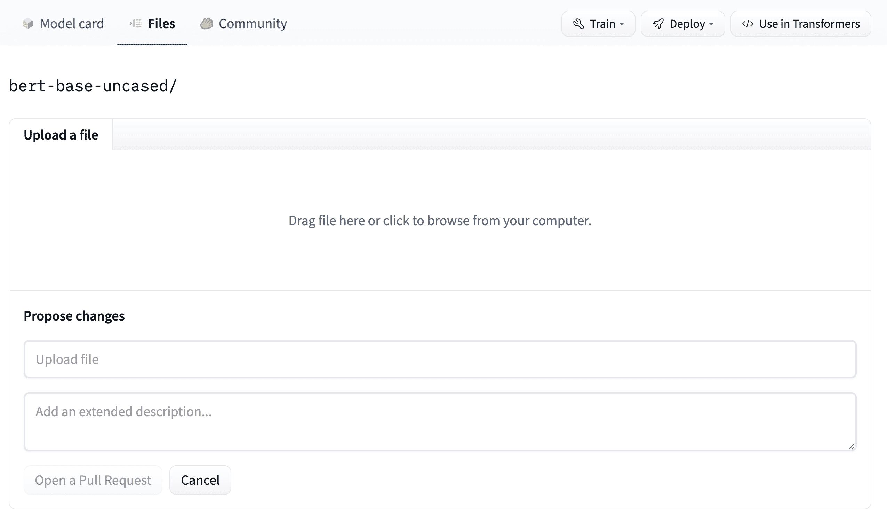
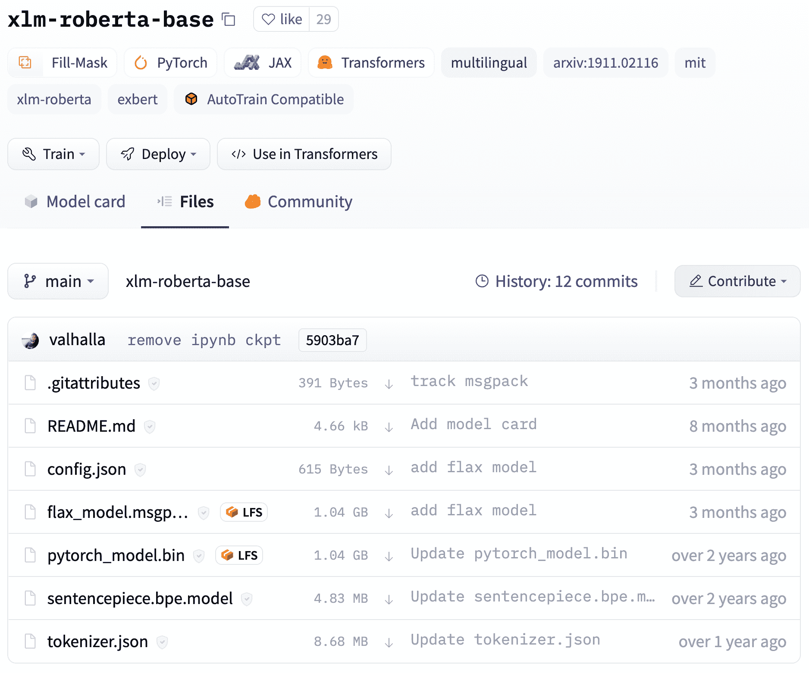
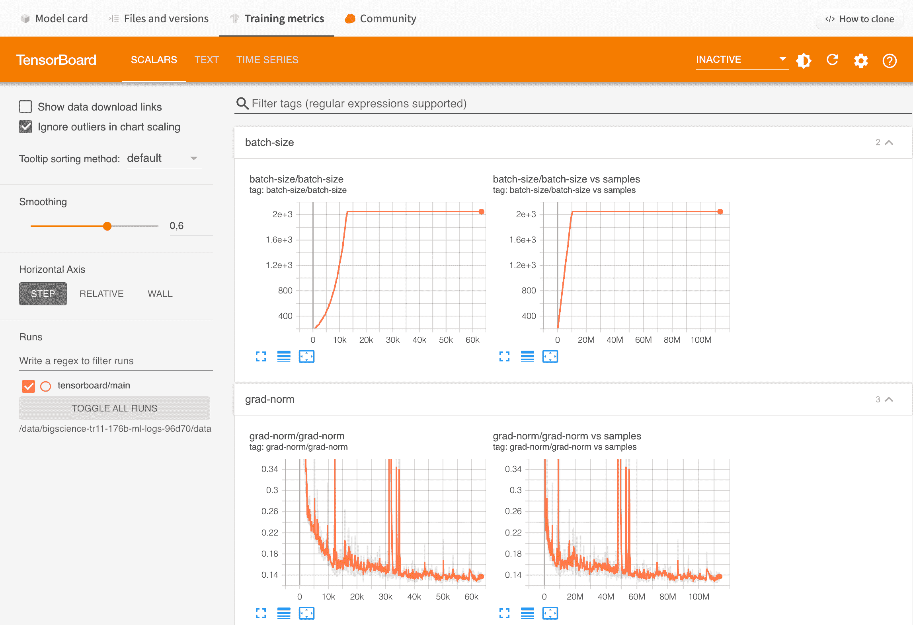
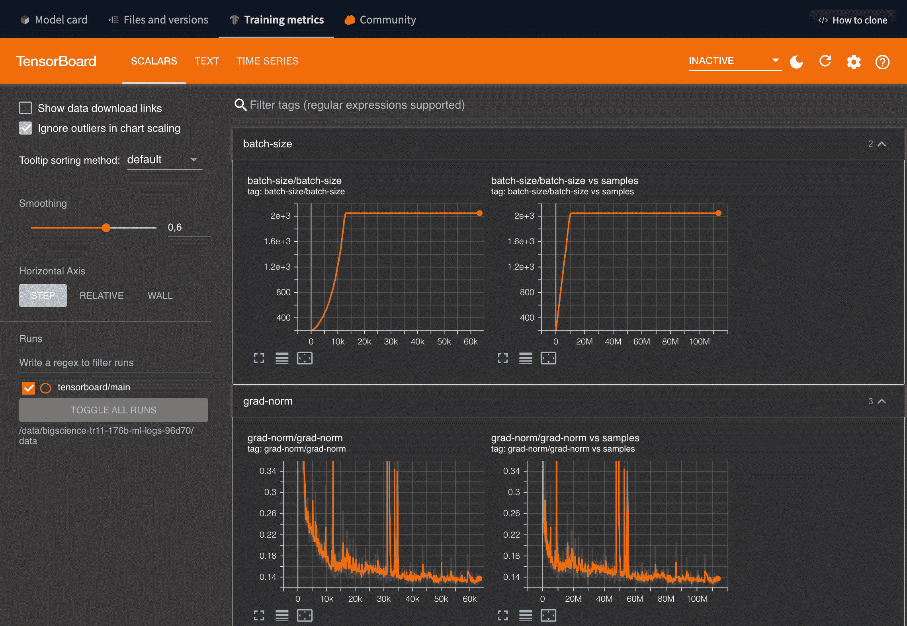
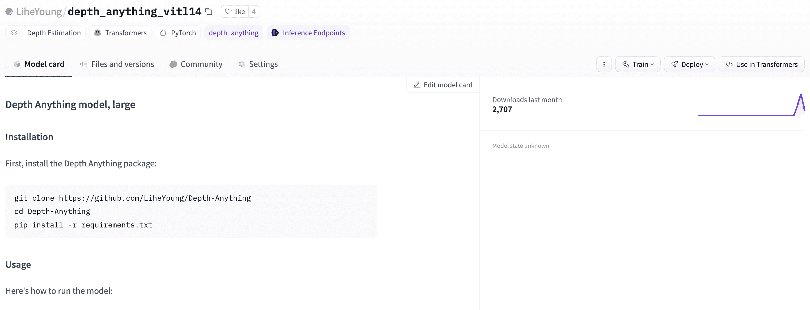

# 上传模型

> 原始文本：[`huggingface.co/docs/hub/models-uploading`](https://huggingface.co/docs/hub/models-uploading)

要将模型上传到 Hub，您需要在[Hugging Face](https://huggingface.co/join)上创建一个帐户。Hub 上的模型是基于 Git 的存储库，为您提供版本控制、分支、可发现性和共享功能、与数十个库的集成等功能！您可以控制您想要上传到存储库的内容，包括检查点、配置文件和任何其他文件。

您可以将存储库与个人用户（例如[osanseviero/fashion_brands_patterns](https://huggingface.co/osanseviero/fashion_brands_patterns)）或组织（例如[facebook/bart-large-xsum](https://huggingface.co/facebook/bart-large-xsum)）关联起来。组织可以收集与公司、社区或库相关的模型！如果选择组织，该模型将显示在组织的页面上，组织的每个成员都将有能力为存储库做出贡献。您可以在[这里](https://huggingface.co/organizations/new)创建一个新组织。

有几种上传模型到 Hub 的方法，如下所述。

+   如果您的模型来自具有内置支持的库，可以使用现有的方法。

+   如果您的模型是一个自定义的 PyTorch 模型，推荐的方式是利用 huggingface_hub Python 库，因为它允许为您的模型添加`from_pretrained`、`push_to_hub`和[自动下载指标](https://huggingface.co/docs/hub/models-download-stats)功能，就像 Transformers、Diffusers 和 Timm 库中的模型一样。

+   除了编程上传之外，您还可以使用 Web 界面。

一旦您的模型上传完成，我们建议在您的存储库中添加一个模型卡片来记录您的模型。

## 使用 Web 界面

要创建一个全新的模型存储库，请访问[huggingface.co/new](http://huggingface.co/new)。然后按照以下步骤操作：

1.  在“文件和版本”选项卡中，选择“添加文件”并指定“上传文件”：

 

1.  从那里，从您的计算机中选择一个文件进行上传，并留下一个有用的提交消息，以了解您正在上传的内容：

 

1.  之后，点击**提交更改**将您的模型上传到 Hub！

1.  检查文件和历史记录

您可以检查您的存储库，查看所有最近添加的文件！

 

该界面允许您浏览模型文件和提交，并查看每个提交引入的差异：

 

1.  添加元数据

您可以向您的模型卡片添加元数据。您可以指定：

+   这个模型是为哪种类型的任务，启用小部件和推理 API。

+   所使用的库（`transformers`、`spaCy`等）

+   语言

+   数据集

+   指标

+   许可证

+   还有更多！

在 model-cards#model-card-metadata 中阅读有关模型标签的更多信息。

1.  添加 TensorBoard 跟踪

任何包含 TensorBoard 跟踪（文件名包含`tfevents`的文件）的存储库都将被归类为[`TensorBoard`标签](https://huggingface.co/models?filter=tensorboard)。作为一种惯例，我们建议您将跟踪保存在`runs/`子文件夹下。然后，“训练指标”选项卡可以轻松查看记录变量的图表，如损失或准确性。

 

使用🤗 Transformers 训练的模型将默认生成[TensorBoard traces](https://huggingface.co/docs/transformers/main_classes/callback#transformers.integrations.TensorBoardCallback)，如果安装了[`tensorboard`](https://pypi.org/project/tensorboard/)。

## 从具有内置支持的库上传

首先检查您的模型是否来自具有内置支持以推送到/从 Hub 加载的库，例如 Transformers、Diffusers、Timm、Asteroid 等：[`huggingface.co/docs/hub/models-libraries`](https://huggingface.co/docs/hub/models-libraries)。下面我们将展示如何对于 Transformers 这样的库来说这是多么简单的事情：

```py
from transformers import BertConfig, BertModel

config = BertConfig()
model = BertModel(config)

model.push_to_hub("nielsr/my-awesome-bert-model")

# reload
model = BertModel.from_pretrained("nielsr/my-awesome-bert-model")
```

## 使用 huggingface_hub 上传 PyTorch 模型

如果您的模型是（自定义）PyTorch 模型，您可以利用[huggingface_hub](https://github.com/huggingface/huggingface_hub) Python 库中提供的`PyTorchModelHubMixin`[类](https://huggingface.co/docs/huggingface_hub/package_reference/mixins#huggingface_hub.PyTorchModelHubMixin)。这是一个最小的类，它为任何`nn.Module`添加了`from_pretrained`和`push_to_hub`功能，以及下载指标。

以下是如何使用它（假设您已经运行了`pip install huggingface_hub`）：

```py
import torch
import torch.nn as nn
from huggingface_hub import PyTorchModelHubMixin

class MyModel(nn.Module, PyTorchModelHubMixin):
    def __init__(self, config: dict):
        super().__init__()
        self.param = nn.Parameter(torch.rand(config["num_channels"], config["hidden_size"]))
        self.linear = nn.Linear(config["hidden_size"], config["num_classes"])

    def forward(self, x):
        return self.linear(x + self.param)

# create model
config = {"num_channels": 3, "hidden_size": 32, "num_classes": 10}
model = MyModel(config=config)

# save locally
model.save_pretrained("my-awesome-model", config=config)

# push to the hub
model.push_to_hub("my-awesome-model", config=config)

# reload
model = MyModel.from_pretrained("username/my-awesome-model")
```

正如所见，唯一需要做的是在 Python 字典中定义有关模型架构的所有超参数（例如隐藏大小、类数、丢失概率等）。接下来，您可以定义一个类，该类以`config`作为关键字参数在其 init 中。

这带有自动化的下载指标，这意味着您将能够看到模型被下载的次数，就像它们对于原生集成在 Transformers、Diffusers 或 Timm 库中的模型一样。使用这个混合类，每个单独的检查点都存储在 Hub 中的一个由 2 个文件组成的存储库中：

+   包含权重的`pytorch_model.bin`或`model.safetensors`文件

+   一个`config.json`文件，它是模型配置的序列化版本。此类用于计算下载指标：每当用户调用`from_pretrained`加载`config.json`时，计数会增加一次。请参阅有关自动下载指标的[此指南](https://huggingface.co/docs/hub/models-download-stats)。

建议为每个检查点添加一个模型卡片，以便人们可以阅读模型的相关信息，有论文链接等。

 利用 PyTorchModelHubMixin 的示例[存储库](https://huggingface.co/LiheYoung/depth_anything_vitl14)。下载量显示在右侧。

访问[huggingface_hub 文档](https://huggingface.co/docs/huggingface_hub/guides/integrations)以了解更多信息。

或者，也可以简单地以编程方式将文件或文件夹上传到 hub：[`huggingface.co/docs/huggingface_hub/guides/upload`](https://huggingface.co/docs/huggingface_hub/guides/upload)。

## 使用 Git

最后，由于模型存储库只是 Git 存储库，您也可以使用 Git 将模型文件推送到 Hub。请按照开始使用存储库指南学习如何使用`git` CLI 提交和推送您的模型。
