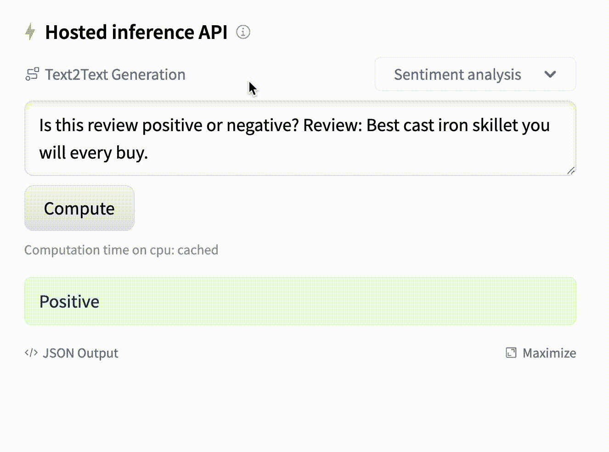
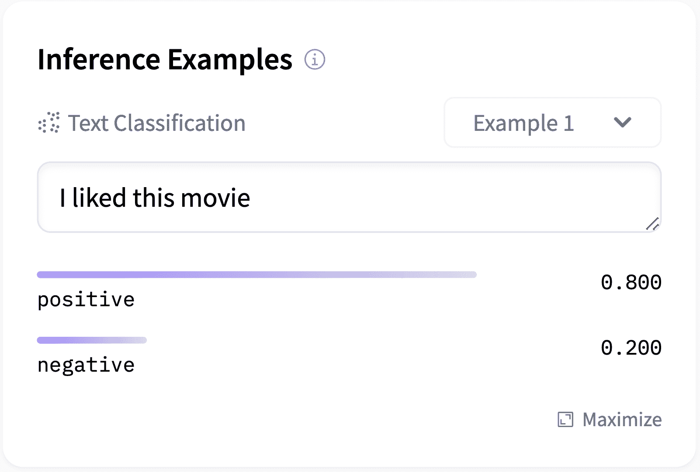
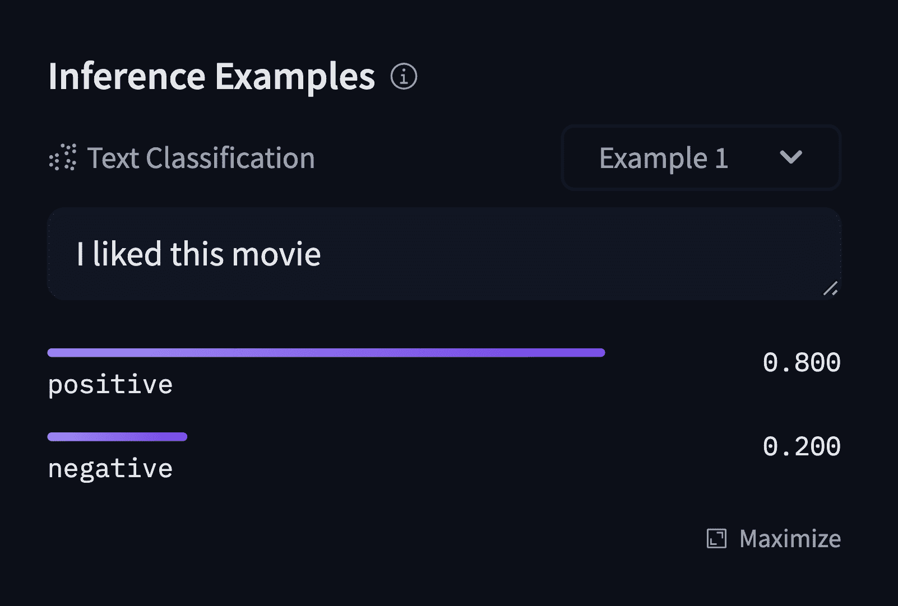
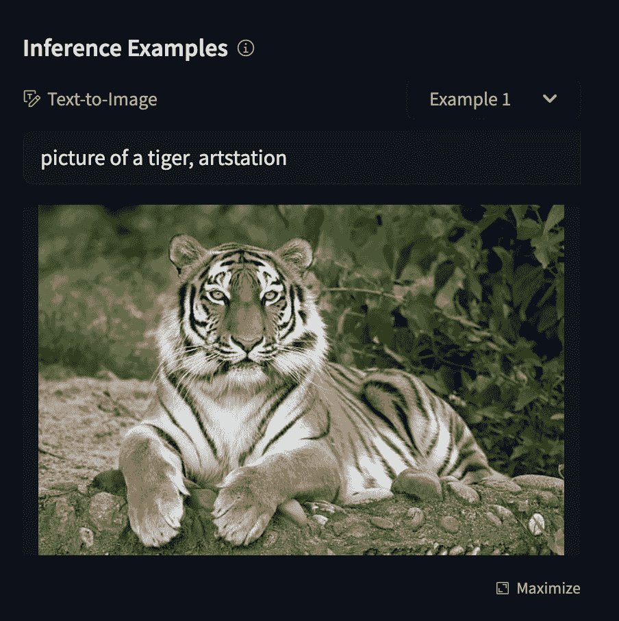

# 小部件

> 原文链接：[`huggingface.co/docs/hub/models-widgets`](https://huggingface.co/docs/hub/models-widgets)

## 什么是小部件？

许多模型存储库都有一个小部件，允许任何人直接在浏览器中运行推理！

以下是一些示例：

+   [命名实体识别](https://huggingface.co/spacy/en_core_web_sm?text=My+name+is+Sarah+and+I+live+in+London) 使用[spaCy](https://spacy.io/)。

+   [图像分类](https://huggingface.co/google/vit-base-patch16-224) 使用[🤗 Transformers](https://github.com/huggingface/transformers)

+   [文本转语音](https://huggingface.co/julien-c/ljspeech_tts_train_tacotron2_raw_phn_tacotron_g2p_en_no_space_train) 使用[ESPnet](https://github.com/espnet/espnet)。

+   [句子相似度](https://huggingface.co/osanseviero/full-sentence-distillroberta3) 使用[句子转换器](https://github.com/UKPLab/sentence-transformers)。

您可以在[这里](https://huggingface-widgets.netlify.app/)尝试所有小部件。

## 启用小部件

当您将模型上传到 Hub 时，将自动为您的模型创建一个小部件。为了确定显示哪个管道和小部件（`文本分类`，`标记分类`，`翻译`等），我们会分析存储库中提供的元数据和配置文件等信息。这些信息被映射到一个单一的`pipeline_tag`。为了简单起见，我们选择**仅显示一个**模型的小部件。

对于大多数用例，我们从标签中确定模型类型。例如，如果在 model 卡片元数据中有`tag: text-classification`，则推断的`pipeline_tag`将是`text-classification`。

对于一些库，例如🤗`Transformers`，应根据配置文件（`config.json`）自动推断模型类型。架构可以确定类型：例如，`AutoModelForTokenClassification`对应于`token-classification`。如果您对此感兴趣，可以在[此代码片段](https://gist.github.com/julien-c/857ba86a6c6a895ecd90e7f7cab48046)中看到伪代码。

**您可以始终在您的 model 卡片元数据中手动覆盖您的管道类型，使用`pipeline_tag: xxx`。**（您也可以使用元数据 GUI 编辑器来执行此操作）。

### 如何控制我的模型的小部件示例输入？

您可以在模型卡片元数据部分指定小部件输入：

```py
widget:
- text: "Jens Peter Hansen kommer fra Danmark"
```

您可以提供多个示例输入。在小部件的示例下拉菜单中，它们将显示为`示例 1`，`示例 2`等。也可以选择提供`example_title`。

 

```py
widget:
- text: "Is this review positive or negative? Review: Best cast iron skillet you will ever buy."
  example_title: "Sentiment analysis"
- text: "Barack Obama nominated Hilary Clinton as his secretary of state on Monday. He chose her because she had ..."
  example_title: "Coreference resolution"
- text: "On a shelf, there are five books: a gray book, a red book, a purple book, a blue book, and a black book ..."
  example_title: "Logic puzzles"
- text: "The two men running to become New York City's next mayor will face off in their first debate Wednesday night ..."
  example_title: "Reading comprehension"
```

此外，您可以在模型卡片元数据中指定非文本示例输入。请参考此处以获取所有小部件类型的示例输入格式的完整列表。对于视觉和音频小部件类型，请使用`src`而不是`text`提供示例输入。

例如，允许用户从两个示例音频文件中选择，用于自动语音识别任务：

```py
widget:
- src: https://example.org/somewhere/speech_samples/sample1.flac
  example_title: Speech sample 1
- src: https://example.org/somewhere/speech_samples/sample2.flac
  example_title: Speech sample 2
```

请注意，您还可以在您的模型存储库中包含示例文件并将其用作：

```py
widget:
  - src: https://huggingface.co/username/model_repo/resolve/main/sample1.flac
    example_title: Custom Speech Sample 1
```

但更方便的是，如果文件位于相应的模型存储库中，您可以直接使用文件名或存储库内的文件路径：

```py
widget:
  - src: sample1.flac
    example_title: Custom Speech Sample 1
```

或者如果它被嵌套在存储库中：

```py
widget:
  - src: nested/directory/sample1.flac
```

我们为一些语言和大多数小部件类型提供示例输入，[default-widget-inputs.ts 文件](https://github.com/huggingface/huggingface.js/blob/main/packages/tasks/src/default-widget-inputs.ts)中有。如果缺少某些示例，我们欢迎社区提供 PR 来添加它们！

## 示例输出

作为示例输入的扩展，对于每个小部件示例，您还可以选择在`output`属性中直接描述相应的模型输出。

当模型尚未受到推理 API 的支持时（例如，模型库尚未受到支持或模型过大），这将非常有用，以便模型页面仍然可以展示模型的工作原理和结果。

例如，对于 automatic-speech-recognition 模型：

```py
widget:
  - src: sample1.flac
    output:
      text: "Hello my name is Julien"
```

 

`output`属性应该是一个表示推理 API 输出的 YAML 字典。

对于输出文本的模型，请参阅上面的示例。

对于输出标签的模型（例如文本分类模型），输出应如下所示：

```py
widget:
  - text: "I liked this movie"
    output:
      - label: POSITIVE
        score: 0.8
      - label: NEGATIVE
        score: 0.2
```

 

最后，对于输出图像、音频或任何其他类型资产的模型，输出应包括一个`url`属性，链接到存储库内的文件名或路径，或远程 URL。例如，对于文本到图像模型：

```py
widget:
  - text: "picture of a futuristic tiger, artstation"
    output:
      url: images/tiger.jpg
```

 

我们还可以在 Hugging Face UI 中展示示例输出，例如，对于文本到图像模型，以显示一个酷炫图像生成的画廊。


## 所有可能的任务/小部件类型是什么？

您可以在[pipelines.ts 文件](https://github.com/huggingface/huggingface.js/blob/main/packages/tasks/src/pipelines.ts)中找到所有支持的任务。

以下是一些示例链接：

+   `text-classification`，例如[`roberta-large-mnli`](https://huggingface.co/roberta-large-mnli)

+   `token-classification`，例如[`dbmdz/bert-large-cased-finetuned-conll03-english`](https://huggingface.co/dbmdz/bert-large-cased-finetuned-conll03-english)

+   `question-answering`，例如[`distilbert-base-uncased-distilled-squad`](https://huggingface.co/distilbert-base-uncased-distilled-squad)

+   `translation`，例如[`t5-base`](https://huggingface.co/t5-base)

+   `summarization`，例如[`facebook/bart-large-cnn`](https://huggingface.co/facebook/bart-large-cnn)

+   `conversational`，例如[`facebook/blenderbot-400M-distill`](https://huggingface.co/facebook/blenderbot-400M-distill)

+   `text-generation`，例如[`gpt2`](https://huggingface.co/gpt2)

+   `fill-mask`，例如[`distilroberta-base`](https://huggingface.co/distilroberta-base)

+   `zero-shot-classification`（建立在 nli `text-classification`模型之上），例如[`facebook/bart-large-mnli`](https://huggingface.co/facebook/bart-large-mnli)

+   `table-question-answering`，例如[`google/tapas-base-finetuned-wtq`](https://huggingface.co/google/tapas-base-finetuned-wtq)

+   `sentence-similarity`，例如`osanseviero/full-sentence-distillroberta2`

## 如何控制我的模型小部件推理 API 参数？

通常，模型的推理 API 使用与每个任务相关的默认管道设置。但是，如果您想更改管道的默认设置并指定额外的推理参数，可以通过模型卡片元数据直接配置参数。有关与每个任务相关的一些常用参数，请参考[这里](https://huggingface.co/docs/api-inference/detailed_parameters)。

例如，如果您想为小部件中的 NER 任务指定聚合策略：

```py
inference:
  parameters:
    aggregation_strategy: "none"
```

或者，如果您想在小部件中更改摘要任务的温度：

```py
inference:
  parameters:
    temperature: 0.7
```

推理 API 允许您向 Hugging Face Hub 中的模型发送 HTTP 请求，比小部件快 2 倍到 10 倍！⚡⚡ 通过阅读推理 API 文档了解更多。最后，您还可以将所有这些模型部署到专用的[推理端点](https://huggingface.co/docs/inference-endpoints)。
