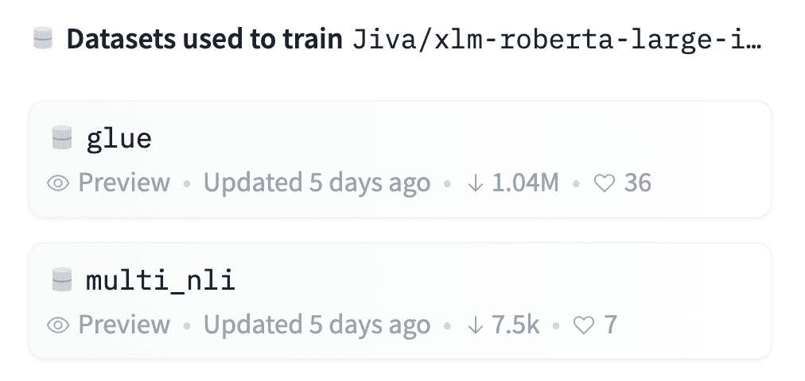
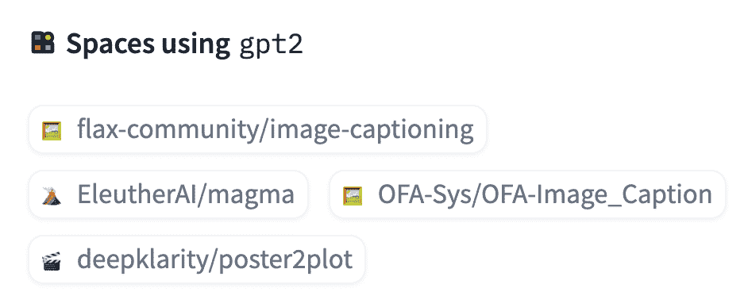
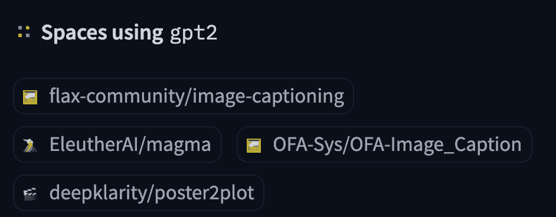
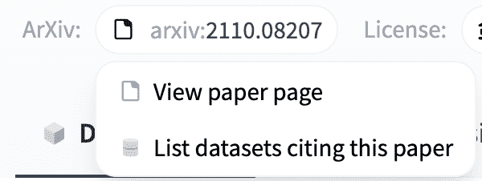
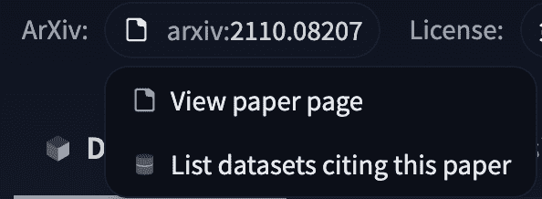

# 模型常见问题

> 原始文本：[`huggingface.co/docs/hub/models-faq`](https://huggingface.co/docs/hub/models-faq)

## 如何查看模型训练时使用的数据集？

包含训练信息取决于上传模型的人！用户可以指定用于训练模型的数据集。如果用于模型的数据集在 Hub 上，上传者可能已经将它们包含在[model card 的元数据](https://huggingface.co/Jiva/xlm-roberta-large-it-mnli/blob/main/README.md#L7-L9)中。在这种情况下，数据集将与模型页面右侧的一个方便的卡片链接：

 

## 如何查看模型在实际中的示例？

模型可以具有推理小部件，让您在浏览器中尝试模型！推理小部件易于配置，您可以选择许多不同的选项。访问 Widgets 文档以了解更多。

Hugging Face Hub 还拥有 Spaces，这是用于展示模型的交互式演示。如果模型有任何与之关联的 Spaces，您将在模型页面上找到它们的链接，如下所示：

 

空间是展示您制作的模型或探索使用现有模型的新方法的好方法！访问 Spaces 文档以了解如何创建您自己的空间。

## 如何上传更新/模型的新版本？

发布您已经发布的模型的更新可以通过向模型的存储库推送新的提交来完成。要做到这一点，请按照上传初始模型时遵循的相同过程。您以前的模型版本将保留在存储库的提交历史记录中，因此您仍然可以从特定的 git 提交或标签下载以前的模型版本，或者根据需要恢复到以前的版本。

## 如果我有一个在不同数据集上训练的模型的不同检查点呢？

按照惯例，每个模型存储库应该包含一个单独的检查点。您应该将在不同数据集上训练的任何新检查点上传到 Hub 中的一个新模型存储库中。您可以通过在 model card 的元数据中的`tags`键中指定的标签，使用 Collections 将不同相关存储库组合在一起，或者通过在模型卡中链接它们来将模型链接在一起。例如，[akiyamasho/AnimeBackgroundGAN-Shinkai](https://huggingface.co/akiyamasho/AnimeBackgroundGAN-Shinkai#other-pre-trained-model-versions)模型在模型卡中引用其他检查点，位于*“Other pre-trained model versions”*下。

## 我可以将我的模型链接到 arXiv 上的论文吗？

如果模型卡包含指向 arXiv 上的论文的链接，Hugging Face Hub 将提取 arXiv ID，并以`arxiv:<PAPER ID>`的格式将其包含在模型标签中。点击标签将让您：

+   访问论文页面

+   过滤 Hub 上引用相同论文的其他模型。

 

在这里阅读更多关于论文页面的信息 here。
