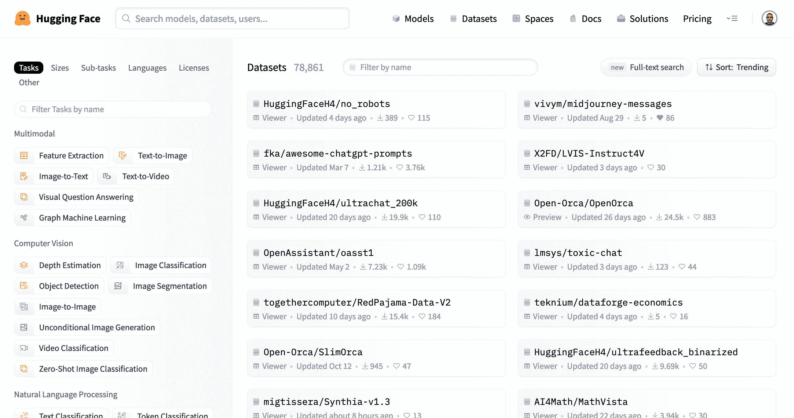
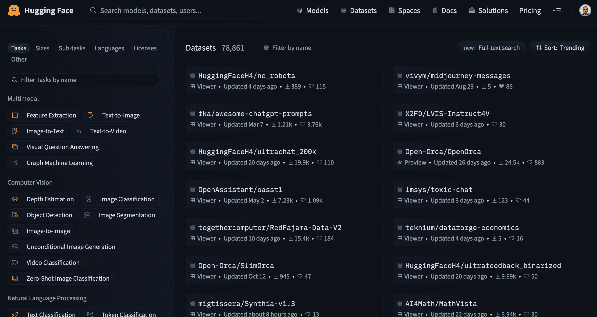

# 数据集概述

> 原文链接：[`huggingface.co/docs/hub/datasets-overview`](https://huggingface.co/docs/hub/datasets-overview)

## Hub 上的数据集

Hugging Face Hub 托管了大量社区策划的数据集，涵盖了各种任务，如翻译、自动语音识别和图像分类。除了包含在数据集卡中的信息之外，许多数据集，如[GLUE](https://huggingface.co/datasets/glue)，还包括一个数据集查看器来展示数据。

每个数据集都是一个包含生成训练、评估和测试分割所需数据的 Git 存储库。有关数据集存储库结构的信息，请参考数据文件配置页面。遵循支持的存储库结构将确保 Hub 上的数据集页面具有查看器。

## 搜索数据集

与模型和空间一样，您可以使用顶部导航栏中的搜索栏或[主数据集页面](https://huggingface.co/datasets)在 Hub 中搜索数据集。有大量的语言、任务和许可证可供您使用，以便筛选结果，找到适合您的数据集。

 

## 隐私

由于数据集是存储库，您可以通过设置选项卡在私有和公共之间切换它们的可见性。如果数据集是由组织拥有的，则隐私设置适用于组织的所有成员。
