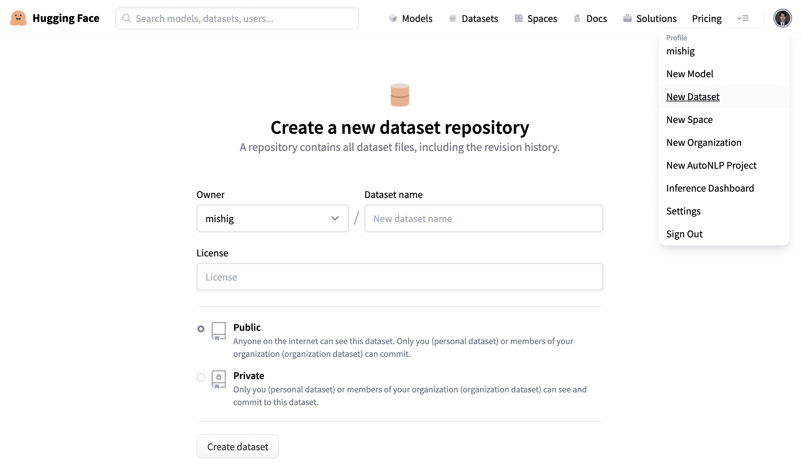
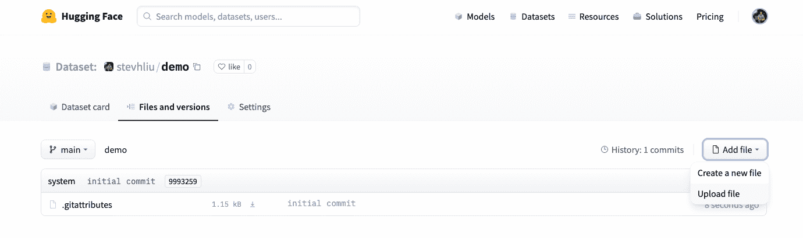
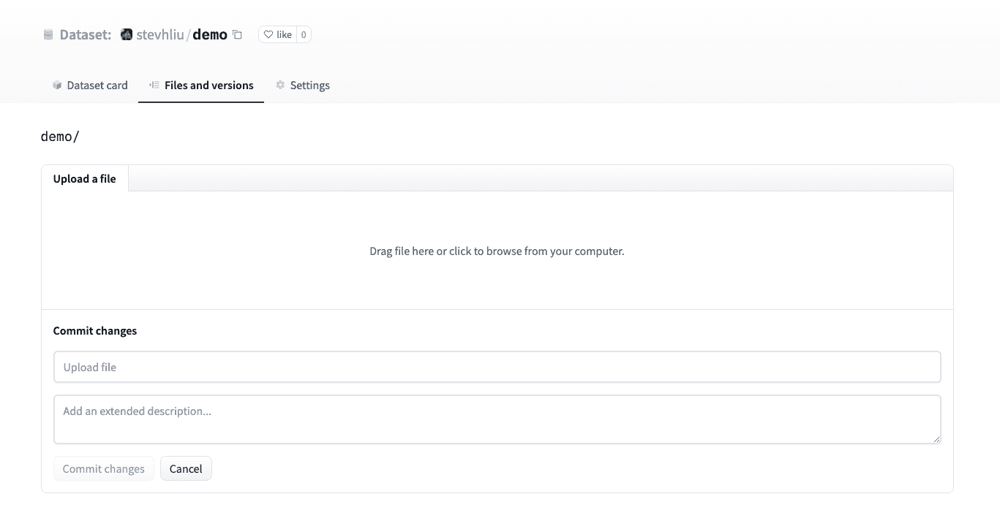
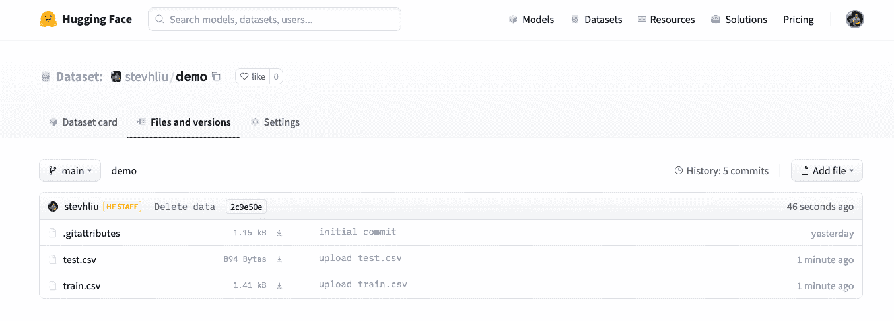
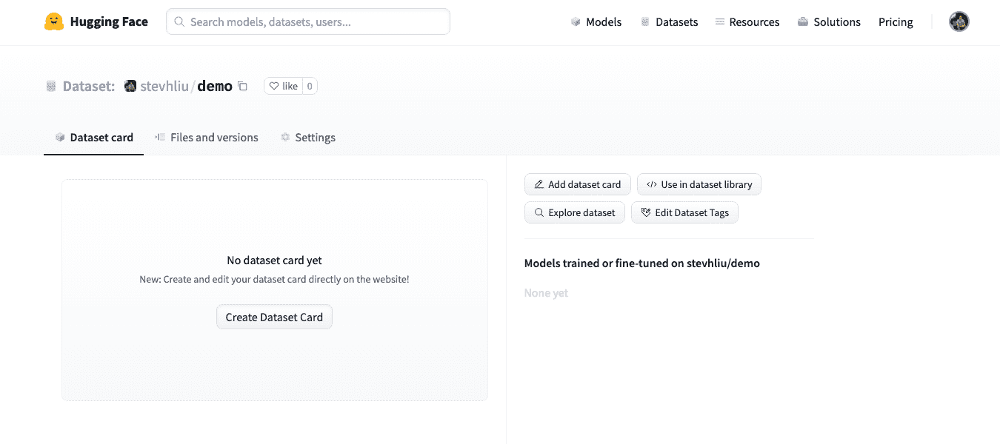
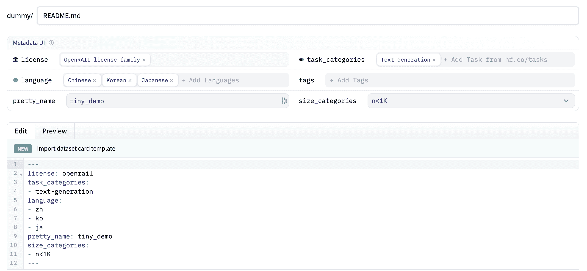

# 上传数据集

> 原文：[`huggingface.co/docs/hub/datasets-adding`](https://huggingface.co/docs/hub/datasets-adding)

[Hub](https://huggingface.co/datasets)是社区策划和研究数据集的广泛收藏地。我们鼓励您将您的数据集分享到 Hub，以帮助发展 ML 社区并加速每个人的进步。欢迎所有贡献；添加数据集只是一步之遥！

如果您还没有，请首先[创建 Hugging Face Hub 帐户](https://huggingface.co/join)。

## 使用 Hub UI 上传

Hub 的基于 Web 的界面允许没有任何开发经验的用户上传数据集。

### 创建存储库

存储库托管所有数据集文件，包括修订历史，使得存储多个数据集版本成为可能。

1.  点击您的个人资料，选择**新数据集**以创建[新数据集存储库](https://huggingface.co/new-dataset)。

1.  为您的数据集选择一个名称，并选择它是公共数据集还是私有数据集。公共数据集对任何人可见，而私有数据集只能由您或您组织的成员查看。

### 上传数据集

1.  创建存储库后，转到**文件和版本**选项卡以添加文件。选择**添加文件**以上传您的数据集文件。我们支持许多文本、音频、图像和其他数据扩展名，如`.csv`、`.mp3`和`.jpg`（请参阅文件格式的完整列表）。

1.  拖放您的数据集文件。

1.  上传数据集文件后，它们将存储在您的数据集存储库中。

### 创建数据集卡

添加数据集卡对帮助用户找到您的数据集并了解如何负责使用它非常有价值。

1.  点击**创建数据集卡**以创建数据集卡。此按钮将在您的存储库中创建一个`README.md`文件。

1.  在顶部，您将看到**元数据 UI**，其中有几个字段可供选择，如许可证、语言和任务类别。这些是帮助用户在 Hub 上发现您的数据集最重要的标签（如果适用）。当您为字段选择一个选项时，它将自动添加到数据集卡的顶部。

    您还可以查看[数据集卡规范](https://github.com/huggingface/hub-docs/blob/main/datasetcard.md?plain=1)，其中包含一整套允许的标签，包括可选的`annotations_creators`，以帮助您选择对您的数据集有用的标签。

1.  在数据集卡中编写数据集文档，向社区介绍您的数据集，并帮助用户了解其中的内容：用例和限制是什么，数据来自何处，重要的道德考虑是什么，以及其他相关细节。

    您可以点击编辑器顶部的**导入数据集卡模板**链接，自动创建数据集卡模板。要查看良好数据集卡的详细示例，请查看[CNN DailyMail 数据集卡](https://huggingface.co/datasets/cnn_dailymail)。

## 使用 huggingface_hub 客户端库

`huggingface_hub`库中丰富的功能集允许您管理存储库，包括创建存储库和上传数据集到 Hub。访问[客户端库文档](https://huggingface.co/docs/huggingface_hub/index)以了解更多。

## 使用其他库

一些库，如🤗 Datasets、[Pandas](https://pandas.pydata.org/)、[Dask](https://www.dask.org/)或[DuckDB](https://duckdb.org/)可以上传文件到 Hub。有关更多信息，请查看 Datasets Hub 支持的库列表。

## 使用 Git

由于数据集存储库是 Git 存储库，您可以使用 Git 将数据文件推送到 Hub。请按照入门指南上的指南，了解如何使用 `git` CLI 提交和推送数据集。

## 文件格式

Hub 本地支持多种文件格式：

+   CSV (.csv, .tsv)

+   JSON Lines，JSON (.jsonl, .json)

+   Parquet (.parquet)

+   文本 (.txt)

+   图像 (.png, .jpg, 等)

+   音频 (.wav, .mp3, 等)

+   [WebDataset](https://github.com/webdataset/webdataset) (.tar)

它支持使用 ZIP (.zip)，GZIP (.gz)，ZSTD (.zst)，BZ2 (.bz2)，LZ4 (.lz4) 和 LZMA (.xz) 压缩的文件。

图像和音频文件也可以有额外的元数据文件，请参阅图像和音频数据集上的数据文件配置。

您可能希望将文件转换为这些格式以从所有 Hub 功能中受益。其他格式和结构可能不被 Hub 所识别。

### 数据集查看器

数据集查看器 在下载数据之前了解数据实际情况非常有用。它默认对所有公共数据集启用。它也适用于由[PRO 用户](https://huggingface.co/pricing)或[企业中心组织](https://huggingface.co/enterprise)拥有的私有数据集。

上传数据集后，请确保数据集查看器正确显示您的数据，或配置数据集查看器。

## 大规模数据集

Hugging Face Hub 支持大规模数据集，通常以 Parquet 格式上传（例如通过使用🤗 Datasets 的 `push_to_hub()`）或[WebDataset](https://github.com/webdataset/webdataset)格式。

您可以使用 `huggingface-hub` 库以高速上传大规模数据集。

查看如何按块上传文件夹和大文件上传的技巧和窍门。
