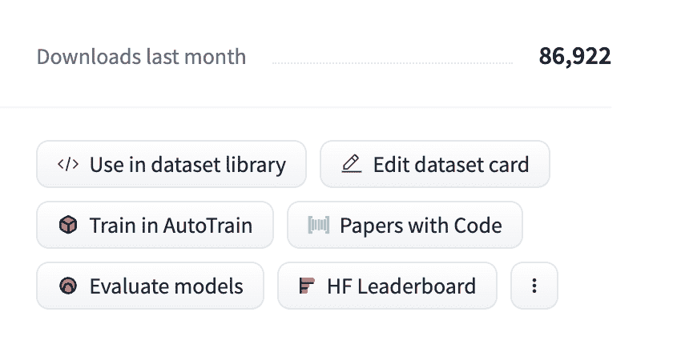
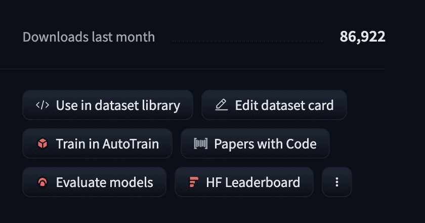
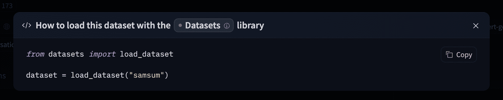

# 下载数据集

> 原文链接：[`huggingface.co/docs/hub/datasets-downloading`](https://huggingface.co/docs/hub/datasets-downloading)

## 集成库

如果 Hub 上的数据集与支持的库相关联，只需几行代码即可加载数据集。有关访问数据集的信息，您可以单击数据集页面上的“在数据集库中使用”按钮，查看如何操作。例如，[`samsum`](https://huggingface.co/datasets/samsum?library=true)显示了如何在下面使用🤗数据集。

  

## 使用 Hugging Face 客户端库

您可以使用[`huggingface_hub`](https://huggingface.co/docs/huggingface_hub)库来创建、删除、更新和检索存储库中的信息。您还可以从存储库中下载文件或将其集成到您的库中！例如，您可以使用 Pandas 几行代码快速加载 CSV 数据集。

```py
from huggingface_hub import hf_hub_download
import pandas as pd

REPO_ID = "YOUR_REPO_ID"
FILENAME = "data.csv"

dataset = pd.read_csv(
    hf_hub_download(repo_id=REPO_ID, filename=FILENAME, repo_type="dataset")
)
```

## 使用 Git

由于 Hub 上的所有数据集都是 Git 存储库，您可以通过运行以下命令在本地克隆数据集：

```py
git lfs install
git clone git@hf.co:datasets/<dataset ID> # example: git clone git@hf.co:datasets/allenai/c4
```

如果您对特定数据集存储库具有写入访问权限，您还可以提交和推送对数据集的修订。

将您的 SSH 公钥添加到[您的用户设置](https://huggingface.co/settings/keys)中，以推送更改和/或访问私有存储库。
