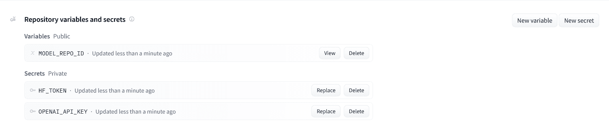
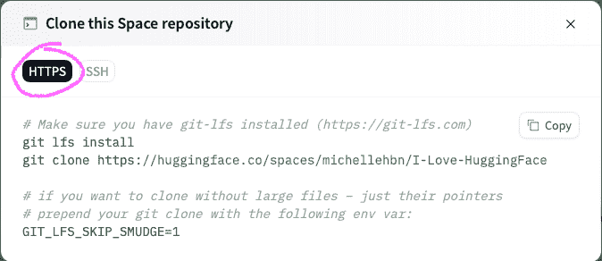

# Spaces 概述

> 原文：[`huggingface.co/docs/hub/spaces-overview`](https://huggingface.co/docs/hub/spaces-overview)

Hugging Face Spaces 让您可以在几分钟内轻松创建和部署基于 ML 的演示。观看以下视频，快速了解 Spaces：

[`www.youtube-nocookie.com/embed/3bSVKNKb_PY`](https://www.youtube-nocookie.com/embed/3bSVKNKb_PY)

在接下来的部分中，您将学习创建空间、配置空间和部署代码到空间的基础知识。

## 创建一个新空间

**创建一个新空间**，访问[Spaces 主页](https://huggingface.co/spaces)并单击**创建新空间**。除了为您的空间选择一个名称、选择一个可选许可证和设置您的空间的可见性外，您还将被提示选择您的空间的**SDK**。Hub 提供四个 SDK 选项：Gradio、Streamlit、Docker 和静态 HTML。如果您选择“Gradio”作为您的 SDK，您将被导航到一个新的仓库，显示以下页面：

 

在内部，Spaces 将您的代码存储在一个 git 仓库中，就像模型和数据集仓库一样。由于这一点，我们用于所有 Hub 上的其他仓库（`git` 和 `git-lfs`）的相同工具也适用于 Spaces。按照开始使用仓库中的相同流程将文件添加到您的空间。每次推送新提交时，空间将自动重建和重新启动。

有关逐步教程以创建您的第一个空间，请参阅下面的指南：

+   创建一个 Gradio 空间

+   创建一个 Streamlit 空间

+   创建一个 Docker 空间

## 硬件资源

每个 Spaces 环境默认限制为 16GB RAM、2 个 CPU 核心和 50GB（非持久性）磁盘空间，您可以免费使用。您可以升级到更好的硬件，包括各种 GPU 加速器和持久性存储，价格[有竞争力](https://huggingface.co/pricing#spaces)。要请求升级，请单击您的空间中的 *设置* 按钮，并选择您喜欢的硬件环境。

| **硬件** | **GPU 内存** | **CPU** | **内存** | **磁盘** | **每小时价格** |
| --- | --- | --- | --- | --- | --- |
| CPU 基础 | - | 2 vCPU | 16 GB | 50 GB | 免费！ |
| CPU 升级 | - | 8 vCPU | 32 GB | 50 GB | $0.03 |
| Nvidia T4 - 小 | 16GB | 4 vCPU | 15 GB | 50 GB | $0.60 |
| Nvidia T4 - 中 | 16GB | 8 vCPU | 30 GB | 100 GB | $0.90 |
| Nvidia A10G - 小 | 24GB | 4 vCPU | 15 GB | 110 GB | $1.05 |
| Nvidia A10G - 大 | 24GB | 12 vCPU | 46 GB | 200 GB | $3.15 |
| 2x Nvidia A10G - 大 | 48GB | 24 vCPU | 92 GB | 1000 GB | $5.70 |
| 4x Nvidia A10G - 大 | 96GB | 48 vCPU | 184 GB | 2000 GB | $10.80 |
| Nvidia A100 - 大 | 40GB | 12 vCPU | 142 GB | 1000 GB | $4.13 |
| **存储层** | **大小** | **持久性** | **月租金** |
| --- | --- | --- | --- |
| 临时（默认） | 50GB | 否 | 免费！ |
| 小 | 临时 + 20GB | 是 | $5 |
| 中等 | 临时 + 150GB | 是 | $25 |
| 大 | 临时 + 1TB | 是 | $100 |

注意：在[我们的定价页面](https://huggingface.co/pricing)上找到更详细和全面的定价信息。

您是否拥有一个很棒的空间，但需要帮助支付硬件升级成本？我们很乐意帮助那些拥有创新空间的人，所以请随时申请社区 GPU 赠款，使用您的空间的 *设置* 选项卡中的链接，看看您的空间是否符合条件！

在 Spaces GPU 升级和 Spaces 存储升级的专门部分中阅读更多。

 

## 管理密钥和环境变量

如果您的应用程序需要环境变量（例如，秘密密钥或令牌），请不要在应用程序内部硬编码它们！相反，请转到您的空间存储库的设置页面，并添加一个新的**变量**或**秘密**。如果需要存储非敏感配置值的变量和用于存储访问令牌、API 密钥或任何敏感值或凭据的秘密，请使用变量。

 

变量是公开可访问和可查看的，并将自动添加到从您的存储库复制的空间中。它们作为环境变量暴露给您的应用程序。

对于静态空间，它们可以通过客户端 JavaScript 在`window.huggingface.variables`中访问。

对于 Docker 空间，请查看 Docker 环境管理。

秘密是私有的，一旦设置就无法检索其值。它们不会被添加到从您的存储库复制的空间中。如果您使用 Streamlit，秘密将通过[Streamlit 秘密管理](https://blog.streamlit.io/secrets-in-sharing-apps/)暴露给您的应用程序，在其他情况下作为环境变量。对于 Docker 空间，请查看 Docker 环境管理。当我们的`Spaces Secrets Scanner`发现硬编码的秘密时，用户会收到警告。

## 复制空间

如果您想使用另一个演示作为初始模板构建新的演示，复制空间可能会很有用。如果您想要一个个人升级的空间以进行快速推理，复制的空间也可能会很有用。

如果您想复制一个空间，可以单击空间右上角的三个点，然后单击**复制此空间**。这样做后，您将能够更改以下属性：

+   所有者：复制的空间可以在您的帐户下或您具有写入访问权限的任何组织下。

+   空间名称

+   可见性：空间默认为私有。了解更多关于私有存储库的信息这里。

+   硬件：您可以选择空间运行的硬件。了解更多关于硬件升级的信息这里。

+   存储：如果原始存储库使用持久存储，您将被提示选择存储层级。了解更多关于持久存储的信息这里。

+   秘密和变量：如果原始存储库设置了一些秘密和变量，您可以在复制存储库时设置它们。

一些空间可能有环境变量需要设置。在这种情况下，复制工作流将自动填充源空间的公共变量，并提醒您设置秘密。复制的空间将默认使用免费的 CPU 硬件，但如果需要，您可以随后升级。

## 网络

如果您的空间需要进行任何网络请求，您可以通过标准的 HTTP 和 HTTPS 端口（80 和 443）以及端口 8080 进行请求。任何发送到其他端口的请求将被阻止。

## 生命周期管理

在免费硬件上，如果未使用，您的空间将“休眠”并在一段时间后停止执行。如果希望您的空间无限期运行，请考虑升级到付费硬件。您还可以从**设置**选项卡手动暂停您的空间。暂停的空间将停止执行，直到由所有者手动重新启动。暂停时间不计费。

## 辅助环境变量

在某些情况下，您可能对以编程方式访问空间作者或存储库名称感兴趣。当您希望用户复制您的空间时，此功能特别有用。为了帮助实现这一点，Spaces 在运行时暴露不同的环境变量。给定一个空间[`osanseviero/i-like-flan`](https://huggingface.co/spaces/osanseviero/i-like-flan)：

+   `CPU_CORES`: 4

+   `MEMORY`: 15Gi

+   `SPACE_AUTHOR_NAME`: osanseviero

+   `SPACE_REPO_NAME`: i-like-flan

+   `SPACE_TITLE`：我喜欢奶油布丁（在 README 文件中指定）

+   `SPACE_ID`：`osanseviero/i-like-flan`

+   `SPACE_HOST`：`osanseviero-i-like-flan.hf.space`

如果为您的 Space 启用了 OAuth，还将提供以下变量：

+   `OAUTH_CLIENT_ID`：您的 OAuth 应用程序的客户端 ID（公共）

+   `OAUTH_CLIENT_SECRET`：您的 OAuth 应用程序的客户端密钥

+   `OAUTH_SCOPES`：您的 OAuth 应用程序可访问的范围。目前，这始终是`"openid profile"`。

+   `OPENID_PROVIDER_URL`：OpenID 提供者的 URL。 OpenID 元数据将在[`{OPENID_PROVIDER_URL}/.well-known/openid-configuration`](https://huggingface.co/.well-known/openid-configuration)处提供。

## 克隆存储库

您可以轻松地在本地克隆您的 Space 存储库。首先点击 Space 页面右上角的下拉菜单开始：

 

选择“克隆存储库”，然后您可以按照说明使用 HTTPS 或 SSH 将 Space 存储库克隆到本地计算机。

  

## 在 Hub 上链接模型和数据集

您可以通过在 Space 的 README 元数据中添加它们的标识符来展示 Space 链接到的所有模型和数据集。为此，您可以在`models`和`datasets`键下定义它们。除了在 README 文件中列出工件外，您还可以将它们记录在任何`.py`、`.ini`或`.html`文件中。我们会自动解析它！

这里有一个链接两个模型的示例：

```py
title: My lovely space
emoji: 🤗
colorFrom: blue
colorTo: green
sdk: docker
pinned: false
models:
- reach-vb/musicgen-large-fp16-endpoint
- reach-vb/wav2vec2-large-xls-r-1B-common_voice7-lt-ft
```
