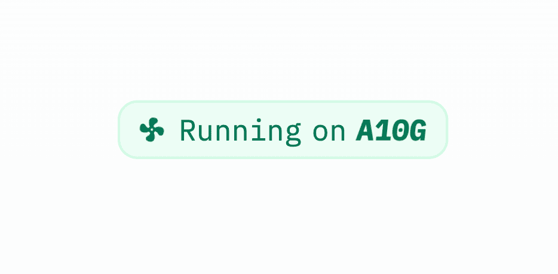
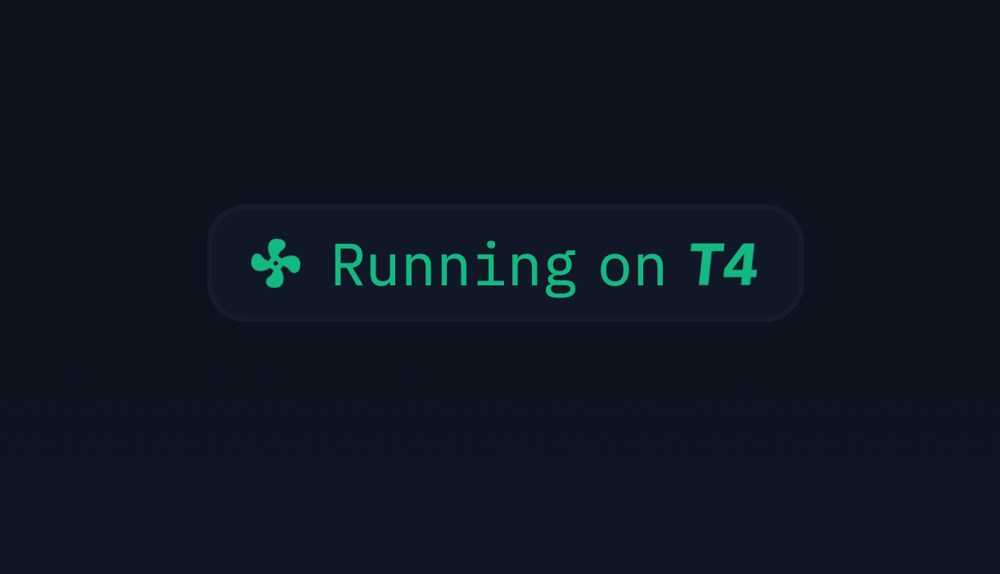
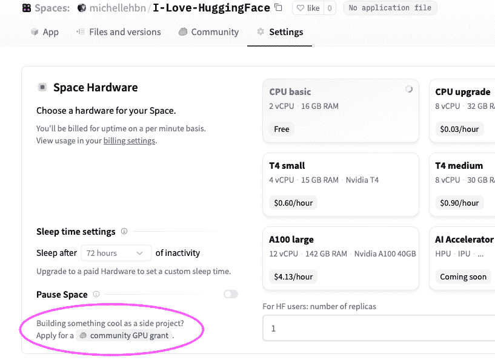
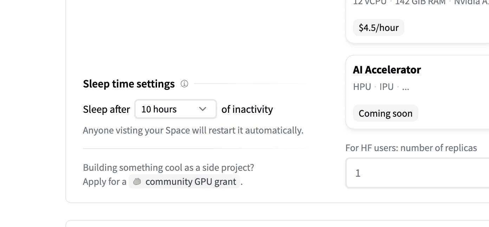
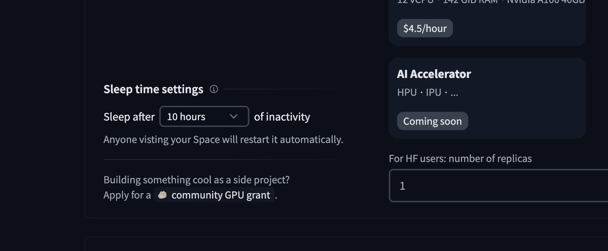
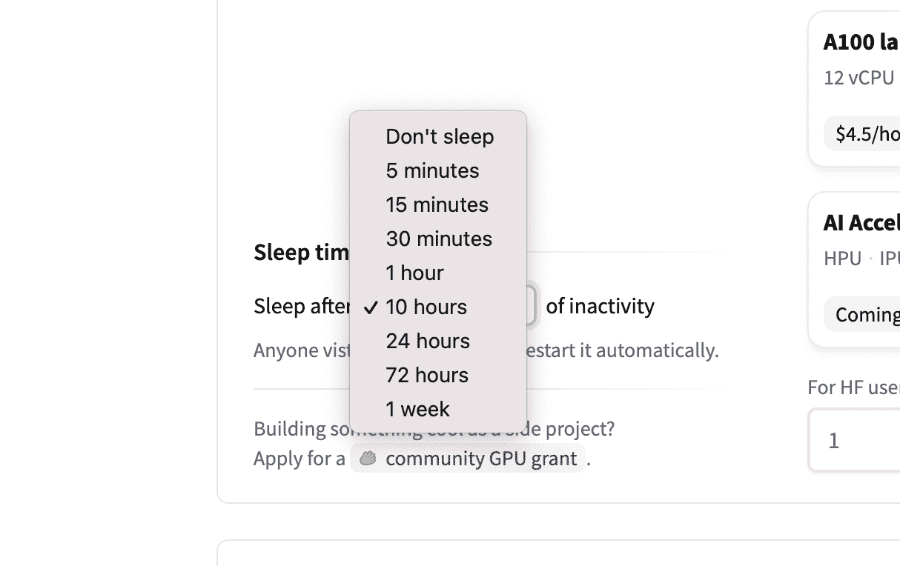
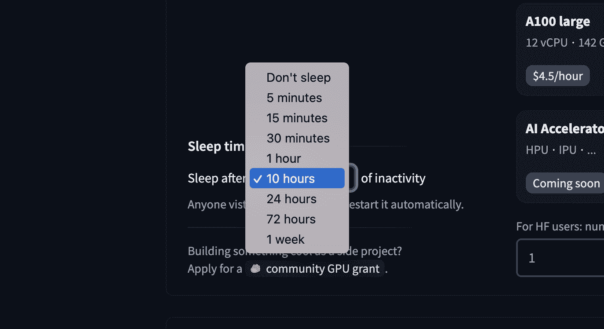

# 使用 GPU Spaces

> 原始文本：[`huggingface.co/docs/hub/spaces-gpus`](https://huggingface.co/docs/hub/spaces-gpus)

您可以通过在 Space 顶部导航栏中使用*设置*按钮来升级您的 Space 以使用 GPU 加速器。如果您正在为一个副业项目构建一个很酷的演示，甚至可以请求免费升级！

 长期来看，我们还希望公开非 GPU 硬件，如 HPU、IPU 或 TPU。如果您有特定的 AI 硬件希望运行，请告诉我们（网站在 huggingface.co）。

一旦您的 Space 在 GPU 上运行，您可以直接从此徽章上看到它正在运行的硬件：

 

## 硬件规格

在下表中，您可以看到不同升级选项的规格。

| **硬件** | **GPU 内存** | **CPU** | **内存** | **磁盘** | **每小时价格** |
| --- | --- | --- | --- | --- | --- |
| CPU 基础 | - | 2 vCPU | 16 GB | 50 GB | 免费！ |
| CPU 升级 | - | 8 vCPU | 32 GB | 50 GB | $0.03 |
| Nvidia T4 - 小 | 16GB | 4 vCPU | 15 GB | 50 GB | $0.60 |
| Nvidia T4 - 中 | 16GB | 8 vCPU | 30 GB | 100 GB | $0.90 |
| Nvidia A10G - 小 | 24GB | 4 vCPU | 15 GB | 110 GB | $1.05 |
| Nvidia A10G - 大 | 24GB | 12 vCPU | 46 GB | 200 GB | $3.15 |
| Nvidia A100 - 大 | 40GB | 12 vCPU | 142 GB | 1000 GB | $4.13 |

## 通过编程配置硬件

您可以使用`huggingface_hub`来以编程方式配置您的 Space 硬件。这允许在需要动态分配 GPU 的各种用例中使用。查看[此指南](https://huggingface.co/docs/huggingface_hub/main/en/guides/manage_spaces)以获取更多详细信息。

## 框架特定要求

大多数 Spaces 在 GPU 升级后应该可以直接运行，但有时您需要安装您使用的机器学习框架的 CUDA 版本。请按照本指南确保您的 Space 充分利用改进的硬件。

### PyTorch

您需要安装与内置 CUDA 驱动程序兼容的 PyTorch 版本。将以下两行添加到您的`requirements.txt`文件中应该可以工作：

```py
--extra-index-url https://download.pytorch.org/whl/cu113
torch
```

您可以通过在您的`app.py`中运行以下代码并在您的 Space 日志中检查输出来验证安装是否成功：

```py
import torch
print(f"Is CUDA available: {torch.cuda.is_available()}")
# True
print(f"CUDA device: {torch.cuda.get_device_name(torch.cuda.current_device())}")
# Tesla T4
```

许多框架在有 GPU 时会自动使用 GPU。这适用于🤗`transformers`、`fastai`等库中的 Pipelines。在其他情况下，或者如果您直接使用 PyTorch，您可能需要将您的模型和数据移动到 GPU 上，以确保计算在加速器上而不是在 CPU 上进行。您可以使用 PyTorch 的`.to()`语法，例如：

```py
model = load_pytorch_model()
model = model.to("cuda")
```

### JAX

如果您使用 JAX，您需要指定包含 CUDA 兼容包的 URL。请将以下行添加到您的`requirements.txt`文件中：

```py
-f https://storage.googleapis.com/jax-releases/jax_cuda_releases.html
jax[cuda11_pip]
jaxlib
```

之后，您可以通过打印以下代码的输出并在您的 Space 日志中检查来验证安装是否成功。

```py
import jax

print(f"JAX devices: {jax.devices()}")
# JAX devices: [StreamExecutorGpuDevice(id=0, process_index=0)]
print(f"JAX device type: {jax.devices()[0].device_kind}")
# JAX device type: Tesla T4
```

### Tensorflow

默认的`tensorflow`安装应该能够识别 CUDA 设备。只需将`tensorflow`添加到您的`requirements.txt`文件中，并在您的`app.py`中使用以下代码来在您的 Space 日志中进行验证。

```py
import tensorflow as tf
print(tf.config.list_physical_devices('GPU'))
# [PhysicalDevice(name='/physical_device:GPU:0', device_type='GPU')]
```

## 计费

Spaces 上的计费基于硬件使用情况，并按分钟计算：您将为 Space 在请求的硬件上运行的每一分钟收费，无论 Space 是否被使用。

在 Space 的生命周期中，只有当 Space 实际处于`运行`状态时才会计费。这意味着在构建或启动过程中没有费用。

如果正在运行的 Space 开始失败，它将被自动暂停，计费也将停止。

运行在免费硬件上的空间如果长时间不使用（例如两天），将自动暂停。升级后的空间默认情况下会永久运行，即使没有使用。您可以通过在空间设置中设置自定义“睡眠时间”来更改此行为。要中断空间的计费，您可以将硬件更改为 CPU 基础，或者暂停它。

关于计费的额外信息可以在专门的全局部分中找到。

### 社区 GPU 赠款

您是否拥有一个很棒的空间，但需要帮助支付 GPU 硬件升级的费用？我们很乐意帮助那些拥有创新空间的人，所以请随时申请社区 GPU 赠款，看看您的空间是否符合条件！此申请可以在您的空间硬件存储库设置中找到，位于左下角的“睡眠时间设置”下方：



## 设置自定义睡眠时间

如果您的空间运行在默认的`cpu-basic`硬件上，并且在超过一定时间（目前为 48 小时）内处于非活动状态，它将进入睡眠状态。任何访问您的空间的人都将自动重新启动它。

如果您希望您的空间永远不会停用，或者想设置自定义睡眠时间，您需要升级到付费硬件。

默认情况下，升级后的空间永远不会进入睡眠状态。但是，您可以使用此设置使您的升级后的空间在未使用时变为空闲（`停止`阶段）😴。在空间处于休眠状态时，您不会被收取升级硬件的费用。一旦空间收到新访客，空间将“唤醒”或重新启动。

然后在您的空间硬件设置中将提供以下界面：

 

以下选项可用：

 

## 暂停一个空间

您可以从存储库设置中`暂停`一个空间。 “暂停”空间意味着该空间被暂停，直到手动重新启动，只有暂停空间的所有者才能重新启动。暂停时间不计费。
