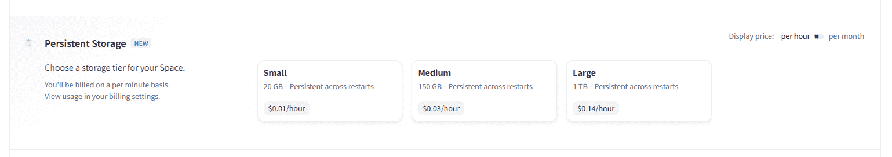
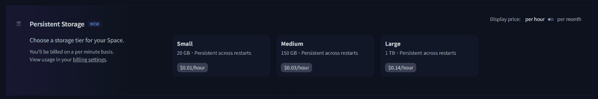

# 空间上的磁盘使用

> 原文链接：[`huggingface.co/docs/hub/spaces-storage`](https://huggingface.co/docs/hub/spaces-storage)

每个空间都配备了一小部分磁盘存储空间。这个磁盘空间是临时的，这意味着如果您的空间重新启动或停止，其内容将丢失。如果您需要将数据保留比空间本身寿命更长的时间，您可以：

+   订阅持久性存储升级

+   将数据集用作数据存储

## 持久性存储

您可以通过**设置**选项卡将您的空间升级以访问持久性磁盘空间。

 

您可以选择您喜欢的存储级别，以访问在您的空间重新启动时保持不变的磁盘空间。

持久性存储就像挂载在`/data`上的传统磁盘存储。

这意味着您可以像使用传统硬盘或固态硬盘一样从您的空间中读取和写入此存储。

持久性磁盘空间可以随意升级到更大的级别，但无法降级到更小的级别。如果您希望使用较小的持久性存储级别，您必须首先删除当前（较大）的存储。

如果您正在使用 Hugging Face 开源库，可以通过将环境变量`HF_HOME`设置为`/data/.huggingface`来使您的空间重新启动更快。像`transformers`、`diffusers`、`datasets`等库使用该环境变量来缓存从 Hugging Face Hub 下载的任何资产。将此变量设置为持久性存储路径将确保在重新启动空间时不需要重新下载缓存资源。

警告：删除存储中的所有数据将会丢失。

### 持久性存储规格

以下是每种不同升级选项的规格：

| **级别** | **磁盘空间** | **持久性** | **月费用** |
| --- | --- | --- | --- |
| 免费级别 | 50GB | 否（临时） | 免费！ |
| 小型 | 20GB | 是 | $5 |
| 中型 | 150 GB | 是 | $25 |
| 大型 | 1TB | 是 | $100 |

### 计费

空间的计费基于硬件使用情况，并按分钟计算：您将根据空间在请求的硬件上运行的每一分钟收费，无论空间是否被使用。

持久性存储升级将在删除之前计费，即使空间未运行，也不管空间状态或运行状态如何。

有关计费的其他信息可以在专用 Hub 全局部分中找到。

## 数据集存储

如果您需要持久化比您的空间寿命更长的数据，您可以使用数据集仓库。

您可以在[这里](https://huggingface.co/spaces/Wauplin/space_to_dataset_saver)找到一个持久性的示例，该示例使用[`huggingface_hub`库](https://huggingface.co/docs/huggingface_hub/index)来以编程方式将文件上传到数据集存储库。这个空间示例以及[这个指南](https://huggingface.co/docs/huggingface_hub/main/en/guides/upload#scheduled-uploads)将帮助您确定哪种解决方案最适合您的数据类型。

访问[`datasets`库](https://huggingface.co/docs/datasets/index)文档和[`huggingface_hub`客户端库](https://huggingface.co/docs/huggingface_hub/index)文档，了解如何通过编程方式与数据集仓库交互的更多信息。
