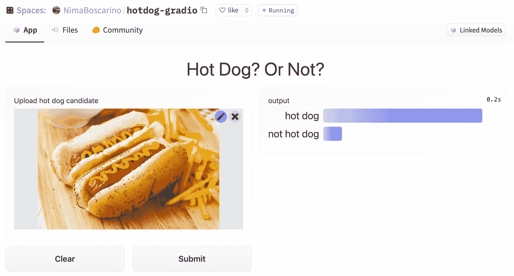
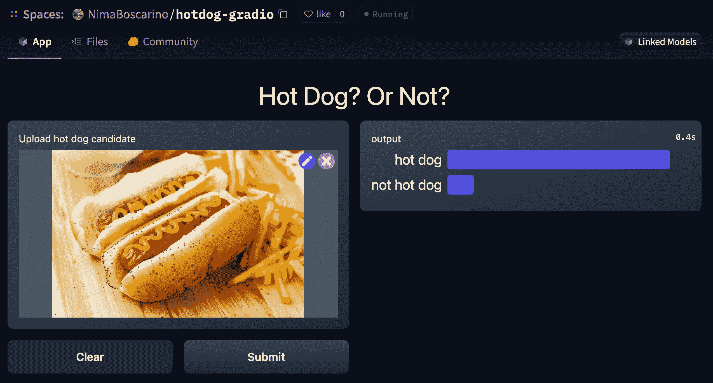

# Gradio 空间

> 原文链接：[`huggingface.co/docs/hub/spaces-sdks-gradio`](https://huggingface.co/docs/hub/spaces-sdks-gradio)

**Gradio**提供了一个简单直观的界面，用于从输入列表中运行模型，并以图像、音频、3D 对象等格式显示输出。Gradio 现在甚至还有一个[Plot 输出组件](https://gradio.app/docs/#o_plot)，用于使用 Matplotlib、Bokeh 和 Plotly 创建数据可视化！有关更多详细信息，请查看 Gradio 团队的[入门指南](https://gradio.app/getting_started/)。

在[创建新空间](https://huggingface.co/new-space)时选择**Gradio**作为 SDK 将通过在您的`README.md`文件的 YAML 块中将`sdk`属性设置为`gradio`来初始化您的空间的最新版本。如果您想要更改 Gradio 版本，可以编辑`sdk_version`属性。

访问[Gradio 文档](https://gradio.app/docs/)以了解其所有功能，并查看[Gradio 指南](https://gradio.app/guides/)，以获取一些有用的教程，帮助您入门！

## 您的第一个 Gradio 空间：热狗分类器

在接下来的几节中，您将学习创建空间、配置空间以及将代码部署到空间的基础知识。我们将创建一个使用 Gradio 的**热狗分类器**空间，用于演示[julien-c/hotdog-not-hotdog](https://huggingface.co/julien-c/hotdog-not-hotdog)模型，该模型可以检测给定图片中是否包含热狗🌭

您可以在[NimaBoscarino/hotdog-gradio](https://huggingface.co/spaces/NimaBoscarino/hotdog-gradio)找到此主机化版本的完整版本。

## 创建一个新的 Gradio 空间

我们将从[创建一个全新的空间](https://huggingface.co/new-space)开始，并选择**Gradio**作为我们的 SDK。Hugging Face 空间是 Git 存储库，这意味着您可以通过推送提交来逐步（和协作地）处理您的空间。在继续之前，请查看开始使用存储库指南，了解如何在继续之前创建和编辑文件。

## 添加依赖项

对于**热狗分类器**，我们将使用一个[🤗 Transformers pipeline](https://huggingface.co/docs/transformers/pipeline_tutorial)来使用模型，因此我们需要首先安装一些依赖项。这可以通过在我们的存储库中创建一个**requirements.txt**文件，并将以下依赖项添加到其中来完成：

```py
transformers
torch
```

空间运行时将处理安装依赖项！

## 创建 Gradio 界面

要创建 Gradio 应用程序，请在存储库中创建一个名为**app.py**的新文件，并添加以下代码：

```py
import gradio as gr
from transformers import pipeline

pipeline = pipeline(task="image-classification", model="julien-c/hotdog-not-hotdog")

def predict(input_img):
    predictions = pipeline(input_img)
    return input_img, {p["label"]: p["score"] for p in predictions} 

gradio_app = gr.Interface(
    predict,
    inputs=gr.Image(label="Select hot dog candidate", sources=['upload', 'webcam'], type="pil"),
    outputs=[gr.Image(label="Processed Image"), gr.Label(label="Result", num_top_classes=2)],
    title="Hot Dog? Or Not?",
)

if __name__ == "__main__":
    gradio_app.launch()
```

这个 Python 脚本使用了一个[🤗 Transformers pipeline](https://huggingface.co/docs/transformers/pipeline_tutorial)来加载[julien-c/hotdog-not-hotdog](https://huggingface.co/julien-c/hotdog-not-hotdog)模型，该模型被 Gradio 界面使用。Gradio 应用程序将期望您上传一张图片，然后将其分类为*热狗*或*非热狗*。一旦您将代码保存到**app.py**文件中，请访问**App**选项卡，查看您的应用程序运行情况！

 

## 在其他网页上嵌入 Gradio 空间

您可以使用 Web 组件或 HTML `<iframe>`标签在其他网页上嵌入 Gradio 空间。查看我们的文档或[Gradio 文档](https://gradio.app/sharing_your_app/#embedding-hosted-spaces)获取更多详细信息。
