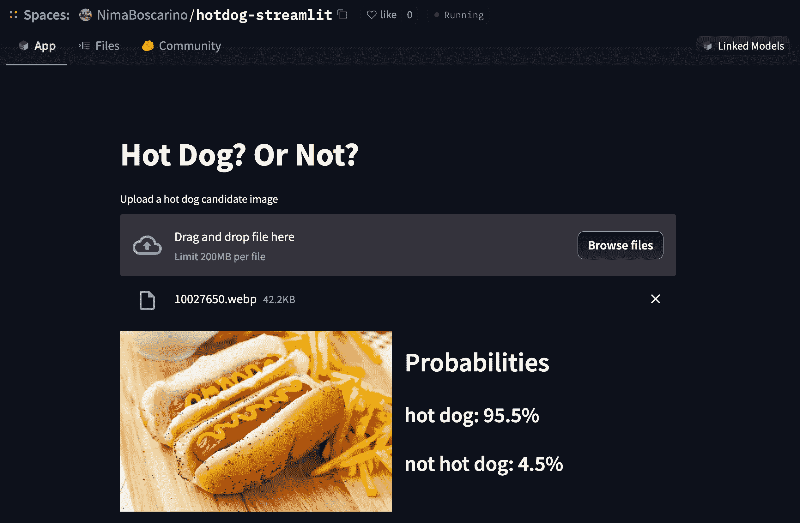

# Streamlit Spaces

> 原始文本：[`huggingface.co/docs/hub/spaces-sdks-streamlit`](https://huggingface.co/docs/hub/spaces-sdks-streamlit)

Streamlit 为用户提供了使用 Python 以*反应式*方式构建完整功能的 Web 应用程序的自由。每次应用程序状态发生变化时，都会重新运行您的代码。Streamlit 还非常适合数据可视化，并支持多个图表库，如 Bokeh、Plotly 和 Altair。阅读这篇关于在 Spaces 中构建和托管 Streamlit 应用程序的[博客文章](https://huggingface.co/blog/streamlit-spaces)。

在[创建新 Space](https://huggingface.co/new-space)时选择**Streamlit**作为 SDK，将通过在`README.md`文件的 YAML 块中将`sdk`属性设置为`streamlit`来初始化您的 Space 的最新版本。如果您想更改 Streamlit 版本，可以编辑`sdk_version`属性。

要在 Space 中使用 Streamlit，请在通过[**New Space**表单](https://huggingface.co/new-space)创建 Space 时选择**Streamlit**作为 SDK。这将创建一个包含以下属性的 YAML 配置块的`README.md`的存储库：

```py
sdk: streamlit
sdk_version: 1.25.0 # The latest supported version
```

您可以编辑`sdk_version`，但请注意，当您使用不受支持的 Streamlit 版本时可能会出现问题。并非所有 Streamlit 版本都受支持，请参考参考部分查看可用版本。

有关 Streamlit 的详细信息，请参阅[Streamlit 文档](https://docs.streamlit.io/)。

只允许使用端口 8501 进行 Streamlit Spaces（默认端口）。因此，如果为您的 Space 提供了`config.toml`文件，请确保未覆盖默认端口。

## 您的第一个 Streamlit Space：Hot Dog Classifier

在接下来的部分中，您将学习创建 Space、配置 Space 和将代码部署到 Space 的基础知识。我们将创建一个使用 Streamlit 的**Hot Dog Classifier** Space，用于演示[julien-c/hotdog-not-hotdog](https://huggingface.co/julien-c/hotdog-not-hotdog)模型，该模型可以检测给定图片是否包含热狗🌭

您可以在[NimaBoscarino/hotdog-streamlit](https://huggingface.co/spaces/NimaBoscarino/hotdog-streamlit)找到此主机化版本。

## 创建一个新的 Streamlit Space

我们将从[创建全新 Space](https://huggingface.co/new-space)并选择**Streamlit**作为我们的 SDK 开始。 Hugging Face Spaces 是 Git 存储库，这意味着您可以通过推送提交逐步（和协作地）处理 Space。在继续之前，请查看开始使用存储库指南，了解如何在继续之前创建和编辑文件。

## 添加依赖项

对于**Hot Dog Classifier**，我们将使用[🤗 Transformers pipeline](https://huggingface.co/docs/transformers/pipeline_tutorial)来使用模型，因此我们需要首先安装一些依赖项。这可以通过在我们的存储库中创建一个**requirements.txt**文件，并将以下依赖项添加到其中来完成：

```py
transformers
torch
```

Spaces 运行时将处理安装依赖项！

## 创建 Streamlit 应用程序

要创建 Streamlit 应用程序，请在存储库中创建一个名为**app.py**的新文件，并添加以下代码：

```py
import streamlit as st
from transformers import pipeline
from PIL import Image

pipeline = pipeline(task="image-classification", model="julien-c/hotdog-not-hotdog")

st.title("Hot Dog? Or Not?")

file_name = st.file_uploader("Upload a hot dog candidate image")

if file_name is not None:
    col1, col2 = st.columns(2)

    image = Image.open(file_name)
    col1.image(image, use_column_width=True)
    predictions = pipeline(image)

    col2.header("Probabilities")
    for p in predictions:
        col2.subheader(f"{ p['label'] }: { round(p['score'] * 100, 1)}%")
```

此 Python 脚本使用[🤗 Transformers pipeline](https://huggingface.co/docs/transformers/pipeline_tutorial)加载[julien-c/hotdog-not-hotdog](https://huggingface.co/julien-c/hotdog-not-hotdog)模型，该模型由 Streamlit 界面使用。Streamlit 应用程序将要求您上传一张图片，然后将其分类为*热狗*或*非热狗*。保存代码到**app.py**文件后，访问**App**选项卡以查看您的应用程序运行情况！

 

## 在其他网页上嵌入 Streamlit Spaces

您可以使用 HTML `<iframe>` 标签将 Streamlit Space 嵌入到其他网页的内联框架中。只需包含您的 Space 的 URL，以 `.hf.space` 结尾。要找到您的 Space 的 URL，您可以使用 Spaces 选项中的“嵌入此 Space”按钮。

例如，上面的演示可以使用以下标签嵌入到这些文档中：

```py
<iframe
  src="https://NimaBoscarino-hotdog-streamlit.hf.space?embed=true"
  title="My awesome Streamlit Space"
></iframe>
```

[`NimaBoscarino-hotdog-streamlit.hf.space?embed=true`](https://NimaBoscarino-hotdog-streamlit.hf.space?embed=true)

请注意，我们已将 `?embed=true` 添加到 URL 中，这将激活 Streamlit 应用程序的嵌入模式，删除一些间隔和页脚以实现精简嵌入。

## 使用自动调整大小的 IFrames 嵌入 Streamlit Spaces

自从 [1.17.0](https://docs.streamlit.io/library/changelog#version-1170) 版本以来，Streamlit 支持自动调整 iframe 大小，以便自动调整父 iframe 的大小以适应嵌入的 Streamlit 应用程序的内容量。

它依赖于 [`iFrame Resizer`](https://github.com/davidjbradshaw/iframe-resizer) 库，您需要添加几行代码，就像以下示例中所示

+   `id` 设置为 `<iframe />`，用于指定自动调整大小的目标。

+   `iFrame Resizer` 通过 `script` 标签加载。

+   调用 `iFrameResize()` 函数时，使用目标 `iframe` 元素的 ID，以便其大小自动更改。

我们可以将选项传递给 `iFrameResize()` 的第一个参数。有关详细信息，请参阅[文档](https://github.com/davidjbradshaw/iframe-resizer/blob/master/docs/parent_page/options.md)。

```py
<iframe
	id="your-iframe-id"
	src="https://<space-subdomain>.hf.space"
	frameborder="0"
	width="850"
	height="450"
></iframe>
<script src="https://cdn.jsdelivr.net/npm/iframe-resizer@4.3.4/js/iframeResizer.min.js"></script>
<script> iFrameResize({}, "#your-iframe-id") </script>
```

此外，您可以查看我们的文档。
