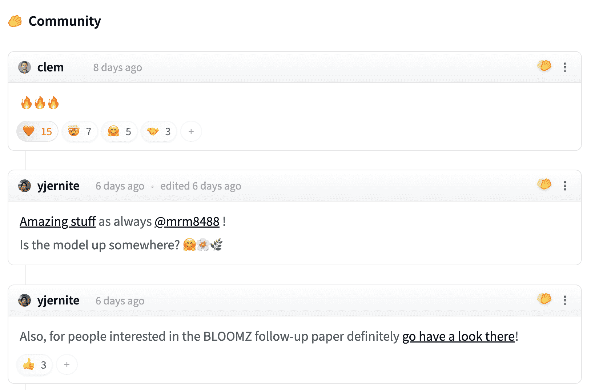
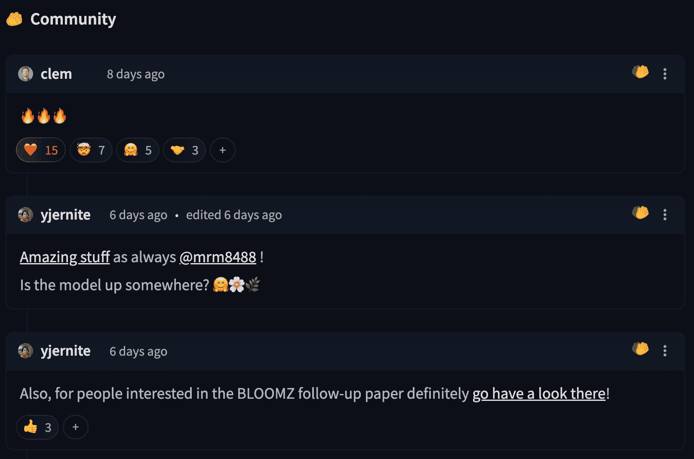
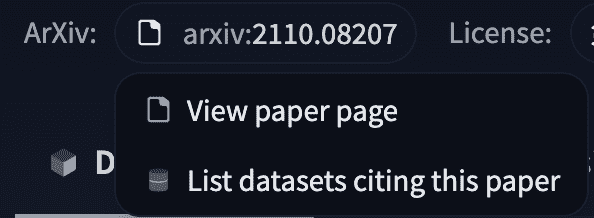
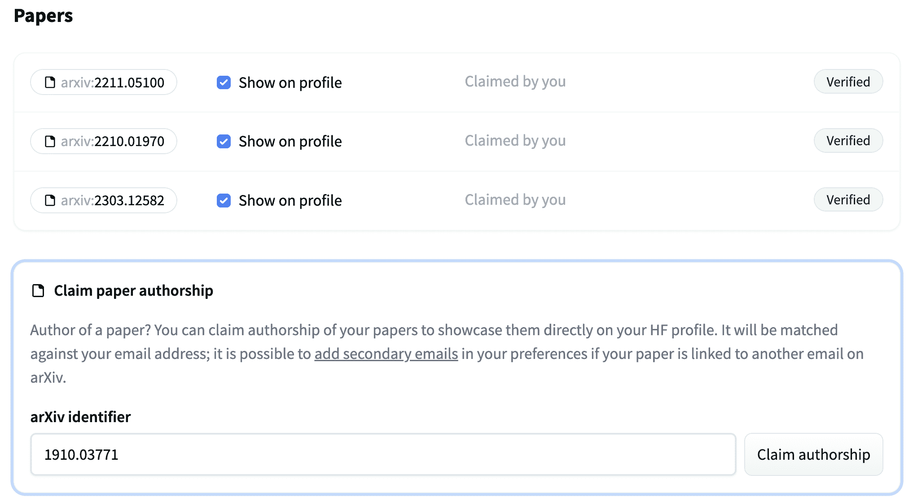
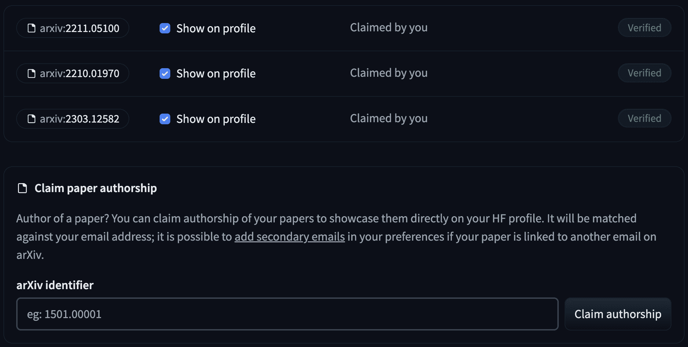

# 论文页面

> 原文链接：[`huggingface.co/docs/hub/paper-pages`](https://huggingface.co/docs/hub/paper-pages)

论文页面允许人们查找与论文相关的模型、数据集和应用程序/演示（空间）等工件。论文页面还使社区能够讨论论文。

 

## 将论文链接到模型、数据集或空间

如果存储库卡片（`README.md`）包含指向 arXiv 上的论文的链接，Hugging Face Hub 将提取 arXiv ID 并将其包含在存储库的标签中。单击 arxiv 标签将让您：

+   访问论文页面。

+   在 Hub 上筛选引用相同论文的其他模型或数据集。

 

## 声明论文的作者身份

Hub 将尝试根据用户的电子邮件自动将论文与用户匹配。

 

如果您的论文未链接到您的帐户，您可以在相应的论文页面中点击您的姓名，然后点击“声明作者身份”。这将自动重定向到您的论文设置，您可以在那里确认请求。管理员团队将很快验证您的请求。一旦确认，论文页面将显示为已验证。

 

## 常见问题

### 我可以控制哪些论文页面显示在我的个人资料中吗？

可以！您可以访问您的论文页面[设置](https://huggingface.co/settings/papers)，在那里您将看到一个经过验证的论文列表。在那里，您可以单击“在个人资料中显示”复选框，以在您的个人资料中隐藏/显示它。

### 您支持 ACL 文集吗？

我们从 Arxiv 开始，因为 95%的 Hugging Face 用户在其存储库中自然链接的论文 URL 都来自 Arxiv。我们将检查这一进展，并在未来可能扩展到其他论文主机。

### 即使我没有模型/数据集/空间，我也可以拥有一篇论文页面吗？

是的。您可以转到[主要论文页面](https://huggingface.co/papers)，点击搜索并输入论文名称或完整的 Arxiv id。如果论文不存在，您将获得索引选项。您也可以访问页面`hf.co/papers/xxxx.yyyyy`，将其替换为您希望索引的论文的 arxiv id。
