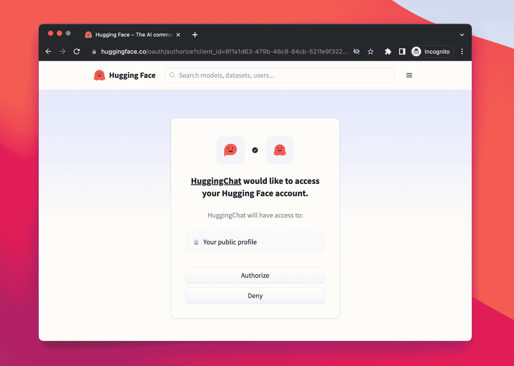
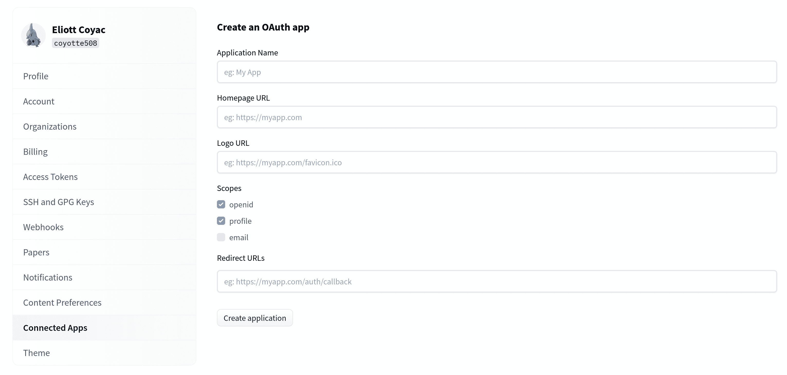

# 使用 Hugging Face 登录

> 原文：[`huggingface.co/docs/hub/oauth`](https://huggingface.co/docs/hub/oauth)

您可以使用 HF OAuth / OpenID 连接流程在任何网站或应用程序中创建一个**“使用 HF 登录”**流程。

这将允许用户使用他们的 HF 帐户登录到您的网站或应用程序，方法是点击类似于这个的按钮：

点击此按钮后，您的用户将被呈现一个权限模态框，以授权您的应用程序：

## 创建一个 OAuth 应用程序

您可以在您的[设置](https://huggingface.co/settings/applications/new)中创建您的应用程序：

### 如果您在 Spaces 上托管

如果您在 Spaces 上托管您的应用程序，那么流程将更容易实现（并直接内置到 Gradio 中）；请查看我们的[Spaces OAuth 指南](https://huggingface.co/docs/hub/spaces-oauth)。

## 目前支持的范围

目前支持的范围有：

+   `openid`：除了访问令牌外，还获取 ID 令牌。

+   `profile`：获取用户的个人资料信息（用户名、头像等）。

+   `email`：获取用户的电子邮件地址。

+   `read-repos`：获取用户个人仓库的读取权限。

+   `write-repos`：获取用户个人仓库的写入权限。单独不授予读取权限，您还需要包括`read-repos`。

+   `manage-repos`：获取对仓库设置的访问权限。还授予仓库创建和删除权限。

+   `inference-api`：获取对[推理 API](https://huggingface.co/docs/api-inference/index)的访问权限，您将能够代表用户发出推理请求。

所有其他信息都可以在[OpenID 元数据](https://huggingface.co/.well-known/openid-configuration)中找到。

如果您需要任何额外的范围，请联系我们。

## 品牌

您可以自由地为按钮使用自己的设计。以下是一些有用的提供的 SVG 图像。

查看[我们的徽章](https://huggingface.co/datasets/huggingface/badges#sign-in-with-hugging-face)，其中包含将它们集成到 markdown 或 HTML 中的解释。

 

 

 

 
