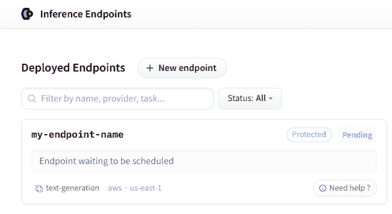

# 推理端点

> 原始文本：[`huggingface.co/docs/huggingface_hub/guides/inference_endpoints`](https://huggingface.co/docs/huggingface_hub/guides/inference_endpoints)

推理端点提供了一个安全的生产解决方案，可以轻松部署任何`transformers`、`sentence-transformers`和`diffusers`模型，这些模型在由 Hugging Face 管理的专用和自动缩放的基础设施上构建。推理端点是从[Hub](https://huggingface.co/models)中的模型构建的。在本指南中，我们将学习如何使用`huggingface_hub`以编程方式管理推理端点。有关推理端点产品本身的更多信息，请查看其[官方文档](https://huggingface.co/docs/inference-endpoints/index)。

本指南假定`huggingface_hub`已正确安装并且您的计算机已登录。如果还没有，请查看[快速入门指南](https://huggingface.co/docs/huggingface_hub/quick-start#quickstart)。支持推理端点 API 的最低版本是`v0.19.0`。

## 创建推理端点

第一步是使用 create_inference_endpoint()创建一个推理端点：

```py
>>> from huggingface_hub import create_inference_endpoint

>>> endpoint = create_inference_endpoint(
...     "my-endpoint-name",
...     repository="gpt2",
...     framework="pytorch",
...     task="text-generation",
...     accelerator="cpu",
...     vendor="aws",
...     region="us-east-1",
...     type="protected",
...     instance_size="medium",
...     instance_type="c6i"
... )
```

在这个例子中，我们创建了一个名为`"my-endpoint-name"`的`protected`推理端点，用于为`text-generation`提供[gpt2](https://huggingface.co/gpt2)。`protected`推理端点意味着需要您的令牌才能访问 API。我们还需要提供额外的信息来配置硬件要求，如供应商、地区、加速器、实例类型和大小。您可以在这里查看可用资源的列表[here](https://api.endpoints.huggingface.cloud/#/v2%3A%3Aprovider/list_vendors)。或者，您可以使用[Web 界面](https://ui.endpoints.huggingface.co/new)方便地手动创建推理端点。有关高级设置及其用法的详细信息，请参考此[指南](https://huggingface.co/docs/inference-endpoints/guides/advanced)。

create_inference_endpoint()返回的值是一个 InferenceEndpoint 对象：

```py
>>> endpoint
InferenceEndpoint(name='my-endpoint-name', namespace='Wauplin', repository='gpt2', status='pending', url=None)
```

这是一个数据类，保存有关端点的信息。您可以访问重要属性，如`name`、`repository`、`status`、`task`、`created_at`、`updated_at`等。如果需要，您还可以使用`endpoint.raw`访问服务器的原始响应。

创建完推理端点后，您可以在您的[个人仪表板](https://ui.endpoints.huggingface.co/)上找到它。



#### 使用自定义镜像

默认情况下，推理端点是由 Hugging Face 提供的 docker 镜像构建的。但是，可以使用`custom_image`参数指定任何 docker 镜像。一个常见的用例是使用[text-generation-inference](https://github.com/huggingface/text-generation-inference)框架运行 LLMs。可以这样做：

```py
# Start an Inference Endpoint running Zephyr-7b-beta on TGI
>>> from huggingface_hub import create_inference_endpoint
>>> endpoint = create_inference_endpoint(
...     "aws-zephyr-7b-beta-0486",
...     repository="HuggingFaceH4/zephyr-7b-beta",
...     framework="pytorch",
...     task="text-generation",
...     accelerator="gpu",
...     vendor="aws",
...     region="us-east-1",
...     type="protected",
...     instance_size="medium",
...     instance_type="g5.2xlarge",
...     custom_image={
...         "health_route": "/health",
...         "env": {
...             "MAX_BATCH_PREFILL_TOKENS": "2048",
...             "MAX_INPUT_LENGTH": "1024",
...             "MAX_TOTAL_TOKENS": "1512",
...             "MODEL_ID": "/repository"
...         },
...         "url": "ghcr.io/huggingface/text-generation-inference:1.1.0",
...     },
... )
```

作为`custom_image`传递的值是一个包含指向 docker 容器和配置以运行它的 url 的字典。有关更多详细信息，请查看[Swagger 文档](https://api.endpoints.huggingface.cloud/#/v2%3A%3Aendpoint/create_endpoint)。

### 获取或列出现有的推理端点

在某些情况下，您可能需要管理之前创建的推理端点。如果您知道名称，可以使用 get_inference_endpoint()来获取它，该方法返回一个 InferenceEndpoint 对象。或者，您可以使用 list_inference_endpoints()来检索所有推理端点的列表。这两种方法都接受一个可选的`namespace`参数。您可以将`namespace`设置为您所属的任何组织。否则，默认为您的用户名。

```py
>>> from huggingface_hub import get_inference_endpoint, list_inference_endpoints

# Get one
>>> get_inference_endpoint("my-endpoint-name")
InferenceEndpoint(name='my-endpoint-name', namespace='Wauplin', repository='gpt2', status='pending', url=None)

# List all endpoints from an organization
>>> list_inference_endpoints(namespace="huggingface")
[InferenceEndpoint(name='aws-starchat-beta', namespace='huggingface', repository='HuggingFaceH4/starchat-beta', status='paused', url=None), ...]

# List all endpoints from all organizations the user belongs to
>>> list_inference_endpoints(namespace="*")
[InferenceEndpoint(name='aws-starchat-beta', namespace='huggingface', repository='HuggingFaceH4/starchat-beta', status='paused', url=None), ...]
```

## 检查部署状态

在本指南的其余部分中，我们将假设我们有一个名为`endpoint`的 InferenceEndpoint 对象。您可能已经注意到端点具有一个类型为 InferenceEndpointStatus 的`status`属性。当推理端点部署并可访问时，状态应为“运行”，并设置`url`属性：

```py
>>> endpoint
InferenceEndpoint(name='my-endpoint-name', namespace='Wauplin', repository='gpt2', status='running', url='https://jpj7k2q4j805b727.us-east-1.aws.endpoints.huggingface.cloud')
```

在达到“运行”状态之前，推理端点通常会经历“初始化”或“挂起”阶段。您可以通过运行 fetch()来获取端点的新状态。与 InferenceEndpoint 中的其他向服务器发出请求的方法一样，`endpoint`的内部属性会就地发生变化：

```py
>>> endpoint.fetch()
InferenceEndpoint(name='my-endpoint-name', namespace='Wauplin', repository='gpt2', status='pending', url=None)
```

在等待其运行时，您可以直接调用 wait()而不是获取推理端点状态。此辅助程序接受`timeout`和`fetch_every`参数（以秒为单位），并将阻塞线程直到推理端点部署。默认值分别为`None`（无超时）和`5`秒。

```py
# Pending endpoint
>>> endpoint
InferenceEndpoint(name='my-endpoint-name', namespace='Wauplin', repository='gpt2', status='pending', url=None)

# Wait 10s => raises a InferenceEndpointTimeoutError
>>> endpoint.wait(timeout=10)
    raise InferenceEndpointTimeoutError("Timeout while waiting for Inference Endpoint to be deployed.")
huggingface_hub._inference_endpoints.InferenceEndpointTimeoutError: Timeout while waiting for Inference Endpoint to be deployed.

# Wait more
>>> endpoint.wait()
InferenceEndpoint(name='my-endpoint-name', namespace='Wauplin', repository='gpt2', status='running', url='https://jpj7k2q4j805b727.us-east-1.aws.endpoints.huggingface.cloud')
```

如果设置了`timeout`并且推理端点加载时间过长，则会引发`InferenceEndpointTimeoutError`超时错误。

## 运行推理

一旦您的推理端点正常运行，您最终可以在其上运行推理！

InferenceEndpoint 有两个属性`client`和`async_client`，分别返回一个 InferenceClient 和一个 AsyncInferenceClient 对象。

```py
# Run text_generation task:
>>> endpoint.client.text_generation("I am")
' not a fan of the idea of a "big-budget" movie. I think it\'s a'

# Or in an asyncio context:
>>> await endpoint.async_client.text_generation("I am")
```

如果推理端点未运行，则会引发 InferenceEndpointError 异常：

```py
>>> endpoint.client
huggingface_hub._inference_endpoints.InferenceEndpointError: Cannot create a client for this Inference Endpoint as it is not yet deployed. Please wait for the Inference Endpoint to be deployed using `endpoint.wait()` and try again.
```

有关如何使用 InferenceClient 的更多详细信息，请查看推理指南。

## 管理生命周期

现在我们已经看到如何创建推理端点并在其上运行推理，让我们看看如何管理其生命周期。

在本节中，我们将看到像 pause()、resume()、scale_to_zero()、update()和 delete()等方法。所有这些方法都是为了方便而添加到 InferenceEndpoint 中的别名。如果您愿意，您也可以使用`HfApi`中定义的通用方法：pause_inference_endpoint()、resume_inference_endpoint()、scale_to_zero_inference_endpoint()、update_inference_endpoint()和 delete_inference_endpoint()。

### 暂停或缩减为零

当您的推理端点不在使用时，您可以选择使用 pause()暂停它，或者使用 scale_to_zero()将其缩减为零以减少成本。

*暂停*或*缩减为零*的推理端点不会产生任何费用。这两者之间的区别在于*暂停*的端点需要使用 resume()显式地*恢复*。相反，*缩减为零*的端点将在进行推理调用时自动启动，并附加冷启动延迟。推理端点还可以配置为在一段时间内自动缩减为零。

```py
# Pause and resume endpoint
>>> endpoint.pause()
InferenceEndpoint(name='my-endpoint-name', namespace='Wauplin', repository='gpt2', status='paused', url=None)
>>> endpoint.resume()
InferenceEndpoint(name='my-endpoint-name', namespace='Wauplin', repository='gpt2', status='pending', url=None)
>>> endpoint.wait().client.text_generation(...)
...

# Scale to zero
>>> endpoint.scale_to_zero()
InferenceEndpoint(name='my-endpoint-name', namespace='Wauplin', repository='gpt2', status='scaledToZero', url='https://jpj7k2q4j805b727.us-east-1.aws.endpoints.huggingface.cloud')
# Endpoint is not 'running' but still has a URL and will restart on first call.
```

### 更新模型或硬件要求

在某些情况下，您可能还想更新您的推理端点而不创建新的。您可以更新托管模型或运行模型所需的硬件要求。您可以使用 update()来实现：

```py
# Change target model
>>> endpoint.update(repository="gpt2-large")
InferenceEndpoint(name='my-endpoint-name', namespace='Wauplin', repository='gpt2-large', status='pending', url=None)

# Update number of replicas
>>> endpoint.update(min_replica=2, max_replica=6)
InferenceEndpoint(name='my-endpoint-name', namespace='Wauplin', repository='gpt2-large', status='pending', url=None)

# Update to larger instance
>>> endpoint.update(accelerator="cpu", instance_size="large", instance_type="c6i")
InferenceEndpoint(name='my-endpoint-name', namespace='Wauplin', repository='gpt2-large', status='pending', url=None)
```

### 删除端点

最后，如果您不再使用推理端点，您可以简单地调用`~InferenceEndpoint.delete()`。

这是一个不可逆转的操作，将完全删除端点，包括其配置、日志和使用指标。您无法恢复已删除的推理端点。

## 端到端示例

推理端点的典型用例是一次处理一批作业以限制基础设施成本。您可以使用本指南中所见的方法自动化此过程：

```py
>>> import asyncio
>>> from huggingface_hub import create_inference_endpoint

# Start endpoint + wait until initialized
>>> endpoint = create_inference_endpoint(name="batch-endpoint",...).wait()

# Run inference
>>> client = endpoint.client
>>> results = [client.text_generation(...) for job in jobs]

# Or with asyncio
>>> async_client = endpoint.async_client
>>> results = asyncio.gather(*[async_client.text_generation(...) for job in jobs])

# Pause endpoint
>>> endpoint.pause()
```

或者，如果您的推理端点已经存在并且已暂停：

```py
>>> import asyncio
>>> from huggingface_hub import get_inference_endpoint

# Get endpoint + wait until initialized
>>> endpoint = get_inference_endpoint("batch-endpoint").resume().wait()

# Run inference
>>> async_client = endpoint.async_client
>>> results = asyncio.gather(*[async_client.text_generation(...) for job in jobs])

# Pause endpoint
>>> endpoint.pause()
```
