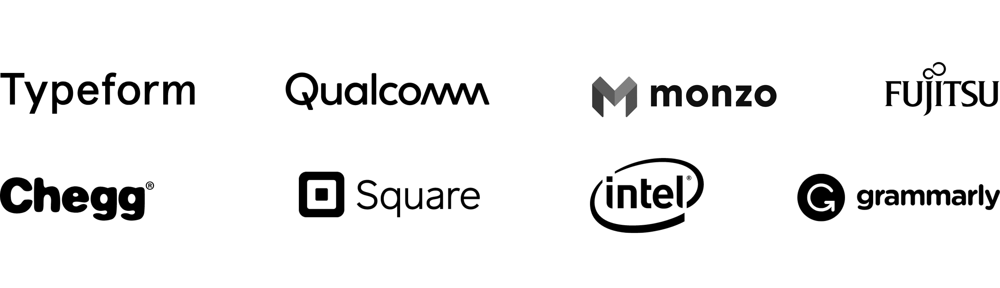
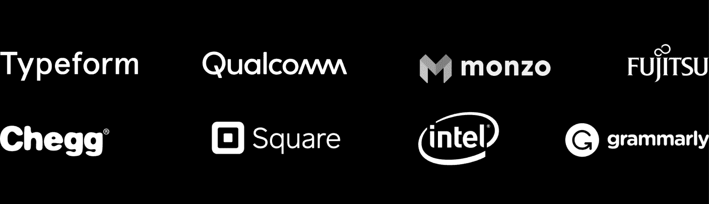

# 🤗 托管推理 API

> 原文链接：[`huggingface.co/docs/api-inference/index`](https://huggingface.co/docs/api-inference/index)

免费测试和评估超过 150,000 个公开可访问的机器学习模型，或您自己的私有模型，通过简单的 HTTP 请求，快速推理托管在 Hugging Face 共享基础设施上。

推理 API 可免费使用，并受速率限制。如果您需要用于生产的推理解决方案，请查看我们的[推理端点](https://huggingface.co/docs/inference-endpoints/index)服务。通过推理端点，您可以轻松部署任何机器学习模型在专用和完全托管的基础设施上。选择云、区域、计算实例、自动缩放范围和安全级别以匹配您的模型、延迟、吞吐量和合规需求。

## 主要特点：

+   从**150,000+个 Transformers、Diffusers 或 Timm 模型**（T5、Blenderbot、Bart、GPT-2、Pegasus...）获取预测

+   使用内置集成与**超过 20 个开源库**（spaCy、SpeechBrain、Keras 等）。

+   通过仅切换模型 ID 来切换到下一个模型

+   上传、管理和私密地提供您的**自己的模型**

+   运行分类、图像分割、自动语音识别、NER、对话、摘要、翻译、问答、嵌入提取任务

+   由 Intel Xeon Ice Lake 提供动力的**CPU**上的即插即用加速推理

## 第三方库模型：

+   [Hub](https://huggingface.co)支持许多新库，如 SpaCy、Timm、Keras、fastai 等。您可以在[这里](https://hf.co/docs/hub/libraries)阅读完整列表。

+   这些模型得以在 API 上启用，得益于一些 docker 集成[api-inference-community](https://github.com/huggingface/api-inference-community/)。

但请注意，这些模型将不允许您（[跟踪问题](https://github.com/huggingface/huggingface_hub/issues/85)）：

+   要获得完整的优化

+   运行私有模型

+   要获得 GPU 推理访问权限

## 如果您正在寻找来自 Hugging Face 团队的定制支持

## Hugging Face 在生产中受到超过 10,000 家公司的信任

 
