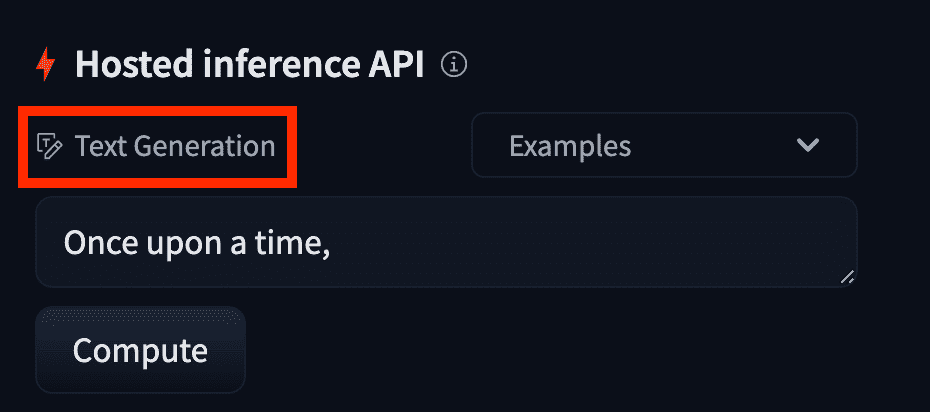

# 详细参数

> 原始文本：[`huggingface.co/docs/api-inference/detailed_parameters`](https://huggingface.co/docs/api-inference/detailed_parameters)

## 这个模型使用哪个任务？

一般来说，🤗 托管的 API 推断接受一个简单的字符串作为输入。然而，更高级的用法取决于模型解决的“任务”。 

模型的“任务”在其模型页面上定义：

 

## 自然语言处理

### 填充掩码任务

尝试用一个缺失的单词填补一个空白（准确来说是一个标记）。这是 BERT 模型的基本任务。

**推荐模型**：[bert-base-uncased](https://huggingface.co/bert-base-uncased)（这是一个简单的模型，但很有趣玩）。

可用于：[🤗 Transformers](https://github.com/huggingface/transformers)

示例：

PythonJavaScriptcURL

```py
import requests
headers = {"Authorization": f"Bearer {API_TOKEN}"}
API_URL = "https://api-inference.huggingface.co/models/bert-base-uncased"
def query(payload):
    response = requests.post(API_URL, headers=headers, json=payload)
    return response.json()
data = query({"inputs": "The answer to the universe is [MASK]."})
```

当发送您的请求时，您应该发送一个 JSON 编码的有效负载。以下是所有选项

| 所有参数 |  |
| :-- | :-- |
| **inputs**（必需）： | 一个要填充的字符串，必须包含[MASK]标记（检查模型卡片以获取掩码的确切名称） |
| **options** | 包含以下键的字典： |
| use_cache | (默认值：`true`)。布尔值。推断 API 上有一个缓存层，用于加速我们已经看到的请求。大多数模型可以直接使用这些结果，因为模型是确定性的（意味着结果无论如何都将相同）。但是，如果您使用的是一个非确定性模型，您可以设置此参数以防止使用缓存机制，从而导致一个真正的新查询。 |
| wait_for_model | (默认值：`false`) 布尔值。如果模型尚未准备好，等待它而不是收到 503。这将限制获取推断结果所需的请求数量。建议只在收到 503 错误后将此标志设置为 true，因为它将限制应用程序在已知位置挂起。 |

返回值要么是一个字典，要么是一个字典列表，如果您发送了一个输入列表

PythonJavaScriptcURL

```py
self.assertEqual(
    deep_round(data),
    [
        {
            "sequence": "the answer to the universe is no.",
            "score": 0.1696,
            "token": 2053,
            "token_str": "no",
        },
        {
            "sequence": "the answer to the universe is nothing.",
            "score": 0.0734,
            "token": 2498,
            "token_str": "nothing",
        },
        {
            "sequence": "the answer to the universe is yes.",
            "score": 0.0580,
            "token": 2748,
            "token_str": "yes",
        },
        {
            "sequence": "the answer to the universe is unknown.",
            "score": 0.044,
            "token": 4242,
            "token_str": "unknown",
        },
        {
            "sequence": "the answer to the universe is simple.",
            "score": 0.0402,
            "token": 3722,
            "token_str": "simple",
        },
    ],
)
```

| 返回值 |  |
| :-- | :-- |
| **sequence** | 运行模型的实际标记序列（可能包含特殊标记） |
| **score** | 此标记的概率。 |
| **token** | 标记的 ID |
| **token_str** | 标记的字符串表示 |

### 总结任务

这个任务被广泛认为是将较长的文本总结为较短的文本。请注意，一些模型有输入的最大长度。这意味着摘要不能处理完整的书籍等。在选择模型时要小心。如果您想讨论您的摘要需求，请与我们联系：api-enterprise@huggingface.co

**推荐模型**：[facebook/bart-large-cnn](https://huggingface.co/facebook/bart-large-cnn)。

可用于：[🤗 Transformers](https://github.com/huggingface/transformers)

示例：

PythonJavaScriptcURL

```py
import requests
headers = {"Authorization": f"Bearer {API_TOKEN}"}
API_URL = "https://api-inference.huggingface.co/models/facebook/bart-large-cnn"
def query(payload):
    response = requests.post(API_URL, headers=headers, json=payload)
    return response.json()
data = query(
    {
        "inputs": "The tower is 324 metres (1,063 ft) tall, about the same height as an 81-storey building, and the tallest structure in Paris. Its base is square, measuring 125 metres (410 ft) on each side. During its construction, the Eiffel Tower surpassed the Washington Monument to become the tallest man-made structure in the world, a title it held for 41 years until the Chrysler Building in New York City was finished in 1930\. It was the first structure to reach a height of 300 metres. Due to the addition of a broadcasting aerial at the top of the tower in 1957, it is now taller than the Chrysler Building by 5.2 metres (17 ft). Excluding transmitters, the Eiffel Tower is the second tallest free-standing structure in France after the Millau Viaduct.",
        "parameters": {"do_sample": False},
    }
)
# Response
self.assertEqual(
    data,
    [
        {
            "summary_text": "The tower is 324 metres (1,063 ft) tall, about the same height as an 81-storey building. Its base is square, measuring 125 metres (410 ft) on each side. During its construction, the Eiffel Tower surpassed the Washington Monument to become the tallest man-made structure in the world.",
        },
    ],
)
```

当发送您的请求时，您应该发送一个 JSON 编码的有效负载。以下是所有选项

| 所有参数 |  |
| :-- | :-- |
| **inputs**（必需） | 要总结的字符串 |
| **parameters** | 包含以下键的字典： |
| min_length | (默认值：`None`)。定义输出摘要的最小长度（以标记为单位）的整数。 |
| max_length | (默认值：`None`)。定义输出摘要的最大长度（以标记为单位）的整数。 |
| top_k | (默认值：`None`)。整数，用于定义在`sample`操作中考虑的前几个标记，以创建新文本。 |
| top_p | (默认值：`None`)。浮点数，用于定义在文本生成的`sample`操作中的标记。在样本中添加标记，直到概率之和大于`top_p`为止，概率从最可能到最不可能。 |
| temperature | (默认值：`1.0`)。浮点数（0.0-100.0）。采样操作的温度。1 表示常规采样，`0`表示始终取最高分数，`100.0`接近均匀概率。 |
| repetition_penalty | (默认: `None`)。浮点数 (0.0-100.0)。在生成过程中一个标记被使用得越多，它在连续的生成过程中被惩罚的可能性就越大。 |
| max_time | (默认: `None`)。浮点数 (0-120.0)。查询应该最多花费的时间量（以秒为单位）。网络可能会导致一些开销，因此这将是一个软限制。 |
| **options** | 包含以下键的字典： |
| use_cache | (默认: `true`)。布尔值。推断 API 上有一个缓存层，用于加速我们已经看到的请求。大多数模型可以直接使用这些结果，因为模型是确定性的（意味着结果无论如何都将相同）。但是，如果您使用的是非确定性模型，可以设置此参数以防止使用缓存机制导致进行真正的新查询。 |
| wait_for_model | (默认: `false`) 布尔值。如果模型尚未准备好，等待它而不是收到 503。它限制了获取推断完成所需的请求数量。建议只在收到 503 错误后将此标志设置为 true，因为它将限制应用程序中的挂起到已知位置。 |

返回值可以是一个字典，或者如果您发送了一个输入列表，则可以是一个字典列表

| 返回值 |  |
| :-- | :-- |
| **summary_text** | 摘要后的字符串 |

### 问答任务

想要一个可以回答任何问题的聪明全知机器人吗？

**推荐模型**：[deepset/roberta-base-squad2](https://huggingface.co/deepset/roberta-base-squad2)。

可用于：[🤗Transformers](https://github.com/huggingface/transformers) 和 [AllenNLP](https://github.com/allenai/allennlp)

示例：

PythonJavaScriptcURL

```py
import requests
headers = {"Authorization": f"Bearer {API_TOKEN}"}
API_URL = "https://api-inference.huggingface.co/models/deepset/roberta-base-squad2"
def query(payload):
    response = requests.post(API_URL, headers=headers, json=payload)
    return response.json()
data = query(
    {
        "inputs": {
            "question": "What's my name?",
            "context": "My name is Clara and I live in Berkeley.",
        }
    }
)
```

发送请求时，应发送 JSON 编码的有效负载。以下是所有选项

返回值是一个字典。

PythonJavaScriptcURL

```py
self.assertEqual(
    deep_round(data),
    {"score": 0.9327, "start": 11, "end": 16, "answer": "Clara"},
)
```

| 返回值 |  |
| :-- | :-- |
| **answer** | 文本中的答案字符串。 |
| **score** | 代表答案正确性的浮点数 |
| **start** | `context` 中答案的开始索引（字符串方式）。 |
| **stop** | `context` 中答案的结束索引（字符串方式）。 |

### 表格问答任务

不懂 SQL？不想深入研究大型电子表格？用简单的英语提问！

**推荐模型**：[google/tapas-base-finetuned-wtq](https://huggingface.co/google/tapas-base-finetuned-wtq)。

可用于：[🤗 Transformers](https://github.com/huggingface/transformers)

示例：

PythonJavaScriptcURL

```py
import requests
headers = {"Authorization": f"Bearer {API_TOKEN}"}
API_URL = "https://api-inference.huggingface.co/models/google/tapas-base-finetuned-wtq"
def query(payload):
    response = requests.post(API_URL, headers=headers, json=payload)
    return response.json()
data = query(
    {
        "inputs": {
            "query": "How many stars does the transformers repository have?",
            "table": {
                "Repository": ["Transformers", "Datasets", "Tokenizers"],
                "Stars": ["36542", "4512", "3934"],
                "Contributors": ["651", "77", "34"],
                "Programming language": [
                    "Python",
                    "Python",
                    "Rust, Python and NodeJS",
                ],
            },
        }
    }
)
```

发送请求时，应发送 JSON 编码的有效负载。以下是所有选项

| 所有参数 |  |
| :-- | :-- |
| **inputs** (required) |  |
| query (required) | 您想要询问表格的纯文本查询 |
| table (required) | 以字典列表表示的数据表，其中条目是标题，列表是所有值，所有列表必须具有相同的大小。 |
| **options** | 包含以下键的字典： |
| use_cache | (默认: `true`)。布尔值。推断 API 上有一个缓存层，用于加速我们已经看到的请求。大多数模型可以直接使用这些结果，因为模型是确定性的（意味着结果无论如何都将相同）。但是，如果您使用的是非确定性模型，可以设置此参数以防止使用缓存机制导致进行真正的新查询。 |
| wait_for_model | (默认: `false`) 布尔值。如果模型尚未准备好，等待它而不是收到 503。它限制了获取推断完成所需的请求数量。建议只在收到 503 错误后将此标志设置为 true，因为它将限制应用程序中的挂起到已知位置。 |

返回值可以是一个字典，或者如果您发送了一个输入列表，则可以是一个字典列表

PythonJavaScriptcURL

```py
self.assertEqual(
    data,
    {
        "answer": "AVERAGE > 36542",
        "coordinates": [[0, 1]],
        "cells": ["36542"],
        "aggregator": "AVERAGE",
    },
)
```

| 返回值 |  |
| :-- | :-- |
| **answer** | 明文答案 |
| **coordinates** | 答案中引用的单元格的坐标列表 |
| **cells** | 单元格内容的坐标列表 |
| **聚合器** | 用于获取答案的聚合器 |

### 句子相似性任务

通过比较它们的嵌入来计算一个文本与其他句子列表之间的语义相似性。

**推荐模型**：[sentence-transformers/all-MiniLM-L6-v2](https://huggingface.co/sentence-transformers/all-MiniLM-L6-v2)。

可用于：[Sentence Transformers](https://www.sbert.net/index.html)

示例：

PythonJavaScriptcURL

```py
import requests
headers = {"Authorization": f"Bearer {API_TOKEN}"}
API_URL = "https://api-inference.huggingface.co/models/sentence-transformers/all-MiniLM-L6-v2"
def query(payload):
    response = requests.post(API_URL, headers=headers, json=payload)
    return response.json()
data = query(
    {
        "inputs": {
            "source_sentence": "That is a happy person",
            "sentences": ["That is a happy dog", "That is a very happy person", "Today is a sunny day"],
        }
    }
)
```

发送请求时，应发送 JSON 编码的有效负载。以下是所有选项

| 所有参数 |  |
| :-- | :-- |
| **inputs**（必需） |  |
| source_sentence（必需） | 您希望将其他字符串与之进行比较的字符串。这可以是短语、句子或更长的段落，具体取决于所使用的模型。 |
| sentences（必需） | 将与 source_sentence 进行比较的字符串列表。 |
| **选项** | 包含以下键的字典： |
| use_cache | （默认：`true`）。布尔值。推断 API 上有一个缓存层，可以加快我们已经看到的请求。大多数模型可以直接使用这些结果，因为模型是确定性的（意味着结果无论如何都将相同）。但是，如果您使用的是非确定性模型，可以设置此参数以防止使用缓存机制导致真正的新查询。 |
| wait_for_model | （默认：`false`）布尔值。如果模型尚未准备好，等待它而不是收到 503。它限制了获取推断所需的请求数量。建议只在收到 503 错误后将此标志设置为 true，因为它将限制应用程序中的挂起到已知位置。 |

返回值是一组相似性分数，以浮点数表示。

PythonJavaScriptcURL

```py
self.assertEqual(
    deep_round(data),
    deep_round([0.6945773363113403, 0.9429150819778442, 0.2568760812282562]),
)
```

| 返回值 |  |
| :-- | :-- |
| **分数** | 给定字符串的相关相似性分数 |

### 文本分类任务

通常用于情感分析，这将输出输入类别的可能性。

**推荐模型**：[distilbert-base-uncased-finetuned-sst-2-english](https://huggingface.co/distilbert-base-uncased-finetuned-sst-2-english)

可用于：[🤗 Transformers](https://github.com/huggingface/transformers)

示例：

PythonJavaScriptcURL

```py
import requests
headers = {"Authorization": f"Bearer {API_TOKEN}"}
API_URL = "https://api-inference.huggingface.co/models/distilbert-base-uncased-finetuned-sst-2-english"
def query(payload):
    response = requests.post(API_URL, headers=headers, json=payload)
    return response.json()
data = query({"inputs": "I like you. I love you"})
```

发送请求时，应发送 JSON 编码的有效负载。以下是所有选项

| 所有参数 |  |
| :-- | :-- |
| **inputs**（必需） | 要分类的字符串 |
| **选项** | 包含以下键的字典： |
| use_cache | （默认：`true`）。布尔值。推断 API 上有一个缓存层，可以加快我们已经看到的请求。大多数模型可以直接使用这些结果，因为模型是确定性的（意味着结果无论如何都将相同）。但是，如果您使用的是非确定性模型，可以设置此参数以防止使用缓存机制导致真正的新查询。 |
| wait_for_model | （默认：`false`）布尔值。如果模型尚未准备好，等待它而不是收到 503。它限制了获取推断所需的请求数量。建议只在收到 503 错误后将此标志设置为 true，因为它将限制应用程序中的挂起到已知位置。 |

返回值可以是一个字典或字典列表（如果您发送了一组输入）

PythonJavaScriptcURL

```py
self.assertEqual(
    deep_round(data),
    [
        [
            {"label": "POSITIVE", "score": 0.9999},
            {"label": "NEGATIVE", "score": 0.0001},
        ]
    ],
)
```

| 返回值 |  |
| :-- | :-- |
| **标签** | 类别的标签（特定于模型） |
| **分数** | 代表文本属于该类的可能性的浮点数。 |

### 文本生成任务

用于从提示中继续文本。这是一个非常通用的任务。

**推荐模型**：[gpt2](https://huggingface.co/gpt2)（这是一个简单的模型，但很有趣玩）。

可用于：[🤗 Transformers](https://github.com/huggingface/transformers)

示例：

PythonJavaScriptcURL

```py
import requests
headers = {"Authorization": f"Bearer {API_TOKEN}"}
API_URL = "https://api-inference.huggingface.co/models/gpt2"
def query(payload):
    response = requests.post(API_URL, headers=headers, json=payload)
    return response.json()
data = query({"inputs": "The answer to the universe is"})
```

发送请求时，应发送 JSON 编码的有效负载。以下是所有选项

| 所有参数 |  |
| :-- | :-- |
| **inputs**（必需）： | 要生成的字符串 |
| **参数** | 包含以下键的字典： |
| top_k | (默认：`None`)。整数，用于定义在`sample`操作中考虑的前几个标记，以生成新文本。 |
| top_p | (默认：`None`)。浮点数，用于定义在文本生成的`sample`操作中的标记。将标记添加到样本中，以使概率最大的标记最不可能，直到概率之和大于`top_p`。 |
| temperature | (默认：`1.0`)。浮点数（0.0-100.0）。采样操作的温度。1 表示常规采样，`0`表示始终选择最高分数，`100.0`接近均匀概率。 |
| repetition_penalty | (默认：`None`)。浮点数（0.0-100.0）。在生成中使用一个标记的次数越多，它就越受到惩罚，以便在连续的生成过程中不被选择。 |
| max_new_tokens | (默认：`None`)。整数（0-250）。要生成的新标记的数量，这**不**包括输入长度，它是您想要生成的文本大小的估计。每个新标记都会减慢请求速度，因此请在响应时间和生成文本长度之间寻找平衡。 |
| max_time | (默认：`None`)。浮点数（0-120.0）。查询应该最多花费的时间量（以秒为单位）。网络可能会导致一些开销，因此这将是一个软限制。与`max_new_tokens`结合使用以获得最佳结果。 |
| return_full_text | (默认：`True`)。布尔值。如果设置为 False，则返回结果将**不**包含原始查询，使提示更加简单。 |
| num_return_sequences | (默认：`1`)。整数。要返回的建议数量。 |
| do_sample | (可选：`True`)。布尔值。是否使用采样，否则使用贪婪解码。 |
| **options** | 包含以下键的字典： |
| use_cache | (默认：`true`)。布尔值。推断 API 上有一个缓存层，可以加快我们已经看到的请求。大多数模型可以直接使用这些结果，因为模型是确定性的（意味着结果无论如何都将相同）。但是，如果您使用的是非确定性模型，可以设置此参数以防止使用缓存机制，从而导致真正的新查询。 |
| wait_for_model | (默认：`false`) 布尔值。如果模型尚未准备好，则等待它，而不是收到 503。这将限制获取推断所需的请求数量。建议仅在收到 503 错误后将此标志设置为 true，因为它将限制应用程序中的挂起到已知位置。 |

返回值可以是字典，也可以是字典列表（如果您发送了输入列表）

PythonJavaScriptcURL

```py
data == [
    {
        "generated_text": 'The answer to the universe is that we are the creation of the entire universe," says Fitch.\n\nAs of the 1960s, six times as many Americans still make fewer than six bucks ($17) per year on their way to retirement.'
    }
]
```

| 返回值 |  |
| :-- | :-- |
| **generated_text** | 连续的字符串 |

### 文本到文本生成任务

基本上是文本生成任务。但使用编码器-解码器架构，因此将来可能会有更多选项。

### 标记分类任务

通常用于句子解析，无论是语法还是命名实体识别（NER），以了解文本中包含的关键字。

**推荐模型**：[dbmdz/bert-large-cased-finetuned-conll03-english](https://huggingface.co/dbmdz/bert-large-cased-finetuned-conll03-english)

可用于：[🤗 Transformers](https://github.com/huggingface/transformers), [Flair](https://github.com/flairNLP/flair)

示例：

PythonJavaScriptcURL

```py
import requests
headers = {"Authorization": f"Bearer {API_TOKEN}"}
API_URL = "https://api-inference.huggingface.co/models/dbmdz/bert-large-cased-finetuned-conll03-english"
def query(payload):
    response = requests.post(API_URL, headers=headers, json=payload)
    return response.json()
data = query({"inputs": "My name is Sarah Jessica Parker but you can call me Jessica"})
```

发送请求时，应发送 JSON 编码的有效载荷。以下是所有选项

| 所有参数 |  |
| :-- | :-- |
| **inputs** (required) | 需要分类的字符串 |
| **parameters** | 包含以下键的字典： |

| aggregation_strategy | (默认：`simple`)。有几种聚合策略：`none`：每个标记都会被分类，无需进一步聚合。

`simple`: 实体根据默认模式进行分组（当标记相似时，B-、I-标记会合并）。

`first`: 与`simple`策略相同，但单词不能以不同的标记结束。当存在歧义时，单词将使用第一个标记的标记。

`average`：与`simple`策略相同，除了单词不能以不同的标签结束。分数在标记之间进行平均，然后应用最大标签。

`max`：与`simple`策略相同，除了单词不能以不同的标签结束。单词实体将是具有最高分数的标记。 |

| **options** | 包含以下键的字典： |
| --- | --- |
| use_cache | （默认：`true`）。布尔值。推理 API 上有一个缓存层，用于加速我们已经看过的请求。大多数模型可以直接使用这些结果，因为模型是确定性的（意味着结果无论如何都将相同）。但是，如果您使用的是非确定性模型，您可以设置此参数以防止使用缓存机制，从而导致真正的新查询。 |
| wait_for_model | （默认：`false`）布尔值。如果模型尚未准备好，则等待它，而不是收到 503。它限制了获取推理结果所需的请求数量。建议仅在收到 503 错误后将此标志设置为 true，因为它将限制应用程序中的挂起到已知位置。 |

返回值可以是一个字典，也可以是一个字典列表，如果您发送了一个输入列表

PythonJavaScriptcURL

```py
self.assertEqual(
    deep_round(data),
    [
        {
            "entity_group": "PER",
            "score": 0.9991,
            "word": "Sarah Jessica Parker",
            "start": 11,
            "end": 31,
        },
        {
            "entity_group": "PER",
            "score": 0.998,
            "word": "Jessica",
            "start": 52,
            "end": 59,
        },
    ],
)
```

| 返回值 |  |
| :-- | :-- |
| **entity_group** | 被识别实体的类型（特定于模型）。 |
| **score** | 实体被识别的可能性有多大。 |
| **word** | 被捕获的字符串 |
| **start** | 答案所在的字符串偏移位置。如果`word`出现多次，这对于消除歧义很有用。 |
| **end** | 答案所在的字符串偏移位置。如果`word`出现多次，这对于消除歧义很有用。 |

### 命名实体识别（NER）任务

查看 Token-classification task

### 翻译任务

这个任务被广泛认为是将文本从一种语言翻译成另一种语言

**推荐模型**：[Helsinki-NLP/opus-mt-ru-en](https://huggingface.co/Helsinki-NLP/opus-mt-ru-en)。Helsinki-NLP 上传了许多具有许多语言对的模型。**推荐模型**：[t5-base](https://huggingface.co/t5-base)。

可用于：[🤗 Transformers](https://github.com/huggingface/transformers)

示例：

PythonJavaScriptcURL

```py
import requests
headers = {"Authorization": f"Bearer {API_TOKEN}"}
API_URL = "https://api-inference.huggingface.co/models/Helsinki-NLP/opus-mt-ru-en"
def query(payload):
    response = requests.post(API_URL, headers=headers, json=payload)
    return response.json()
data = query(
    {
        "inputs": "Меня зовут Вольфганг и я живу в Берлине",
    }
)
# Response
self.assertEqual(
    data,
    [
        {
            "translation_text": "My name is Wolfgang and I live in Berlin.",
        },
    ],
)
```

发送请求时，应发送 JSON 编码的有效载荷。以下是所有选项

| 所有参数 |  |
| :-- | :-- |
| **inputs**（必填） | 要在原始语言中翻译的字符串 |
| **options** | 包含以下键的字典： |
| use_cache | （默认：`true`）。布尔值。推理 API 上有一个缓存层，用于加速我们已经看过的请求。大多数模型可以直接使用这些结果，因为模型是确定性的（意味着结果无论如何都将相同）。但是，如果您使用的是非确定性模型，您可以设置此参数以防止使用缓存机制，从而导致真正的新查询。 |
| wait_for_model | （默认：`false`）布尔值。如果模型尚未准备好，则等待它，而不是收到 503。它限制了获取推理结果所需的请求数量。建议仅在收到 503 错误后将此标志设置为 true，因为它将限制应用程序中的挂起到已知位置。 |

返回值可以是一个字典，也可以是一个字典列表，如果您发送了一个输入列表

| 返回值 |  |
| :-- | :-- |
| **translation_text** | 翻译后的字符串 |

### 零样本分类任务

这个任务非常有用，可以尝试使用零代码进行分类，只需传递一个句子/段落和该句子的可能标签，就可以得到结果。

**推荐模型**：[facebook/bart-large-mnli](https://huggingface.co/facebook/bart-large-mnli)。

可用于：[🤗 Transformers](https://github.com/huggingface/transformers)

请求：

PythonJavaScriptcURL

```py
import requests
headers = {"Authorization": f"Bearer {API_TOKEN}"}
API_URL = "https://api-inference.huggingface.co/models/facebook/bart-large-mnli"
def query(payload):
    response = requests.post(API_URL, headers=headers, json=payload)
    return response.json()
data = query(
    {
        "inputs": "Hi, I recently bought a device from your company but it is not working as advertised and I would like to get reimbursed!",
        "parameters": {"candidate_labels": ["refund", "legal", "faq"]},
    }
)
```

发送请求时，应发送 JSON 编码的有效载荷。以下是所有选项

| 所有参数 |  |
| :-- | :-- |
| **inputs**（必填） | 一个字符串或字符串列表 |
| **parameters**（必填） | 包含以下键的字典： |
| candidate_labels（必填） | 一个潜在类别的字符串列表，用于`inputs`。（最多 10 个候选标签，如果需要更多，只需运行多个请求，如果使用太多候选标签，结果将会误导。如果要保持完全相同，可以简单地运行`multi_label=True`并在您的端上进行缩放。） |
| multi_label | （默认值：`false`）如果类别可以重叠，则设置为 True 的布尔值 |
| **选项** | 包含以下键的字典： |
| use_cache | （默认值：`true`）。布尔值。推理 API 上有一个缓存层，可以加快我们已经看到的请求。大多数模型可以直接使用这些结果，因为模型是确定性的（意味着结果无论如何都将相同）。但是，如果您使用的是非确定性模型，可以设置此参数以防止使用缓存机制，导致真正的新查询。 |
| wait_for_model | （默认值：`false`）布尔值。如果模型尚未准备好，则等待它而不是收到 503 错误。它限制了获取推理结果所需的请求数量。建议只在收到 503 错误后将此标志设置为 true，因为这将限制在已知位置挂起在您的应用程序中。 |

返回值可以是一个字典，也可以是一个字典列表，如果您发送了一个输入列表

响应：

PythonJavaScriptcURL

```py
self.assertEqual(
    deep_round(data),
    {
        "sequence": "Hi, I recently bought a device from your company but it is not working as advertised and I would like to get reimbursed!",
        "labels": ["refund", "faq", "legal"],
        "scores": [
            # 88% refund
            0.8778,
            0.1052,
            0.017,
        ],
    },
)
```

| 返回值 |  |
| :-- | :-- |
| **sequence** | 作为输入发送的字符串 |
| **标签** | 您发送的标签字符串列表（按顺序） |
| **分数** | 与`标签`相同顺序的标签概率的浮点数列表。 |

### 对话任务

此任务对应于任何类似聊天机器人的结构。模型往往具有较短的`max_length`，因此在使用给定模型时，请谨慎检查是否需要长距离依赖性。

**推荐模型**：[microsoft/DialoGPT-large](https://huggingface.co/microsoft/DialoGPT-large)。

可用于：[🤗 Transformers](https://github.com/huggingface/transformers)

示例：

PythonJavaScriptcURL

```py
import requests
headers = {"Authorization": f"Bearer {API_TOKEN}"}
API_URL = "https://api-inference.huggingface.co/models/microsoft/DialoGPT-large"
def query(payload):
    response = requests.post(API_URL, headers=headers, json=payload)
    return response.json()
data = query(
    {
        "inputs": {
            "past_user_inputs": ["Which movie is the best ?"],
            "generated_responses": ["It's Die Hard for sure."],
            "text": "Can you explain why ?",
        },
    }
)
# Response
# This is annoying
data.pop("warnings")
self.assertEqual(
    data,
    {
        "generated_text": "It's the best movie ever.",
        "conversation": {
            "past_user_inputs": [
                "Which movie is the best ?",
                "Can you explain why ?",
            ],
            "generated_responses": [
                "It's Die Hard for sure.",
                "It's the best movie ever.",
            ],
        },
        # "warnings": ["Setting `pad_token_id` to `eos_token_id`:50256 for open-end generation."],
    },
)
```

发送请求时，您应该发送一个 JSON 编码的有效负载。以下是所有选项

| 所有参数 |  |
| :-- | :-- |
| **inputs**（必填） |  |
| text（必填） | 会话中用户的最后输入。 |
| generated_responses | 与模型先前回复对应的字符串列表。 |
| past_user_inputs | 与用户先前回复对应的字符串列表。应与`generated_responses`的长度相同。 |
| **参数** | 包含以下键的字典： |
| min_length | （默认值：`None`）。整数，用于定义输出摘要的最小长度**以令牌为单位**。 |
| max_length | （默认值：`None`）。整数，用于定义输出摘要的最大长度**以令牌为单位**。 |
| top_k | （默认值：`None`）。整数，用于定义在`sample`操作中考虑的前几个令牌以创建新文本。 |
| top_p | （默认值：`None`）。浮点数，用于定义在文本生成的`sample`操作中的令牌。在样本中添加令牌，直到概率之和大于`top_p`为止，从最可能到最不可能。 |
| temperature | （默认值：`1.0`）。浮点数（0.0-100.0）。采样操作的温度。1 表示常规采样，`0`表示始终选择最高分数，`100.0`接近均匀概率。 |
| repetition_penalty | （默认值：`None`）。浮点数（0.0-100.0）。在生成过程中一个令牌被使用得越多，它就越受到惩罚，以便在连续的生成过程中不被选中。 |
| max_time | （默认值：`None`）。浮点数（0-120.0）。查询应该花费的最长时间（以秒为单位）。网络可能会导致一些开销，因此这将是一个软限制。 |
| **选项** | 包含以下键的字典： |
| use_cache | (默认：`true`)。布尔值。推断 API 上有一个缓存层，用于加速我们已经看到的请求。大多数模型可以直接使用这些结果，因为模型是确定性的（意味着结果无论如何都将相同）。但是，如果您使用的是非确定性模型，您可以设置此参数以防止使用缓存机制，从而导致进行真正的新查询。 |
| wait_for_model | (默认：`false`) 布尔值。如果模型尚未准备好，等待它而不是收到 503。它限制了获取推断所需的请求数量。建议只在收到 503 错误后将此标志设置为 true，因为它将限制应用程序中的挂起到已知位置。 |

返回值是一个字典，或者如果您发送了一组输入，则是一个字典的列表

| 返回值 |  |
| :-- | :-- |
| **generated_text** | 机器人的答案 |
| **conversation** | 一个设施字典，用于发送回下一个输入（包括新用户输入）。 |
| past_user_inputs | 字符串列表。对话中用户的最后输入，在模型运行后。 |
| generated_responses | 字符串列表。对话中模型的最后输出，在模型运行后。 |

### 特征提取任务

此任务读取一些文本，并输出原始浮点值，通常作为语义数据库/语义搜索的一部分。

**推荐模型**：[Sentence-transformers](https://huggingface.co/sentence-transformers/paraphrase-xlm-r-multilingual-v1)。

可用于：[🤗 Transformers](https://github.com/huggingface/transformers) [Sentence-transformers](https://github.com/UKPLab/sentence-transformers)

请求：

| 所有参数 |  |
| :-- | :-- |
| **inputs**（必需）： | 从中获取特征的字符串或字符串列表。 |
| **选项** | 包含以下键的字典： |
| use_cache | (默认：`true`)。布尔值。推断 API 上有一个缓存层，用于加速我们已经看到的请求。大多数模型可以直接使用这些结果，因为模型是确定性的（意味着结果无论如何都将相同）。但是，如果您使用的是非确定性模型，您可以设置此参数以防止使用缓存机制，从而导致进行真正的新查询。 |
| wait_for_model | (默认：`false`) 布尔值。如果模型尚未准备好，等待它而不是收到 503。它限制了获取推断所需的请求数量。建议只在收到 503 错误后将此标志设置为 true，因为它将限制应用程序中的挂起到已知位置。 |

返回值是一个字典，或者如果您发送了一组输入，则是一个字典的列表

| 返回值 |  |
| :-- | :-- |
| **一组浮点数（或一组浮点数的列表）** | 输入的表示特征的数字。 |

返回值是一组浮点数，或一组浮点数的列表（取决于您发送的是字符串还是字符串列表，以及是否为您应用了自动缩减，通常是 mean_pooling 等）。这应该在模型的 README 中有解释。

## 音频

### 自动语音识别任务

此任务读取一些音频输入，并输出音频文件中的文字。

**推荐模型**：[检查您的语言](https://huggingface.co/models?pipeline_tag=automatic-speech-recognition)。

**英语**：[facebook/wav2vec2-large-960h-lv60-self](https://huggingface.co/facebook/wav2vec2-large-960h-lv60-self)。

可用于：[🤗 Transformers](https://github.com/huggingface/transformers) [ESPnet](https://github.com/espnet/espnet) 和 [SpeechBrain](https://github.com/speechbrain/speechbrain)

请求：

PythonJavaScriptcURL

```py
import json
import requests
headers = {"Authorization": f"Bearer {API_TOKEN}"}
API_URL = "https://api-inference.huggingface.co/models/facebook/wav2vec2-base-960h"
def query(filename):
    with open(filename, "rb") as f:
        data = f.read()
    response = requests.request("POST", API_URL, headers=headers, data=data)
    return json.loads(response.content.decode("utf-8"))
data = query("sample1.flac")
```

发送请求时，应发送一个包含音频文件的二进制载荷。我们尝试支持大多数格式（Flac、Wav、Mp3、Ogg 等...）。我们会自动将采样率重新调整为给定模型的适当速率（通常为 16KHz）。

| 所有参数 |  |
| :-- | :-- |
| **无参数**（必填） | 音频文件的二进制表示。当前不允许其他参数。 |

返回值可以是一个字典，或者如果您发送了一个输入列表，则是一个字典列表

响应：

PythonJavaScriptcURL

```py
self.assertEqual(
    data,
    {
        "text": "GOING ALONG SLUSHY COUNTRY ROADS AND SPEAKING TO DAMP AUDIENCES IN DRAUGHTY SCHOOL ROOMS DAY AFTER DAY FOR A FORTNIGHT HE'LL HAVE TO PUT IN AN APPEARANCE AT SOME PLACE OF WORSHIP ON SUNDAY MORNING AND HE CAN COME TO US IMMEDIATELY AFTERWARDS"
    },
)
```

| 返回值 |  |
| :-- | :-- |
| **文本** | 在音频文件中被识别出的字符串。 |

### 音频分类任务

此任务读取一些音频输入，并输出类别的可能性。

**推荐模型**：[superb/hubert-large-superb-er](https://huggingface.co/superb/hubert-large-superb-er)。

可用于：[🤗 Transformers](https://github.com/huggingface/transformers) [SpeechBrain](https://github.com/speechbrain/speechbrain)

请求：

PythonJavaScriptcURL

```py
import json
import requests
headers = {"Authorization": f"Bearer {API_TOKEN}"}
API_URL = "https://api-inference.huggingface.co/models/superb/hubert-large-superb-er"
def query(filename):
    with open(filename, "rb") as f:
        data = f.read()
    response = requests.request("POST", API_URL, headers=headers, data=data)
    return json.loads(response.content.decode("utf-8"))
data = query("sample1.flac")
```

在发送请求时，您应该发送一个包含音频文件的二进制有效负载。我们尽量支持大多数格式（Flac、Wav、Mp3、Ogg 等...）。我们会自动将采样率重新调整为给定模型的适当速率（通常为 16KHz）。

| 所有参数 |  |
| :-- | :-- |
| **无参数**（必填） | 音频文件的二进制表示。当前不允许其他参数。 |

返回值是一个字典

PythonJavaScriptcURL

```py
self.assertEqual(
    deep_round(data, 4),
    [
        {"score": 0.5928, "label": "neu"},
        {"score": 0.2003, "label": "hap"},
        {"score": 0.128, "label": "ang"},
        {"score": 0.079, "label": "sad"},
    ],
)
```

| 返回值 |  |
| :-- | :-- |
| **标签** | 类别的标签（特定于模型） |
| **分数** | 代表音频文件属于该类别的可能性的浮点数。 |

## 计算机视觉

### 图像分类任务

此任务读取一些图像输入，并输出类别的可能性。

**推荐模型**：[google/vit-base-patch16-224](https://huggingface.co/google/vit-base-patch16-224)。

可用于：[🤗 Transformers](https://github.com/huggingface/transformers)

请求：

PythonJavaScriptcURL

```py
import json
import requests
headers = {"Authorization": f"Bearer {API_TOKEN}"}
API_URL = "https://api-inference.huggingface.co/models/google/vit-base-patch16-224"
def query(filename):
    with open(filename, "rb") as f:
        data = f.read()
    response = requests.request("POST", API_URL, headers=headers, data=data)
    return json.loads(response.content.decode("utf-8"))
data = query("cats.jpg")
```

在发送请求时，您应该发送一个包含图像文件的二进制有效负载。我们支持[Pillow 支持的所有图像格式](https://pillow.readthedocs.io/en/stable/handbook/image-file-formats.html)。

| 所有参数 |  |
| :-- | :-- |
| **无参数**（必填） | 图像文件的二进制表示。当前不允许其他参数。 |

返回值是一个字典

PythonJavaScriptcURL

```py
self.assertEqual(
    deep_round(data, 4),
    [
        {"score": 0.9374, "label": "Egyptian cat"},
        {"score": 0.0384, "label": "tabby, tabby cat"},
        {"score": 0.0144, "label": "tiger cat"},
        {"score": 0.0033, "label": "lynx, catamount"},
        {"score": 0.0007, "label": "Siamese cat, Siamese"},
    ],
)
```

| 返回值 |  |
| :-- | :-- |
| **标签** | 类别的标签（特定于模型） |
| **分数** | 代表图像文件属于该类别的可能性的浮点数。 |

### 目标检测任务

此任务读取一些图像输入，并输出类别的可能性和检测到的对象的边界框。

**推荐模型**：[facebook/detr-resnet-50](https://huggingface.co/facebook/detr-resnet-50)。

可用于：[🤗 Transformers](https://github.com/huggingface/transformers)

请求：

PythonJavaScriptcURL

```py
import json
import requests
headers = {"Authorization": f"Bearer {API_TOKEN}"}
API_URL = "https://api-inference.huggingface.co/models/facebook/detr-resnet-50"
def query(filename):
    with open(filename, "rb") as f:
        data = f.read()
    response = requests.request("POST", API_URL, headers=headers, data=data)
    return json.loads(response.content.decode("utf-8"))
data = query("cats.jpg")
```

在发送请求时，您应该发送一个包含图像文件的二进制有效负载。我们支持[Pillow 支持的所有图像格式](https://pillow.readthedocs.io/en/stable/handbook/image-file-formats.html)。

| 所有参数 |  |
| :-- | :-- |
| **无参数**（必填） | 图像文件的二进制表示。当前不允许其他参数。 |

返回值是一个字典

PythonJavaScriptcURL

```py
self.assertEqual(
    deep_round(data, 4),
    [
        {
            "score": 0.9982,
            "label": "remote",
            "box": {"xmin": 40, "ymin": 70, "xmax": 175, "ymax": 117},
        },
        {
            "score": 0.9960,
            "label": "remote",
            "box": {"xmin": 333, "ymin": 72, "xmax": 368, "ymax": 187},
        },
        {
            "score": 0.9955,
            "label": "couch",
            "box": {"xmin": 0, "ymin": 1, "xmax": 639, "ymax": 473},
        },
        {
            "score": 0.9988,
            "label": "cat",
            "box": {"xmin": 13, "ymin": 52, "xmax": 314, "ymax": 470},
        },
        {
            "score": 0.9987,
            "label": "cat",
            "box": {"xmin": 345, "ymin": 23, "xmax": 640, "ymax": 368},
        },
    ],
)
```

| 返回值 |  |
| :-- | :-- |
| **标签** | 检测到的对象的类别的标签（特定于模型）。 |
| **分数** | 代表检测到的对象属于给定类别的可能性的浮点数。 |
| **框** | 代表检测到的对象的边界框的字典（带有键[xmin,ymin,xmax,ymax]）。 |

### 图像分割任务

此任务读取一些图像输入，并输出类别的可能性和检测到的对象的边界框。

**推荐模型**：[facebook/detr-resnet-50-panoptic](https://huggingface.co/facebook/detr-resnet-50-panoptic)。

可用于：[🤗 Transformers](https://github.com/huggingface/transformers)

请求：

PythonJavaScriptcURL

```py
import json
import requests
headers = {"Authorization": f"Bearer {API_TOKEN}"}
API_URL = "https://api-inference.huggingface.co/models/facebook/detr-resnet-50-panoptic"
def query(filename):
    with open(filename, "rb") as f:
        data = f.read()
    response = requests.request("POST", API_URL, headers=headers, data=data)
    return json.loads(response.content.decode("utf-8"))
data = query("cats.jpg")
```

在发送请求时，您应该发送一个包含图像文件的二进制有效负载。我们支持[Pillow 支持的所有图像格式](https://pillow.readthedocs.io/en/stable/handbook/image-file-formats.html)。

| 所有参数 |  |
| :-- | :-- |
| **no parameter**（必需） | 图像文件的二进制表示。当前不允许其他参数。 |

返回值是一个字典

PythonJavaScriptcURL

```py
import base64
from io import BytesIO
from PIL import Image
with Image.open("cats.jpg") as img:
    masks = [d["mask"] for d in data]
    self.assertEqual(img.size, (640, 480))
    mask_imgs = [Image.open(BytesIO(base64.b64decode(mask))) for mask in masks]
    for mask_img in mask_imgs:
        self.assertEqual(mask_img.size, img.size)
        self.assertEqual(mask_img.mode, "L")  # L (8-bit pixels, black and white)
    first_mask_img = mask_imgs[0]
    min_pxl_val, max_pxl_val = first_mask_img.getextrema()
    self.assertGreaterEqual(min_pxl_val, 0)
    self.assertLessEqual(max_pxl_val, 255)
```

| 返回值 |  |
| :-- | :-- |
| **label** | 段的类别标签（特定于模型）。 |
| **score** | 代表该段属于给定类的可能性的浮点数。 |
| **mask** | 代表段的蒙版的字符串（单通道黑白图像的 base64 字符串）。 |
