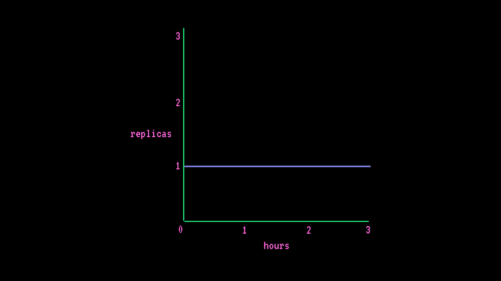
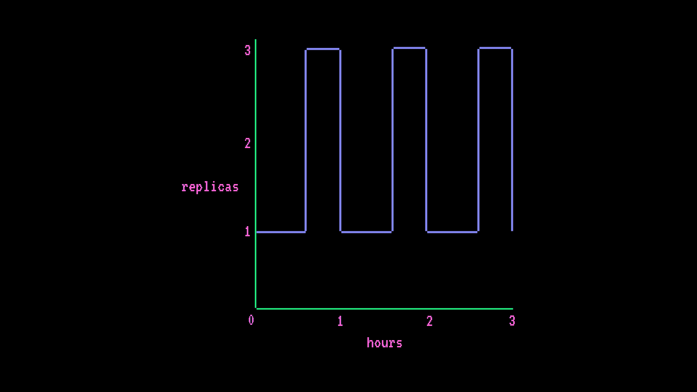

# 定价

> 原始文本：[`huggingface.co/docs/inference-endpoints/pricing`](https://huggingface.co/docs/inference-endpoints/pricing)

或请求报价

通过🤗推理终端点轻松部署机器学习模型在专用基础设施上。创建终端点时，您可以选择实例类型来部署和按小时费率扩展您的模型。🤗推理终端点可供拥有活跃订阅和已存档信用卡的 Hugging Face 帐户访问。在订阅期结束时，用户或组织帐户将根据终端点处于*初始化*和*运行*状态时使用的计算资源收费。

您可以在🤗推理终端点中找到所有可用实例的每小时定价，以及以下成本计算示例。虽然价格按小时显示，但实际成本是按分钟计算的。

## CPU 实例

下表显示了当前可用的 CPU 实例及其每小时定价。如果应用程序中无法选择实例类型，则需要请求配额来使用它。

| 服务提供商 | 实例大小 | 每小时费率 | vCPUs | 内存 | 架构 |
| --- | --- | --- | --- | --- | --- |
| aws | 小型 | $0.06 | 1 | 2GB | Intel Xeon - Ice Lake |
| aws | 中型 | $0.12 | 2 | 4GB | Intel Xeon - Ice Lake |
| aws | 大型 | $0.24 | 4 | 8GB | Intel Xeon - Ice Lake |
| aws | 超大型 | $0.48 | 8 | 16GB | Intel Xeon - Ice Lake |
| azure | 小型 | $0.06 | 1 | 2GB | Intel Xeon |
| azure | 中型 | $0.12 | 2 | 4GB | Intel Xeon |
| azure | 大型 | $0.24 | 4 | 8GB | Intel Xeon |
| azure | 超大型 | $0.48 | 8 | 16GB | Intel Xeon |

## GPU 实例

下表显示了当前可用的 GPU 实例及其每小时定价。如果应用程序中无法选择实例类型，则需要请求配额来使用它。

| 服务提供商 | 实例大小 | 每小时费率 | GPU | 内存 | 架构 |
| --- | --- | --- | --- | --- | --- |
| aws | 小型 | $0.60 | 1 | 14GB | NVIDIA T4 |
| aws | 中型 | $1.30 | 1 | 24GB | NVIDIA A10G |
| aws | 大型 | $4.50 | 4 | 56GB | NVIDIA T4 |
| aws | 超大型 | $6.50 | 1 | 80GB | NVIDIA A100 |
| aws | xxlarge | $7.00 | 4 | 96GB | NVIDIA A10G |
| aws | 2xlarge | $13.00 | 2 | 160GB | NVIDIA A100 |
| aws | 4xlarge | $26.00 | 4 | 320GB | NVIDIA A100 |
| aws | 8xlarge | $45.00 | 8 | 640GB | NVIDIA A100 |

## 定价示例

以下示例定价方案演示了如何计算成本。您可以在上面的表格中找到所有实例类型和大小的每小时费率。使用以下公式计算成本：

```py
instance hourly rate * ((hours * # min replica) + (scale-up hrs * # additional replicas))
```

### 基本终端点

+   AWS CPU 中型（2 x 4GB vCPUs）

+   自动扩展（最少 1 个副本，最多 1 个副本）

**每小时成本**

```py
instance hourly rate * (hours * # min replica) = hourly cost
$0.12/hr * (1hr * 1 replica) = $0.12/hr
```

**每月成本**

```py
instance hourly rate * (hours * # min replica) = monthly cost
$0.12/hr * (730hr * 1 replica) = $87.6/month
```



### 高级终端点

+   AWS GPU 小型（1 x 14GB GPU）

+   自动扩展（最少 1 个副本，最多 3 个副本），每小时流量峰值将终端点从 1 个副本扩展到 3 个副本，持续 15 分钟

**每小时成本**

```py
instance hourly rate * ((hours * # min replica) + (scale-up hrs * # additional replicas)) = hourly cost
$0.6/hr * ((1hr * 1 replica) + (0.25hr * 2 replicas)) = $0.9/hr
```

**每月成本**

```py
instance hourly rate * ((hours * # min replica) + (scale-up hrs * # additional replicas)) = monthly cost
$0.6/hr * ((730hr * 1 replica) + (182.5hr * 2 replicas)) = $657/month
```


