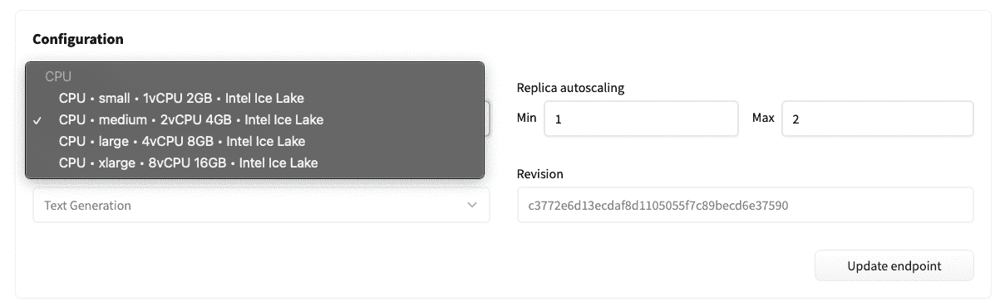

# 更新您的终端节点

> 原文链接：[`huggingface.co/docs/inference-endpoints/guides/update_endpoint`](https://huggingface.co/docs/inference-endpoints/guides/update_endpoint)

您可以更新`正在运行`的终端节点以更改一些配置。但是，如果您的终端节点处于`失败`状态，您需要创建一个新的终端节点。要更新您的终端节点，您需要导航到“设置”选项卡。

您可以更新实例类型、自动缩放配置、任务和存储库修订版。

## 实例大小

您可以在终端节点概览菜单中更新终端节点的实例大小，以满足您不断发展的需求。例如，如果您不需要计算，可以缩小到较小的实例类型，或者如果需要增加计算，可以升级到较大的实例类型。

您可以更新*当前*实例类型：CPU 或 GPU。无法从一个实例类型更新到另一个实例类型（从 CPU 到 GPU 或反之）。

## 自动缩放

您可以在设置菜单中更新终端节点的自动缩放配置。调整最小和最大副本数量以调整终端节点的扩展或缩小。了解更多关于自动缩放的信息[在这里](https://huggingface.co/docs/inference-endpoints/faq#q-how-does-autoscaling-work)。

## 任务

您可以在设置菜单中更新正在运行的终端节点的任务。任务定义了终端节点将使用的`pipeline`类型以及终端节点概览上的推理小部件。

## 修订版

您可以在设置菜单中更新`正在运行`的终端节点的修订版。修订版定义了您想要用于推理的模型存储库的版本。
