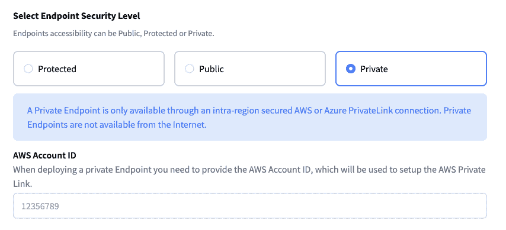
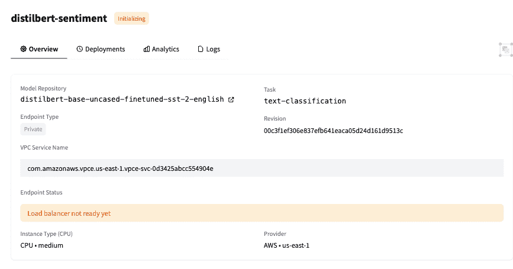

# 使用 AWS PrivateLink 创建私有端点

> 原始文本：[`huggingface.co/docs/inference-endpoints/guides/private_link`](https://huggingface.co/docs/inference-endpoints/guides/private_link)

安全性和安全推理是推理端点的关键原则。我们目前提供三种不同级别的安全性：公共、受保护和私有。

公共和受保护的端点不需要任何额外配置。但是，为了为安全的区域内连接创建私有端点，您需要提供应该访问推理端点的帐户的 AWS 帐户 ID。

在提供 AWS 帐户 ID 并单击**创建端点**后，推理服务将创建一个 VPC 端点，并且您应该在概述中看到 VPC 服务名称。

VPC 服务名称用于在您（客户）的云帐户中创建 VPC 接口端点。打开您的云帐户[控制台](https://console.aws.amazon.com/vpc/home?#Endpoints)以创建 VPC 接口端点。

下面显示了 VPC 端点配置的示例。您需要选择要使用的 VPC 和子网，以及安全组。

成功创建推理端点后，请转到相应的 AWS 帐户并将 VPC 端点添加为端点。

在 VPC 端点状态从**pending**更改为**available**后，您应该在概述中看到一个端点 URL。现在，您可以在您的 VPC 内使用此 URL 以安全和受保护的方式访问您的端点，确保流量仅在两个端点之间发生，永远不会离开 AWS。
