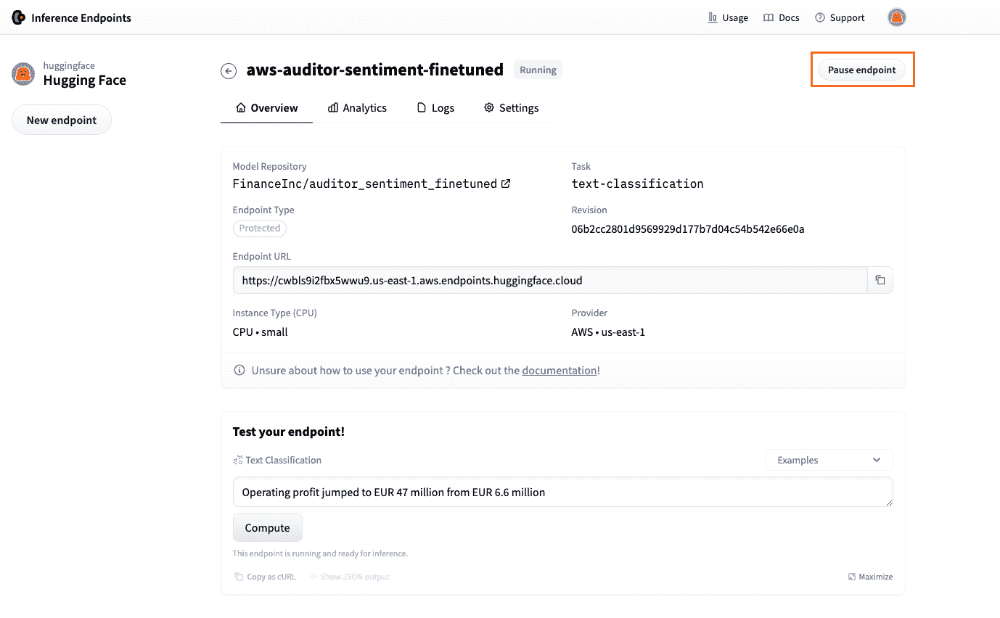
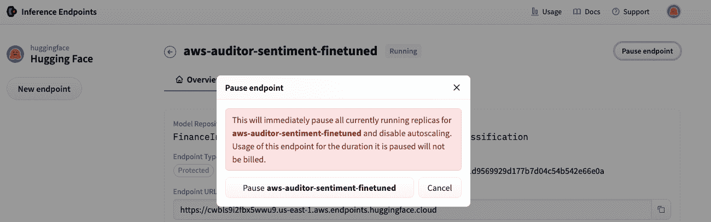
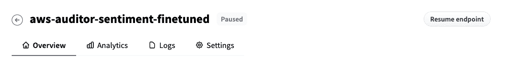
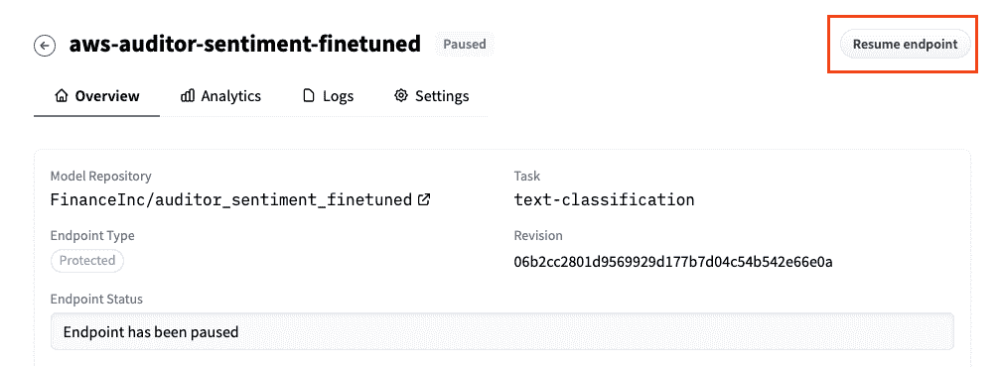

# 暂停和恢复您的端点

> 原始文本：[`huggingface.co/docs/inference-endpoints/guides/pause_endpoint`](https://huggingface.co/docs/inference-endpoints/guides/pause_endpoint)

您可以`暂停`和`恢复`端点以节省成本和配置。请注意，如果您的端点处于`失败`状态，则需要创建一个新的端点。要`暂停`/`恢复`您的端点，请导航到“概述”选项卡，然后点击右上角的按钮，显示“暂停端点”以暂停，或“恢复端点”以重新激活暂停的端点。

暂停端点时，最小和最大副本数将设置为 0。恢复端点时，最小和最大副本数将设置为 1。这允许您通过更新 API 中的“min_replicas”和“max_replicas”字段来以编程方式暂停和恢复端点。暂停的推理端点将具有以下状态：`PAUSED`。暂停的端点在恢复之前不会计费。暂停和恢复端点是节省成本的好方法，当您不需要端点运行时。例如，您可以在晚上或周末轻松暂停端点。当您暂时不需要端点时，应该将其暂停。

您的端点的 URL 将保持不变，即使您暂停和恢复它。这意味着您可以暂停您的端点，稍后恢复它，而无需更新您的代码。

## 暂停推理端点

要暂停端点，请导航到“概述”选项卡，然后点击右上角的按钮，上面写着“暂停端点”。

点击按钮后，将要求您确认操作。点击“暂停{ENDPOINT-NAME}”以确认。

之后，您的副本将设置为 0，您的端点将被暂停。您可以在“概述”选项卡中看到端点状态的变化为`PAUSED`。如果您没有看到`PAUSED`状态，请确保您已经按照这些说明操作，或者联系我们寻求帮助。

## 恢复推理端点

要恢复端点，请导航到“概述”选项卡，然后点击右上角显示“恢复端点”的按钮。

您的端点将被恢复，状态将变为`初始化`，然后变为`运行`。一旦您的端点正在运行，您可以再次开始使用它，并且将产生计费使用。
