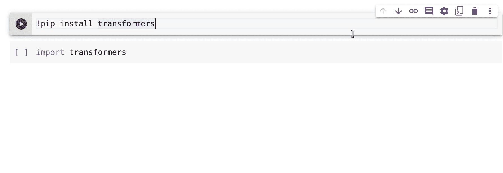

# 课程简介

> 原文：[`huggingface.co/learn/nlp-course/zh-CN/chapter0/1?fw=pt`](https://huggingface.co/learn/nlp-course/zh-CN/chapter0/1?fw=pt)

            

欢迎来到拥抱脸课程！本介绍将指导您设置工作环境。如果您刚开始学习本课程，我们建议您先阅读第一章, 然后再回来设置您的环境，以便您可以自己尝试运行代码。

我们将在本课程中使用的所有库都以 Python 包的形式提供，因此在这里我们将向您展示如何设置 Python 环境并安装您需要的特定库。

我们将介绍两种设置工作环境的方法，使用 Colab 笔记本或 Python 虚拟环境。选择任意一种趁手的方式即可。对于初学者，我们强烈建议您从使用 Colab 笔记本开始（国内无法访问,可以跳过,直接查阅本页**安装依赖**那一节即可在本地的环境下运行,译者注）。

请注意，Python 虚拟环境的一些命令不支持 Windows 系统。如果您在 Windows 上运行，我们建议您继续使用 Colab 笔记本。如果您使用的是 Linux 发行版或 macOS，则可以使用此处的任一方法。

大多数课程和服务都依赖于您拥有 Hugging Face 帐户。我们建议现在创建一个：[创建一个账号](https://huggingface.co/join).

## 使用 Google Colab 笔记本

使用 Colab notebook 是最简单的设置；可以在浏览器中启动 Notebook 并直接开始编写自己的代码！

如果您不熟悉 Colab，我们建议您从[这个介绍](https://colab.research.google.com/notebooks/intro.ipynb)开始。Colab 提供一些加速硬件，例如 GPU 或 TPU，并且当我们使用的算力比较少的时候是免费的。

当打开 Colab 后，创建一个新笔记本：


下一步是安装我们将在本课程中使用的库。我们将使用 **pip** 进行安装，它是 Python 的包管理器。在 Notebook 中，您可以通过加上!字符表示执行系统命令，所以安装🤗 Transformers 的命令如下：

```py
!pip install transformers
```

您可以通过在运行 Python 时导入包来判断是否正确安装了该包：

```py
import transformers
```



这将安装一个非常轻量级的 🤗 Transformers。并没有安装机器学习框架（如 PyTorch 或 TensorFlow）。由于之后我们将使用该库的许多不同功能，我们建议安装开发版本，它带有几乎所有所需的依赖项：

```py
!pip install transformers[sentencepiece]
```

这将需要一些时间，但当完成之后您就做好学习剩下的课程的环境准备了！

## 使用 Python 虚拟环境

如果您更喜欢使用 Python 虚拟环境，那么第一步是在您的系统上安装 Python。我们建议您按照[这个教程](https://realpython.com/installing-python/)进行配置。

安装 Python 后，您应该能够在终端中运行 Python 命令。您可以先运行以下命令来检验爱装是否正确，然后再继续下一步：**python —version**。这应该会打印出您系统上现在可用的 Python 版本。

在终端中运行 Python 命令（例如 **python —version**）时，您应该将运行命令的这个 Python 视为系统上的“默认”Python。我们建议保持这个默认的 Python 安装程序没有任何包，当运行某个程序的时候就为那个程序创建一个单独的运行环境 - 这样，每个应用程序都可以有自己的依赖项和包，您无需担心与其他应用程序潜在的兼容性问题。

在 Python 中，这是通过 [*虚拟环境*](https://docs.python.org/3/tutorial/venv.html)实现的，虚拟环境会创建许多目录树，每个目录树都包含具有特定 Python 版本的 Python 安装以及应用程序所需的所有包。可以使用许多不同的工具来创建这样的虚拟环境，但在此我们将使用官方 Python 包：[`venv`](https://docs.python.org/3/library/venv.html#module-venv).

首先，创建您希望 Transformers 所在的目录 - 例如，您可能希望在主目录的根目录下创建一个名为 *Transformers-course* 的新目录：

```py
mkdir ~/transformers-course
cd ~/transformers-course
```

在这个目录中，使用 Python `venv` 模块创建一个虚拟环境：

```py
python -m venv .env
```

您现在应该在原本为空的文件夹中看到一个名为 *.env* 的目录：

```py
ls -a
```

```py
.      ..    .env
```

您可以使用`activate`和`deactivate`命令来控制进入和退出您的虚拟环境：

```py
# Activate the virtual environment
source .env/bin/activate

# Deactivate the virtual environment
source .env/bin/deactivate
```

您可以通过运行 `which python` 命令来检测虚拟环境是否被激活：如果它指向虚拟环境，那么您已经成功激活了它！

```py
which python
```

```py
/home/<user>/transformers-course/.env/bin/python
```

### 安装依赖

与使用 Google Colab 实例的上一节一样，您现在需要安装继续所需的包。 同样，您可以使用 `pip` 包管理器安装 🤗 Transformers 的开发版本：

```py
pip install "transformers[sentencepiece]"
```

您现在已准备就绪，可以开始了！