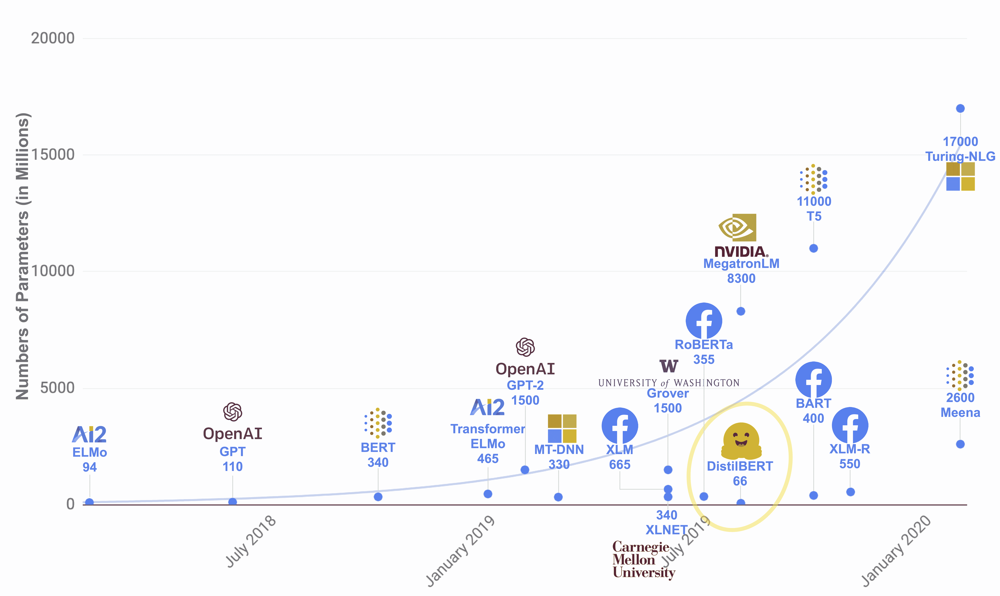

# Transformers 是如何工作的？

> 原文：[`huggingface.co/learn/nlp-course/zh-CN/chapter1/4?fw=pt`](https://huggingface.co/learn/nlp-course/zh-CN/chapter1/4?fw=pt)

              

在本节中，我们将深入了解 Transformer 模型的架构。

## 一点 Transformers 的发展历史

以下是 Transformer 模型（简短）历史中的一些关键节点：

 

[Transformer 架构](https://arxiv.org/abs/1706.03762) 于 2017 年 6 月推出。原本研究的重点是翻译任务。随后推出了几个有影响力的模型，包括

*   **2018 年 6 月**: [GPT](https://cdn.openai.com/research-covers/language-unsupervised/language_understanding_paper.pdf), 第一个预训练的 Transformer 模型，用于各种 NLP 任务并获得极好的结果

*   **2018 年 10 月**: [BERT](https://arxiv.org/abs/1810.04805), 另一个大型预训练模型，该模型旨在生成更好的句子摘要（下一章将详细介绍！）

*   **2019 年 2 月**: [GPT-2](https://cdn.openai.com/better-language-models/language_models_are_unsupervised_multitask_learners.pdf), GPT 的改进（并且更大）版本，由于道德问题没有立即公开发布

*   **2019 年 10 月**: [DistilBERT](https://arxiv.org/abs/1910.01108), BERT 的提炼版本，速度提高 60%，内存减轻 40%，但仍保留 BERT 97% 的性能

*   **2019 年 10 月**: [BART](https://arxiv.org/abs/1910.13461) 和 [T5](https://arxiv.org/abs/1910.10683), 两个使用与原始 Transformer 模型相同架构的大型预训练模型（第一个这样做）

*   **2020 年 5 月**, [GPT-3](https://arxiv.org/abs/2005.14165), GPT-2 的更大版本，无需微调即可在各种任务上表现良好（称为零样本学习）

这个列表并不全面，只是为了突出一些不同类型的 Transformer 模型。大体上，它们可以分为三类：

*   GPT-like (也被称作自回归 Transformer 模型)
*   BERT-like (也被称作自动编码 Transformer 模型)
*   BART/T5-like (也被称作序列到序列的 Transformer 模型)

稍后我们将更深入地探讨这些分类。

## Transformers 是语言模型

上面提到的所有 Transformer 模型（GPT、BERT、BART、T5 等）都被训练为语言模型。这意味着他们已经以无监督学习的方式接受了大量原始文本的训练。无监督学习是一种训练类型，其中目标是根据模型的输入自动计算的。这意味着不需要人工来标记数据！

这种类型的模型可以对其训练过的语言进行统计理解，但对于特定的实际任务并不是很有用。因此，一般的预训练模型会经历一个称为*迁移学习*的过程。在此过程中，模型在给定任务上以监督方式（即使用人工注释标签）进行微调。

任务的一个例子是阅读 *n* 个单词的句子，预测下一个单词。这被称为因果语言建模，因为输出取决于过去和现在的输入。

 

另一个例子是*遮罩语言建模*，该模型预测句子中的遮住的词。

 

## Transformer 是大模型

除了一些特例（如 DistilBERT）外，实现更好性能的一般策略是增加模型的大小以及预训练的数据量。

不幸的是，训练模型，尤其是大型模型，需要大量的数据，时间和计算资源。它甚至会对环境产生影响，如下图所示。

 

[`www.youtube-nocookie.com/embed/ftWlj4FBHTg`](https://www.youtube-nocookie.com/embed/ftWlj4FBHTg)

Transformers 是由一个团队领导的（非常大的）模型项目，该团队试图减少预训练对环境的影响，通过运行大量试验以获得最佳超参数。

想象一下，如果每次一个研究团队、一个学生组织或一家公司想要训练一个模型，都从头开始训练的。这将导致巨大的、不必要的浪费！

这就是为什么共享语言模型至关重要：共享经过训练的权重，当遇见新的需求时在预训练的权重之上进行微调，可以降低训练模型训练的算力和时间消耗，降低全球的总体计算成本和碳排放。

顺便说一句，您可以通过多种工具评估模型训练的碳排放。 例如 [ML CO2 Impact](https://mlco2.github.io/impact/) 或集成在 🤗 Transformers 中的 [Code Carbon](https://codecarbon.io/)。 要了解更多相关信息，您可以阅读这篇[博客文章](https://huggingface.co/blog/carbon-emissions-on-the-hub)，其中将向您展示如何生成 `emissions.csv` 文件估计训练的碳足迹，这里还有 🤗 Transformers 关于碳足迹的[文档](https://huggingface.co/docs/hub/model-cards-co2)。

## 迁移学习

[`www.youtube-nocookie.com/embed/BqqfQnyjmgg`](https://www.youtube-nocookie.com/embed/BqqfQnyjmgg)

*预训练是*训练模型前的一个操作：随机初始化权重，在没有任何先验知识的情况下开始训练。

 

这种预训练通常是在非常大量的数据上进行的。因此，它需要大量的数据，而且训练可能需要几周的时间。

另一方面，*微调*是在模型经过预训练后完成的训练。要执行微调，首先需要获取一个经过预训练的语言模型，然后使用特定于任务的数据集执行额外的训练。等等，为什么不直接为最后的任务而训练呢？有几个原因：

*   预训练模型已经在与微调数据集有一些相似之处的数据集上进行了训练。因此，微调过程能够利用模型在预训练期间获得的知识（例如，对于 NLP 问题，预训练模型将对您在任务中使用的语言有某种统计规律上的理解）。
*   由于预训练模型已经在大量数据上进行了训练，因此微调需要更少的数据来获得不错的结果。
*   出于同样的原因，获得好结果所需的时间和资源要少得多

例如，可以利用英语的预训练过的模型，然后在 arXiv 语料库上对其进行微调，从而形成一个基于科学/研究的模型。微调只需要有限的数据量：预训练模型获得的知识可以“迁移”到目标任务上，因此被称为*迁移学习*。

 

因此，微调模型具有较低的时间、数据、财务和环境成本。迭代不同的微调方案也更快、更容易，因为与完整的预训练相比，训练的约束更少。

这个过程也会比从头开始的训练（除非你有很多数据）取得更好的效果，这就是为什么你应该总是尝试利用一个预训练的模型—一个尽可能接近你手头的任务的模型—并对其进行微调。

## 一般的体系结构

在这一部分，我们将介绍 Transformer 模型的一般架构。如果你不理解其中的一些概念，不要担心；下文将详细介绍每个组件。

[`www.youtube-nocookie.com/embed/H39Z_720T5s`](https://www.youtube-nocookie.com/embed/H39Z_720T5s)

## 介绍

该模型主要由两个块组成：

*   **Encoder (左侧)**: 编码器接收输入并构建其表示（其特征）。这意味着对模型进行了优化，以从输入中获得理解。
*   **Decoder (右侧)**: 解码器使用编码器的表示（特征）以及其他输入来生成目标序列。这意味着该模型已针对生成输出进行了优化。

 

这些部件中的每一个都可以独立使用，具体取决于任务：

*   **Encoder-only models**: 适用于需要理解输入的任务，如句子分类和命名实体识别。
*   **Decoder-only models**: 适用于生成任务，如文本生成。
*   **Encoder-decoder models** 或者 **sequence-to-sequence models**: 适用于需要根据输入进行生成的任务，如翻译或摘要。

在后面的部分中，我们将单独地深入研究这些体系结构。

## 注意力层

Transformer 模型的一个关键特性是*注意力层*。事实上，介绍 Transformer 架构的文章的标题是[“注意力就是你所需要的”](https://arxiv.org/abs/1706.03762)! 我们将在课程的后面更加深入地探索注意力层；现在，您需要知道的是，这一层将告诉模型在处理每个单词的表示时，要特别重视您传递给它的句子中的某些单词（并且或多或少地忽略其他单词）。

把它放在语境中，考虑将文本从英语翻译成法语的任务。在输入“You like this course”的情况下，翻译模型还需要注意相邻的单词“You”，以获得单词“like”的正确翻译，因为在法语中，动词“like”的变化取决于主题。然而，句子的其余部分对于该词的翻译没有用处。同样，在翻译“this”时，模型也需要注意“course”一词，因为“this”的翻译不同，取决于相关名词是单数还是复数。同样，句子中的其他单词对于“this”的翻译也不重要。对于更复杂的句子（以及更复杂的语法规则），模型需要特别注意可能出现在句子中更远位置的单词，以便正确地翻译每个单词。

同样的概念也适用于与自然语言相关的任何任务：一个词本身有一个含义，但这个含义受语境的影响很大，语境可以是研究该词之前或之后的任何其他词（或多个词）。

现在您已经了解了注意力层的含义，让我们更仔细地了解 Transformer 架构。

## 原始的结构

Transformer 架构最初是为翻译而设计的。在训练期间，编码器接收特定语言的输入（句子），而解码器需要输出对应语言的翻译。在编码器中，注意力层可以使用一个句子中的所有单词（正如我们刚才看到的，给定单词的翻译可以取决于它在句子中的其他单词）。然而，解码器是按顺序工作的，并且只能注意它已经翻译过的句子中的单词。例如，当我们预测了翻译目标的前三个单词时，我们将它们提供给解码器，然后解码器使用编码器的所有输入来尝试预测第四个单词。

为了在训练过程中加快速度（当模型可以访问目标句子时），解码器会被输入整个目标，但不允许获取到要翻译的单词（如果它在尝试预测位置 2 的单词时可以访问位置 2 的单词，解码器就会偷懒，直接输出那个单词，从而无法学习到正确的语言关系！）。例如，当试图预测第 4 个单词时，注意力层只能获取位置 1 到 3 的单词。

最初的 Transformer 架构如下所示，编码器位于左侧，解码器位于右侧：

 

注意，解码器块中的第一个注意力层关联到解码器的所有（过去的）输入，但是第二注意力层使用编码器的输出。因此，它可以访问整个输入句子，以最好地预测当前单词。这是非常有用的，因为不同的语言可以有语法规则将单词按不同的顺序排列，或者句子后面提供的一些上下文可能有助于确定给定单词的最佳翻译。

也可以在编码器/解码器中使用*注意力遮罩层*，以防止模型注意某些特殊单词。例如，在批处理句子时，填充特殊词使所有句子的长度一致。

## 架构与参数

在本课程中，当我们深入探讨 Transformers 模型时，您将看到 架构、参数和模型 。 这些术语的含义略有不同：

*   **架构**: 这是模型的骨架 — 每个层的定义以及模型中发生的每个操作。
*   **Checkpoints**: 这些是将在给架构中结构中加载的权重。
*   **模型**: 这是一个笼统的术语，没有“架构”或“参数”那么精确：它可以指两者。为了避免歧义，本课程使用将使用架构和参数。

例如，BERT 是一个架构，而 `bert-base-cased`， 这是谷歌团队为 BERT 的第一个版本训练的一组权重参数，是一个参数。我们可以说“BERT 模型”和”`bert-base-cased`模型.”