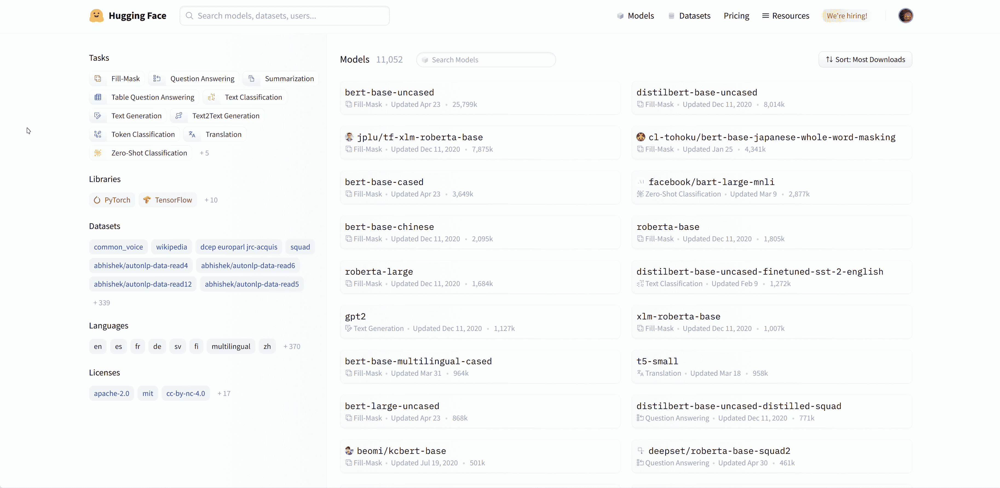
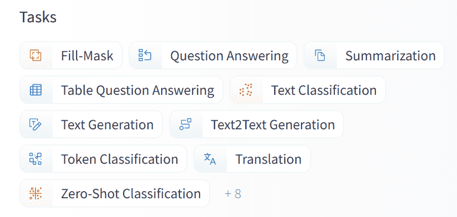

# 使用预训练模型

> 原文：[`huggingface.co/learn/nlp-course/zh-CN/chapter4/2?fw=pt`](https://huggingface.co/learn/nlp-course/zh-CN/chapter4/2?fw=pt)

                Pytorch TensorFlow  

模型中心使选择合适的模型变得简单，因此只需几行代码即可在任何下游库中使用它。让我们来看看如何使用这些模型，以及如何将模型贡献到社区。

假设我们正在寻找一种可以执行 mask 填充的 French-based 模型。



我们选择 `camembert-base` 检查点来尝试一下。我们需要做的仅仅是输入 `camembert-base` 标识符！正如你在前几章中看到的，我们可以使用 `pipeline()` 功能：

```py
from transformers import pipeline

camembert_fill_mask = pipeline("fill-mask", model="camembert-base")
results = camembert_fill_mask("Le camembert est <mask> :)")
```

```py
[
  {'sequence': 'Le camembert est délicieux :)', 'score': 0.49091005325317383, 'token': 7200, 'token_str': 'délicieux'}, 
  {'sequence': 'Le camembert est excellent :)', 'score': 0.1055697426199913, 'token': 2183, 'token_str': 'excellent'}, 
  {'sequence': 'Le camembert est succulent :)', 'score': 0.03453313186764717, 'token': 26202, 'token_str': 'succulent'}, 
  {'sequence': 'Le camembert est meilleur :)', 'score': 0.0330314114689827, 'token': 528, 'token_str': 'meilleur'}, 
  {'sequence': 'Le camembert est parfait :)', 'score': 0.03007650189101696, 'token': 1654, 'token_str': 'parfait'}
]
```

如你所见，在管道中加载模型非常简单。你唯一需要注意的是所选检查点是否适合它将用于的任务。例如，这里我们正在将 `camembert-base` 检查点加载在 `fill-mask` 管道，这完全没问题。但是如果我们在 `text-classification` 管道加载检查点，结果没有任何意义，因为 `camembert-base` 不适合这个任务！我们建议使用 Hugging Face Hub 界面中的任务选择器来选择合适的检查点：



你还可以直接使用模型架构实例化检查点：

```py
from transformers import CamembertTokenizer, CamembertForMaskedLM

tokenizer = CamembertTokenizer.from_pretrained("camembert-base")
model = CamembertForMaskedLM.from_pretrained("camembert-base")
```

然而，我们建议使用 [`Auto*` 类](https://huggingface.co/transformers/model_doc/auto.html?highlight=auto#auto-classes)，因为 `Auto*` 类设计与架构无关。前面的代码示例将只能在 CamemBERT 架构中加载可用的检查点，但使用 `Auto*` 类使切换不同的检查点变得简单：

```py
from transformers import AutoTokenizer, AutoModelForMaskedLM

tokenizer = AutoTokenizer.from_pretrained("camembert-base")
model = AutoModelForMaskedLM.from_pretrained("camembert-base")
```

使用预训练模型时，一定要检查它是如何训练的、在哪些数据集上训练的、它的局限性和偏差。所有这些信息都应在其模型卡片上注明。